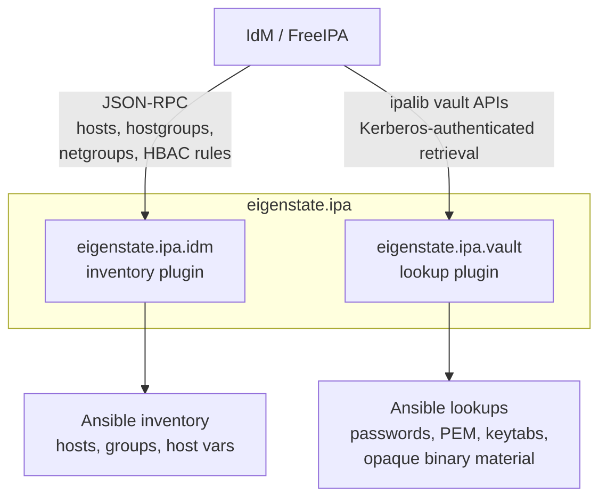

# eigenstate.ipa

**An Ansible collection for Red Hat IdM / FreeIPA with dynamic inventory and IdM vault lookup plugins for Kerberos-friendly automation, AAP, and secure secret retrieval.**

[](COPYING)


<a href="https://gprocunier.github.io/eigenstate-ipa/documentation-map.html"><kbd>&nbsp;&nbsp;DOCS MAP&nbsp;&nbsp;</kbd></a>
<a href="https://gprocunier.github.io/eigenstate-ipa/inventory-plugin.html"><kbd>&nbsp;&nbsp;INVENTORY PLUGIN&nbsp;&nbsp;</kbd></a>
<a href="https://gprocunier.github.io/eigenstate-ipa/vault-plugin.html"><kbd>&nbsp;&nbsp;IDM VAULT PLUGIN&nbsp;&nbsp;</kbd></a>
<a href="https://gprocunier.github.io/eigenstate-ipa/inventory-capabilities.html"><kbd>&nbsp;&nbsp;INVENTORY CAPABILITIES&nbsp;&nbsp;</kbd></a>
<a href="https://gprocunier.github.io/eigenstate-ipa/vault-capabilities.html"><kbd>&nbsp;&nbsp;IDM VAULT CAPABILITIES&nbsp;&nbsp;</kbd></a>
<a href="https://gprocunier.github.io/eigenstate-ipa/inventory-use-cases.html"><kbd>&nbsp;&nbsp;INVENTORY USE CASES&nbsp;&nbsp;</kbd></a>
<a href="https://gprocunier.github.io/eigenstate-ipa/vault-use-cases.html"><kbd>&nbsp;&nbsp;IDM VAULT USE CASES&nbsp;&nbsp;</kbd></a>
<a href="https://gprocunier.github.io/eigenstate-ipa/aap-integration.html"><kbd>&nbsp;&nbsp;AAP INTEGRATION&nbsp;&nbsp;</kbd></a>
<a href="https://gprocunier.github.io/eigenstate-ipa/"><kbd>&nbsp;&nbsp;WEBSITE&nbsp;&nbsp;</kbd></a>

---

`eigenstate` is a nod to the quantum-mechanical idea of a stable observable
state. In practice, the collection assumes IdM already knows what the estate
looks like and what secrets it should hand out. The Ansible side should consume
that state directly instead of maintaining a parallel copy in static inventory
files and side-channel secret stores.

The GitHub repository name is `eigenstate-ipa`; the Ansible collection name is
`eigenstate.ipa`.

## Contents

- [Why This Collection Exists](#why-this-collection-exists)
- [What The Collection Contains](#what-the-collection-contains)
- [Start Here](#start-here)
- [Quick Install](#quick-install)
- [Repository Layout](#repository-layout)
- [Author](#author)
- [License](#license)

## Why This Collection Exists

Ansible already has strong support for managing IdM objects. The missing piece
has been consuming IdM as an input system:

- dynamic inventory from enrolled IdM hosts, hostgroups, netgroups, and HBAC
  policy
- secret retrieval from IdM vaults without copying those values into Git or
  inventory vars

Without those two paths, operators usually end up with:

- static inventory that drifts from the enrollment reality
- policy data duplicated outside the identity platform
- credentials copied into other stores because automation cannot read IdM vaults

This collection closes that gap with one inventory plugin and one lookup plugin.

## What The Collection Contains



| Plugin | Type | FQCN | Purpose |
| --- | --- | --- | --- |
| IdM inventory | inventory | `eigenstate.ipa.idm` | Builds live inventory from IdM-enrolled hosts and policy-backed group relationships |
| IdM vault | lookup | `eigenstate.ipa.vault` | Retrieves vault payloads, inspects metadata, and searches vault scopes in IdM |

## Start Here

If you want the project map and reading order, open
<a href="https://gprocunier.github.io/eigenstate-ipa/documentation-map.html"><kbd>DOCS MAP</kbd></a>.

If you are deciding whether the collection fits your use case, start with:

- <a href="https://gprocunier.github.io/eigenstate-ipa/inventory-capabilities.html"><kbd>INVENTORY CAPABILITIES</kbd></a>
- <a href="https://gprocunier.github.io/eigenstate-ipa/vault-capabilities.html"><kbd>IDM VAULT CAPABILITIES</kbd></a>
- <a href="https://gprocunier.github.io/eigenstate-ipa/inventory-use-cases.html"><kbd>INVENTORY USE CASES</kbd></a>
- <a href="https://gprocunier.github.io/eigenstate-ipa/vault-use-cases.html"><kbd>IDM VAULT USE CASES</kbd></a>

If you are wiring the plugins into actual automation, start with:

- <a href="https://gprocunier.github.io/eigenstate-ipa/inventory-plugin.html"><kbd>INVENTORY PLUGIN</kbd></a>
- <a href="https://gprocunier.github.io/eigenstate-ipa/vault-plugin.html"><kbd>IDM VAULT PLUGIN</kbd></a>
- <a href="https://gprocunier.github.io/eigenstate-ipa/aap-integration.html"><kbd>AAP INTEGRATION</kbd></a>

## Quick Install

```bash
ansible-galaxy collection install eigenstate-ipa-1.0.1.tar.gz
```

Verify:

```bash
ansible-doc -t inventory eigenstate.ipa.idm
ansible-doc -t lookup eigenstate.ipa.vault
```

> [!NOTE]
> The inventory plugin talks to the IdM JSON-RPC API and can use either
> password authentication or Kerberos with an optional keytab. The vault plugin
> uses `ipalib` and therefore depends on the local IdM client Python libraries
> being available on the control node or execution environment.

## Repository Layout

| Path | Purpose |
| --- | --- |
| `plugins/inventory/idm.py` | Dynamic inventory plugin for hosts, hostgroups, netgroups, and HBAC rules |
| `plugins/lookup/vault.py` | Lookup plugin for IdM vault retrieval |
| `docs/` | Operator and maintainer documentation aligned with the collection interface |
| `scripts/validate-collection.sh` | Lightweight repo validation for YAML, plugin syntax, and collection build hygiene |
| `Makefile` | Wrapper for repo validation targets |
| `llms.txt` | Project-level navigation file for model consumers |
| `CITATION.cff` | Citation metadata for GitHub and downstream tooling |
| `CHANGELOG.md` | Release-history placeholder for Galaxy and repo hygiene |
| `meta/runtime.yml` | Collection runtime metadata |

## Author

Greg Procunier

## License

GPL-3.0-or-later. See [COPYING](https://github.com/gprocunier/eigenstate-ipa/blob/main/COPYING).
