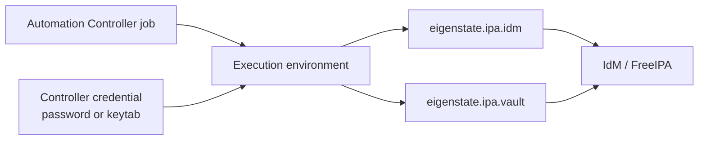

# AAP Integration

Nearby docs:

<a href="https://gprocunier.github.io/eigenstate-ipa/inventory-plugin.html"><kbd>&nbsp;&nbsp;INVENTORY PLUGIN&nbsp;&nbsp;</kbd></a>
<a href="https://gprocunier.github.io/eigenstate-ipa/vault-plugin.html"><kbd>&nbsp;&nbsp;IDM VAULT PLUGIN&nbsp;&nbsp;</kbd></a>
<a href="https://gprocunier.github.io/eigenstate-ipa/documentation-map.html"><kbd>&nbsp;&nbsp;DOCS MAP&nbsp;&nbsp;</kbd></a>

## Purpose

This page describes the practical integration model for using `eigenstate.ipa`
inside Ansible Automation Platform / Automation Controller.

It answers:

- what must exist in the execution environment
- how to authenticate non-interactively
- how to wire the inventory plugin and IdM vault lookup into controller objects

## Contents

- [Controller Integration Model](#controller-integration-model)
- [Execution Environment Requirements](#execution-environment-requirements)
- [Authentication Guidance](#authentication-guidance)
- [Inventory Source Pattern](#inventory-source-pattern)
- [IdM Vault Lookup Pattern](#idm-vault-lookup-pattern)
- [Credential-Source Pattern](#credential-source-pattern)
- [Operational Guardrails](#operational-guardrails)

## Controller Integration Model



## Execution Environment Requirements

The current collection code implies two dependency sets.

For the inventory plugin:

- `python3-requests`
- either `python3-requests-gssapi` or `python3-requests-kerberos` for Kerberos
  mode
- `python3-gssapi`
- `krb5-workstation` when keytab-driven `kinit` is needed

For the IdM vault lookup:

- `python3-ipalib`
- `python3-ipaclient`
- `krb5-workstation` when password-driven or keytab-driven ticket acquisition is
  needed

> [!IMPORTANT]
> The IdM vault lookup is not just a pure Python helper. If the EE does not
> contain
> the IdM client libraries, vault retrieval will fail even if network access and
> credentials are otherwise correct.

## Authentication Guidance

For controller use, prefer Kerberos with a keytab over plaintext password auth.

Why:

- no interactive `kinit`
- cleaner non-interactive execution
- consistent behavior for both inventory syncs and job runs

Recommended pattern:

- store the keytab as a controller credential-managed file
- inject it into the EE at runtime
- point `kerberos_keytab` at that mounted path
- provide `verify` with the IdM CA path

Password auth still works for the inventory plugin and for the IdM vault
lookup's ticket acquisition path, but it is the weaker controller posture.

## Inventory Source Pattern

Example controller inventory source content:

```yaml
plugin: eigenstate.ipa.idm
server: idm-01.corp.example.com
use_kerberos: true
kerberos_keytab: /runner/env/ipa/admin.keytab
ipaadmin_principal: admin
verify: /runner/env/ipa/ca.crt
sources:
  - hosts
  - hostgroups
hostgroup_filter:
  - webservers
  - databases
host_filter_from_groups: true
compose:
  ansible_host: idm_fqdn
```

## IdM Vault Lookup Pattern

Example task usage from a controller job template:

```yaml
- name: Retrieve a shared secret from IdM vault
  ansible.builtin.set_fact:
    db_password: "{{ lookup('eigenstate.ipa.vault',
                     'database-password',
                     server='idm-01.corp.example.com',
                     kerberos_keytab='/runner/env/ipa/admin.keytab',
                     shared=true,
                     verify='/runner/env/ipa/ca.crt') }}"
```

## Credential-Source Pattern

A practical AAP pattern is to use the IdM vault lookup inside a custom credential
type injector or job vars resolution path.

That works well when:

- a controller-managed job needs a secret only at runtime
- the secret should remain in IdM rather than being copied into controller
  storage
- the same secret should resolve differently by scope or by rotated value over
  time

## Operational Guardrails

- keep the IdM CA available inside the EE and set `verify`
- prefer keytab auth for repeatable non-interactive jobs
- use `encoding='base64'` for keytabs or binary bundles
- keep vault ownership scope explicit when ambiguity is possible

> [!NOTE]
> If an inventory sync works but IdM vault lookups fail inside the same EE, suspect
> missing `ipalib`/`ipaclient` content first. The two plugins do not share the
> same client dependency stack.
