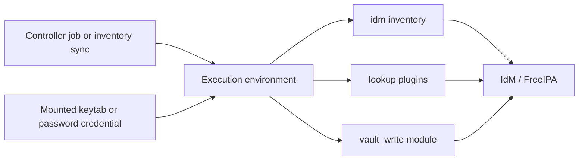



# AAP Integration

Related docs:

<a href="https://gprocunier.github.io/eigenstate-ipa/vault-cyberark-primer.html"><kbd>&nbsp;&nbsp;VAULT/CYBERARK PRIMER&nbsp;&nbsp;</kbd></a>
<a href="https://gprocunier.github.io/eigenstate-ipa/openshift-primer.html"><kbd>&nbsp;&nbsp;OPENSHIFT ECOSYSTEM PRIMER&nbsp;&nbsp;</kbd></a>
<a href="https://gprocunier.github.io/eigenstate-ipa/openshift-rhoso-use-cases.html"><kbd>&nbsp;&nbsp;OPENSHIFT RHOSO USE CASES&nbsp;&nbsp;</kbd></a>
<a href="https://gprocunier.github.io/eigenstate-ipa/openshift-rhacm-use-cases.html"><kbd>&nbsp;&nbsp;OPENSHIFT RHACM USE CASES&nbsp;&nbsp;</kbd></a>
<a href="https://gprocunier.github.io/eigenstate-ipa/openshift-rhacs-use-cases.html"><kbd>&nbsp;&nbsp;OPENSHIFT RHACS USE CASES&nbsp;&nbsp;</kbd></a>
<a href="https://gprocunier.github.io/eigenstate-ipa/openshift-quay-use-cases.html"><kbd>&nbsp;&nbsp;OPENSHIFT QUAY USE CASES&nbsp;&nbsp;</kbd></a>
<a href="https://gprocunier.github.io/eigenstate-ipa/rotation-use-cases.html"><kbd>&nbsp;&nbsp;ROTATION USE CASES&nbsp;&nbsp;</kbd></a>
<a href="https://gprocunier.github.io/eigenstate-ipa/inventory-use-cases.html"><kbd>&nbsp;&nbsp;INVENTORY USE CASES&nbsp;&nbsp;</kbd></a>
<a href="https://gprocunier.github.io/eigenstate-ipa/ephemeral-access-capabilities.html"><kbd>&nbsp;&nbsp;EPHEMERAL ACCESS CAPABILITIES&nbsp;&nbsp;</kbd></a>
<a href="https://gprocunier.github.io/eigenstate-ipa/documentation-map.html"><kbd>&nbsp;&nbsp;DOCS MAP&nbsp;&nbsp;</kbd></a>

## Purpose

This page explains how `eigenstate.ipa` fits into Ansible Automation Platform
and Automation Controller.

The important boundary is simple: the collection is mostly controller-side.
The execution environment talks directly to IdM. Managed hosts usually consume
artifacts or decisions that were produced on the controller.

Use this page for:

- execution-environment dependency planning
- non-interactive authentication guidance
- the controller-side workflows that are actually worth standardizing
- the handoff point between `eigenstate.ipa` and the official IdM collections

Use plugin pages for exact options. Use use-case pages for full playbook detail.
This page is the control-plane view.

## Controller Model



The collection is strongest when AAP supplies:

- the schedule
- the execution environment image
- credential injection
- approvals and job boundaries
- repeatable controller-side execution

That is the part of the stack that makes IdM-backed workflows feel operationally
coherent instead of ad hoc.

## Current Controller-Side Surface

### Inventory

- `eigenstate.ipa.idm`

### `ipalib`-backed lookups and modules

- `eigenstate.ipa.vault`
- `eigenstate.ipa.vault_write`
- `eigenstate.ipa.principal`
- `eigenstate.ipa.cert`
- `eigenstate.ipa.otp`
- `eigenstate.ipa.dns`
- `eigenstate.ipa.user_lease`
- `eigenstate.ipa.selinuxmap`
- `eigenstate.ipa.sudo`
- `eigenstate.ipa.hbacrule`

### CLI-backed lookup

- `eigenstate.ipa.keytab`

The official IdM collections still matter beside this surface. They remain the
right place for enrollment, broad CRUD against IdM objects, and cert revocation.
`eigenstate.ipa` is the read-heavy and workflow-focused layer around those
operations.

## Execution Environment Requirements

| Surface | EE requirements | Notes |
| --- | --- | --- |
| `idm` inventory | `python3-requests`; `python3-gssapi`; `python3-requests-gssapi` or `python3-requests-kerberos`; `krb5-workstation` when keytab-driven `kinit` is used | inventory does not require `ipalib` |
| `vault`, `vault_write`, `principal`, `cert`, `otp`, `dns`, `user_lease`, `selinuxmap`, `sudo`, `hbacrule` | `python3-ipalib`; `python3-ipaclient`; `krb5-workstation` for ticket acquisition | these share the same IdM Python stack |
| `keytab` | package providing `ipa-getkeytab`; `krb5-workstation` | on RHEL 10 this is `ipa-client` |

> [!IMPORTANT]
> Inventory can work while the `ipalib`-backed surfaces fail if the EE only
> contains the HTTP stack. That split is deliberate in the collection, so the
> EE image has to be deliberate too.

For most estates, the simplest stable Controller posture is one EE containing
all three dependency groups.

## Authentication Guidance

Prefer Kerberos with a mounted keytab.

Why:

- the same credential shape works for inventory, lookups, `vault_write`, and `keytab`
- it avoids reusable plaintext admin passwords in job templates
- it works for inventory syncs and normal job runs
- it fits Controller credential injection cleanly

Recommended pattern:

- store the keytab as a Controller-managed credential file
- mount it into the EE at runtime
- set `kerberos_keytab` explicitly in the inventory source or task
- mount the IdM CA and set `verify`
- set `ipaadmin_principal` explicitly when ambiguity is possible
- ensure the EE contains `krb5-workstation` so `/usr/bin/kinit` is present in the standard RHEL location

The collection now prefers `/usr/bin/kinit` when it exists and only falls back
to a `PATH`-resolved `kinit` for non-standard layouts. Standard RHEL-based EEs
should treat `/usr/bin/kinit` as the expected path.

## High-Value Controller Workflows

These are the combinations worth documenting and standardizing. They are the
places where the collection becomes a coherent controller workflow instead of isolated plugin calls.

### 1. Identity-driven inventory sync

Use `eigenstate.ipa.idm` to make Controller inventory follow the IdM model
instead of a second static host list.

High-value combinations:

- `hosts` + `hostvars_include` for lean synced metadata
- `hostgroups`, `netgroups`, or `hbacrules` for security- or role-shaped targeting
- `keyed_groups` over `idm_location`, `idm_os`, or `idm_hostgroups` for smart inventory input

Guardrail:

- `hostvars_enabled` and `hostvars_include` only control host attribute export
- Ansible can still merge group-derived vars into final hostvars later in the inventory process

Read next:
<a href="https://gprocunier.github.io/eigenstate-ipa/inventory-use-cases.html"><kbd>INVENTORY USE CASES</kbd></a>

### 2. Pre-flight gate before changing systems

Use lookups on the controller before any managed host work starts.

Best combinations:

- `dns` to verify name state the workflow depends on
- `principal` to confirm the principal exists and is usable
- `hbacrule` to test whether access is actually allowed
- `selinuxmap` and `sudo` to confirm confinement and privilege shape

This is one of the collection's strongest differentiated patterns. Vault and
CyberArk can answer credential questions. They do not answer live IdM policy
questions for a host, service, or login path.

### 3. Service onboarding

Use `principal` as the gate, then branch into the artifact you actually need:

- `keytab` for Kerberos service onboarding
- `cert` for X.509 issuance
- `vault_write` when the workflow must archive a private key or related bootstrap secret

This keeps identity state, key material, and cert issuance in one controller
flow instead of scattering them across shell tasks.

Read next:
<a href="https://gprocunier.github.io/eigenstate-ipa/principal-use-cases.html"><kbd>PRINCIPAL USE CASES</kbd></a>

### 4. Static secret lifecycle

Use `vault_write` for mutation and `vault` for retrieval. Let AAP supply the
schedule, approvals, execution boundary, and credentials.

This is the correct answer to the collection's rotation story:

- no native lease engine
- yes controller-scheduled rotation workflows for static IdM-backed assets

Read next:
<a href="https://gprocunier.github.io/eigenstate-ipa/rotation-use-cases.html"><kbd>ROTATION USE CASES</kbd></a>

### 5. Host enrollment and first-day trust

Use `otp` to generate the enrollment credential, then hand the actual
installation to the official IdM collections.

Best combination:

- `eigenstate.ipa.otp` for the one-time host password
- `freeipa.ansible_freeipa.ipahost` or `redhat.rhel_idm.ipahost` to ensure the host object exists
- `freeipa.ansible_freeipa.ipaclient` or `redhat.rhel_idm.ipaclient` for enrollment
- `principal` afterward if the workflow needs a post-enrollment check

That keeps `eigenstate.ipa` on the credential-generation boundary it was built
for instead of turning it into a full enrollment role.

### 6. Lease-like temporary access patterns

AAP can orchestrate temporary access, but it is not the only control. The
stronger patterns are the ones where IdM itself makes the identity unusable
after the window closes:

- delegated temporary users with `user_lease` expiry controls
- dedicated Kerberos principals whose key material is retired by rotation

Read next:
<a href="https://gprocunier.github.io/eigenstate-ipa/ephemeral-access-capabilities.html"><kbd>EPHEMERAL ACCESS CAPABILITIES</kbd></a>

For the delegated user side specifically, continue to
<a href="https://gprocunier.github.io/eigenstate-ipa/user-lease-use-cases.html"><kbd>USER LEASE USE CASES</kbd></a>.

### 7. OpenShift and OpenShift Virtualization workflows

When OpenShift uses Keycloak on top of IdM-backed trust, the collection's
value shows up around the cluster rather than in direct cluster CRUD.

The strongest controller-side patterns are:

- time-bounded break-glass with `user_lease`
- controller-scoped Kerberos identity for cluster-support services
- guest enrollment with `otp` plus the official IdM collections
- internal service onboarding with `principal`, `dns`, `cert`, and `vault_write`

Read next:
<a href="https://gprocunier.github.io/eigenstate-ipa/openshift-primer.html"><kbd>OPENSHIFT ECOSYSTEM PRIMER</kbd></a>.

### 8. RHACM-triggered remediation and lifecycle hooks

RHACM can trigger AAP from policy violations and lifecycle events. The useful pattern is that AAP owns the job, while IdM owns the identity, policy, and supporting-state boundary. RHACM hands off event context such as `target_clusters`, `policy_name`, and `policy_violations`; AAP turns that into a controller-side workflow; `eigenstate.ipa` checks whether the supporting state is actually ready.

In practice, that means RHACM-triggered jobs can use the same controller-side patterns already used elsewhere in the collection:

- `principal` and `keytab` for authenticated remediation jobs
- `hbacrule`, `sudo`, and `selinuxmap` for path validation before the job starts
- `user_lease` for temporary operator access when a fix should not become permanent
- `otp` plus the official IdM collections when a hook creates a supporting host or VM

Read next:
<a href="https://gprocunier.github.io/eigenstate-ipa/openshift-rhacm-use-cases.html"><kbd>OPENSHIFT RHACM USE CASES</kbd></a>.

### 9. RHACS-triggered security workflows

RHACS already owns policy evaluation, admission control, runtime detection, and notifier integrations. The valuable AAP pattern is not to duplicate those controls. It is to make the response path identity-aware.

In practice, that means RHACS-triggered jobs can use controller-side patterns such as:

- `principal` and `keytab` for service-authenticated remediation jobs
- `hbacrule`, `sudo`, and `selinuxmap` for pre-flight validation before touching supporting hosts
- `user_lease` for temporary operator access that expires in IdM instead of living in a ticket
- `dns`, `cert`, and `vault_write` when a security finding exposes missing onboarding prerequisites for an internal service

Read next:
<a href="https://gprocunier.github.io/eigenstate-ipa/openshift-rhacs-use-cases.html"><kbd>OPENSHIFT RHACS USE CASES</kbd></a>.

### 10. Quay-triggered registry and repository workflows

Quay already owns registry behavior, repository notifications, mirroring, and robot-account workflows. The useful AAP pattern is to make the surrounding automation path identity-aware instead of trying to turn Quay into a full workflow engine.

In practice, that means Quay-triggered or Quay-adjacent jobs can use controller-side patterns such as:

- `principal` and `keytab` for service-authenticated mirror or promotion jobs
- `dns`, `cert`, and `vault_write` when registry or route onboarding still needs surrounding enterprise-state checks
- `hbacrule`, `sudo`, and `selinuxmap` when a helper host or bastion is in the workflow path
- `user_lease` for temporary registry administration that should expire in IdM

Read next:
<a href="https://gprocunier.github.io/eigenstate-ipa/openshift-quay-use-cases.html"><kbd>OPENSHIFT QUAY USE CASES</kbd></a>.

### 11. RHOSO operator and tenant workflows

RHOSO already has its own operator-driven lifecycle, Keystone identity model,
and RHEL data-plane relationship. The useful AAP pattern is the work around
those boundaries rather than inside the product.

In practice, that means RHOSO-adjacent jobs can use controller-side patterns such as:

- `user_lease` for operator maintenance windows that should expire in IdM
- `hbacrule`, `sudo`, and `selinuxmap` for pre-flight validation before touching RHEL data-plane hosts
- `otp` plus the official IdM collections when support hosts or utility VMs need first-day enrollment
- `principal`, `dns`, `cert`, and `vault_write` when cloud-facing or tenant-facing services need a coherent onboarding flow

Read next:
<a href="https://gprocunier.github.io/eigenstate-ipa/openshift-rhoso-use-cases.html"><kbd>OPENSHIFT RHOSO USE CASES</kbd></a>.

## Example Patterns

### Lean inventory source for Controller

```yaml
plugin: eigenstate.ipa.idm
server: idm-01.corp.example.com
use_kerberos: true
kerberos_keytab: /runner/env/ipa/admin.keytab
verify: /etc/ipa/ca.crt
sources:
  - hosts
  - hostgroups
hostgroup_filter:
  - webservers
  - databases
host_filter_from_groups: true
hostvars_include:
  - idm_fqdn
  - idm_location
  - idm_hostgroups
keyed_groups:
  - key: idm_location
    prefix: dc
    separator: "_"
```

For secret-bearing workflows, treat `verify` as part of the contract. If the execution environment does not carry `/etc/ipa/ca.crt`, provide an explicit CA path or set `verify: false` intentionally; the hardened module and lookup paths no longer fall back silently.

### Controller-side policy gate before maintenance

```yaml
- name: Pre-flight gate before privileged maintenance
  hosts: localhost
  gather_facts: false

  vars:
    target_host: app01.corp.example.com
    deploy_identity: svc-maintenance

  tasks:
    - name: Confirm sudo rule exists
      ansible.builtin.set_fact:
        sudo_rule: "{{ lookup('eigenstate.ipa.sudo',
                        'ops-maintenance',
                        sudo_object='rule',
                        server='idm-01.corp.example.com',
                        kerberos_keytab='/runner/env/ipa/admin.keytab',
                        verify='/etc/ipa/ca.crt') }}"

    - name: Confirm HBAC access would be granted
      ansible.builtin.set_fact:
        access_result: "{{ lookup('eigenstate.ipa.hbacrule',
                            deploy_identity,
                            operation='test',
                            targethost=target_host,
                            service='sshd',
                            server='idm-01.corp.example.com',
                            kerberos_keytab='/runner/env/ipa/admin.keytab',
                            verify='/etc/ipa/ca.crt') }}"

    - name: Assert policy is ready
      ansible.builtin.assert:
        that:
          - sudo_rule.exists
          - sudo_rule.enabled
          - not access_result.denied
        fail_msg: "IdM policy does not match the maintenance workflow boundary."
```

### Scheduled static secret update

```yaml
- name: Rotate a shared application secret
  hosts: localhost
  gather_facts: false

  tasks:
    - name: Generate replacement secret
      ansible.builtin.set_fact:
        new_secret: "{{ lookup('community.general.random_string', length=32, special=false) }}"
      no_log: true

    - name: Archive replacement in IdM vault
      eigenstate.ipa.vault_write:
        name: app-secret
        state: archived
        shared: true
        data: "{{ new_secret }}"
        server: idm-01.corp.example.com
        kerberos_keytab: /runner/env/ipa/admin.keytab
        verify: /etc/ipa/ca.crt
      no_log: true
```

## Where The Official IdM Collections Fit

Use the official collections when the job is primarily object management rather
than lookup-driven decision making.

Typical examples:

- host creation and enrollment
- user, group, HBAC, sudo, or DNS CRUD
- certificate revocation
- large structural IdM configuration roles

Use `eigenstate.ipa` when the job is primarily:

- inventory shaping
- secret retrieval or vault mutation
- state inspection
- live access testing
- pre-flight gating
- controller-side orchestration around IdM state

## Guardrails

To keep the docs and the workflows clear:

- keep EE dependency detail here, not copied into every plugin page
- keep exact parameter reference in plugin pages
- keep cross-plugin flow in use-case pages and collection-wide guides
- do not describe AAP as if it creates dynamic secret leases; it schedules and packages static workflows
- do not describe `hostvars_enabled: false` as "empty hostvars"; it only stops host attribute export from IdM host objects


