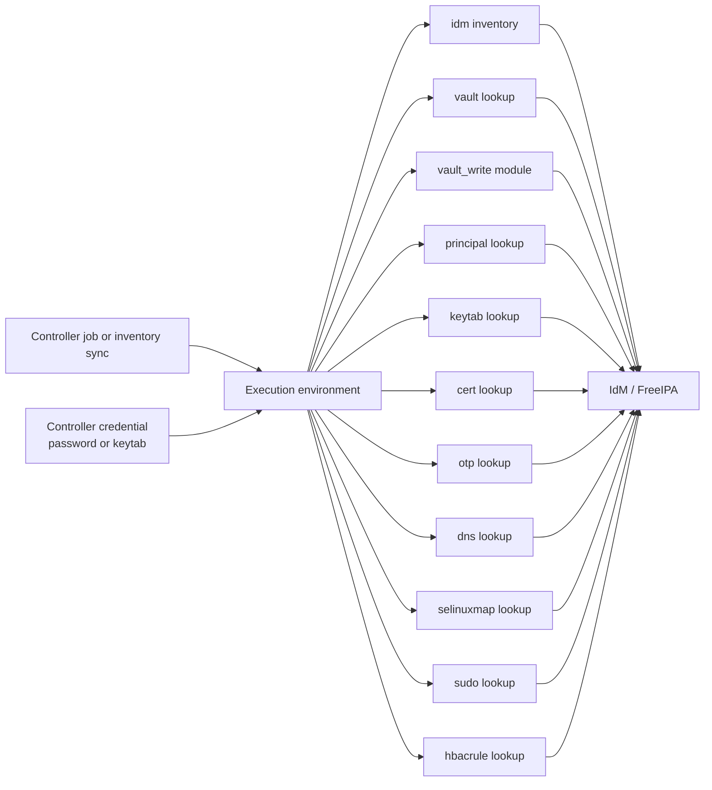



# AAP Integration

Related docs:

<a href="https://gprocunier.github.io/eigenstate-ipa/inventory-plugin.html"><kbd>&nbsp;&nbsp;INVENTORY PLUGIN&nbsp;&nbsp;</kbd></a>
<a href="https://gprocunier.github.io/eigenstate-ipa/vault-plugin.html"><kbd>&nbsp;&nbsp;IDM VAULT PLUGIN&nbsp;&nbsp;</kbd></a>
<a href="https://gprocunier.github.io/eigenstate-ipa/vault-write-plugin.html"><kbd>&nbsp;&nbsp;VAULT WRITE MODULE&nbsp;&nbsp;</kbd></a>
<a href="https://gprocunier.github.io/eigenstate-ipa/principal-plugin.html"><kbd>&nbsp;&nbsp;PRINCIPAL PLUGIN&nbsp;&nbsp;</kbd></a>
<a href="https://gprocunier.github.io/eigenstate-ipa/keytab-plugin.html"><kbd>&nbsp;&nbsp;KEYTAB PLUGIN&nbsp;&nbsp;</kbd></a>
<a href="https://gprocunier.github.io/eigenstate-ipa/cert-plugin.html"><kbd>&nbsp;&nbsp;IDM CERT PLUGIN&nbsp;&nbsp;</kbd></a>
<a href="https://gprocunier.github.io/eigenstate-ipa/otp-plugin.html"><kbd>&nbsp;&nbsp;OTP PLUGIN&nbsp;&nbsp;</kbd></a>
<a href="https://gprocunier.github.io/eigenstate-ipa/dns-plugin.html"><kbd>&nbsp;&nbsp;DNS PLUGIN&nbsp;&nbsp;</kbd></a>
<a href="https://gprocunier.github.io/eigenstate-ipa/selinuxmap-plugin.html"><kbd>&nbsp;&nbsp;SELINUX MAP PLUGIN&nbsp;&nbsp;</kbd></a>
<a href="https://gprocunier.github.io/eigenstate-ipa/sudo-plugin.html"><kbd>&nbsp;&nbsp;SUDO PLUGIN&nbsp;&nbsp;</kbd></a>
<a href="https://gprocunier.github.io/eigenstate-ipa/hbacrule-plugin.html"><kbd>&nbsp;&nbsp;HBAC RULE PLUGIN&nbsp;&nbsp;</kbd></a>
<a href="https://gprocunier.github.io/eigenstate-ipa/documentation-map.html"><kbd>&nbsp;&nbsp;DOCS MAP&nbsp;&nbsp;</kbd></a>

## Purpose

This page describes how to run `eigenstate.ipa` inside Ansible Automation
Platform / Automation Controller.

It covers:

- what must exist in the execution environment
- how to authenticate non-interactively
- how the current inventory, lookup, and module surfaces map into controller jobs
- what runtime patterns fit inventory syncs, secret retrieval, pre-flight checks, and static-secret workflows

## Contents

- [Controller Integration Model](#controller-integration-model)
- [Current AAP-Capable Collection Surface](#current-aap-capable-collection-surface)
- [Execution Environment Requirements](#execution-environment-requirements)
- [Authentication Guidance](#authentication-guidance)
- [Inventory Source Pattern](#inventory-source-pattern)
- [Lookup Pattern](#lookup-pattern)
- [Vault Write Module Pattern](#vault-write-module-pattern)
- [Credential-Source And Runtime Secret Pattern](#credential-source-and-runtime-secret-pattern)
- [Policy And Pre-Flight Pattern](#policy-and-pre-flight-pattern)
- [Operational Guardrails](#operational-guardrails)

## Controller Integration Model



## Current AAP-Capable Collection Surface

The current collection splits into three controller-side execution shapes.

### Inventory plugin

- `eigenstate.ipa.idm`

### `ipalib`-backed lookups and module

These require the IdM client Python stack in the execution environment.

- `eigenstate.ipa.vault`
- `eigenstate.ipa.vault_write`
- `eigenstate.ipa.principal`
- `eigenstate.ipa.cert`
- `eigenstate.ipa.otp`
- `eigenstate.ipa.dns`
- `eigenstate.ipa.selinuxmap`
- `eigenstate.ipa.sudo`
- `eigenstate.ipa.hbacrule`

### CLI-backed lookup

This shells out to platform IPA tooling instead of `ipalib`.

- `eigenstate.ipa.keytab`

The important AAP boundary is that all of these are controller-side surfaces.
The execution environment talks to IdM directly; the managed hosts do not need
these libraries just because the job uses the collection.

## Execution Environment Requirements

The current collection implies two dependency families plus the HTTP inventory
stack.

### Inventory plugin stack

For `eigenstate.ipa.idm`:

- `python3-requests`
- either `python3-requests-gssapi` or `python3-requests-kerberos` for Kerberos mode
- `python3-gssapi`
- `krb5-workstation` when keytab-driven `kinit` is needed

### `ipalib` stack

For `vault`, `vault_write`, `principal`, `cert`, `otp`, `dns`, `selinuxmap`,
`sudo`, and `hbacrule`:

- `python3-ipalib`
- `python3-ipaclient`
- `krb5-workstation` when password-driven or keytab-driven ticket acquisition is needed

> [!IMPORTANT]
> If the execution environment is missing `python3-ipalib` or
> `python3-ipaclient`, the inventory plugin may still work while every IdM
> lookup or module fails. Inventory and the `ipalib` surfaces do not share the
> same dependency stack.

### Keytab tooling stack

For `eigenstate.ipa.keytab`:

- on RHEL 10, `ipa-client` (provides `ipa-getkeytab` there)
- on other execution-environment bases, the package that provides `ipa-getkeytab`
- `krb5-workstation` when password-driven or keytab-driven ticket acquisition is needed

> [!NOTE]
> The keytab lookup does not require `python3-ipalib` or `python3-ipaclient`.
> It shells out to `ipa-getkeytab` directly.

### Practical EE build rule

For most controller estates, the easiest stable execution environment is one
that contains all three groups so inventory syncs, secret retrieval, policy
checks, vault lifecycle jobs, and keytab workflows can run from the same image.

## Authentication Guidance

For controller use, prefer Kerberos with a keytab over plaintext password auth.

Why:

- no interactive `kinit`
- cleaner non-interactive execution
- consistent behavior for inventory syncs and job runs
- one credential shape works across the inventory plugin, the `ipalib` surfaces, and the keytab lookup

Recommended pattern:

- store the keytab as a controller credential-managed file
- inject it into the execution environment at runtime
- point `kerberos_keytab` at that mounted path
- set `ipaadmin_principal` explicitly when needed
- provide `verify` with the IdM CA path

Password auth still works for the inventory plugin and the `ipalib` surfaces,
but it is the weaker controller posture.

## Inventory Source Pattern

Example controller inventory source content:

```yaml
plugin: eigenstate.ipa.idm
server: idm-01.corp.example.com
use_kerberos: true
kerberos_keytab: /runner/env/ipa/admin.keytab
ipaadmin_principal: admin
verify: /runner/env/ipa/ca.crt
sources:
  - hosts
  - hostgroups
hostgroup_filter:
  - webservers
  - databases
host_filter_from_groups: true
compose:
  ansible_host: idm_fqdn
```

## Lookup Pattern

The general lookup pattern in AAP is the same across the current read-only
surfaces: resolve data at job runtime inside the execution environment and keep
IdM as the source of truth.

```yaml
- name: Load controller-side IdM state
  ansible.builtin.set_fact:
    db_password: "{{ lookup('eigenstate.ipa.vault',
                     'database-password',
                     server='idm-01.corp.example.com',
                     kerberos_keytab='/runner/env/ipa/admin.keytab',
                     shared=true,
                     verify='/runner/env/ipa/ca.crt') }}"
    principal_state: "{{ lookup('eigenstate.ipa.principal',
                          'host/app-01.corp.example.com',
                          server='idm-01.corp.example.com',
                          kerberos_keytab='/runner/env/ipa/admin.keytab',
                          verify='/runner/env/ipa/ca.crt') }}"
    dns_record: "{{ lookup('eigenstate.ipa.dns',
                     'idm-01',
                     zone='corp.example.com',
                     server='idm-01.corp.example.com',
                     kerberos_keytab='/runner/env/ipa/admin.keytab',
                     verify='/runner/env/ipa/ca.crt') }}"
```

The same controller-mounted keytab pattern also applies to `cert`, `otp`,
`selinuxmap`, `sudo`, and `hbacrule`.

## Vault Write Module Pattern

`eigenstate.ipa.vault_write` runs cleanly in AAP as a controller-side module
when the execution environment already contains the `ipalib` stack.

```yaml
- name: Archive a new shared vault secret version from Controller
  eigenstate.ipa.vault_write:
    state: archived
    name: database-password
    scope: shared
    vault_type: standard
    value: "{{ rotated_value }}"
    server: idm-01.corp.example.com
    kerberos_keytab: /runner/env/ipa/admin.keytab
    ipaadmin_principal: admin
    verify: /runner/env/ipa/ca.crt
```

This is the normal module shape for scheduled static-secret workflows in AAP:
Controller supplies the schedule, keytab credential, approval path, and job
boundary; IdM remains the system of record.

## Credential-Source And Runtime Secret Pattern

One AAP pattern is to use the IdM vault lookup inside a custom credential type
injector or job-vars resolution path.

That works well when:

- a controller-managed job needs a secret only at runtime
- the secret should remain in IdM rather than being copied into controller storage
- the same secret should resolve differently by scope or by rotated value over time

The same broad idea also applies to OTP bootstrap values and keytab retrieval,
with the normal caveat that returned keytabs, OTP URIs, and enrollment passwords
should be treated as secret material in controller logs and survey output.

## Policy And Pre-Flight Pattern

AAP jobs can also use the collection as a controller-side validation layer
before touching managed infrastructure.

Common fits:

- `principal` before keytab or certificate workflows
- `dns` before deployment or enrollment steps that depend on forward or reverse records
- `sudo`, `selinuxmap`, and `hbacrule` before compliance or access-sensitive changes
- `cert` for scheduled expiry search and reporting

```yaml
- name: Validate IdM policy and name state before deploy
  ansible.builtin.assert:
    that:
      - dns_record.exists
      - principal_state.exists
      - hbac_test.denied == false
  vars:
    dns_record: "{{ lookup('eigenstate.ipa.dns', 'app-01', zone='corp.example.com', server='idm-01.corp.example.com', kerberos_keytab='/runner/env/ipa/admin.keytab', verify='/runner/env/ipa/ca.crt') }}"
    principal_state: "{{ lookup('eigenstate.ipa.principal', 'host/app-01.corp.example.com', server='idm-01.corp.example.com', kerberos_keytab='/runner/env/ipa/admin.keytab', verify='/runner/env/ipa/ca.crt') }}"
    hbac_test: "{{ lookup('eigenstate.ipa.hbacrule', operation='test', user='deploysvc', targethost='app-01.corp.example.com', service='sshd', server='idm-01.corp.example.com', kerberos_keytab='/runner/env/ipa/admin.keytab', verify='/runner/env/ipa/ca.crt') }}"
```

## Operational Guardrails

- keep the IdM CA available inside the execution environment and set `verify`
- prefer keytab auth for repeatable non-interactive jobs
- build one EE that includes the inventory HTTP stack, the `ipalib` stack, and `ipa-getkeytab` unless you have a reason to split them
- treat returned keytabs, OTP URIs, enrollment passwords, and vault values as secret material in Controller output and callbacks
- keep vault ownership scope explicit when ambiguity is possible
- remember that `vault_write` is controller-side mutation of static IdM-backed assets, not a lease engine
- remember that the collection reads and writes against IdM from the EE; managed hosts do not need these client libraries unless your play itself also uses them locally


