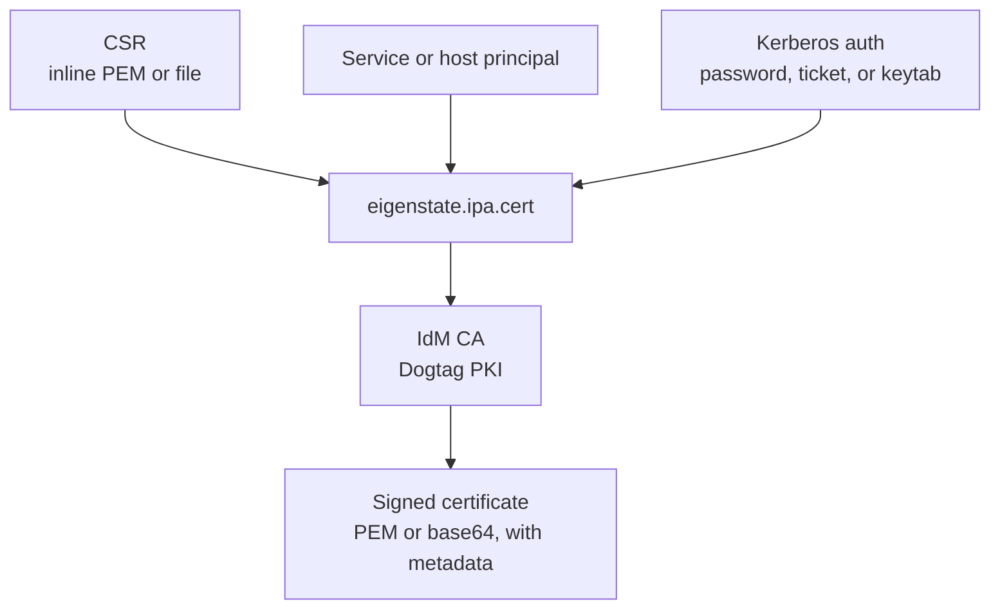
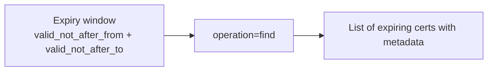
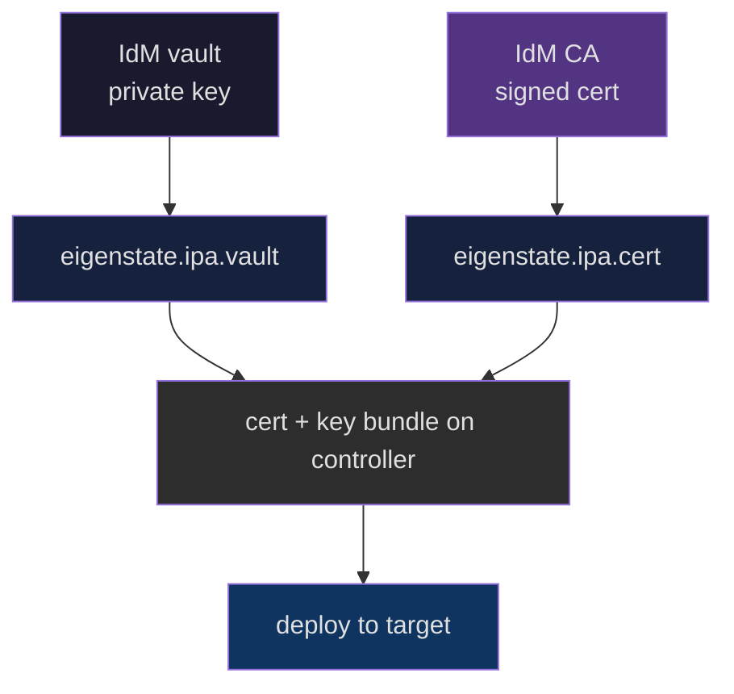
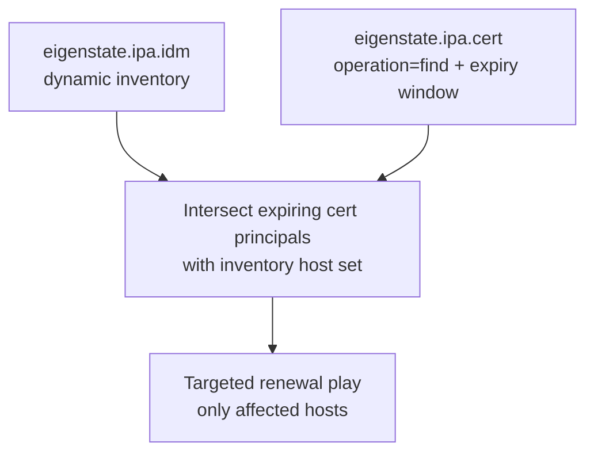
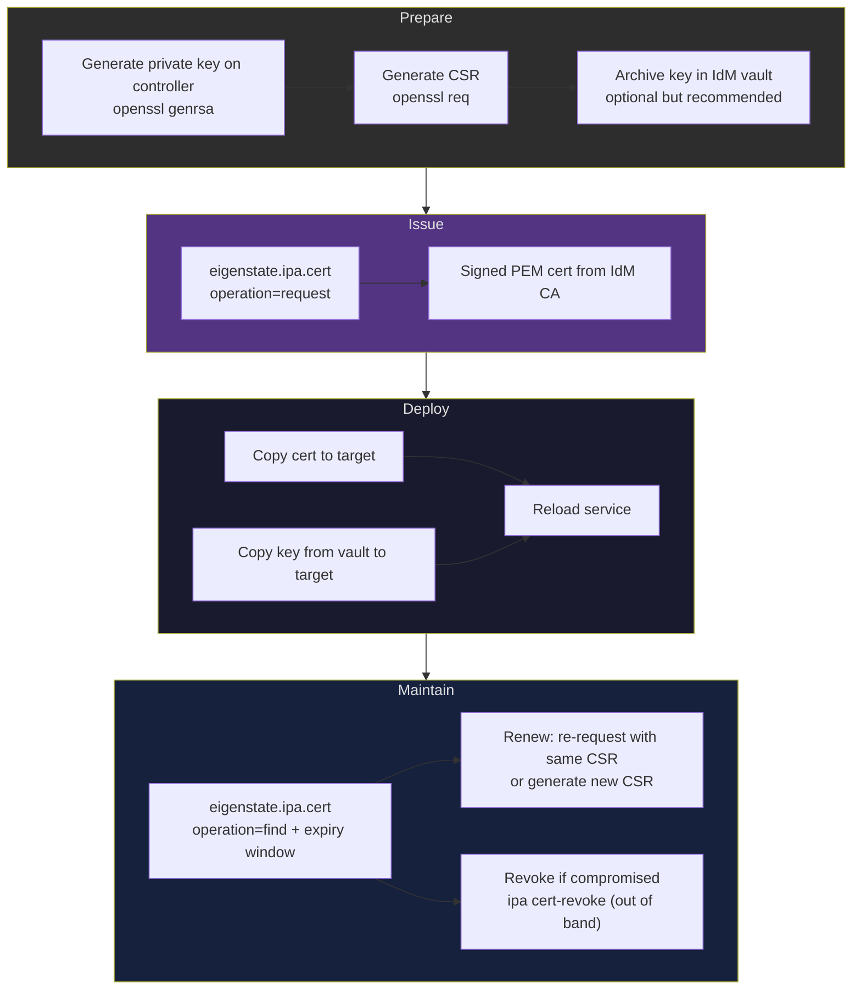



# IdM Cert Capabilities

Related docs:

<a href="https://gprocunier.github.io/eigenstate-ipa/cert-plugin.html"><kbd>&nbsp;&nbsp;IDM CERT PLUGIN&nbsp;&nbsp;</kbd></a>
<a href="https://gprocunier.github.io/eigenstate-ipa/vault-capabilities.html"><kbd>&nbsp;&nbsp;IDM VAULT CAPABILITIES&nbsp;&nbsp;</kbd></a>
<a href="https://gprocunier.github.io/eigenstate-ipa/aap-integration.html"><kbd>&nbsp;&nbsp;AAP INTEGRATION&nbsp;&nbsp;</kbd></a>
<a href="https://gprocunier.github.io/eigenstate-ipa/documentation-map.html"><kbd>&nbsp;&nbsp;DOCS MAP&nbsp;&nbsp;</kbd></a>

## Purpose

Use this guide to choose the major IdM PKI automation pattern exposed by
`eigenstate.ipa.cert`.

It is the cert-side companion to the vault capabilities guide. Where the vault
guide covers secret retrieval, this guide covers certificate lifecycle
operations: signing new certs, retrieving existing ones, and finding certs by
expiry or principal.

IdM already runs Dogtag CA. This plugin gives Ansible a direct signing and
retrieval interface without certmonger running interactively on the target.

## Contents

- [Request Model](#request-model)
- [1. Service Certificate Request](#1-service-certificate-request)
- [2. Certificate Retrieval By Serial Number](#2-certificate-retrieval-by-serial-number)
- [3. Pre-Expiry Maintenance: Find By Expiry Window](#3-pre-expiry-maintenance-find-by-expiry-window)
- [4. Multi-Principal Batch Request](#4-multi-principal-batch-request)
- [5. Certificate Deployment: PEM File On Target](#5-certificate-deployment-pem-file-on-target)
- [6. Certificate Plus Vault Key Bundle](#6-certificate-plus-vault-key-bundle)
- [7. Expiry Audit Integrated With IdM Inventory](#7-expiry-audit-integrated-with-idm-inventory)
- [8. Full Cert Lifecycle Workflow](#8-full-cert-lifecycle-workflow)
- [Quick Decision Matrix](#quick-decision-matrix)

## Request Model



Choose the cert operation that matches what you actually need at runtime:

- use `request` when the cert does not exist yet or should be re-issued
- use `retrieve` when the cert already exists and you need it by serial
- use `find` when you need to discover certificates by principal or expiry date

## 1. Service Certificate Request

Use `operation='request'` when a service principal needs a signed certificate
and you are supplying the CSR from the controller or a file.

Typical cases:

- issuing a TLS cert for a new service deployment
- replacing an expiring cert that you are managing without certmonger
- service certificate automation in a fresh environment before certmonger is
  configured on the target


Example:

```yaml
- name: Request a signed service certificate from IdM
  ansible.builtin.set_fact:
    api_cert_pem: "{{ lookup('eigenstate.ipa.cert',
                       'HTTP/api.example.com@EXAMPLE.COM',
                       operation='request',
                       server='idm-01.corp.example.com',
                       kerberos_keytab='/runner/env/ipa/admin.keytab',
                       csr_file='/runner/env/csr/api.example.com.csr',
                       verify='/etc/ipa/ca.crt') }}"
```

Why this pattern fits:

- the CSR stays on the controller side; the signed cert comes back
- no certmonger agent is needed on the target
- the Kerberos principal authorizes the request, matching IdM's existing PKI
  access controls
- the result is a plain PEM string that can be written directly to a file

## 2. Certificate Retrieval By Serial Number

Use `operation='retrieve'` when you already know the certificate serial number
and need to pull the signed cert without re-issuing it.

Typical cases:

- retrieving a previously issued cert for re-deployment after a reinstall
- integrating with an audit workflow that tracks serial numbers
- cert delivery automation where the CA signing step already happened separately


Example:

```yaml
- name: Retrieve certificate by serial number
  ansible.builtin.set_fact:
    cert_record: "{{ lookup('eigenstate.ipa.cert',
                      '12345',
                      operation='retrieve',
                      server='idm-01.corp.example.com',
                      kerberos_keytab='/runner/env/ipa/admin.keytab',
                      result_format='record',
                      verify='/etc/ipa/ca.crt') }}"
```

Why this pattern fits:

- it avoids re-signing when the original cert is still valid
- serial-keyed retrieval makes it easy to drive from a previously discovered
  serial in an earlier `find` step
- `result_format='record'` carries the expiry and subject alongside the cert so
  the playbook can make a validity check before deploying

## 3. Pre-Expiry Maintenance: Find By Expiry Window

Use `operation='find'` with a `valid_not_after_to` date to discover all
certificates expiring before a target date. Pair with `valid_not_after_from`
to scope the window.

Typical cases:

- 30-day or 60-day pre-expiry renewal runs
- compliance audits that enumerate certificates expiring within a quarter
- automated alerting when the expiry window has no outstanding certs



Example:

```yaml
- name: Find certificates expiring within 60 days
  ansible.builtin.set_fact:
    expiring_certs: "{{ lookup('eigenstate.ipa.cert',
                          operation='find',
                          server='idm-01.corp.example.com',
                          kerberos_keytab='/runner/env/ipa/admin.keytab',
                          valid_not_after_from='2026-04-05',
                          valid_not_after_to='2026-06-05',
                          result_format='map_record',
                          verify='/etc/ipa/ca.crt') }}"

- name: Report expiring certificates
  ansible.builtin.debug:
    msg: "Cert {{ item.key }} for {{ item.value.metadata.subject }} expires {{ item.value.metadata.valid_not_after }}"
  loop: "{{ expiring_certs | dict2items }}"
  when: expiring_certs | length > 0
```

Why this pattern fits:

- `valid_not_after_to` maps directly onto a renewal deadline
- `result_format='map_record'` keys results by serial number so the consuming
  task can act on each cert independently without caring about list position
- the full metadata dict includes `subject` and `san`, giving the playbook
  enough context to re-request the right CSR without a separate IdM query

> [!NOTE]
> The `valid_not_after_from` and `valid_not_after_to` filters use the CA's own
> validity fields. They do not require parsing the certificate on the
> controller. The metadata comes back from `ipalib` directly.

## 4. Multi-Principal Batch Request

Use `terms` with multiple principals when you need certificates for several
service principals in one lookup call.

Typical cases:

- issuing certs for a cluster of hosts in one play
- bootstrapping multiple services in a fresh environment
- certificate rollout for a set of principals generated from inventory


Example:

```yaml
- name: Request certificates for a set of service principals
  ansible.builtin.set_fact:
    service_certs: "{{ lookup('eigenstate.ipa.cert',
                         'HTTP/web-01.example.com@EXAMPLE.COM',
                         'HTTP/web-02.example.com@EXAMPLE.COM',
                         'HTTP/web-03.example.com@EXAMPLE.COM',
                         operation='request',
                         server='idm-01.corp.example.com',
                         kerberos_keytab='/runner/env/ipa/admin.keytab',
                         csr_file='/runner/env/csr/cluster.csr',
                         result_format='map',
                         verify='/etc/ipa/ca.crt') }}"

- name: Write each cert to its target
  ansible.builtin.copy:
    content: "{{ service_certs['HTTP/' + inventory_hostname + '@EXAMPLE.COM'] }}"
    dest: /etc/pki/tls/certs/service.pem
    mode: "0644"
```

Why this pattern fits:

- one lookup call signs all the principals in a single Kerberos session
- `result_format='map'` keys results by principal so the consuming task can
  index directly by host without positional lookups
- the CSR is shared across all principals; if different principals need
  distinct CSR parameters, call the lookup once per principal

> [!CAUTION]
> When the same CSR is reused for multiple principals, the CN in the CSR only
> matches one of them. IdM validates the CSR subject against the principal. Use
> a wildcard or SAN-based CSR if the CA profile allows it, or generate one CSR
> per principal and call the lookup individually.

## 5. Certificate Deployment: PEM File On Target

Use the result of a `request` or `retrieve` lookup to write a `.crt` file to a
target host in the same play.

Typical cases:

- full deploy plays that request a cert and install it in one run
- post-enrollment certificate provisioning
- cert refresh plays triggered by an expiry find result


Example:

```yaml
- name: Issue and deploy service certificate
  hosts: api.example.com
  gather_facts: false

  tasks:
    - name: Request signed certificate from IdM
      ansible.builtin.set_fact:
        service_cert: "{{ lookup('eigenstate.ipa.cert',
                           'HTTP/api.example.com@EXAMPLE.COM',
                           operation='request',
                           server='idm-01.corp.example.com',
                           kerberos_keytab='/runner/env/ipa/admin.keytab',
                           csr_file='/runner/env/csr/api.csr',
                           verify='/etc/ipa/ca.crt') }}"
      delegate_to: localhost
      run_once: true

    - name: Write certificate to target
      ansible.builtin.copy:
        content: "{{ service_cert }}"
        dest: /etc/pki/tls/certs/api.crt
        mode: "0644"
        owner: root
        group: root

    - name: Reload dependent service
      ansible.builtin.systemd:
        name: httpd
        state: reloaded
```

Why this pattern fits:

- the lookup returns a PEM string that `copy` can write without any decoding
- `delegate_to: localhost` keeps the CA interaction on the controller while
  the file write lands on the target
- the default `encoding='pem'` and the default `result_format='value'` give
  the simplest possible output for file-write use cases

## 6. Certificate Plus Vault Key Bundle

Use `eigenstate.ipa.cert` alongside `eigenstate.ipa.vault` when a service
needs both a signed certificate and the matching private key at deploy time.

The private key lives in an IdM vault. The certificate comes from the IdM CA.
Both are assembled on the controller and delivered together.

Typical cases:

- full TLS provisioning for a service that manages its own private key
- cert plus key delivery to a service that reads both from a shared directory
- automated renewal that replaces both files atomically



Example:

```yaml
- name: Deploy service TLS cert and key from IdM
  hosts: api.example.com
  gather_facts: false

  tasks:
    - name: Retrieve private key from IdM vault
      ansible.builtin.set_fact:
        service_key: "{{ lookup('eigenstate.ipa.vault',
                          'api.example.com-private-key',
                          server='idm-01.corp.example.com',
                          kerberos_keytab='/runner/env/ipa/admin.keytab',
                          shared=true,
                          verify='/etc/ipa/ca.crt') }}"
      delegate_to: localhost
      run_once: true
      no_log: true

    - name: Request signed certificate from IdM CA
      ansible.builtin.set_fact:
        service_cert: "{{ lookup('eigenstate.ipa.cert',
                           'HTTP/api.example.com@EXAMPLE.COM',
                           operation='request',
                           server='idm-01.corp.example.com',
                           kerberos_keytab='/runner/env/ipa/admin.keytab',
                           csr_file='/runner/env/csr/api.csr',
                           verify='/etc/ipa/ca.crt') }}"
      delegate_to: localhost
      run_once: true

    - name: Write private key to target
      ansible.builtin.copy:
        content: "{{ service_key }}"
        dest: /etc/pki/tls/private/api.key
        mode: "0600"
        owner: root
        group: root
      no_log: true

    - name: Write certificate to target
      ansible.builtin.copy:
        content: "{{ service_cert }}"
        dest: /etc/pki/tls/certs/api.crt
        mode: "0644"
        owner: root
        group: root

    - name: Reload service
      ansible.builtin.systemd:
        name: httpd
        state: reloaded
```

Why this pattern fits:

- IdM is both the key store and the CA; neither secret crosses a different
  trust boundary
- the key is retrieved from a vault (read-only, access-controlled) while the
  cert is issued from the CA (Kerberos-authorized signing request)
- `no_log: true` on the key tasks keeps the private key off controller logs

> [!CAUTION]
> Never pass the private key through a CSR or cert request parameter. The CSR
> should contain only the public key. The private key stays in the vault and
> moves directly to the target via the vault lookup.

## 7. Expiry Audit Integrated With IdM Inventory

Use `operation='find'` with an expiry window alongside `eigenstate.ipa.idm`
dynamic inventory to scope renewal plays to only the affected hosts.

Typical cases:

- large estate renewal runs where only a subset of hosts have expiring certs
- compliance reports grouped by IdM hostgroup
- targeted cert refresh without touching hosts with valid certs



Example:

```yaml
- name: Identify and renew expiring service certs
  hosts: all
  gather_facts: false

  tasks:
    - name: Find certs expiring in the next 30 days
      ansible.builtin.set_fact:
        expiring: "{{ lookup('eigenstate.ipa.cert',
                       operation='find',
                       server='idm-01.corp.example.com',
                       kerberos_keytab='/runner/env/ipa/admin.keytab',
                       valid_not_after_from='2026-04-05',
                       valid_not_after_to='2026-05-05',
                       result_format='map_record',
                       verify='/etc/ipa/ca.crt') }}"
      delegate_to: localhost
      run_once: true

    - name: Report what is expiring
      ansible.builtin.debug:
        msg: >
          Serial {{ item.key }}
          subject={{ item.value.metadata.subject }}
          expires={{ item.value.metadata.valid_not_after }}
      loop: "{{ expiring | dict2items }}"
      run_once: true
      when: expiring | length > 0

    - name: Request renewal for principals matching this host
      ansible.builtin.set_fact:
        renewed_cert: "{{ lookup('eigenstate.ipa.cert',
                           'HTTP/' + inventory_hostname + '@EXAMPLE.COM',
                           operation='request',
                           server='idm-01.corp.example.com',
                           kerberos_keytab='/runner/env/ipa/admin.keytab',
                           csr_file='/runner/env/csr/' + inventory_hostname + '.csr',
                           verify='/etc/ipa/ca.crt') }}"
      delegate_to: localhost
      when: >
        expiring.values() |
        selectattr('metadata.subject', 'search', inventory_hostname) |
        list | length > 0
```

Why this pattern fits:

- the find step runs once; renewal tasks run per-host only where needed
- IdM inventory groups keep the host set bounded; the cert search scopes the
  renewal set; the intersection avoids touching healthy hosts
- `result_format='map_record'` gives the loop both the serial and the full
  metadata without a second query

## 8. Full Cert Lifecycle Workflow

This section covers the end-to-end path from CSR generation through cert
expiry, for operators who own the full cert lifecycle in automation.



### Step 1 — Generate Key And CSR

On the controller or a dedicated PKI host:

```bash
# Generate private key
openssl genrsa -out /runner/env/csr/api.example.com.key 2048
chmod 0600 /runner/env/csr/api.example.com.key

# Generate CSR
openssl req -new \
  -key /runner/env/csr/api.example.com.key \
  -out /runner/env/csr/api.example.com.csr \
  -subj "/CN=api.example.com" \
  -addext "subjectAltName=DNS:api.example.com"
```

If the key should be stored in IdM vault for later retrieval, archive it
before proceeding. See the vault capabilities guide for the archive workflow.

### Step 2 — Request The Signed Certificate

```yaml
- name: Request signed certificate
  ansible.builtin.set_fact:
    signed_cert: "{{ lookup('eigenstate.ipa.cert',
                      'HTTP/api.example.com@EXAMPLE.COM',
                      operation='request',
                      server='idm-01.corp.example.com',
                      kerberos_keytab='/runner/env/ipa/admin.keytab',
                      csr_file='/runner/env/csr/api.example.com.csr',
                      result_format='record',
                      verify='/etc/ipa/ca.crt') }}"
  delegate_to: localhost
  run_once: true
```

Record the `metadata.serial_number` from the result. It is the stable
identifier for retrieval and revocation.

### Step 3 — Deploy Cert And Key To Target

```yaml
- name: Write certificate
  ansible.builtin.copy:
    content: "{{ signed_cert.value }}"
    dest: /etc/pki/tls/certs/api.crt
    mode: "0644"

- name: Write private key (from vault if stored there)
  ansible.builtin.copy:
    content: "{{ service_key }}"
    dest: /etc/pki/tls/private/api.key
    mode: "0600"
  no_log: true

- name: Reload service
  ansible.builtin.systemd:
    name: httpd
    state: reloaded
```

### Step 4 — Maintain: Find Before Expiry

Run this on a schedule to catch expiring certs before they cause outages:

```yaml
- name: Find certs expiring in 30 days
  ansible.builtin.set_fact:
    expiring: "{{ lookup('eigenstate.ipa.cert',
                   operation='find',
                   server='idm-01.corp.example.com',
                   kerberos_keytab='/runner/env/ipa/admin.keytab',
                   valid_not_after_from='{{ ansible_date_time.date }}',
                   valid_not_after_to='{{ (ansible_date_time.date | to_datetime(\"%Y-%m-%d\") + timedelta(days=30)) | strftime(\"%Y-%m-%d\") }}',
                   result_format='map_record',
                   verify='/etc/ipa/ca.crt') }}"
  delegate_to: localhost
  run_once: true
```

To renew, re-run the `request` operation for the same principal with the
same or a freshly generated CSR. The IdM CA issues a new cert with a new
serial. The previous cert remains valid until its original expiry date unless
explicitly revoked.

> [!NOTE]
> Revocation (`ipa cert-revoke`) is out of scope for the lookup plugin. The
> plugin is a retrieval and issuance interface. Revocation requires write
> access to the CA and is best handled as a separate `ipa` CLI task or via
> the IdM API directly when needed.

## Quick Decision Matrix

| Need | Best pattern |
| --- | --- |
| Issue a new cert for a service principal | `operation='request'` with `csr_file` or `csr` |
| Pull an existing cert by serial | `operation='retrieve'` with serial number term |
| Discover certs expiring within a date range | `operation='find'` with `valid_not_after_from` + `valid_not_after_to` |
| Find all certs for a specific principal | `operation='find'` with `principal` filter |
| Deploy cert file to target host | `result_format='value'` (default) + `ansible.builtin.copy` |
| Keep expiry and subject alongside the cert | `result_format='record'` |
| Index multiple certs by principal or serial | `result_format='map'` or `result_format='map_record'` |
| Cert + private key bundle delivery | `eigenstate.ipa.cert` request + `eigenstate.ipa.vault` key retrieval |
| Targeted renewal from dynamic inventory | `operation='find'` expiry window intersected with IdM inventory groups |
| Auto-create principal if missing | `operation='request'` with `add=true` |
| Override the signing profile | `operation='request'` with `profile=<profile_id>` |

For option-level behavior, failure modes, and exact lookup syntax, return to
<a href="https://gprocunier.github.io/eigenstate-ipa/cert-plugin.html"><kbd>IDM CERT PLUGIN</kbd></a>.


