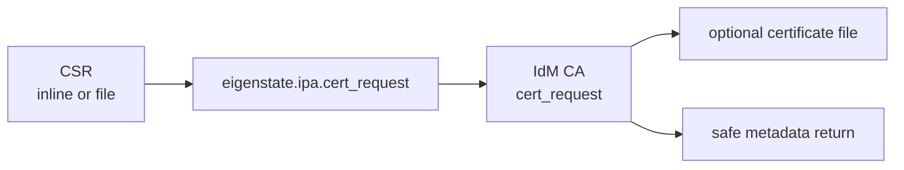



# Cert Request Module

Related docs:

<a href="https://gprocunier.github.io/eigenstate-ipa/cert-plugin.html"><kbd>&nbsp;&nbsp;CERT LOOKUP&nbsp;&nbsp;</kbd></a>
<a href="https://gprocunier.github.io/eigenstate-ipa/mutation-surface-migration.html"><kbd>&nbsp;&nbsp;MUTATION MIGRATION&nbsp;&nbsp;</kbd></a>
<a href="https://gprocunier.github.io/eigenstate-ipa/compatibility-policy.html"><kbd>&nbsp;&nbsp;COMPATIBILITY POLICY&nbsp;&nbsp;</kbd></a>
<a href="https://gprocunier.github.io/eigenstate-ipa/documentation-map.html"><kbd>&nbsp;&nbsp;DOCS MAP&nbsp;&nbsp;</kbd></a>

`eigenstate.ipa.cert_request` submits a certificate signing request to the IdM
CA and optionally writes the issued certificate to disk. It is the preferred
surface for new automation that requests certificates because the task has
module-style change reporting, check-mode behavior, and safe metadata-first
returns.

Private key handling remains outside this module. Generate and protect the
private key with the platform or application workflow that owns it, then pass
only the CSR into `cert_request`.

## Request Flow



## Example

```yaml
- name: Request a service certificate
  eigenstate.ipa.cert_request:
    principal: HTTP/app.example.com@EXAMPLE.COM
    csr_file: /etc/pki/tls/certs/app.csr
    destination: /etc/pki/tls/certs/app.pem
    mode: "0644"
    server: idm-01.example.com
    kerberos_keytab: /runner/env/ipa/admin.keytab
```

The default return is metadata only:

```yaml
changed: true
principal: HTTP/app.example.com@EXAMPLE.COM
destination: /etc/pki/tls/certs/app.pem
metadata:
  serial_number: 42
  subject: CN=app.example.com,O=EXAMPLE.COM
  issuer: CN=Certificate Authority,O=EXAMPLE.COM
  valid_not_before: "2026-05-05 00:00:00"
  valid_not_after: "2027-05-05 00:00:00"
  san:
    - app.example.com
  revoked: false
```

Certificate content is returned only when explicitly requested:

```yaml
- name: Request a certificate and return the PEM content
  eigenstate.ipa.cert_request:
    principal: HTTP/app.example.com@EXAMPLE.COM
    csr: "{{ app_csr }}"
    return_content: true
    server: idm-01.example.com
    ipaadmin_password: "{{ ipa_password }}"
```

## CSR Inputs

Use exactly one:

- `csr`: inline PEM CSR content
- `csr_file`: controller-local path to a PEM CSR

The module does not accept private key material. That keeps the request surface
limited to the artifact the CA needs.

## Destination Handling

When `destination` is set, the issued certificate is written to that path. The
module compares the local file content before replacing it and applies optional
`mode`, `owner`, and `group`.

Use `encoding: pem` for normal certificate files. Use `encoding: base64` only
when another tool expects base64 DER.

## Check Mode

Check mode does not submit the CSR. It reports that the request would be a
change and returns no certificate content.

## Compatibility

`eigenstate.ipa.cert` remains supported for lookup-shaped workflows, including
certificate retrieval and broad certificate searches. New certificate issuance
automation should prefer `cert_request` because issuance is a side-effecting CA
operation.


