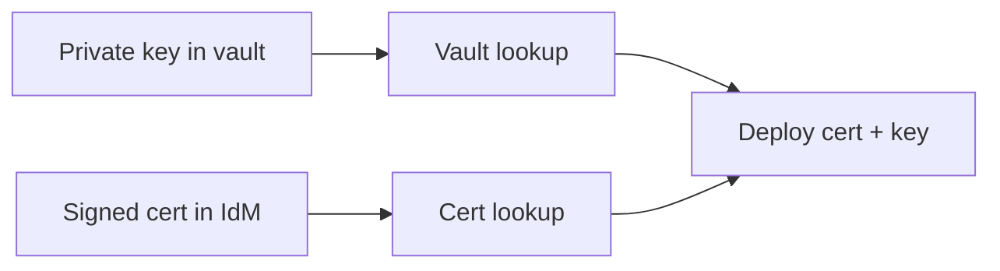
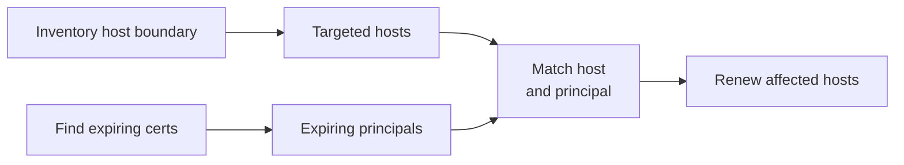
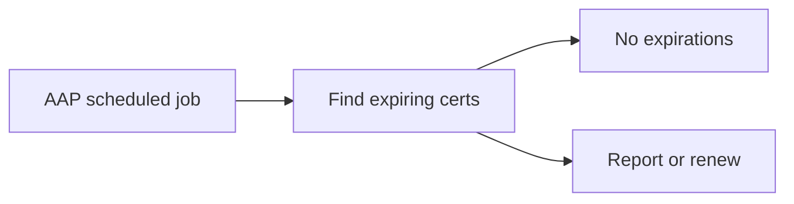
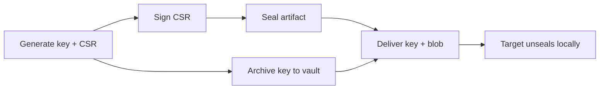
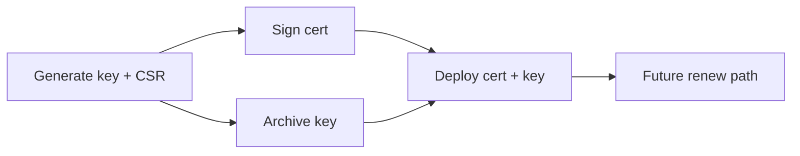



# IdM Cert Use Cases

Related docs:

<a href="https://gprocunier.github.io/eigenstate-ipa/cert-plugin.html"><kbd>&nbsp;&nbsp;IDM CERT PLUGIN&nbsp;&nbsp;</kbd></a>
<a href="https://gprocunier.github.io/eigenstate-ipa/cert-capabilities.html"><kbd>&nbsp;&nbsp;IDM CERT CAPABILITIES&nbsp;&nbsp;</kbd></a>
<a href="https://gprocunier.github.io/eigenstate-ipa/vault-use-cases.html"><kbd>&nbsp;&nbsp;IDM VAULT USE CASES&nbsp;&nbsp;</kbd></a>
<a href="https://gprocunier.github.io/eigenstate-ipa/rotation-use-cases.html"><kbd>&nbsp;&nbsp;ROTATION USE CASES&nbsp;&nbsp;</kbd></a>
<a href="https://gprocunier.github.io/eigenstate-ipa/documentation-map.html"><kbd>&nbsp;&nbsp;DOCS MAP&nbsp;&nbsp;</kbd></a>

## Purpose

This page contains worked examples for `eigenstate.ipa.cert` against the IdM
CA.

Use the capability guide to choose the cert operation and result pattern. Use
this page when you need the corresponding playbook.

Not every caller is a global IdM administrator. A service principal with the
right IdM permission delegation can request, retrieve, and search certificates
within its own scope. The examples below use a keytab-backed service principal
wherever that is the practical steady-state choice.

## Contents

- [Use Case Flow](#use-case-flow)
- [1. Request A Certificate For A New Service](#1-request-a-certificate-for-a-new-service)
- [2. Retrieve An Existing Certificate By Serial Number](#2-retrieve-an-existing-certificate-by-serial-number)
- [3. Pre-Expiry Report: Find Certificates In An Expiry Window](#3-pre-expiry-report-find-certificates-in-an-expiry-window)
- [4. Renew A Certificate Before It Expires](#4-renew-a-certificate-before-it-expires)
- [5. Multi-Service Batch Request](#5-multi-service-batch-request)
- [6. Cert Plus Key Bundle Delivery](#6-cert-plus-key-bundle-delivery)
- [7. Expiry-Driven Renewal With IdM Inventory](#7-expiry-driven-renewal-with-idm-inventory)
- [8. Post-Enrollment Certificate Provisioning](#8-post-enrollment-certificate-provisioning)
- [9. Scheduled Cert Audit In AAP](#9-scheduled-cert-audit-in-aap)
- [10. Certmonger-Free Sealed Artifact Provisioning](#10-certmonger-free-sealed-artifact-provisioning)
- [11. Coordinated Cert And Private Key Provisioning](#11-coordinated-cert-and-private-key-provisioning)
- [Kerberos Is A Good Default Here](#kerberos-is-a-good-default-here)

## Use Case Flow


## 1. Request A Certificate For A New Service

Use `operation='request'` when a service principal needs its first signed
certificate and the CSR is available on the controller.

This is the most common cert issuance pattern for service deployments where
certmonger is not running on the target.


Example:

```yaml
- name: Request and deploy a service certificate
  hosts: api.corp.example.com
  gather_facts: false

  tasks:
    - name: Request signed certificate from IdM
      ansible.builtin.set_fact:
        service_cert: "{{ lookup('eigenstate.ipa.cert',
                           'HTTP/api.corp.example.com@CORP.EXAMPLE.COM',
                           operation='request',
                           server='idm-01.corp.example.com',
                           kerberos_keytab='/runner/env/ipa/svc-deploy.keytab',
                           csr_file='/runner/env/csr/api.corp.example.com.csr',
                           verify='/etc/ipa/ca.crt') }}"
      delegate_to: localhost
      run_once: true

    - name: Install certificate
      ansible.builtin.copy:
        content: "{{ service_cert }}"
        dest: /etc/pki/tls/certs/service.crt
        mode: "0644"
        owner: root
        group: root

    - name: Reload httpd
      ansible.builtin.systemd:
        name: httpd
        state: reloaded
```

## 2. Retrieve An Existing Certificate By Serial Number

Use `operation='retrieve'` when you already have the serial number and need
to pull the signed cert without re-issuing it.

This is useful after a `find` run that returned serial numbers, or when the
serial is tracked externally by a CMDB or audit system.


Example:

```yaml
- name: Retrieve certificate by known serial
  ansible.builtin.set_fact:
    cert_record: "{{ lookup('eigenstate.ipa.cert',
                      '12345',
                      operation='retrieve',
                      server='idm-01.corp.example.com',
                      kerberos_keytab='/runner/env/ipa/svc-deploy.keytab',
                      result_format='record',
                      verify='/etc/ipa/ca.crt') }}"

- name: Show cert subject and expiry
  ansible.builtin.debug:
    msg:
      - "subject={{ cert_record.metadata.subject }}"
      - "expires={{ cert_record.metadata.valid_not_after }}"
      - "revoked={{ cert_record.metadata.revoked }}"

- name: Write cert to disk
  ansible.builtin.copy:
    content: "{{ cert_record.value }}"
    dest: /etc/pki/tls/certs/service.crt
    mode: "0644"
```

## 3. Pre-Expiry Report: Find Certificates In An Expiry Window

Use `operation='find'` with `valid_not_after_from` and `valid_not_after_to`
to discover all certificates expiring in a given window.

This is the right starting point for a scheduled audit job that needs to
identify renewal candidates before they affect services.


Example:

```yaml
- name: Find certificates expiring in the next 45 days
  hosts: localhost
  gather_facts: true

  tasks:
    - name: Query IdM for expiring certs
      ansible.builtin.set_fact:
        expiring_certs: "{{ lookup('eigenstate.ipa.cert',
                              operation='find',
                              server='idm-01.corp.example.com',
                              kerberos_keytab='/runner/env/ipa/svc-audit.keytab',
                              valid_not_after_from='{{ ansible_date_time.date }}',
                              valid_not_after_to='{{ "%Y-%m-%d" | strftime(ansible_date_time.epoch | int + 45 * 86400) }}',
                              result_format='map_record',
                              verify='/etc/ipa/ca.crt') }}"

    - name: Report expiring certificates
      ansible.builtin.debug:
        msg: >
          serial={{ item.key }}
          subject={{ item.value.metadata.subject }}
          expires={{ item.value.metadata.valid_not_after }}
          revoked={{ item.value.metadata.revoked }}
      loop: "{{ expiring_certs | dict2items }}"
      when: expiring_certs | length > 0

    - name: Warn if nothing is expiring
      ansible.builtin.debug:
        msg: "No certificates found expiring in the next 45 days."
      when: expiring_certs | length == 0
```

The `map_record` format keys each result by serial number. That makes it easy
to iterate without depending on list position, and to pass individual records
to a renewal task by key.

## 4. Renew A Certificate Before It Expires

Use a `find` step to discover which certs need renewal, then re-request each
one with the same or refreshed CSR.

This is the standard pre-expiry renewal loop for service certificates managed
outside certmonger.


Example:

```yaml
- name: Renew expiring service certificates
  hosts: all
  gather_facts: true

  tasks:
    - name: Find certs expiring in 30 days
      ansible.builtin.set_fact:
        expiring: "{{ lookup('eigenstate.ipa.cert',
                       operation='find',
                       server='idm-01.corp.example.com',
                       kerberos_keytab='/runner/env/ipa/svc-deploy.keytab',
                       valid_not_after_from='{{ ansible_date_time.date }}',
                       valid_not_after_to='{{ "%Y-%m-%d" | strftime(ansible_date_time.epoch | int + 30 * 86400) }}',
                       result_format='map_record',
                       verify='/etc/ipa/ca.crt') }}"
      delegate_to: localhost
      run_once: true

    - name: Request renewal for this host if its cert is expiring
      ansible.builtin.set_fact:
        renewed_cert: "{{ lookup('eigenstate.ipa.cert',
                           'HTTP/' + inventory_hostname + '@CORP.EXAMPLE.COM',
                           operation='request',
                           server='idm-01.corp.example.com',
                           kerberos_keytab='/runner/env/ipa/svc-deploy.keytab',
                           csr_file='/runner/env/csr/' + inventory_hostname + '.csr',
                           verify='/etc/ipa/ca.crt') }}"
      delegate_to: localhost
      when: >
        expiring.values() |
        selectattr('metadata.subject', 'search', inventory_hostname) |
        list | length > 0

    - name: Install renewed certificate
      ansible.builtin.copy:
        content: "{{ renewed_cert }}"
        dest: /etc/pki/tls/certs/service.crt
        mode: "0644"
      when: renewed_cert is defined

    - name: Reload service after cert update
      ansible.builtin.systemd:
        name: httpd
        state: reloaded
      when: renewed_cert is defined
```

The previous cert remains valid until its original expiry date. Renewing
before that point gives a clean overlap window and avoids an outage.

## 5. Multi-Service Batch Request

Use multiple principals in `terms` when a single play needs to issue
certificates for a group of services at once.

This is practical for cluster deployments, service mesh bootstrapping, or
environment refreshes where several principals need fresh certs in the same
run.


Example:

```yaml
- name: Issue certificates for all web tier services
  hosts: web_tier
  gather_facts: false

  tasks:
    - name: Request certs for all web tier principals
      ansible.builtin.set_fact:
        web_certs: "{{ lookup('eigenstate.ipa.cert',
                         'HTTP/web-01.corp.example.com@CORP.EXAMPLE.COM',
                         'HTTP/web-02.corp.example.com@CORP.EXAMPLE.COM',
                         'HTTP/web-03.corp.example.com@CORP.EXAMPLE.COM',
                         operation='request',
                         server='idm-01.corp.example.com',
                         kerberos_keytab='/runner/env/ipa/svc-deploy.keytab',
                         csr_file='/runner/env/csr/web-tier.csr',
                         result_format='map',
                         verify='/etc/ipa/ca.crt') }}"
      delegate_to: localhost
      run_once: true

    - name: Install certificate for this host
      ansible.builtin.copy:
        content: "{{ web_certs['HTTP/' + inventory_hostname + '@CORP.EXAMPLE.COM'] }}"
        dest: /etc/pki/tls/certs/service.crt
        mode: "0644"

    - name: Reload httpd
      ansible.builtin.systemd:
        name: httpd
        state: reloaded
```

> [!NOTE]
> All principals here share the same CSR. If the CA profile requires the
> subject CN to match the principal name exactly, generate a separate CSR per
> host and call the lookup per-host instead of batching terms.

## 6. Cert Plus Key Bundle Delivery

Use `eigenstate.ipa.cert` for the signed certificate and `eigenstate.ipa.vault`
for the matching private key. Both are then deployed to the target in the same
play.

This is the primary full-TLS deployment pattern when the private key is stored
in an IdM vault. It avoids moving private key material through any other system.



Example:

```yaml
- name: Deploy TLS cert and key for a service
  hosts: api.corp.example.com
  gather_facts: false

  tasks:
    - name: Retrieve private key from IdM vault
      ansible.builtin.set_fact:
        service_key: "{{ lookup('eigenstate.ipa.vault',
                          'api.corp.example.com-tls-key',
                          server='idm-01.corp.example.com',
                          kerberos_keytab='/runner/env/ipa/svc-deploy.keytab',
                          shared=true,
                          verify='/etc/ipa/ca.crt') }}"
      delegate_to: localhost
      run_once: true
      no_log: true

    - name: Request signed certificate from IdM CA
      ansible.builtin.set_fact:
        service_cert: "{{ lookup('eigenstate.ipa.cert',
                           'HTTP/api.corp.example.com@CORP.EXAMPLE.COM',
                           operation='request',
                           server='idm-01.corp.example.com',
                           kerberos_keytab='/runner/env/ipa/svc-deploy.keytab',
                           csr_file='/runner/env/csr/api.corp.example.com.csr',
                           verify='/etc/ipa/ca.crt') }}"
      delegate_to: localhost
      run_once: true

    - name: Install private key
      ansible.builtin.copy:
        content: "{{ service_key }}"
        dest: /etc/pki/tls/private/service.key
        mode: "0600"
        owner: root
        group: root
      no_log: true

    - name: Install certificate
      ansible.builtin.copy:
        content: "{{ service_cert }}"
        dest: /etc/pki/tls/certs/service.crt
        mode: "0644"
        owner: root
        group: root

    - name: Reload service
      ansible.builtin.systemd:
        name: httpd
        state: reloaded
```

Both lookups use the same Kerberos keytab and the same IdM server. The
cert-signing and vault-retrieval operations are independent calls that run
in the same task sequence without requiring a second auth step.

> [!CAUTION]
> Always set `no_log: true` on tasks that handle private key material. The key
> is not the cert — set_fact for the cert separately so that debug and diff
> output for the cert remains visible while the key stays out of logs.

## 7. Expiry-Driven Renewal With IdM Inventory

Use `eigenstate.ipa.idm` dynamic inventory to scope a renewal play to a
specific IdM hostgroup, then use `eigenstate.ipa.cert` to find which certs
in that scope are actually expiring.

This avoids running renewal logic on every host in the estate. Only the hosts
whose certificates appear in the expiry window receive a cert operation.



Example:

```yaml
- name: Targeted cert renewal for web tier
  hosts: webservers
  gather_facts: true

  tasks:
    - name: Find certs expiring in 30 days
      ansible.builtin.set_fact:
        expiring: "{{ lookup('eigenstate.ipa.cert',
                       operation='find',
                       server='idm-01.corp.example.com',
                       kerberos_keytab='/runner/env/ipa/svc-audit.keytab',
                       valid_not_after_from='{{ ansible_date_time.date }}',
                       valid_not_after_to='{{ "%Y-%m-%d" | strftime(ansible_date_time.epoch | int + 30 * 86400) }}',
                       result_format='map_record',
                       verify='/etc/ipa/ca.crt') }}"
      delegate_to: localhost
      run_once: true

    - name: Renew if this host has an expiring cert
      ansible.builtin.set_fact:
        renewed_cert: "{{ lookup('eigenstate.ipa.cert',
                           'HTTP/' + inventory_hostname + '@CORP.EXAMPLE.COM',
                           operation='request',
                           server='idm-01.corp.example.com',
                           kerberos_keytab='/runner/env/ipa/svc-deploy.keytab',
                           csr_file='/runner/env/csr/' + inventory_hostname + '.csr',
                           verify='/etc/ipa/ca.crt') }}"
      delegate_to: localhost
      when: >
        expiring.values() |
        selectattr('metadata.subject', 'search', inventory_hostname) |
        list | length > 0

    - name: Install renewed cert
      ansible.builtin.copy:
        content: "{{ renewed_cert }}"
        dest: /etc/pki/tls/certs/service.crt
        mode: "0644"
      when: renewed_cert is defined

    - name: Reload service
      ansible.builtin.systemd:
        name: httpd
        state: reloaded
      when: renewed_cert is defined
```

The hostgroup boundary comes from the inventory source. The expiry window
boundary comes from the cert find. Hosts outside both boundaries are not
touched at all.

## 8. Post-Enrollment Certificate Provisioning

Use this pattern when a new host has just been enrolled in IdM and needs a
service certificate issued as part of the same provisioning play.

The certificate request happens after enrollment so the service principal
exists before the CSR is submitted.


Example:

```yaml
- name: Enroll host and provision service certificate
  hosts: newhost.corp.example.com
  gather_facts: false

  tasks:
    - name: Enroll host in IdM
      ansible.builtin.command:
        cmd: >-
          ipa-client-install
          --server=idm-01.corp.example.com
          --domain=corp.example.com
          --principal=admin
          --password="{{ ipa_enrollment_password }}"
          --unattended
      become: true

    - name: Add HTTP service principal in IdM
      ansible.builtin.command:
        cmd: ipa service-add HTTP/newhost.corp.example.com@CORP.EXAMPLE.COM
      delegate_to: localhost
      ignore_errors: true

    - name: Request service certificate
      ansible.builtin.set_fact:
        service_cert: "{{ lookup('eigenstate.ipa.cert',
                           'HTTP/newhost.corp.example.com@CORP.EXAMPLE.COM',
                           operation='request',
                           server='idm-01.corp.example.com',
                           kerberos_keytab='/runner/env/ipa/svc-deploy.keytab',
                           csr_file='/runner/env/csr/newhost.corp.example.com.csr',
                           verify='/etc/ipa/ca.crt') }}"
      delegate_to: localhost

    - name: Install certificate
      ansible.builtin.copy:
        content: "{{ service_cert }}"
        dest: /etc/pki/tls/certs/service.crt
        mode: "0644"
        owner: root
        group: root
      become: true
```

> [!NOTE]
> The `add=true` parameter on the cert lookup can auto-create the service
> principal as part of the request step. Use it instead of the explicit
> `ipa service-add` task if principal namespace hygiene is managed separately
> and you want a more compact play.

## 9. Scheduled Cert Audit In AAP

Use a scheduled job in Automation Controller to run the expiry find on a
regular cadence and report or trigger renewal automatically.

This is the operational steady-state pattern for large estates where cert
expiry needs to be caught before it causes an outage, without requiring manual
intervention.



Example:

```yaml
- name: Scheduled cert expiry audit
  hosts: localhost
  gather_facts: true

  vars:
    audit_window_days: 45
    idm_server: idm-01.corp.example.com
    idm_keytab: /runner/env/ipa/svc-audit.keytab
    idm_ca_cert: /runner/env/ipa/ca.crt

  tasks:
    - name: Compute expiry window end date
      ansible.builtin.set_fact:
        window_end: "{{ '%Y-%m-%d' | strftime(ansible_date_time.epoch | int + audit_window_days * 86400) }}"

    - name: Find certificates expiring within the audit window
      ansible.builtin.set_fact:
        expiring_certs: "{{ lookup('eigenstate.ipa.cert',
                              operation='find',
                              server=idm_server,
                              kerberos_keytab=idm_keytab,
                              valid_not_after_from=ansible_date_time.date,
                              valid_not_after_to=window_end,
                              result_format='map_record',
                              verify=idm_ca_cert) }}"

    - name: Pass audit — no certs expiring in window
      ansible.builtin.debug:
        msg: "No certificates expiring within {{ audit_window_days }} days."
      when: expiring_certs | length == 0

    - name: List expiring certificates
      ansible.builtin.debug:
        msg:
          - "serial={{ item.key }}"
          - "subject={{ item.value.metadata.subject }}"
          - "expires={{ item.value.metadata.valid_not_after }}"
          - "revoked={{ item.value.metadata.revoked }}"
      loop: "{{ expiring_certs | dict2items }}"
      when: expiring_certs | length > 0

    - name: Fail job if certs are expiring and alerting is required
      ansible.builtin.fail:
        msg: "{{ expiring_certs | length }} certificate(s) expiring within {{ audit_window_days }} days."
      when:
        - expiring_certs | length > 0
        - fail_on_expiring | default(false) | bool
```

Set `fail_on_expiring=true` in the job template extra vars to have AAP mark
the job as failed and trigger a notification. Leave it at the default `false`
to run the audit as a reporting-only job that always passes but logs what it
found.

## 10. Certmonger-Free Sealed Artifact Provisioning

The vault use case guide describes a sealed artifact delivery pattern where an
opaque blob is encrypted for a specific target host using `openssl cms`, archived
to an IdM vault, and retrieved and delivered by `eigenstate.ipa.vault`. That
pattern has one prerequisite: a CMS-usable X.509 certificate and matching private
key must already exist on the target before anything can be sealed for it.

On the certmonger path, the key is generated on the target and never moves. That
is the stronger model for established hosts. For new hosts being provisioned from
scratch, `eigenstate.ipa.cert` removes the dependency: the controller generates
the key and CSR, signs the cert through IdM CA, archives the private key to a
vault, seals the artifact using the cert, and archives the sealed blob to a
second vault — all before the target has received a single file.

> [!NOTE]
> On this path the private key passes through controller memory at generation
> time before being vaulted. The certmonger path — where the key is generated on
> the target and never moves — is architecturally stronger when the target
> already exists. Use this pattern for new-host provisioning where no prior
> cert/key pair has been established.



Example:

```yaml
- name: Provision cert-gated bootstrap and deliver sealed artifact
  hosts: newhost.corp.example.com
  gather_facts: false

  tasks:
    # Step 1 - generate key and CSR on the controller
    - name: Generate private key and CSR for target host
      ansible.builtin.command:
        cmd: >-
          openssl req -newkey rsa:4096 -nodes
          -keyout /runner/env/pki/{{ inventory_hostname }}.key
          -out /runner/env/pki/{{ inventory_hostname }}.csr
          -subj "/CN=host/{{ inventory_hostname }}"
        creates: /runner/env/pki/{{ inventory_hostname }}.csr
      delegate_to: localhost

    # Step 2 - sign the CSR via IdM CA
    - name: Request host certificate from IdM CA
      ansible.builtin.set_fact:
        host_cert: "{{ lookup('eigenstate.ipa.cert',
                        'host/' + inventory_hostname + '@CORP.EXAMPLE.COM',
                        operation='request',
                        server='idm-01.corp.example.com',
                        kerberos_keytab='/runner/env/ipa/svc-deploy.keytab',
                        csr_file='/runner/env/pki/' + inventory_hostname + '.csr',
                        verify='/etc/ipa/ca.crt') }}"
      delegate_to: localhost

    - name: Write cert to file for openssl cms recipient
      ansible.builtin.copy:
        content: "{{ host_cert }}"
        dest: /runner/env/pki/{{ inventory_hostname }}.crt
        mode: "0600"
      delegate_to: localhost

    # Step 3 - seal the bootstrap artifact using the host cert
    - name: Seal bootstrap artifact for this host
      ansible.builtin.command:
        cmd: >-
          openssl cms -encrypt
          -in /runner/env/artifacts/bootstrap.bin
          -out /runner/env/pki/{{ inventory_hostname }}-sealed.bin
          -recip /runner/env/pki/{{ inventory_hostname }}.crt
          -aes256 -binary -outform DER
      delegate_to: localhost

    # Step 4 - archive key and sealed blob to IdM vaults
    - name: Archive private key to IdM vault
      ansible.builtin.command:
        cmd: >-
          ipa vault-archive {{ inventory_hostname }}-tls-key
          --in /runner/env/pki/{{ inventory_hostname }}.key
          --shared
      delegate_to: localhost
      no_log: true

    - name: Archive sealed artifact to IdM vault
      ansible.builtin.command:
        cmd: >-
          ipa vault-archive {{ inventory_hostname }}-bootstrap
          --in /runner/env/pki/{{ inventory_hostname }}-sealed.bin
          --shared
      delegate_to: localhost

    # Step 5 - deliver to target via vault lookups
    - name: Retrieve sealed artifact from IdM vault
      ansible.builtin.set_fact:
        sealed_blob: "{{ lookup('eigenstate.ipa.vault',
                          inventory_hostname + '-bootstrap',
                          server='idm-01.corp.example.com',
                          kerberos_keytab='/runner/env/ipa/svc-deploy.keytab',
                          shared=true,
                          encoding='base64',
                          verify='/etc/ipa/ca.crt') }}"
      delegate_to: localhost

    - name: Retrieve private key from IdM vault
      ansible.builtin.set_fact:
        host_key: "{{ lookup('eigenstate.ipa.vault',
                       inventory_hostname + '-tls-key',
                       server='idm-01.corp.example.com',
                       kerberos_keytab='/runner/env/ipa/svc-deploy.keytab',
                       shared=true,
                       verify='/etc/ipa/ca.crt') }}"
      delegate_to: localhost
      no_log: true

    - name: Write sealed artifact to target
      ansible.builtin.copy:
        content: "{{ sealed_blob | b64decode }}"
        dest: /var/lib/bootstrap/sealed.bin
        mode: "0600"
        owner: root
        group: root

    - name: Install private key on target
      ansible.builtin.copy:
        content: "{{ host_key }}"
        dest: /etc/pki/tls/private/host.key
        mode: "0600"
        owner: root
        group: root
      no_log: true

    - name: Install certificate on target
      ansible.builtin.copy:
        content: "{{ host_cert }}"
        dest: /etc/pki/tls/certs/host.crt
        mode: "0644"
        owner: root
        group: root

    # Step 6 - unseal on target
    - name: Unseal bootstrap artifact on target
      ansible.builtin.command:
        cmd: >-
          openssl cms -decrypt
          -in /var/lib/bootstrap/sealed.bin
          -recip /etc/pki/tls/certs/host.crt
          -inkey /etc/pki/tls/private/host.key
          -inform DER
          -out /var/lib/bootstrap/artifact.bin
      become: true

    - name: Remove sealed blob after unseal
      ansible.builtin.file:
        path: /var/lib/bootstrap/sealed.bin
        state: absent
```

> [!CAUTION]
> The IdM vault vaults referenced here (`{{ inventory_hostname }}-tls-key` and
> `{{ inventory_hostname }}-bootstrap`) must be created before the archive steps
> run. Use `ipa vault-add --type standard --shared` for both, and grant the
> automation service principal access via `ipa vault-add-member`. See the sealed
> artifact workflow in the vault capabilities guide for the one-time admin setup
> steps.

## 11. Coordinated Cert And Private Key Provisioning

Use this pattern when a new service has no cert or private key yet and both
need to be provisioned in the same play.

This is a simpler variant of use case 6 for the cold-start case: no prior cert
exists, no prior vault entry exists. The controller generates the key and CSR,
the cert plugin signs the cert, and the private key goes directly to an IdM
vault. Subsequent plays use the vault plugin to retrieve the key and the cert
plugin to retrieve or renew the cert without needing to touch the controller
filesystem again.



Example:

```yaml
- name: Bootstrap TLS cert and key for a new service
  hosts: api.corp.example.com
  gather_facts: false

  tasks:
    - name: Generate private key and CSR on controller
      ansible.builtin.command:
        cmd: >-
          openssl req -newkey rsa:4096 -nodes
          -keyout /runner/env/pki/api.corp.example.com.key
          -out /runner/env/pki/api.corp.example.com.csr
          -subj "/CN=api.corp.example.com"
        creates: /runner/env/pki/api.corp.example.com.csr
      delegate_to: localhost

    - name: Request signed certificate from IdM CA
      ansible.builtin.set_fact:
        service_cert: "{{ lookup('eigenstate.ipa.cert',
                           'HTTP/api.corp.example.com@CORP.EXAMPLE.COM',
                           operation='request',
                           server='idm-01.corp.example.com',
                           kerberos_keytab='/runner/env/ipa/svc-deploy.keytab',
                           csr_file='/runner/env/pki/api.corp.example.com.csr',
                           verify='/etc/ipa/ca.crt') }}"
      delegate_to: localhost

    - name: Archive private key to IdM vault for future retrieval
      ansible.builtin.command:
        cmd: >-
          ipa vault-archive api-corp-tls-key
          --in /runner/env/pki/api.corp.example.com.key
          --shared
      delegate_to: localhost
      no_log: true

    - name: Install certificate on target
      ansible.builtin.copy:
        content: "{{ service_cert }}"
        dest: /etc/pki/tls/certs/service.crt
        mode: "0644"
        owner: root
        group: root

    - name: Retrieve and install private key from vault
      ansible.builtin.copy:
        content: "{{ lookup('eigenstate.ipa.vault',
                     'api-corp-tls-key',
                     server='idm-01.corp.example.com',
                     kerberos_keytab='/runner/env/ipa/svc-deploy.keytab',
                     shared=true,
                     verify='/etc/ipa/ca.crt') }}"
        dest: /etc/pki/tls/private/service.key
        mode: "0600"
        owner: root
        group: root
      no_log: true

    - name: Reload service
      ansible.builtin.systemd:
        name: httpd
        state: reloaded
```

After this play runs, subsequent renewal plays only need to call the cert plugin
to re-sign a fresh CSR against the same principal. The private key stays in the
vault and is retrieved identically on every run. Rotation of the private key
itself requires archiving a new key to the vault before the next delivery run —
the vault lookup always resolves the current archived value.

## Kerberos Is A Good Default Here

Kerberos is especially useful for cert automation because:

- a service keytab can authenticate to the IdM CA non-interactively without
  exposing a human password
- AAP execution environments can hold the keytab as a credential and present it
  transparently to the lookup plugin
- the same keytab principal can sign, retrieve, and audit certificates across
  rotation and renewal cycles
- the cert operation is authorized by IdM policy, not by a static password that
  needs rotation itself

Use password auth when bootstrapping a new environment, but prefer Kerberos for
any steady-state cert issuance and audit workflow.

For the decision model behind these scenarios, return to
<a href="https://gprocunier.github.io/eigenstate-ipa/cert-capabilities.html"><kbd>IDM CERT CAPABILITIES</kbd></a>.


