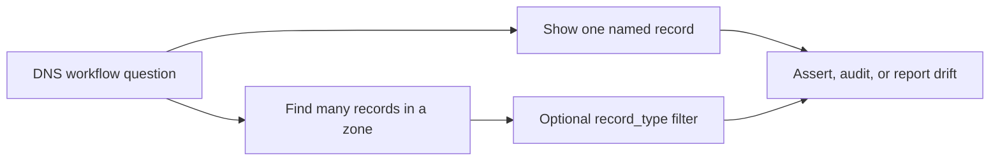

# DNS Capabilities

Related docs:

<a href="https://gprocunier.github.io/eigenstate-ipa/dns-plugin.html"><kbd>&nbsp;&nbsp;DNS PLUGIN&nbsp;&nbsp;</kbd></a>
<a href="https://gprocunier.github.io/eigenstate-ipa/dns-use-cases.html"><kbd>&nbsp;&nbsp;DNS USE CASES&nbsp;&nbsp;</kbd></a>
<a href="https://gprocunier.github.io/eigenstate-ipa/documentation-map.html"><kbd>&nbsp;&nbsp;DOCS MAP&nbsp;&nbsp;</kbd></a>

## Purpose

Use this guide to choose the right DNS lookup pattern for your automation.

The plugin reference explains exact option syntax. This page explains when a
single record lookup is enough, when a zone-wide search is the better fit, and
when to filter by DNS record type instead of post-processing a broad result set.

## Contents

- [Capability Model](#capability-model)
- [1. Pre-flight Record Validation](#1-pre-flight-record-validation)
- [2. Broad Zone Search](#2-broad-zone-search)
- [3. Reverse DNS and Enrollment Checks](#3-reverse-dns-and-enrollment-checks)
- [4. Zone Apex Entry Checks](#4-zone-apex-entry-checks)
- [5. Bulk Zone Audit](#5-bulk-zone-audit)
- [Quick Decision Matrix](#quick-decision-matrix)

## Capability Model

The DNS lookup has one core split:

- use `operation='show'` when the workflow depends on a specific record name
- use `operation='find'` when the workflow depends on an IdM-native zone search
- add `record_type` when you want only records that carry a specific RR kind such as `arecord` or `ptrrecord`

## 1. Pre-flight Record Validation

Use `operation='show'` when a play depends on one known record being present
before later work starts.

Typical cases:

- checking that a VIP record exists before creating dependent routes
- confirming a host A record is present after provisioning
- asserting that a reverse PTR was created for an enrolled system

Why this fits:

- `show` returns `exists: false` for missing records instead of raising
- one record includes TTL, RR data, and the apex marker fields that the IdM DNS APIs return for `@`

## 2. Broad Zone Search

Use `operation='find'` when the workflow depends on an IdM-side search across
one zone.

Typical cases:

- enumerating A records in `workshop.lan`
- checking reverse zones for PTR-bearing records
- building an audit report from the record families the IdM DNS API returns directly

Why this fits:

- the plugin stays aligned with the native IdM DNS API instead of acting like a recursive resolver
- `record_type` keeps the result set focused on the record family that matters

## 3. Reverse DNS and Enrollment Checks

Use `operation='show'` or `find` against a reverse zone when a workflow depends
on PTR state.

Typical cases:

- verifying PTR creation after host enrollment
- checking reverse-zone hygiene for infrastructure IP ranges
- auditing that a service IP resolves back to the expected name

Why this fits:

- reverse zones use the same plugin surface as forward zones
- the collection can keep DNS validation inside the IdM-native control plane

## 4. Zone Apex Entry Checks

Use `operation='show'` with `@` when the workflow needs zone-apex data rather
than only host records.

Typical cases:

- confirming that the managed zone apex entry exists
- checking that a zone lookup is targeting the apex rather than a host record
- capturing any apex metadata the IdM DNS APIs expose in the current environment

Why this fits:

- the apex record is still the right anchor for zone-level assertions
- some IdM environments expose only the apex marker fields through `ipalib`, so treat SOA and policy metadata as opportunistic rather than guaranteed

## 5. Bulk Zone Audit

Use `operation='find'` when you need a broad IdM-side search within one zone.

Typical cases:

- enumerate the records that IdM returns for a broad search in `workshop.lan`
- search for a family of names under `ocp.workshop.lan`
- build a focused report of records carrying SSHFP or PTR data when combined with `record_type`

Why this fits:

- `find` makes the plugin useful for audit and compliance, not just pre-flight checks
- `result_format='map_record'` is the better shape when later tasks need direct access by record name

## Quick Decision Matrix

| Need | Query |
| --- | --- |
| Check that one named host or service record exists | `operation='show'` |
| Validate one reverse record | `operation='show'` against the reverse zone |
| Inspect the zone apex entry | `operation='show'` with `@` |
| Search a zone broadly with IdM-native matching | `operation='find'` |
| Find only records carrying one RR type | `operation='find'` with `record_type=...` |
| Load many named records for later assertions | `result_format='map_record'` |
