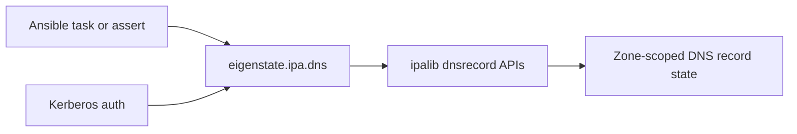



# DNS Plugin

Related docs:

<a href="https://gprocunier.github.io/eigenstate-ipa/dns-capabilities.html"><kbd>&nbsp;&nbsp;DNS CAPABILITIES&nbsp;&nbsp;</kbd></a>
<a href="https://gprocunier.github.io/eigenstate-ipa/dns-use-cases.html"><kbd>&nbsp;&nbsp;DNS USE CASES&nbsp;&nbsp;</kbd></a>
<a href="https://gprocunier.github.io/eigenstate-ipa/documentation-map.html"><kbd>&nbsp;&nbsp;DOCS MAP&nbsp;&nbsp;</kbd></a>
<a href="https://gprocunier.github.io/eigenstate-ipa/principal-plugin.html"><kbd>&nbsp;&nbsp;PRINCIPAL PLUGIN&nbsp;&nbsp;</kbd></a>

## Purpose

`eigenstate.ipa.dns` is the read-only integrated DNS lookup for this collection.
It exposes IdM DNS record state through one plugin surface built on the
FreeIPA `dnsrecord_show` and `dnsrecord_find` APIs.

Use it when playbooks need to:

- confirm that a forward or reverse record exists before proceeding
- audit the DNS names and record data that the IdM DNS APIs expose directly, without using a separate resolver library

This plugin is read-only. Use the official FreeIPA DNS modules for write paths.

## Contents

- [Lookup Model](#lookup-model)
- [Authentication Model](#authentication-model)
- [Operations](#operations)
- [Zone Scope](#zone-scope)
- [Return Shapes](#return-shapes)
- [Minimal Examples](#minimal-examples)
- [Failure Boundaries](#failure-boundaries)

## Lookup Model



## Authentication Model

Authentication follows the same pattern as the other `eigenstate.ipa` lookup
plugins:

1. `kerberos_keytab`: preferred for non-interactive and AAP use.
2. `ipaadmin_password`: uses password-backed `kinit`.
3. ambient Kerberos ticket: used when neither password nor keytab is passed.

`verify` defaults to `/etc/ipa/ca.crt` when present.

## Operations

### `show` (default)

Queries one or more named DNS records in a specific `zone` and returns one
record per entry. Missing records return `exists: false` instead of raising.

```yaml
vars:
  idm_record: "{{ lookup('eigenstate.ipa.dns',
                   'idm-01',
                   zone='workshop.lan',
                   server='idm-01.example.com',
                   kerberos_keytab='/etc/admin.keytab') }}"
```

### `find`

Searches records in `zone` using the native IdM `dnsrecord-find` matching
semantics. Use `criteria` when you want a filtered search, and add
`record_type` when you only care about records containing a specific RR kind.
This is an IdM-side search surface, not a full zone transfer or recursive
resolver.

```yaml
vars:
  ptr_records: "{{ lookup('eigenstate.ipa.dns',
                    operation='find',
                    zone='0.16.172.in-addr.arpa',
                    record_type='ptrrecord',
                    server='idm-01.example.com',
                    kerberos_keytab='/etc/admin.keytab') }}"
```

## Zone Scope

The plugin is zone-scoped by design.

- `zone` is always required
- `_terms` are names relative to that zone
- use `@` to inspect the zone apex entry
- reverse zones work the same way, for example `0.16.172.in-addr.arpa`

This keeps the lookup aligned with the underlying IdM DNS API rather than
pretending to be a generic recursive resolver.

## Return Shapes

### `result_format=record`

Returns a list with one dict per record. A single-term `show` lookup is
unwrapped by Ansible to a plain dict.

### `result_format=map_record`

Returns a single dict keyed by record name. This is the better shape when you
load multiple records and reference them by name later.

### Record Data

DNS data is returned in a generic structure instead of a hardcoded per-type
field list.

Key fields:

- `zone`, `name`, `fqdn`, `exists`
- `ttl`
- `record_types`
- `records`
- `template_record_types`
- `template_records`
- `is_zone_apex`
- zone-apex metadata fields when the IdM DNS APIs expose them for the queried record

## Minimal Examples

**Assert a host record exists with the expected A record:**

```yaml
- ansible.builtin.assert:
    that:
      - dns_record.exists
      - dns_record.records.arecord == ['172.16.0.10']
    fail_msg: "Required DNS record is missing or incorrect"
  vars:
    dns_record: "{{ lookup('eigenstate.ipa.dns',
                    'idm-01',
                    zone='workshop.lan',
                    server='idm-01.example.com',
                    kerberos_keytab='/etc/admin.keytab') }}"
```

**Inspect the zone apex entry:**

```yaml
- ansible.builtin.debug:
    var: zone_apex
  vars:
    zone_apex: "{{ lookup('eigenstate.ipa.dns',
                   '@',
                   zone='workshop.lan',
                   server='idm-01.example.com',
                   kerberos_keytab='/etc/admin.keytab') }}"
```

## Failure Boundaries

- `show` does not fail for missing records; it returns `exists: false`
- authorization failures raise a lookup error
- invalid TLS path or auth inputs raise a lookup error before the IPA query
- `find` follows native `dnsrecord-find` matching semantics and should be read as an IdM-side search, not a full zone transfer
- apex metadata fields may be null when the underlying IdM DNS APIs do not expose them through `ipalib`
- `find` returns an empty list when no records match the zone and filters


