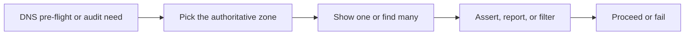



# DNS Use Cases

Related docs:

<a href="https://gprocunier.github.io/eigenstate-ipa/dns-plugin.html"><kbd>&nbsp;&nbsp;DNS PLUGIN&nbsp;&nbsp;</kbd></a>
<a href="https://gprocunier.github.io/eigenstate-ipa/dns-capabilities.html"><kbd>&nbsp;&nbsp;DNS CAPABILITIES&nbsp;&nbsp;</kbd></a>
<a href="https://gprocunier.github.io/eigenstate-ipa/documentation-map.html"><kbd>&nbsp;&nbsp;DOCS MAP&nbsp;&nbsp;</kbd></a>

## Purpose

This page contains worked examples for `eigenstate.ipa.dns` against
FreeIPA/IdM.

Use the capability guide to choose the right query shape. Use this page when
you need the corresponding playbook pattern.

## Contents

- [Use Case Flow](#use-case-flow)
- [1. Assert a Host Record Exists Before Deployment](#1-assert-a-host-record-exists-before-deployment)
- [2. Search Zone Records by Type](#2-search-zone-records-by-type)
- [3. Inspect the Zone Apex Entry](#3-inspect-the-zone-apex-entry)
- [4. Audit Reverse DNS State](#4-audit-reverse-dns-state)
- [5. Build a Named Map of Core Records](#5-build-a-named-map-of-core-records)

## Use Case Flow



## 1. Assert a Host Record Exists Before Deployment

Verify that a required record exists before a play relies on it.

```yaml
- name: Pre-flight - confirm API record before deployment
  hosts: localhost
  gather_facts: false

  tasks:
    - name: Read API record
      ansible.builtin.set_fact:
        api_record: "{{ lookup('eigenstate.ipa.dns',
                        'api',
                        zone='ocp.workshop.lan',
                        server='172.16.0.10',
                        kerberos_keytab='/runner/env/ipa/admin.keytab',
                        verify='/etc/ipa/ca.crt') }}"

    - name: Assert API record is present
      ansible.builtin.assert:
        that:
          - api_record.exists
          - api_record.records.arecord | length > 0
        fail_msg: "Required API DNS record is missing."
```

## 2. Search Zone Records by Type

Filter a zone search down to one record family when you want a compact audit surface.

```yaml
- name: Audit forward records in workshop.lan
  hosts: localhost
  gather_facts: false

  tasks:
    - name: Read A-bearing records from workshop.lan
      ansible.builtin.set_fact:
        a_records: "{{ lookup('eigenstate.ipa.dns',
                         operation='find',
                         zone='workshop.lan',
                         record_type='arecord',
                         server='172.16.0.10',
                         kerberos_keytab='/runner/env/ipa/admin.keytab',
                         verify='/etc/ipa/ca.crt') }}"

    - name: Assert idm-01 appears in the forward record set
      ansible.builtin.assert:
        that:
          - "'idm-01' in (a_records | map(attribute='name') | list)"
        fail_msg: "idm-01 was not returned from the workshop.lan A record search."
```

## 3. Inspect the Zone Apex Entry

Read the zone apex record when the workflow needs to confirm the authoritative apex entry and capture any metadata the IdM APIs expose.

```yaml
- name: Inspect workshop.lan apex data
  hosts: localhost
  gather_facts: false

  tasks:
    - name: Read zone apex
      ansible.builtin.set_fact:
        zone_apex: "{{ lookup('eigenstate.ipa.dns',
                       '@',
                       zone='workshop.lan',
                       server='172.16.0.10',
                       kerberos_keytab='/runner/env/ipa/admin.keytab',
                       verify='/etc/ipa/ca.crt') }}"

    - name: Assert apex entry was returned
      ansible.builtin.assert:
        that:
          - zone_apex.exists
          - zone_apex.is_zone_apex
          - "'idnszone' in zone_apex.object_classes"
        fail_msg: "workshop.lan apex entry was not returned by IdM DNS."
```

## 4. Audit Reverse DNS State

Enumerate PTR-bearing records in a reverse zone.

```yaml
- name: Audit reverse DNS records
  hosts: localhost
  gather_facts: false

  tasks:
    - name: Read PTR-bearing records from reverse zone
      ansible.builtin.set_fact:
        ptr_records: "{{ lookup('eigenstate.ipa.dns',
                          operation='find',
                          zone='0.16.172.in-addr.arpa',
                          record_type='ptrrecord',
                          server='172.16.0.10',
                          kerberos_keytab='/runner/env/ipa/admin.keytab',
                          verify='/etc/ipa/ca.crt') }}"

    - name: Report reverse record names
      ansible.builtin.debug:
        msg: "Reverse records: {{ ptr_records | map(attribute='name') | list }}"
```

## 5. Build a Named Map of Core Records

Load multiple records into a keyed dict when later tasks need direct named access.

```yaml
- name: Build keyed DNS record map
  hosts: localhost
  gather_facts: false

  tasks:
    - name: Load record map
      ansible.builtin.set_fact:
        dns_map: "{{ lookup('eigenstate.ipa.dns',
                      'idm-01', 'bastion-01', 'mirror-registry',
                      zone='workshop.lan',
                      result_format='map_record',
                      server='172.16.0.10',
                      kerberos_keytab='/runner/env/ipa/admin.keytab',
                      verify='/etc/ipa/ca.crt') }}"

    - name: Assert bastion record exists
      ansible.builtin.assert:
        that:
          - dns_map['bastion-01'].exists
          - dns_map['bastion-01'].records.arecord == ['172.16.0.30']
        fail_msg: "bastion-01 DNS record is missing or incorrect."


