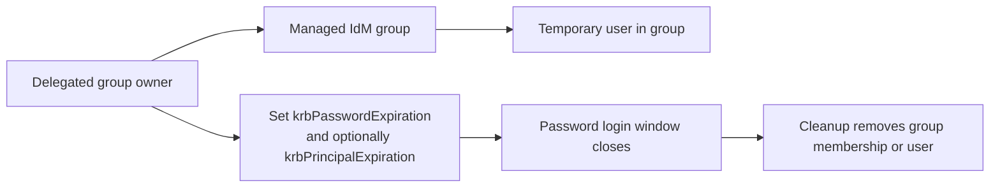
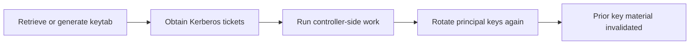



# Ephemeral Access Capabilities

Related docs:

<a href="https://gprocunier.github.io/eigenstate-ipa/vault-cyberark-primer.html"><kbd>&nbsp;&nbsp;VAULT/CYBERARK PRIMER&nbsp;&nbsp;</kbd></a>
<a href="https://gprocunier.github.io/eigenstate-ipa/aap-integration.html"><kbd>&nbsp;&nbsp;AAP INTEGRATION&nbsp;&nbsp;</kbd></a>
<a href="https://gprocunier.github.io/eigenstate-ipa/keytab-capabilities.html"><kbd>&nbsp;&nbsp;KEYTAB CAPABILITIES&nbsp;&nbsp;</kbd></a>
<a href="https://gprocunier.github.io/eigenstate-ipa/otp-capabilities.html"><kbd>&nbsp;&nbsp;OTP CAPABILITIES&nbsp;&nbsp;</kbd></a>
<a href="https://gprocunier.github.io/eigenstate-ipa/documentation-map.html"><kbd>&nbsp;&nbsp;DOCS MAP&nbsp;&nbsp;</kbd></a>

## Purpose

Use this guide when the question is not just "how do I rotate a secret?" but
"how do I make access feel temporary or leased inside an IdM-centric estate?"

This page exists because the answer is more nuanced than a flat "IdM has no
dynamic secrets." That statement is still true in the Vault sense. But it is
not the whole story.

IdM does not provide Vault-style dynamic secret engines with first-class lease
objects, renewal, and revoke semantics. What it does provide is a set of
identity-native controls that can be composed into lease-like temporary access
patterns.

There are two important patterns:

- temporary user access with delegated expiry control
- Kerberos machine identity with immediate key retirement

These are not substitutes for dynamic database credentials or cloud IAM role
issuance. They are stronger answers than ordinary static passwords when the
workload already fits IdM and Kerberos.

## What This Is Not

This guide is not claiming:

- native dynamic secrets engines
- Vault-style lease objects
- automatic renew/revoke semantics tied to an issuer-owned lease record
- cloud- or database-style ephemeral credentials on demand

Those remain real gaps relative to Vault.

## Pattern 1: Delegated Temporary User Lease

This pattern is for temporary user-backed automation or delegated temporary
operator access.

The key idea is that cleanup is not the primary control. Cleanup is hygiene.
The primary control is expiry on the identity itself.

Strong version of the pattern:

- a non-admin group owner manages membership of a specific IdM group
- delegated RBAC allows that same actor, or automation they run, to modify
  `krbPasswordExpiration` for members of that governed group
- temporary automation user is added to the governed group
- the password expiry is set near in time, or forced immediately when the work
  window closes
- cleanup later removes the user or its group membership

Why this is attractive:

- the access boundary is enforced in IdM rather than only in an external
  scheduler
- the delegating team does not need full IPA admin rights
- cleanup failure is less catastrophic because the main cutoff is expiry, not
  the later hygiene job

Important limits:

- `krbPasswordExpiration` is a password-authentication control, not a full
  lease object
- already-issued Kerberos tickets can remain valid until ticket lifetime ends
- if you need a harder cutoff, pair `krbPasswordExpiration` with
  `krbPrincipalExpiration` and short ticket lifetime policy

Best fit:

- temporary operator access
- AAP jobs that truly need a user-backed identity instead of a service
  principal
- delegated administration models where one team owns the group boundary and
  the temporary access window

## Pattern 2: Kerberos Machine Identity Lease

This pattern is for service principals or dedicated automation principals.

The key idea is that the runtime credential is usually a Kerberos ticket, not
repeated direct use of the keytab itself.

Why this is stronger than a static password:

- the identity is bound to a principal, not a shared generic secret
- the keytab can be rotated centrally
- prior key material can be invalidated immediately by rotating the principal
  keys again
- `principal` and `keytab` already give the collection the surfaces needed to
  inspect and drive that lifecycle

What this is good for:

- dedicated controller workflows
- one-purpose automation principals
- tightly coordinated service rollout windows
- cases where immediate retirement of prior key material is sufficient

What it is not:

- a native lease object
- a TTL-backed issuer contract
- a replacement for dynamic database credentials
- something you should do casually for broad shared service principals without
  rollout coordination

## Where AAP Fits

AAP is useful here, but it is not the only control plane.

AAP helps by supplying:

- workflow templates
- schedules
- credential injection
- approvals
- repeatable execution environments
- cleanup and reporting jobs

AAP is not what makes these patterns lease-like. IdM does that part:

- delegated administration and group ownership
- password or principal expiry
- ticket policy
- key invalidation through principal rotation

That distinction matters. It means the strongest temporary-access story is not
"AAP cleanup eventually runs." It is "IdM access becomes unusable on its own,
and AAP handles orchestration around it."

## Decision Matrix

| Need | Better pattern |
| --- | --- |
| temporary operator or user-backed automation access | delegated temporary user lease |
| temporary machine identity where Kerberos already fits | Kerberos machine identity lease |
| static shared secret on a schedule | AAP-scheduled rotation workflow |
| dynamic database or cloud credentials | use Vault or another true dynamic secret system |

## Practical Guardrails

- prefer service principals and Kerberos-first automation when the workload can
  support it
- use temporary users only when the login model really needs a user identity
- do not describe either pattern as a Vault-style dynamic secret engine
- when relying on password expiry, also reason about ticket lifetime
- when relying on key rotation, treat rollout coordination as part of the
  control, not an afterthought

## How To Read The Rest Of The Docs

After this page:

- read <a href="https://gprocunier.github.io/eigenstate-ipa/vault-cyberark-primer.html"><kbd>VAULT/CYBERARK PRIMER</kbd></a>
  for the higher-level comparison framing
- read <a href="https://gprocunier.github.io/eigenstate-ipa/keytab-capabilities.html"><kbd>KEYTAB CAPABILITIES</kbd></a>
  for the Kerberos machine-identity side in more depth
- read <a href="https://gprocunier.github.io/eigenstate-ipa/aap-integration.html"><kbd>AAP INTEGRATION</kbd></a>
  for the controller orchestration boundary


