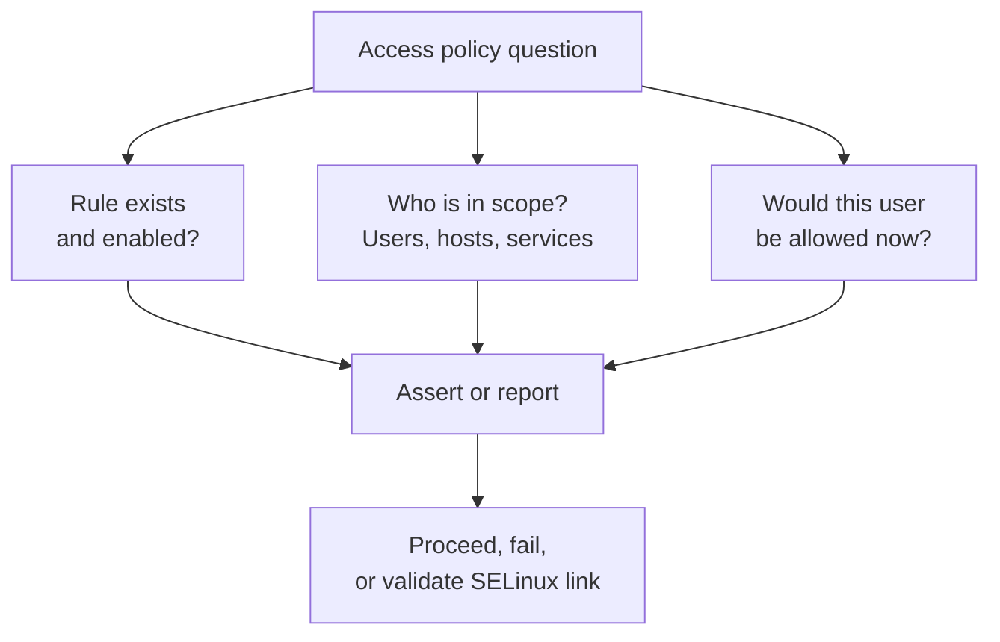
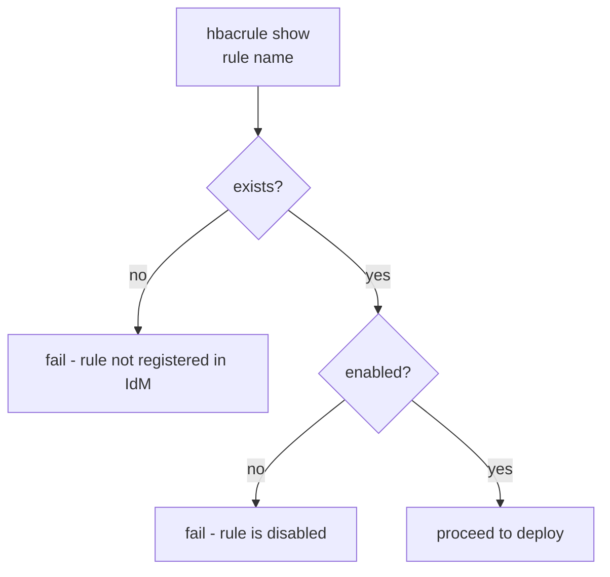
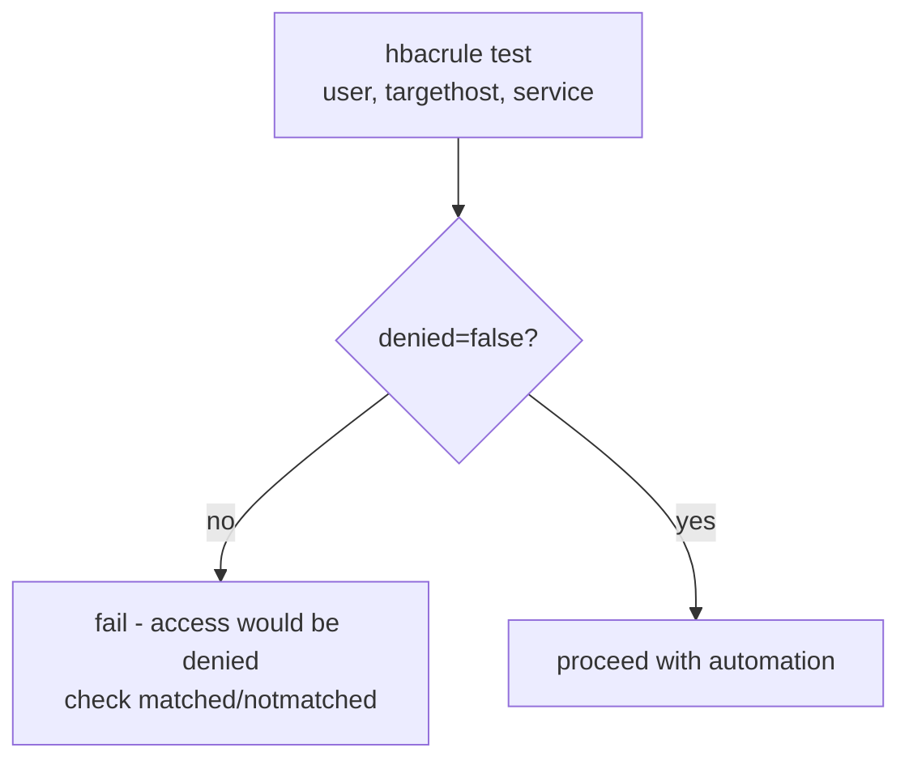
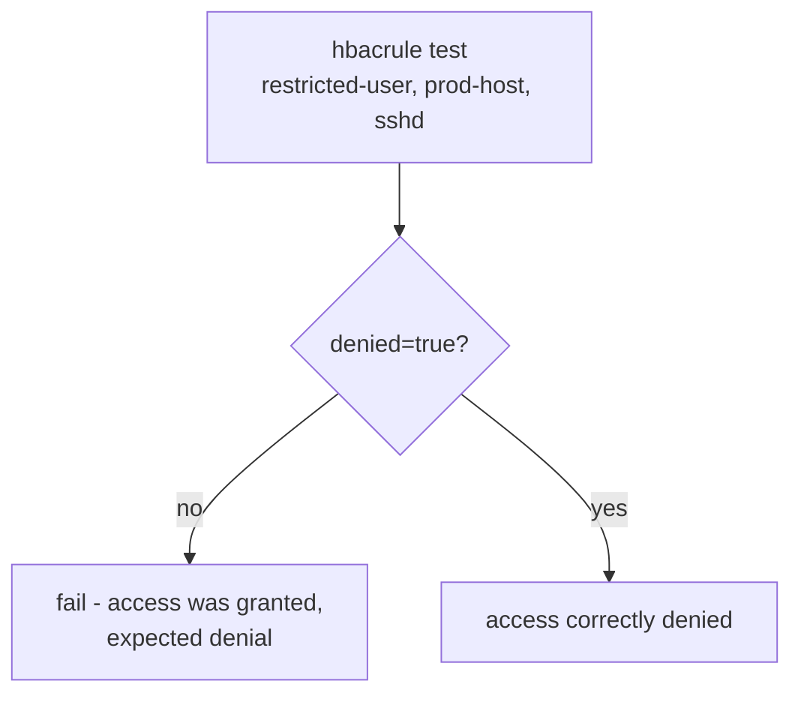
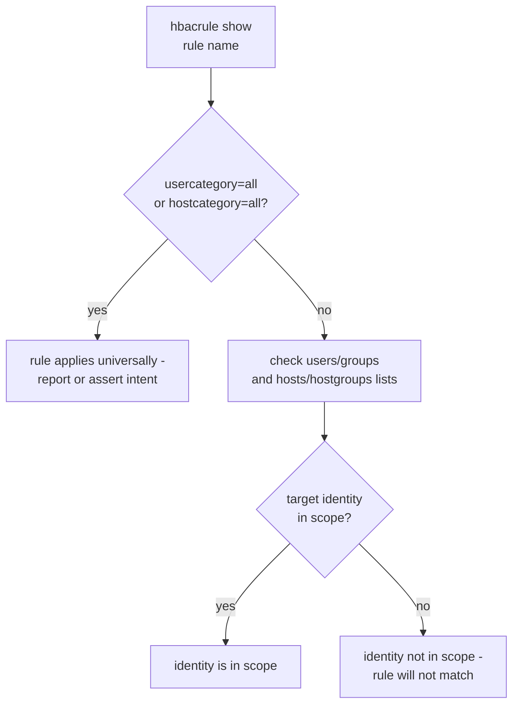
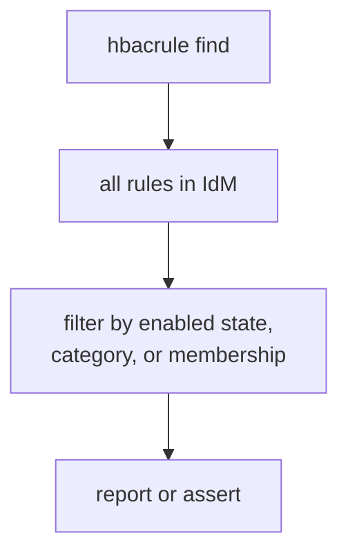
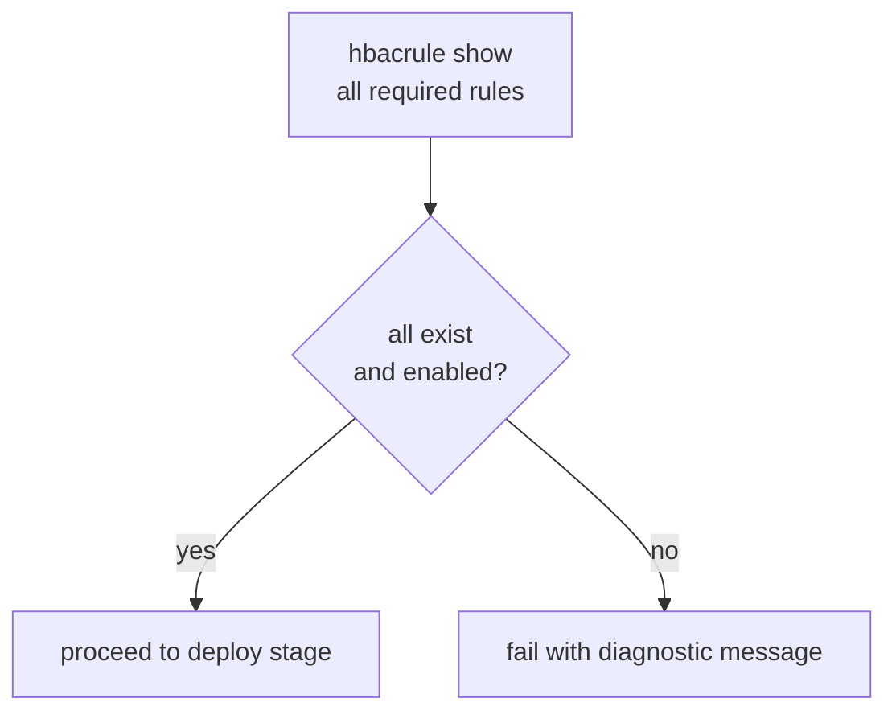
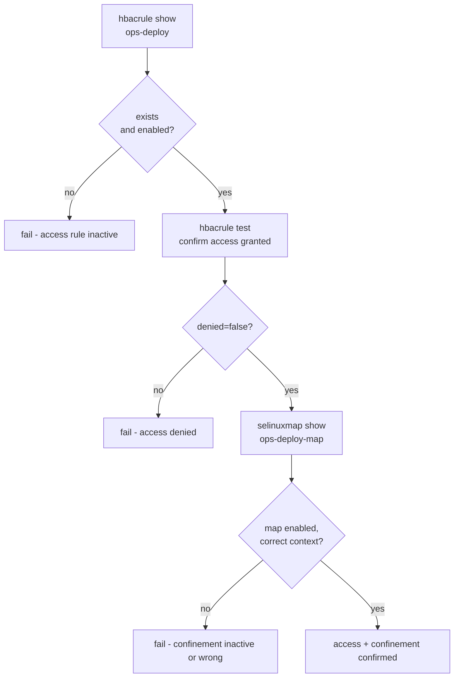

# HBAC Rule Capabilities

Related docs:

<a href="https://gprocunier.github.io/eigenstate-ipa/hbacrule-plugin.html"><kbd>&nbsp;&nbsp;HBAC RULE PLUGIN&nbsp;&nbsp;</kbd></a>
<a href="https://gprocunier.github.io/eigenstate-ipa/hbacrule-use-cases.html"><kbd>&nbsp;&nbsp;HBAC RULE USE CASES&nbsp;&nbsp;</kbd></a>
<a href="https://gprocunier.github.io/eigenstate-ipa/selinuxmap-capabilities.html"><kbd>&nbsp;&nbsp;SELINUX MAP CAPABILITIES&nbsp;&nbsp;</kbd></a>
<a href="https://gprocunier.github.io/eigenstate-ipa/documentation-map.html"><kbd>&nbsp;&nbsp;DOCS MAP&nbsp;&nbsp;</kbd></a>

## Purpose

Use this guide to choose the right HBAC rule query pattern for your automation.

It is the companion to the hbacrule plugin reference. Use the reference for
exact option syntax; use this guide when you are designing an access validation
or confinement workflow and need to know which capability fits your situation.

## Contents

- [Capability Model](#capability-model)
- [1. Pre-flight Before Deployment — Rule Exists and Is Enabled](#1-pre-flight-before-deployment--rule-exists-and-is-enabled)
- [2. Validate Access Would Be Granted Before Running Tasks](#2-validate-access-would-be-granted-before-running-tasks)
- [3. Validate Access Is Denied for Restricted Identities](#3-validate-access-is-denied-for-restricted-identities)
- [4. Check Rule Scope — Membership or Category](#4-check-rule-scope--membership-or-category)
- [5. Bulk Audit of All HBAC Rules](#5-bulk-audit-of-all-hbac-rules)
- [6. Pipeline Gate — Abort When Access Policy Is Wrong](#6-pipeline-gate--abort-when-access-policy-is-wrong)
- [7. Cross-Plugin: HBAC Rule State Then SELinux Map Validation](#7-cross-plugin-hbac-rule-state-then-selinux-map-validation)
- [Quick Decision Matrix](#quick-decision-matrix)

## Capability Model

The hbacrule plugin has two modes: **configuration inspection** (`show`,
`find`) answers whether a rule exists, is enabled, and who is in scope.
**Live access test** (`operation=test`) runs the actual FreeIPA hbactest engine
and answers whether a specific user would be permitted.

Use configuration inspection when you are validating that policy is in place.
Use access test when you need to confirm that policy is operating correctly
for a specific identity, host, and service tuple.

## 1. Pre-flight Before Deployment — Rule Exists and Is Enabled

Use `eigenstate.ipa.hbacrule` with `operation=show` before a play that deploys
to a host, when the deployment depends on the target having correct access
policy in IdM.

Typical cases:

- plays that deploy automation identities and require those identities to have
  access policy registered before configuration is applied
- pre-release pipelines that should fail if any required HBAC rule is absent
  or disabled
- workflows where a missing HBAC rule would cause login failure at runtime;
  catching this during pre-flight separates a policy problem from an
  application problem

Why this pattern fits:

- `show` returns `exists: false` for missing rules rather than raising, so a
  single assert covers both the absent and disabled cases
- catching this before the play begins separates a policy gap from a
  deployment problem

## 2. Validate Access Would Be Granted Before Running Tasks

Use `operation=test` to confirm that a specific identity would actually be
allowed access before running tasks that depend on it.

Typical cases:

- plays that run under a named service identity and must confirm SSSD would
  permit that identity to reach the target host before proceeding
- pre-flight plays for operator-initiated jobs where a wrong HBAC rule would
  cause a login failure that is hard to distinguish from an application error
- compliance checks that confirm a privileged identity has access exactly where
  intended and nowhere else

Why this pattern fits:

- `operation=test` calls the same FreeIPA hbactest engine SSSD uses; the
  result is authoritative for this IdM server's current policy state
- `matched` and `notmatched` in the result identify which rules are relevant,
  which aids debugging when access is unexpectedly denied

## 3. Validate Access Is Denied for Restricted Identities

Use `operation=test` to confirm that identities outside a defined scope cannot
reach a restricted host. This is the inverse of capability #2.

Typical cases:

- security audits that verify a production host is not reachable by
  non-privileged identities
- compliance checks that confirm least-privilege access boundaries are enforced
- post-change validation after a rule is tightened

Important caveat:

- a `denied: true` expectation only holds when no broader enabled HBAC rule also grants access
- environments with global rules such as `allow_all` will still return access granted even when the specific rule under review does not match
- in those environments, the stronger check is often that the expected rule lands in `matched` or `notmatched` as intended

Why this pattern fits:

- asserting `denied: true` confirms the access boundary from the outside,
  not just from the policy configuration view
- the `matched` field identifies any rule that unexpectedly granted access,
  which points directly to what needs to be fixed

## 4. Check Rule Scope — Membership or Category

Use `show` or `find` to inspect which identities and hosts are in scope for a
rule, and whether the rule uses category-wide (`all`) or direct membership
scope.

Typical cases:

- audits that identify rules using `usercategory=all` or `hostcategory=all`
  (permissive rules that apply universally)
- pre-flight checks that confirm a specific user or group is in the direct
  membership list before relying on that rule for access
- compliance workflows that report on the scope model of all rules

Why this pattern fits:

- checking the scope model before relying on a rule for access catches the case
  where a rule exists but does not actually cover the intended identity or host
- `usercategory=all` rules like `allow_all` match every user; confirming their
  enabled state is the important check rather than membership lists

## 5. Bulk Audit of All HBAC Rules

Use `operation=find` to enumerate all HBAC rules and report on their state.

Typical cases:

- day-2 compliance audits that list every rule that is disabled, or every rule
  using `allow_all` scope
- checks that a defined set of required rules all exist and are enabled
- inventory-style reports of the full HBAC policy model before a change window

Why this pattern fits:

- `find` returns all rules without requiring knowledge of their names
- `result_format=map_record` makes it easy to reference rules by name in
  subsequent tasks
- filtering in Jinja2 with `selectattr` avoids shell-out to `ipa hbacrule-find`

## 6. Pipeline Gate — Abort When Access Policy Is Wrong

Use `ansible.builtin.assert` with the hbacrule record to abort a pipeline
stage when required access policy is absent or incorrect.

Typical cases:

- CI/CD pipelines where the deployment stage must not run unless named HBAC
  rules are present and active
- pre-flight roles that run first in a complex deploy and gate all subsequent
  tasks on the access policy model being correct
- multi-identity workflows where each service identity must have its own rule
  before any of them deploy

Why this pattern fits:

- a single assert task can gate an entire play on the state of multiple rules
- `result_format=map_record` lets the assert reference rules by name, which is
  more readable when checking several policies at once

## 7. Cross-Plugin: HBAC Rule State Then SELinux Map Validation

Combine `eigenstate.ipa.hbacrule` and `eigenstate.ipa.selinuxmap` to validate
the complete access and confinement model from the access side.

Use this pattern in pre-deploy roles that need to confirm both that the
identity can reach the target (HBAC) and that it will be confined correctly
(SELinux map) when it does.

## Quick Decision Matrix

| Need | Best capability |
| --- | --- |
| Confirm rule exists and is enabled before deploying | Pre-flight — rule present (#1) |
| Confirm a user would actually be allowed access | Live access test (#2) |
| Confirm a restricted user cannot reach a host | Inverse access test (#3) |
| Check which identities and hosts are in scope | Scope inspection (#4) |
| List all rules and their state | Bulk audit (#5) |
| Abort pipeline if any required rule is wrong | Pipeline gate (#6) |
| Validate access rule and confinement map together | Cross-plugin: hbac + selinuxmap (#7) |

For option-level behavior, field definitions, and exact lookup syntax, return
to
<a href="https://gprocunier.github.io/eigenstate-ipa/hbacrule-plugin.html"><kbd>HBAC RULE PLUGIN</kbd></a>.
