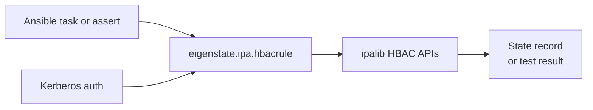



# HBAC Rule Plugin

Related docs:

<a href="https://gprocunier.github.io/eigenstate-ipa/hbacrule-capabilities.html"><kbd>&nbsp;&nbsp;HBAC RULE CAPABILITIES&nbsp;&nbsp;</kbd></a>
<a href="https://gprocunier.github.io/eigenstate-ipa/hbacrule-use-cases.html"><kbd>&nbsp;&nbsp;HBAC RULE USE CASES&nbsp;&nbsp;</kbd></a>
<a href="https://gprocunier.github.io/eigenstate-ipa/selinuxmap-plugin.html"><kbd>&nbsp;&nbsp;SELINUX MAP PLUGIN&nbsp;&nbsp;</kbd></a>
<a href="https://gprocunier.github.io/eigenstate-ipa/principal-plugin.html"><kbd>&nbsp;&nbsp;PRINCIPAL PLUGIN&nbsp;&nbsp;</kbd></a>
<a href="https://gprocunier.github.io/eigenstate-ipa/documentation-map.html"><kbd>&nbsp;&nbsp;DOCS MAP&nbsp;&nbsp;</kbd></a>

## Purpose

`eigenstate.ipa.hbacrule` queries HBAC rule state from FreeIPA/IdM from
Ansible, and can invoke the FreeIPA `hbactest` engine to answer *would this
user be allowed to log in to this host?*

HBAC rules are the FreeIPA mechanism that controls host-based access: which
identities may access which hosts via which services. SSSD evaluates HBAC at
login. HBAC rules also serve as the scope provider for SELinux user maps when
a map is configured with HBAC-linked scope — the same rule that controls who
can log in also determines which SELinux context they receive.

This reference covers:

- how the plugin authenticates to IdM
- what the `show`, `find`, and `test` operations return
- what fields each result record contains
- how to run a simulated access test using the FreeIPA hbactest engine
- how to return a list versus a keyed map

To create, modify, or delete HBAC rules, use
`freeipa.ansible_freeipa.ipahbacrule`. This plugin is read-only.

## Contents

- [Lookup Model](#lookup-model)
- [Authentication Model](#authentication-model)
- [Operations](#operations)
- [Result Record Fields — show and find](#result-record-fields--show-and-find)
- [Result Record Fields — test](#result-record-fields--test)
- [Return Shapes](#return-shapes)
- [Minimal Examples](#minimal-examples)
- [Failure Boundaries](#failure-boundaries)
- [When To Read The Scenario Guide](#when-to-read-the-scenario-guide)

## Lookup Model



## Authentication Model

Authentication follows the same pattern as all other `eigenstate.ipa` lookup
plugins:

1. **Keytab** (`kerberos_keytab`): preferred for non-interactive and AAP use.
   Pass the path to a keytab file. The plugin calls `kinit -kt` and manages
   the ccache lifecycle around the connection.
2. **Password** (`ipaadmin_password`): uses `ipalib.kinit_password` when
   available and falls back to the system `kinit` command on supported RHEL
   controllers as a compatibility path. In AAP, prefer keytabs over
   password-derived tickets. Set via `IPA_ADMIN_PASSWORD` environment variable
   for AAP credential injection.
3. **Ambient ticket**: when neither password nor keytab is provided, the plugin
   uses whatever ticket is in the current `KRB5CCNAME` or the default ccache.

TLS verification (`verify`) defaults to `/etc/ipa/ca.crt` when it exists.
Set it explicitly in EEs where the host system cert store is not available.

## Operations

### `show` (default)

Queries one or more named HBAC rules and returns a record per name.

When a rule does not exist, `show` returns a record with `exists: false` and
all fields null or empty. This lets pre-flight assertions run without
`ignore_errors`.

```yaml
vars:
  rule: "{{ lookup('eigenstate.ipa.hbacrule',
            'ops-deploy',
            server='idm-01.example.com',
            kerberos_keytab='/etc/admin.keytab') }}"
```

### `find`

Searches all HBAC rules in IdM. Returns a list of all rules, optionally
filtered by the `criteria` string.

```yaml
vars:
  all_rules: "{{ lookup('eigenstate.ipa.hbacrule',
                  operation='find',
                  server='idm-01.example.com',
                  kerberos_keytab='/etc/admin.keytab') }}"
```

### `test`

Invokes the FreeIPA `hbactest` engine to evaluate whether a user would be
allowed to access a host via a service. The `_terms` value is the username;
`targethost` and `service` are required.

This is the server-side evaluation of all applicable HBAC rules — the same
logic SSSD applies at login. It is not a dry-run simulation; it is the actual
FreeIPA access control engine called directly via the IPA API.

```yaml
vars:
  access: "{{ lookup('eigenstate.ipa.hbacrule',
               'svc-deploy',
               operation='test',
               targethost='app01.example.com',
               service='sshd',
               server='idm-01.example.com',
               kerberos_keytab='/etc/admin.keytab') }}"
```

`access.denied` is `false` when at least one HBAC rule matched and granted
access. `access.matched` lists the rules that permitted access.

## Result Record Fields — show and find

| Field | Type | Description |
| --- | --- | --- |
| `name` | str | HBAC rule name |
| `exists` | bool | Whether the rule is registered in IdM |
| `enabled` | bool | Whether the rule is active (disabled rules are not evaluated at login) |
| `usercategory` | str | `all` when the rule applies to every user; `null` when scope is direct membership |
| `hostcategory` | str | `all` when the rule applies to every host; `null` when scope is direct membership |
| `servicecategory` | str | `all` when the rule applies to every service; `null` when scope is direct membership |
| `users` | list | IdM users directly in scope; empty when `usercategory=all` |
| `groups` | list | IdM groups directly in scope; empty when `usercategory=all` |
| `hosts` | list | IdM hosts directly in scope; empty when `hostcategory=all` |
| `hostgroups` | list | IdM host groups directly in scope; empty when `hostcategory=all` |
| `services` | list | HBAC services directly in scope; empty when `servicecategory=all` |
| `servicegroups` | list | HBAC service groups directly in scope; empty when `servicecategory=all` |
| `description` | str | Description field from the rule entry, or `null` |

## Result Record Fields — test

| Field | Type | Description |
| --- | --- | --- |
| `user` | str | The username tested |
| `targethost` | str | The host tested against |
| `service` | str | The service tested |
| `denied` | bool | `true` when no rule matched (access denied); `false` when at least one rule granted access |
| `matched` | list | Names of HBAC rules that matched and allowed access |
| `notmatched` | list | Names of HBAC rules that were evaluated but did not match |

## Return Shapes

### `result_format=record` (default)

Returns a list with one dict per rule. A single-term `show` lookup is unwrapped
by Ansible to a plain dict:

```yaml
rule: "{{ lookup('eigenstate.ipa.hbacrule', 'ops-deploy', ...) }}"
# rule is a dict with name, exists, enabled, users, hosts, etc.
```

For `operation=test`, a single-term lookup is unwrapped to a plain dict:

```yaml
access: "{{ lookup('eigenstate.ipa.hbacrule', 'svc-deploy',
             operation='test', targethost='app01', service='sshd', ...) }}"
# access is a dict with user, targethost, service, denied, matched, notmatched
```

### `result_format=map_record`

Returns a single dict keyed by rule name. Use this when loading multiple rules
and referencing them by name:

```yaml
rules: "{{ lookup('eigenstate.ipa.hbacrule',
            'ops-deploy', 'ops-patch',
            result_format='map_record', ...) }}"
# rules['ops-deploy'].enabled
# rules['ops-patch'].users
```

`map_record` applies to `show` and `find` operations. For `operation=test`
the result is always a single record.

## Minimal Examples

**Pre-flight assert before a deployment:**

```yaml
- ansible.builtin.assert:
    that:
      - rule.exists
      - rule.enabled
    fail_msg: "HBAC rule 'ops-deploy' is missing or disabled"
  vars:
    rule: "{{ lookup('eigenstate.ipa.hbacrule', 'ops-deploy',
               server='idm-01.example.com',
               kerberos_keytab='/etc/admin.keytab') }}"
```

**Test whether a user would be allowed access:**

```yaml
- ansible.builtin.assert:
    that:
      - not access.denied
    fail_msg: >-
      Access denied for {{ access.user }} →
      {{ access.targethost }} / {{ access.service }}.
      Matched rules: {{ access.matched | join(', ') | default('none') }}.
  vars:
    access: "{{ lookup('eigenstate.ipa.hbacrule',
                 'svc-deploy',
                 operation='test',
                 targethost='app01.example.com',
                 service='sshd',
                 server='idm-01.example.com',
                 kerberos_keytab='/etc/admin.keytab') }}"
```

**List all HBAC rules (bulk audit):**

```yaml
- ansible.builtin.set_fact:
    all_rules: "{{ lookup('eigenstate.ipa.hbacrule',
                    operation='find',
                    server='idm-01.example.com',
                    kerberos_keytab='/etc/admin.keytab') }}"
```

**Check the identities in scope for a rule:**

```yaml
- ansible.builtin.debug:
    msg: >-
      {{ rule.name }}: users={{ rule.users }},
      groups={{ rule.groups }},
      hosts={{ rule.hosts }},
      hostgroups={{ rule.hostgroups }}
  vars:
    rule: "{{ lookup('eigenstate.ipa.hbacrule', 'ops-deploy',
               server='idm-01.example.com',
               kerberos_keytab='/etc/admin.keytab') }}"
```

## Failure Boundaries

| Condition | Behavior |
| --- | --- |
| Rule does not exist (`show`) | Returns record with `exists: false`; no error |
| `ipalib` not installed | Raises `AnsibleLookupError` with install hint |
| `server` not set | Raises `AnsibleLookupError` immediately |
| `kinit` fails | Raises `AnsibleLookupError` with keytab/principal hint |
| TLS cert not found | Raises `AnsibleLookupError` |
| Not authorized to read rule | Raises `AnsibleLookupError` |
| `operation=test` with no username | Raises `AnsibleLookupError` |
| `operation=test` with no `targethost` | Raises `AnsibleLookupError` |
| `operation=test` with no `service` | Raises `AnsibleLookupError` |
| `operation=test` and host not found in IdM | Raises `AnsibleLookupError` |

## When To Read The Scenario Guide

Use this reference for option syntax and return field meaning.

Use the [capabilities guide](hbacrule-capabilities.html) when you are
choosing how to query HBAC state and need to understand which pattern fits
which automation boundary.

Use the [use cases guide](hbacrule-use-cases.html) when you want a worked
playbook for a specific access validation scenario.


