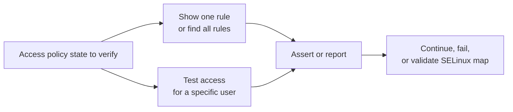
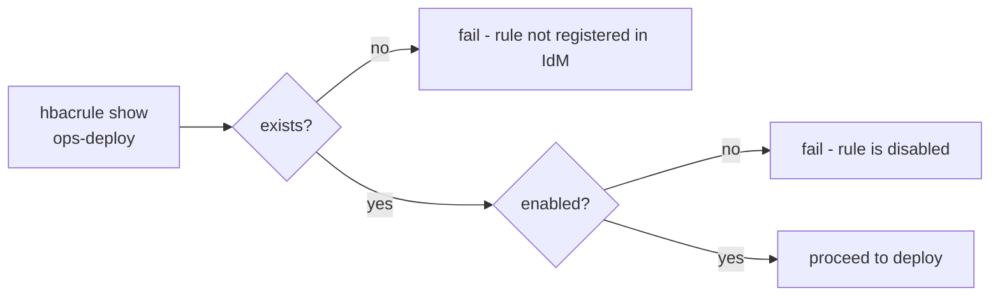
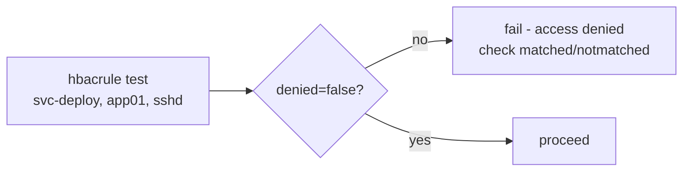
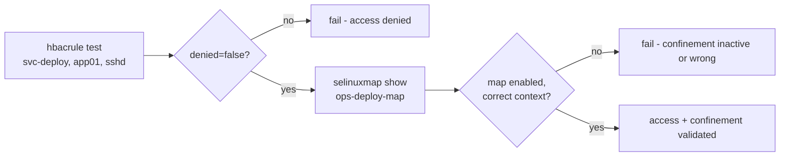



# HBAC Rule Use Cases

Related docs:

<a href="https://gprocunier.github.io/eigenstate-ipa/hbacrule-plugin.html"><kbd>&nbsp;&nbsp;HBAC RULE PLUGIN&nbsp;&nbsp;</kbd></a>
<a href="https://gprocunier.github.io/eigenstate-ipa/hbacrule-capabilities.html"><kbd>&nbsp;&nbsp;HBAC RULE CAPABILITIES&nbsp;&nbsp;</kbd></a>
<a href="https://gprocunier.github.io/eigenstate-ipa/selinuxmap-use-cases.html"><kbd>&nbsp;&nbsp;SELINUX MAP USE CASES&nbsp;&nbsp;</kbd></a>
<a href="https://gprocunier.github.io/eigenstate-ipa/documentation-map.html"><kbd>&nbsp;&nbsp;DOCS MAP&nbsp;&nbsp;</kbd></a>

## Purpose

This page contains worked examples for `eigenstate.ipa.hbacrule` against
FreeIPA/IdM.

Use the capability guide to choose the right pattern. Use this page when you
need the corresponding playbook.

## Contents

- [Use Case Flow](#use-case-flow)
- [1. Pre-flight Assert Before Deployment](#1-pre-flight-assert-before-deployment)
- [2. Live Access Test Before Running Tasks](#2-live-access-test-before-running-tasks)
- [3. Assert Access Is Denied for a Restricted Identity](#3-assert-access-is-denied-for-a-restricted-identity)
- [4. Check Rule Scope Before Relying On It](#4-check-rule-scope-before-relying-on-it)
- [5. Bulk Audit — Find All Disabled or Permissive Rules](#5-bulk-audit--find-all-disabled-or-permissive-rules)
- [6. Pipeline Gate With map_record](#6-pipeline-gate-with-map_record)
- [7. Cross-Plugin: HBAC Access Test Then SELinux Map Validation](#7-cross-plugin-hbac-access-test-then-selinux-map-validation)

## Use Case Flow



## 1. Pre-flight Assert Before Deployment

Verify that the HBAC rule for a service identity exists and is enabled before a
play deploys to the target host. A missing or disabled rule means the identity
cannot log in.



```yaml
- name: Pre-flight — confirm HBAC access rule before deploy
  hosts: localhost
  gather_facts: false

  tasks:
    - name: Check HBAC rule state
      ansible.builtin.set_fact:
        access_rule: "{{ lookup('eigenstate.ipa.hbacrule',
                          'ops-deploy',
                          server='idm-01.corp.example.com',
                          kerberos_keytab='/runner/env/ipa/admin.keytab',
                          verify='/etc/ipa/ca.crt') }}"

    - name: Assert rule is present and active
      ansible.builtin.assert:
        that:
          - access_rule.exists
          - access_rule.enabled
        fail_msg: >-
          HBAC rule 'ops-deploy' is
          {{ 'not registered in IdM' if not access_rule.exists
             else 'registered but disabled' }}.
          Access policy must be in place before deploying.
```

## 2. Live Access Test Before Running Tasks

Confirm that an identity would actually be allowed to reach the target host
before running tasks that depend on it. This uses the FreeIPA hbactest engine —
the same evaluation SSSD performs at login.



```yaml
- name: Confirm HBAC access before deploying
  hosts: localhost
  gather_facts: false

  vars:
    deploy_identity: "svc-deploy"
    target_host: "app01.corp.example.com"
    target_service: "sshd"

  tasks:
    - name: Test HBAC access
      ansible.builtin.set_fact:
        access_result: "{{ lookup('eigenstate.ipa.hbacrule',
                            deploy_identity,
                            operation='test',
                            targethost=target_host,
                            service=target_service,
                            server='idm-01.corp.example.com',
                            kerberos_keytab='/runner/env/ipa/admin.keytab',
                            verify='/etc/ipa/ca.crt') }}"

    - name: Assert access would be granted
      ansible.builtin.assert:
        that:
          - not access_result.denied
        fail_msg: >-
          HBAC test denied access for {{ access_result.user }} →
          {{ access_result.targethost }} / {{ access_result.service }}.
          Matched rules: {{ access_result.matched | join(', ') | default('none') }}.
          Not matched: {{ access_result.notmatched | join(', ') }}.
          Review the HBAC rule membership in IdM.

    - name: Report which rules granted access
      ansible.builtin.debug:
        msg: >-
          Access granted. Matched rules:
          {{ access_result.matched | join(', ') }}.
```

## 3. Assert Access Is Denied for a Restricted Identity

Confirm that an identity outside the authorized scope cannot reach a host.
This is the inverse of capability #2 — assert `denied: true`.

This pattern assumes there is no broader enabled HBAC rule that also grants
access. If the environment has a global rule such as `allow_all`, validate that
the rule under review appears in `notmatched` instead of expecting overall
access denial.

```yaml
- name: Confirm restricted identity cannot reach production host
  hosts: localhost
  gather_facts: false

  vars:
    restricted_identity: "dev-user"
    prod_host: "prod-app01.corp.example.com"
    service: "sshd"

  tasks:
    - name: Test HBAC access for restricted identity
      ansible.builtin.set_fact:
        access_result: "{{ lookup('eigenstate.ipa.hbacrule',
                            restricted_identity,
                            operation='test',
                            targethost=prod_host,
                            service=service,
                            server='idm-01.corp.example.com',
                            kerberos_keytab='/runner/env/ipa/admin.keytab',
                            verify='/etc/ipa/ca.crt') }}"

    - name: Assert access is denied
      ansible.builtin.assert:
        that:
          - access_result.denied
        fail_msg: >-
          Access was unexpectedly granted to {{ access_result.user }} →
          {{ access_result.targethost }} / {{ access_result.service }}.
          Matched rules: {{ access_result.matched | join(', ') }}.
          Review and tighten HBAC policy in IdM.
```

## 4. Check Rule Scope Before Relying On It

Inspect which identities and hosts are in scope for a rule before using it in
a workflow that depends on specific membership.

```yaml
- name: Verify service identity is in HBAC rule scope
  hosts: localhost
  gather_facts: false

  vars:
    hbac_rule_name: "ops-deploy"
    required_user: "svc-deploy"
    required_hostgroup: "app-servers"

  tasks:
    - name: Get HBAC rule
      ansible.builtin.set_fact:
        rule: "{{ lookup('eigenstate.ipa.hbacrule',
                   hbac_rule_name,
                   server='idm-01.corp.example.com',
                   kerberos_keytab='/runner/env/ipa/admin.keytab',
                   verify='/etc/ipa/ca.crt') }}"

    - name: Assert rule exists and is enabled
      ansible.builtin.assert:
        that:
          - rule.exists
          - rule.enabled
        fail_msg: "HBAC rule '{{ hbac_rule_name }}' is missing or disabled."

    - name: Assert user is directly in scope
      ansible.builtin.assert:
        that:
          - >-
            rule.usercategory == 'all'
            or required_user in rule.users
            or rule.groups | intersect(
                 lookup('eigenstate.ipa.principal', required_user,
                        server='idm-01.corp.example.com',
                        kerberos_keytab='/runner/env/ipa/admin.keytab',
                        verify='/etc/ipa/ca.crt').memberof_group
                        | default([])
               ) | length > 0
        fail_msg: >-
          User '{{ required_user }}' is not in scope for HBAC rule
          '{{ hbac_rule_name }}'.
          usercategory={{ rule.usercategory | default('null') }},
          users={{ rule.users }}, groups={{ rule.groups }}.
      when: rule.usercategory != 'all'

    - name: Report rule scope
      ansible.builtin.debug:
        msg: >-
          Rule '{{ rule.name }}': enabled={{ rule.enabled }},
          users={{ rule.users }}, groups={{ rule.groups }},
          hosts={{ rule.hosts }}, hostgroups={{ rule.hostgroups }},
          usercategory={{ rule.usercategory | default('direct') }},
          hostcategory={{ rule.hostcategory | default('direct') }}.
```

## 5. Bulk Audit — Find All Disabled or Permissive Rules

Use `operation=find` to enumerate all HBAC rules and identify those that are
disabled or that apply universally (`usercategory=all` or `hostcategory=all`).

```yaml
- name: Audit HBAC rules — find disabled and permissive policies
  hosts: localhost
  gather_facts: false

  tasks:
    - name: Find all HBAC rules
      ansible.builtin.set_fact:
        all_rules: "{{ lookup('eigenstate.ipa.hbacrule',
                        operation='find',
                        server='idm-01.corp.example.com',
                        kerberos_keytab='/runner/env/ipa/admin.keytab',
                        verify='/etc/ipa/ca.crt') }}"

    - name: Identify disabled rules
      ansible.builtin.set_fact:
        disabled_rules: >-
          {{ all_rules | selectattr('enabled', 'equalto', false) | list }}

    - name: Identify permissive rules (all-category)
      ansible.builtin.set_fact:
        permissive_rules: >-
          {{ all_rules | selectattr('usercategory', 'equalto', 'all')
             | selectattr('enabled', 'equalto', true) | list }}

    - name: Report disabled rules
      ansible.builtin.debug:
        msg: "Disabled HBAC rule: {{ item.name }}"
      loop: "{{ disabled_rules }}"
      when: disabled_rules | length > 0

    - name: Report enabled permissive rules
      ansible.builtin.debug:
        msg: >-
          Permissive rule '{{ item.name }}' is enabled and applies to all
          users. Verify this is intentional.
      loop: "{{ permissive_rules }}"
      when: permissive_rules | length > 0

    - name: Summary
      ansible.builtin.debug:
        msg: >-
          HBAC audit: total={{ all_rules | length }},
          disabled={{ disabled_rules | length }},
          permissive_enabled={{ permissive_rules | length }}.
```

## 6. Pipeline Gate With map_record

Use `result_format=map_record` to gate a pipeline on the state of multiple
HBAC rules by name. This is more readable than asserting by list index.

```yaml
- name: Pipeline pre-flight — confirm all required HBAC rules
  hosts: localhost
  gather_facts: false

  vars:
    required_rules:
      - ops-deploy
      - ops-patch
      - svc-monitor

  tasks:
    - name: Check all required HBAC rules
      ansible.builtin.set_fact:
        rule_states: "{{ lookup('eigenstate.ipa.hbacrule',
                          *required_rules,
                          server='idm-01.corp.example.com',
                          kerberos_keytab='/runner/env/ipa/admin.keytab',
                          result_format='map_record',
                          verify='/etc/ipa/ca.crt') }}"

    - name: Assert each rule exists and is enabled
      ansible.builtin.assert:
        that:
          - rule_states[item].exists
          - rule_states[item].enabled
        fail_msg: >-
          HBAC rule '{{ item }}' is
          {{ 'not registered in IdM' if not rule_states[item].exists
             else 'registered but disabled' }}.
      loop: "{{ required_rules }}"
```

## 7. Cross-Plugin: HBAC Access Test Then SELinux Map Validation

Combine `eigenstate.ipa.hbacrule` with `operation=test` and
`eigenstate.ipa.selinuxmap` to validate the full confinement model from the
access side outward.



```yaml
- name: Validate access and confinement model end-to-end
  hosts: localhost
  gather_facts: false

  vars:
    deploy_identity: "svc-deploy"
    target_host: "app01.corp.example.com"
    target_service: "sshd"
    confinement_map_name: "ops-deploy-map"
    expected_selinuxuser: "staff_u:s0-s0:c0.c1023"

  tasks:
    - name: Test HBAC access
      ansible.builtin.set_fact:
        access_result: "{{ lookup('eigenstate.ipa.hbacrule',
                            deploy_identity,
                            operation='test',
                            targethost=target_host,
                            service=target_service,
                            server='idm-01.corp.example.com',
                            kerberos_keytab='/runner/env/ipa/admin.keytab',
                            verify='/etc/ipa/ca.crt') }}"

    - name: Assert access is granted
      ansible.builtin.assert:
        that:
          - not access_result.denied
        fail_msg: >-
          HBAC denied access for {{ deploy_identity }} →
          {{ target_host }} / {{ target_service }}.
          Matched: {{ access_result.matched | join(', ') | default('none') }}.

    - name: Get SELinux confinement map
      ansible.builtin.set_fact:
        cmap: "{{ lookup('eigenstate.ipa.selinuxmap',
                   confinement_map_name,
                   server='idm-01.corp.example.com',
                   kerberos_keytab='/runner/env/ipa/admin.keytab',
                   verify='/etc/ipa/ca.crt') }}"

    - name: Assert confinement map is active and assigns correct context
      ansible.builtin.assert:
        that:
          - cmap.exists
          - cmap.enabled
          - cmap.selinuxuser == expected_selinuxuser
        fail_msg: >-
          SELinux map '{{ confinement_map_name }}':
          exists={{ cmap.exists }},
          enabled={{ cmap.enabled }},
          selinuxuser={{ cmap.selinuxuser | default('null') }}
          (expected {{ expected_selinuxuser }}).

    - name: Report validated model
      ansible.builtin.debug:
        msg: >-
          Full model validated for {{ deploy_identity }}:
          access_granted={{ not access_result.denied }},
          matched_rules={{ access_result.matched | join(', ') }},
          confinement={{ cmap.selinuxuser }}.
```


