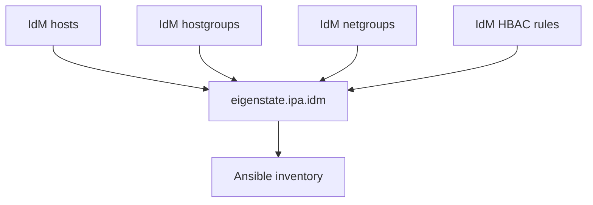
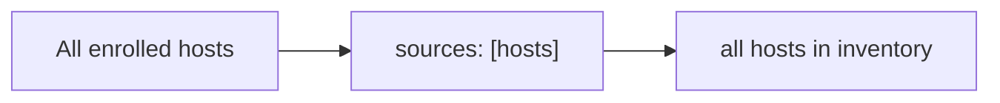
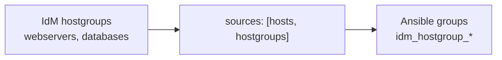
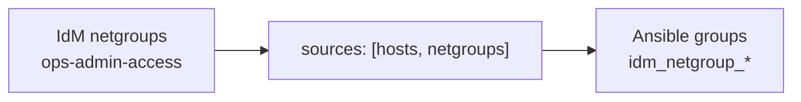
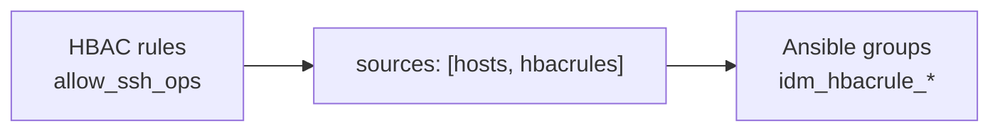



# Inventory Capabilities

Nearby docs:

<a href="https://gprocunier.github.io/eigenstate-ipa/inventory-plugin.html"><kbd>&nbsp;&nbsp;INVENTORY PLUGIN&nbsp;&nbsp;</kbd></a>
<a href="https://gprocunier.github.io/eigenstate-ipa/vault-capabilities.html"><kbd>&nbsp;&nbsp;IDM VAULT CAPABILITIES&nbsp;&nbsp;</kbd></a>
<a href="https://gprocunier.github.io/eigenstate-ipa/aap-integration.html"><kbd>&nbsp;&nbsp;AAP INTEGRATION&nbsp;&nbsp;</kbd></a>
<a href="https://gprocunier.github.io/eigenstate-ipa/documentation-map.html"><kbd>&nbsp;&nbsp;DOCS MAP&nbsp;&nbsp;</kbd></a>

## Purpose

Use this guide to choose the IdM-backed inventory source exposed by
`eigenstate.ipa.idm`.

The focus here is operational boundary selection, not option reference.

## Contents

- [Relationship Model](#relationship-model)
- [Assumed Example Estate](#assumed-example-estate)
- [1. Hosts: Full Estate Discovery](#1-hosts-full-estate-discovery)
- [2. Hostgroups: Role-Based Targeting](#2-hostgroups-role-based-targeting)
- [3. Netgroups: Access-Boundary Targeting](#3-netgroups-access-boundary-targeting)
- [4. HBAC Rules: Policy-Driven Targeting](#4-hbac-rules-policy-driven-targeting)
- [Quick Decision Matrix](#quick-decision-matrix)
- [Operational Pattern](#operational-pattern)

## Relationship Model



The model is:

- hosts describe what exists
- hostgroups describe role or service membership
- netgroups describe access boundary intent
- HBAC rules describe policy enforcement scope

Use the object type that matches the operational boundary you actually care
about.

## Assumed Example Estate

All examples assume an IdM domain `corp.example.com` with enrolled hosts,
nested hostgroups, netgroups, and HBAC rules representing a small production
and staging estate.

> [!NOTE]
> The examples are illustrative. The important part is the decision boundary:
> role, access boundary, or security policy.

## 1. Hosts: Full Estate Discovery

Use `hosts` when you need every enrolled system regardless of role grouping.

Typical cases:

- compliance scans
- full-estate patch reporting
- baseline fact collection



Example inventory:

```yaml
plugin: eigenstate.ipa.idm
server: idm-01.corp.example.com
ipaadmin_password: "{{ lookup('env', 'IPA_ADMIN_PASSWORD') }}"
verify: /etc/ipa/ca.crt
sources:
  - hosts
compose:
  ansible_host: idm_fqdn
```

Why this source fits:

- you want the complete estate
- group membership is not the decision boundary
- host metadata still remains available through `idm_*` vars

## 2. Hostgroups: Role-Based Targeting

Use `hostgroups` when IdM hostgroups already model infrastructure roles.

Typical cases:

- deploy only to web servers
- restart only database hosts
- run phased maintenance across a nested application tier



Example inventory:

```yaml
plugin: eigenstate.ipa.idm
server: idm-01.corp.example.com
ipaadmin_password: "{{ lookup('env', 'IPA_ADMIN_PASSWORD') }}"
verify: /etc/ipa/ca.crt
sources:
  - hosts
  - hostgroups
hostgroup_filter:
  - webservers
  - databases
host_filter_from_groups: true
```

Why this source fits:

- the IdM admin already maintains the role model
- Ansible should inherit that role model rather than duplicate it
- nested hostgroups are resolved for you

### Hostgroups Plus `keyed_groups`

Sometimes IdM stores the useful boundary as metadata instead of a named
hostgroup. In that case, keep `hosts` in scope and build additional groups from
attributes such as `idm_location` or `idm_os`.

That pattern is useful for:

- patching by datacenter
- targeting by OS version
- separating systems with or without keytabs

## 3. Netgroups: Access-Boundary Targeting

Use `netgroups` when the boundary is who can reach a host rather than what the
host does.

Typical cases:

- audit which machines operations can access
- align SSH banner deployment with allowed access scope
- compare developer access against operations access



Example inventory:

```yaml
plugin: eigenstate.ipa.idm
server: idm-01.corp.example.com
ipaadmin_password: "{{ lookup('env', 'IPA_ADMIN_PASSWORD') }}"
verify: /etc/ipa/ca.crt
sources:
  - hosts
  - netgroups
netgroup_filter:
  - ops-admin-access
host_filter_from_groups: true
```

Why this source fits:

- netgroups represent access-domain intent
- they are appropriate for access audits and reachability-scoped changes
- they can pull in both direct hosts and referenced hostgroups

## 4. HBAC Rules: Policy-Driven Targeting

Use `hbacrules` when the operational boundary is the enforced access policy
itself.

Typical cases:

- apply SSH hardening to every host governed by a particular rule
- inspect the practical blast radius of `hostcategory=all`
- rotate host keys or collect evidence during an incident for policy-selected
  hosts



Example inventory:

```yaml
plugin: eigenstate.ipa.idm
server: idm-01.corp.example.com
ipaadmin_password: "{{ lookup('env', 'IPA_ADMIN_PASSWORD') }}"
verify: /etc/ipa/ca.crt
sources:
  - hosts
  - hbacrules
hbacrule_filter:
  - allow_ssh_ops
host_filter_from_groups: true
```

Why this source fits:

- policy scope is the point of control
- the plugin expands direct hosts, referenced hostgroups, and `hostcategory=all`
- it aligns the automation boundary with the security boundary

> [!TIP]
> If you are deciding between hostgroups and HBAC rules, ask a narrower
> question: are you targeting by system role or by authorization policy? If the
> answer is policy, use HBAC rules.

## Quick Decision Matrix

| Need | Best source |
| --- | --- |
| Every enrolled system | `hosts` |
| Systems by infrastructure role | `hostgroups` |
| Systems by who may access them | `netgroups` |
| Systems by enforced access policy | `hbacrules` |

## Operational Pattern

The most useful operator sequence is usually:

1. include `hosts` so host vars are always present
1. add the object source that matches the execution boundary
1. add filters to limit groups
1. enable `host_filter_from_groups: true` when you need the host list trimmed to the selected boundary

For option-level details and exact field behavior, return to
<a href="https://gprocunier.github.io/eigenstate-ipa/inventory-plugin.html"><kbd>INVENTORY PLUGIN</kbd></a>.


