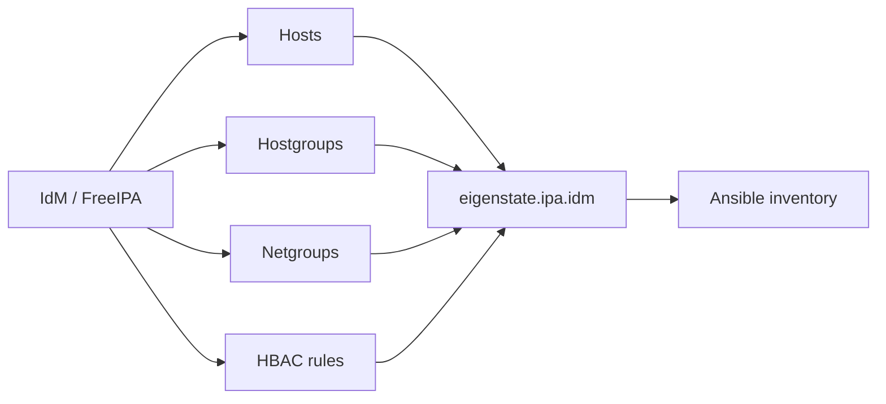



# Inventory Plugin

Nearby docs:

<a href="https://gprocunier.github.io/eigenstate-ipa/inventory-capabilities.html"><kbd>&nbsp;&nbsp;INVENTORY CAPABILITIES&nbsp;&nbsp;</kbd></a>
<a href="https://gprocunier.github.io/eigenstate-ipa/vault-plugin.html"><kbd>&nbsp;&nbsp;IDM VAULT PLUGIN&nbsp;&nbsp;</kbd></a>
<a href="https://gprocunier.github.io/eigenstate-ipa/aap-integration.html"><kbd>&nbsp;&nbsp;AAP INTEGRATION&nbsp;&nbsp;</kbd></a>
<a href="https://gprocunier.github.io/eigenstate-ipa/documentation-map.html"><kbd>&nbsp;&nbsp;DOCS MAP&nbsp;&nbsp;</kbd></a>

## Purpose

`eigenstate.ipa.idm` reads IdM data and turns it into Ansible inventory.

This reference covers:

- what the plugin reads from IdM
- how IdM objects are converted into Ansible groups and host vars
- how password auth and Kerberos auth differ operationally
- when filters remove hosts from inventory versus only pruning groups

The principal does not need to be a global IdM administrator. It does need the
read and auth rights required for the specific IdM objects you want to expose.

## Contents

- [Inventory Model](#inventory-model)
- [Authentication Model](#authentication-model)
- [Current Supported Options](#current-supported-options)
- [How Groups Are Built](#how-groups-are-built)
- [Filtering Behavior](#filtering-behavior)
- [Minimal Examples](#minimal-examples)
- [When To Read The Scenario Guide](#when-to-read-the-scenario-guide)

## Inventory Model



The inventory plugin reads the IdM JSON-RPC API and consumes four object classes:

- `hosts`
- `hostgroups`
- `netgroups`
- `hbacrules`

Host attributes are exposed as host variables with an `idm_` prefix. Group
names created from IdM objects are sanitized into Ansible-safe names.

## Authentication Model

The plugin supports two auth modes:

- password auth:
  - uses `session/login_password`
  - requires `ipaadmin_password`
- Kerberos auth:
  - uses `session/login_kerberos`
  - requires an existing ticket or `kerberos_keytab`

> [!IMPORTANT]
> Kerberos mode is the right default for Automation Controller / AAP execution
> environments. The plugin can obtain a private credential cache from
> `kerberos_keytab` so it does not depend on an interactive `kinit`.

TLS behavior:

- `verify: /path/to/ca.crt` enables explicit certificate verification
- omitting `verify` first tries `/etc/ipa/ca.crt`
- if no local IdM CA path is available, the plugin warns and then disables TLS verification

That means production use should normally provide the IdM CA path explicitly,
even though the plugin now has a safer local default when the host is already
enrolled with IdM.

## Current Supported Options

| Option | Meaning |
| --- | --- |
| `server` | IdM server FQDN |
| `ipaadmin_principal` | Principal used for password auth or Kerberos auth |
| `ipaadmin_password` | Password mode credential |
| `use_kerberos` | Enables Kerberos/GSSAPI auth |
| `kerberos_keytab` | Non-interactive Kerberos auth for EE/AAP use; the plugin warns if the file is more permissive than `0600` |
| `verify` | CA bundle path for TLS verification |
| `sources` | Which IdM object types to include |
| `hostgroup_filter` | Restrict generated hostgroup-derived groups |
| `netgroup_filter` | Restrict generated netgroup-derived groups |
| `hbacrule_filter` | Restrict generated HBAC-derived groups |
| `include_disabled_hbacrules` | Include disabled HBAC rules when true |
| `hostgroup_prefix` | Prefix for hostgroup-derived Ansible groups |
| `netgroup_prefix` | Prefix for netgroup-derived Ansible groups |
| `hbacrule_prefix` | Prefix for HBAC-derived Ansible groups |
| `host_filter_from_groups` | Removes hosts that do not land in any selected generated group |

The plugin also supports standard constructed-inventory features such as:

- `compose`
- `keyed_groups`
- `groups`
- inventory caching

## How Groups Are Built

### Hosts

When `sources` includes `hosts`, every enrolled IdM host is added to inventory.
Important host attributes are mapped to variables such as:

- `idm_fqdn`
- `idm_description`
- `idm_location`
- `idm_os`
- `idm_hostgroups`
- `idm_ssh_public_keys`
- `idm_krbprincipalname`

### Hostgroups

IdM hostgroups become Ansible groups with `hostgroup_prefix`, defaulting to
`idm_hostgroup_`.

Nested IdM hostgroups are resolved recursively before membership is assigned.
That means an Ansible group for a parent hostgroup contains the flattened set of
all nested member hosts.

### Netgroups

IdM netgroups become Ansible groups with `netgroup_prefix`, defaulting to
`idm_netgroup_`.

The plugin resolves both:

- direct host membership
- hostgroup membership referenced by the netgroup

### HBAC Rules

IdM HBAC rules become Ansible groups with `hbacrule_prefix`, defaulting to
`idm_hbacrule_`.

The plugin resolves:

- direct host membership
- hostgroup membership referenced by the rule
- `hostcategory=all` as all enrolled hosts

Disabled rules are skipped unless `include_disabled_hbacrules: true`.

## Filtering Behavior

Filters limit which generated groups are created. They do not automatically
remove unmatched hosts from inventory unless `host_filter_from_groups` is set.

Practical difference:

- filter without `host_filter_from_groups`:
  - unmatched hosts remain present, usually under `ungrouped`
- filter with `host_filter_from_groups: true`:
  - unmatched hosts are removed from the resulting inventory

> [!NOTE]
> `host_filter_from_groups` is the setting that turns a broad IdM estate into a
> tightly scoped execution slice. Without it, filtering affects group creation
> more than host inclusion.

## Minimal Examples

Password auth:

```yaml
plugin: eigenstate.ipa.idm
server: idm-01.example.com
ipaadmin_password: "{{ lookup('env', 'IPA_ADMIN_PASSWORD') }}"
verify: /etc/ipa/ca.crt
sources:
  - hosts
  - hostgroups
```

Kerberos with keytab:

```yaml
plugin: eigenstate.ipa.idm
server: idm-01.example.com
use_kerberos: true
kerberos_keytab: /runner/env/ipa/admin.keytab
ipaadmin_principal: admin
verify: /etc/ipa/ca.crt
sources:
  - hosts
  - hbacrules
```

Constructed inventory from IdM metadata:

```yaml
plugin: eigenstate.ipa.idm
server: idm-01.example.com
ipaadmin_password: "{{ lookup('env', 'IPA_ADMIN_PASSWORD') }}"
verify: /etc/ipa/ca.crt
sources:
  - hosts
keyed_groups:
  - key: idm_location
    prefix: dc
    separator: "_"
compose:
  ansible_host: idm_fqdn
groups:
  has_keytab: idm_has_keytab | default(false)
```

## When To Read The Scenario Guide

Use <a href="https://gprocunier.github.io/eigenstate-ipa/inventory-capabilities.html"><kbd>INVENTORY CAPABILITIES</kbd></a>
when you need to decide which IdM object type should drive a particular
automation boundary:

- full-estate operations
- role-targeted deploys
- access-boundary auditing
- policy-targeted SSH or hardening work


