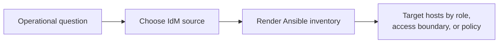
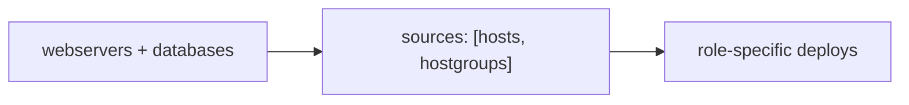
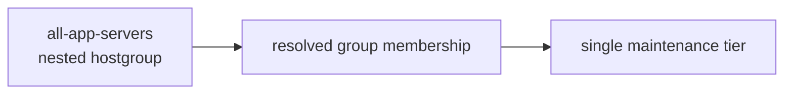
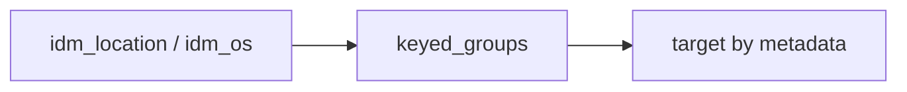
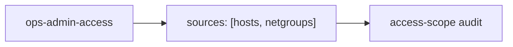
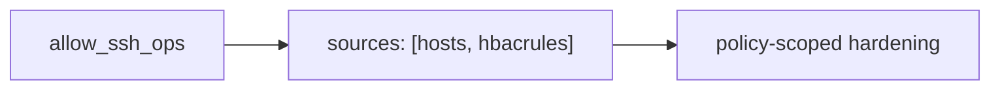
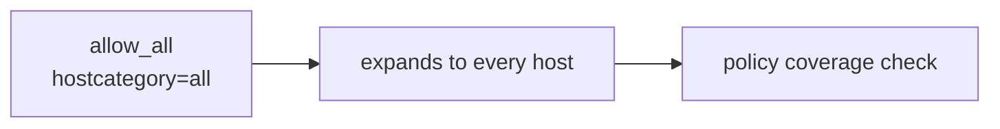

# Inventory Use Cases

Nearby docs:

<a href="https://gprocunier.github.io/eigenstate-ipa/inventory-plugin.html"><kbd>&nbsp;&nbsp;INVENTORY PLUGIN&nbsp;&nbsp;</kbd></a>
<a href="https://gprocunier.github.io/eigenstate-ipa/inventory-capabilities.html"><kbd>&nbsp;&nbsp;INVENTORY CAPABILITIES&nbsp;&nbsp;</kbd></a>
<a href="https://gprocunier.github.io/eigenstate-ipa/vault-use-cases.html"><kbd>&nbsp;&nbsp;VAULT USE CASES&nbsp;&nbsp;</kbd></a>
<a href="https://gprocunier.github.io/eigenstate-ipa/"><kbd>&nbsp;&nbsp;DOCS MAP&nbsp;&nbsp;</kbd></a>

## Purpose

This page gives worked operator examples for `eigenstate.ipa.idm`.

The capability page explains which IdM object class matches which automation
boundary. This page shows what those choices look like in actual inventory files
and playbook targeting.

Not every caller is an IdM administrator. A delegated operator can use this
collection inside their own jurisdiction as long as the principal they run
under can read the hosts, hostgroups, netgroups, or HBAC rules that matter to
that scope.

## Contents

- [Use Case Flow](#use-case-flow)
- [Assumed Example Estate](#assumed-example-estate)
- [1. Full Estate Compliance Scan](#1-full-estate-compliance-scan)
- [2. Role-Based Application Deployment](#2-role-based-application-deployment)
- [3. Nested Application Tier Maintenance](#3-nested-application-tier-maintenance)
- [4. Patch By Metadata Rather Than Named Group](#4-patch-by-metadata-rather-than-named-group)
- [5. Access-Scope Audit](#5-access-scope-audit)
- [6. Policy-Scoped SSH Hardening](#6-policy-scoped-ssh-hardening)
- [7. Estate-Wide Policy Coverage Check](#7-estate-wide-policy-coverage-check)
- [Kerberos Is A Good Default Here](#kerberos-is-a-good-default-here)

## Use Case Flow



## Assumed Example Estate

All examples assume an IdM domain `corp.example.com` with these patterns:

- `web-01`, `web-02`, `web-03` in a `webservers` hostgroup
- `db-01`, `db-02` in a `databases` hostgroup
- nested `all-app-servers` hostgroup containing `webservers` and `databases`
- `ops-admin-access` and `developer-access` netgroups
- `allow_all`, `allow_ssh_ops`, and `allow_ssh_devs` HBAC rules

## 1. Full Estate Compliance Scan

When the job must run against every enrolled system, use `hosts`.


Inventory:

```yaml
plugin: eigenstate.ipa.idm
server: idm-01.corp.example.com
ipaadmin_password: "{{ lookup('env', 'IPA_ADMIN_PASSWORD') }}"
verify: /etc/ipa/ca.crt
sources:
  - hosts
compose:
  ansible_host: idm_fqdn
```

Playbook target:

```yaml
- name: Quarterly compliance scan
  hosts: all
  tasks:
    - ansible.builtin.command:
        cmd: oscap xccdf eval --profile stig /usr/share/xml/scap/content.xml
      failed_when: false
```

Kerberos is especially profitable here when the scan runner lives in AAP or a
shared automation account:

- a keytab avoids embedding a reusable password in the job
- the same principal can be used repeatedly without interactive `kinit`
- controller retries do not require an operator to paste fresh credentials

## 2. Role-Based Application Deployment

When IdM hostgroups already define the runtime role boundary, use hostgroups.



Inventory:

```yaml
plugin: eigenstate.ipa.idm
server: idm-01.corp.example.com
ipaadmin_password: "{{ lookup('env', 'IPA_ADMIN_PASSWORD') }}"
verify: /etc/ipa/ca.crt
sources:
  - hosts
  - hostgroups
hostgroup_filter:
  - webservers
  - databases
host_filter_from_groups: true
compose:
  ansible_host: idm_fqdn
```

Playbook target:

```yaml
- name: Deploy frontend config
  hosts: idm_hostgroup_webservers
  tasks:
    - ansible.builtin.template:
        src: nginx.conf.j2
        dest: /etc/nginx/nginx.conf

- name: Restart database tier
  hosts: idm_hostgroup_databases
  tasks:
    - ansible.builtin.service:
        name: postgresql
        state: restarted
```

This is also a good delegated-operator pattern. The caller does not need global
IdM admin rights if their principal is allowed to read the hostgroups for their
team or business unit.

## 3. Nested Application Tier Maintenance

When the meaningful role boundary is a nested hostgroup, let the plugin resolve
it.



Inventory:

```yaml
plugin: eigenstate.ipa.idm
server: idm-01.corp.example.com
ipaadmin_password: "{{ lookup('env', 'IPA_ADMIN_PASSWORD') }}"
verify: /etc/ipa/ca.crt
sources:
  - hosts
  - hostgroups
hostgroup_filter:
  - all-app-servers
host_filter_from_groups: true
```

Playbook target:

```yaml
- name: Rolling application-tier patch window
  hosts: idm_hostgroup_all_app_servers
  serial: 2
  tasks:
    - ansible.builtin.dnf:
        name: "*"
        state: latest
```

Delegated operators often use this pattern for their own service slice because
the parent hostgroup already defines the boundary they are responsible for.

## 4. Patch By Metadata Rather Than Named Group

When IdM metadata is useful but there is no explicit hostgroup for it, keep
`hosts` and derive groups with `keyed_groups`.



Inventory:

```yaml
plugin: eigenstate.ipa.idm
server: idm-01.corp.example.com
ipaadmin_password: "{{ lookup('env', 'IPA_ADMIN_PASSWORD') }}"
verify: /etc/ipa/ca.crt
sources:
  - hosts
keyed_groups:
  - key: idm_location
    prefix: dc
    separator: "_"
  - key: idm_os
    prefix: os
    separator: "_"
```

Playbook target:

```yaml
- name: Patch east datacenter first
  hosts: dc_DC_East
  serial: 2
  tasks:
    - ansible.builtin.dnf:
        name: "*"
        state: latest
```

Kerberos pays off here because it lets a non-admin operator run the same
inventory source repeatedly from AAP or a bastion without storing a password in
the playbook.

## 5. Access-Scope Audit

When the question is who can reach the systems, use netgroups.



Inventory:

```yaml
plugin: eigenstate.ipa.idm
server: idm-01.corp.example.com
ipaadmin_password: "{{ lookup('env', 'IPA_ADMIN_PASSWORD') }}"
verify: /etc/ipa/ca.crt
sources:
  - hosts
  - netgroups
netgroup_filter:
  - ops-admin-access
host_filter_from_groups: true
```

Playbook target:

```yaml
- name: Record operations access scope
  hosts: idm_netgroup_ops_admin_access
  tasks:
    - ansible.builtin.lineinfile:
        path: /tmp/ops_access_hosts.txt
        line: "{{ idm_fqdn }} - {{ idm_location }}"
        create: true
      delegate_to: localhost
```

This is not a global-admin task. It is a jurisdictional audit task: a delegated
operator can inspect the hosts their team may touch without needing broader
IdM privileges.

## 6. Policy-Scoped SSH Hardening

When the target boundary is the policy itself, use HBAC rules.



Inventory:

```yaml
plugin: eigenstate.ipa.idm
server: idm-01.corp.example.com
ipaadmin_password: "{{ lookup('env', 'IPA_ADMIN_PASSWORD') }}"
verify: /etc/ipa/ca.crt
sources:
  - hosts
  - hbacrules
hbacrule_filter:
  - allow_ssh_ops
host_filter_from_groups: true
```

Playbook target:

```yaml
- name: Harden SSH on systems in the ops SSH policy boundary
  hosts: idm_hbacrule_allow_ssh_ops
  tasks:
    - ansible.builtin.template:
        src: sshd_config_hardened.j2
        dest: /etc/ssh/sshd_config
        validate: sshd -t -f %s
```

For non-admin teams, this is the common pattern: the HBAC rule already encodes
the scope they are allowed to manage, and the collection simply turns that
policy into a target set.

## 7. Estate-Wide Policy Coverage Check

When an HBAC rule uses `hostcategory=all`, the group becomes an easy audit and
validation boundary.



Inventory:

```yaml
plugin: eigenstate.ipa.idm
server: idm-01.corp.example.com
ipaadmin_password: "{{ lookup('env', 'IPA_ADMIN_PASSWORD') }}"
verify: /etc/ipa/ca.crt
sources:
  - hosts
  - hbacrules
hbacrule_filter:
  - allow_all
```

Playbook target:

```yaml
- name: Ensure monitoring agent is present on all policy-covered systems
  hosts: idm_hbacrule_allow_all
  tasks:
    - ansible.builtin.package:
        name: insights-client
        state: present
```

## Kerberos Is A Good Default Here

Kerberos is especially useful for delegated inventory work because:

- the same principal can be reused across inventory syncs and playbook runs
- keytabs work well in AAP execution environments and bastion automation
- a non-admin principal can operate inside a narrow scope without a reusable
  password in the inventory source
- the inventory plugin already supports `kerberos_keytab` for non-interactive
  auth

Use password auth only when you do not have a service principal or a keytab
workflow available.

For the decision model behind these scenarios, return to
<a href="https://gprocunier.github.io/eigenstate-ipa/inventory-capabilities.html"><kbd>INVENTORY CAPABILITIES</kbd></a>.
