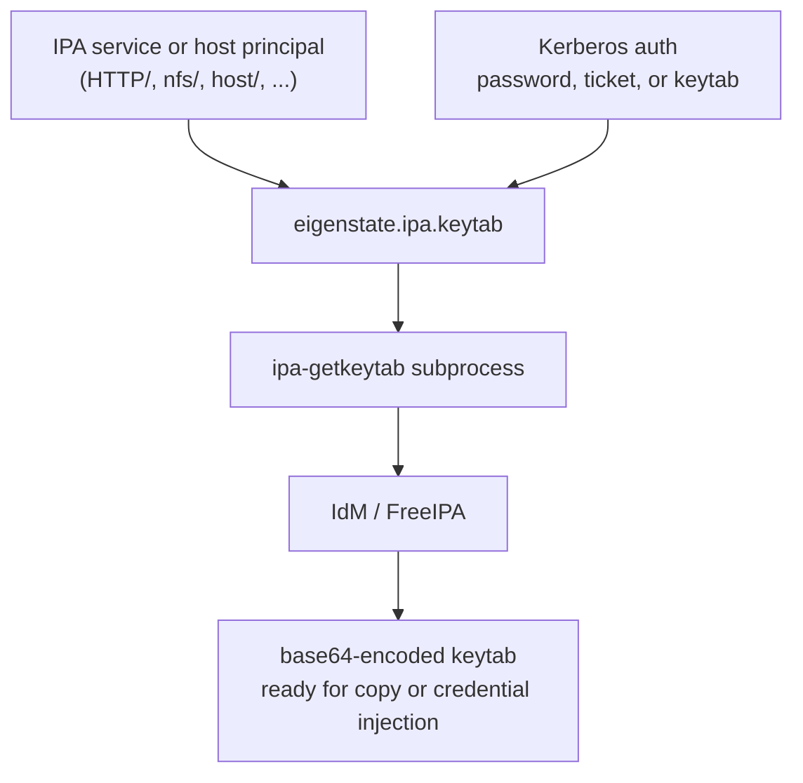
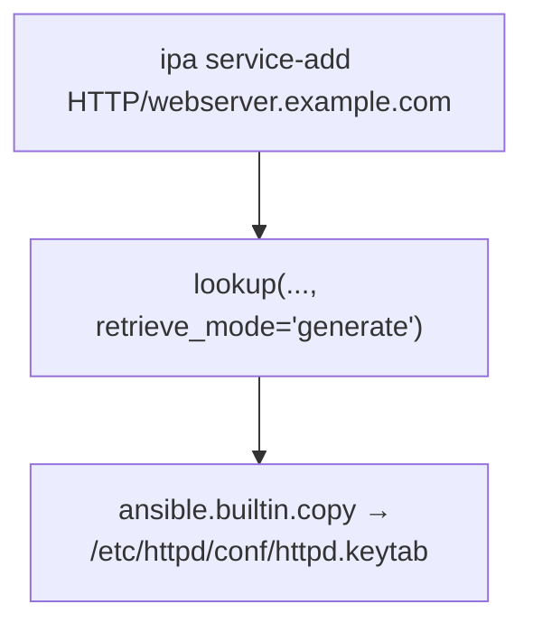
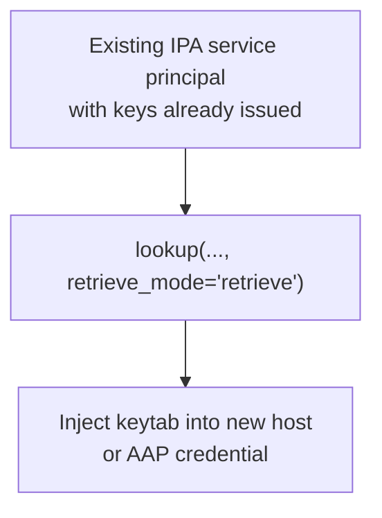
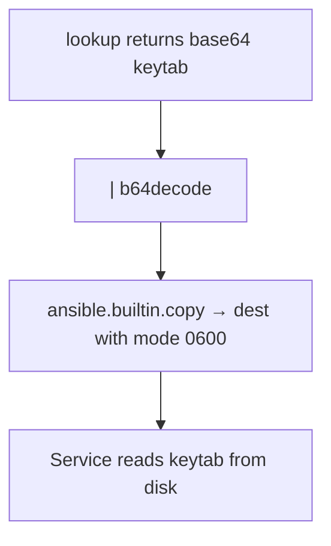
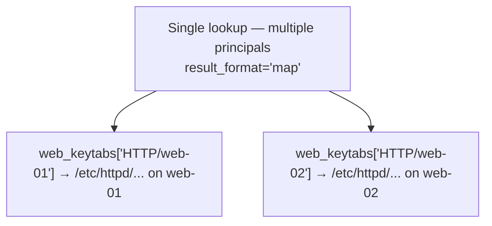
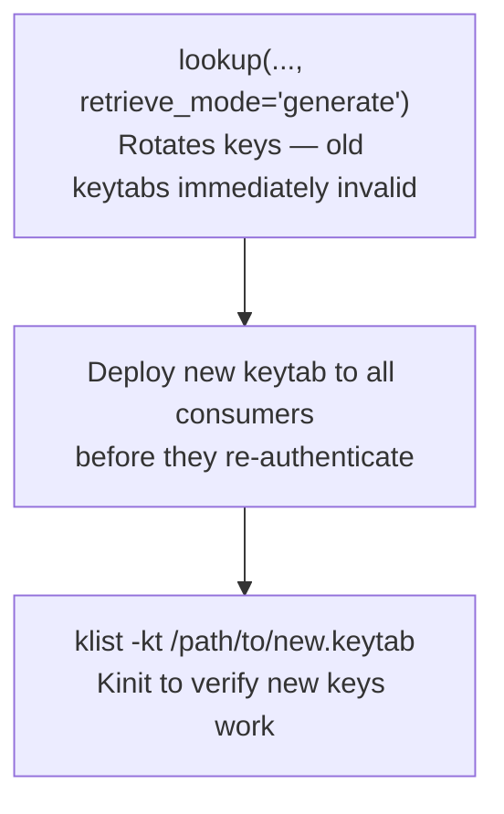
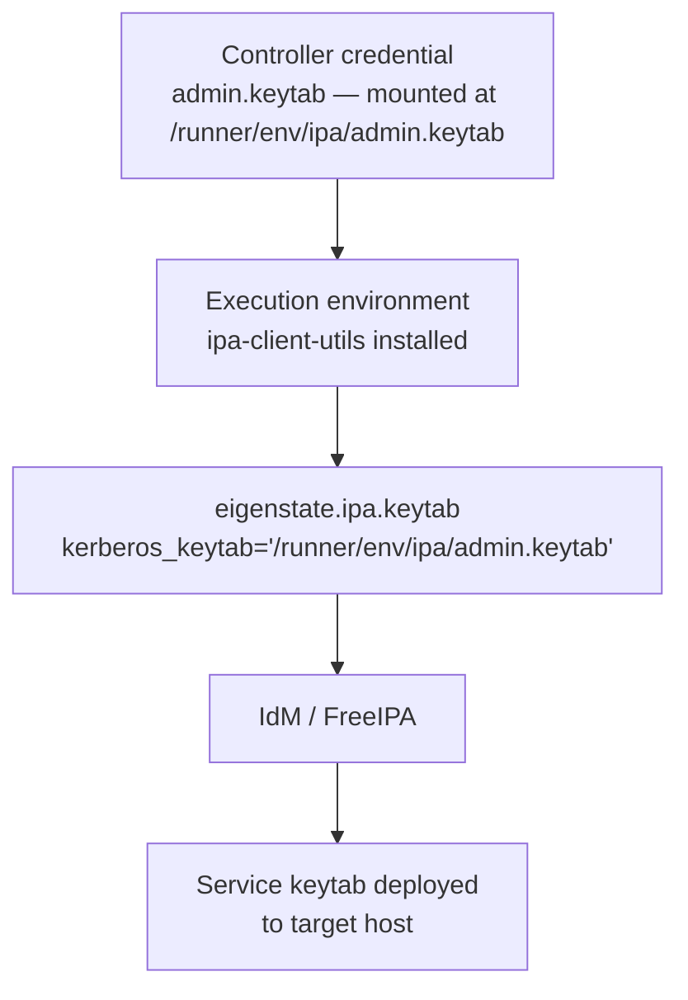
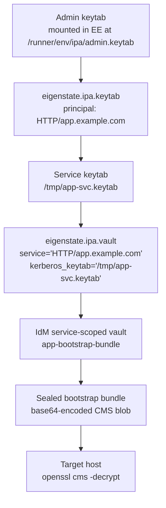

# Keytab Capabilities

Nearby docs:

<a href="https://gprocunier.github.io/eigenstate-ipa/keytab-plugin.html"><kbd>&nbsp;&nbsp;KEYTAB PLUGIN&nbsp;&nbsp;</kbd></a>
<a href="https://gprocunier.github.io/eigenstate-ipa/vault-capabilities.html"><kbd>&nbsp;&nbsp;IDM VAULT CAPABILITIES&nbsp;&nbsp;</kbd></a>
<a href="https://gprocunier.github.io/eigenstate-ipa/aap-integration.html"><kbd>&nbsp;&nbsp;AAP INTEGRATION&nbsp;&nbsp;</kbd></a>
<a href="https://gprocunier.github.io/eigenstate-ipa/documentation-map.html"><kbd>&nbsp;&nbsp;DOCS MAP&nbsp;&nbsp;</kbd></a>

## Purpose

Use this guide to choose the right Kerberos keytab retrieval pattern for your
automation.

`eigenstate.ipa.keytab` fills the gap between service principal creation and
keytab deployment. Today that step is manual or handled by ad-hoc scripting.
This plugin brings it into the Ansible automation lifecycle.

## Contents

- [Retrieval Model](#retrieval-model)
- [1. Initial Keytab Issuance For A New Service Principal](#1-initial-keytab-issuance-for-a-new-service-principal)
- [2. Safe Day-2 Keytab Retrieval](#2-safe-day-2-keytab-retrieval)
- [3. Deploying A Keytab To Disk On A Target Host](#3-deploying-a-keytab-to-disk-on-a-target-host)
- [4. Fleet Keytab Deployment With Map Format](#4-fleet-keytab-deployment-with-map-format)
- [5. Keytab Rotation Workflow](#5-keytab-rotation-workflow)
- [6. Encryption-Type-Restricted Keytab Retrieval](#6-encryption-type-restricted-keytab-retrieval)
- [7. AAP Credential Type Pattern For Admin Keytab](#7-aap-credential-type-pattern-for-admin-keytab)
- [8. Service Bootstrap: Keytab-Gated Vault Secret Delivery](#8-service-bootstrap-keytab-gated-vault-secret-delivery)
- [Quick Decision Matrix](#quick-decision-matrix)

## Retrieval Model



Choose the pattern that matches:

- whether the keytab already exists or needs to be generated for the first time
- whether you are deploying to one host or many
- whether key rotation is intentional or must be avoided

## 1. Initial Keytab Issuance For A New Service Principal

When a service principal has just been created in IdM, it may not have keys
yet. Use `retrieve_mode='generate'` for the first keytab issuance.



> [!WARNING]
> `generate` rotates the principal's keys. If any other service holds a keytab
> for this principal, it will be invalidated immediately. For first issuance of
> a brand-new principal this is safe because no prior keytabs exist.

Example — register service and issue keytab in one play:

```yaml
- name: Add HTTP service principal
  redhat.rhel_idm.ipaservice:
    ipaadmin_password: "{{ lookup('env', 'IPA_PASSWORD') }}"
    name: HTTP/webserver.idm.corp.lan
    state: present

- name: Issue initial keytab
  ansible.builtin.set_fact:
    http_keytab_b64: "{{ lookup('eigenstate.ipa.keytab',
                          'HTTP/webserver.idm.corp.lan',
                          server='idm-01.idm.corp.lan',
                          kerberos_keytab='/runner/env/ipa/admin.keytab',
                          retrieve_mode='generate',
                          verify='/etc/ipa/ca.crt') }}"
```

## 2. Safe Day-2 Keytab Retrieval

Once a principal has keys, use the default `retrieve_mode='retrieve'`. This
only reads existing keys and never rotates them.



Example — retrieve without rotation:

```yaml
- name: Retrieve NFS service keytab
  ansible.builtin.set_fact:
    nfs_keytab_b64: "{{ lookup('eigenstate.ipa.keytab',
                          'nfs/storage.idm.corp.lan',
                          server='idm-01.idm.corp.lan',
                          kerberos_keytab='/runner/env/ipa/admin.keytab',
                          verify='/etc/ipa/ca.crt') }}"
```

The call fails with a clear error if the principal has no keys yet. That is
the right behavior: it prevents silent issuance of unexpected new keys in
day-2 automation.

## 3. Deploying A Keytab To Disk On A Target Host

The plugin always returns base64-encoded content. Decode it before writing to
disk with the `b64decode` filter.



Example — deploy HTTP keytab:

```yaml
- name: Deploy HTTP service keytab
  ansible.builtin.copy:
    content: "{{ lookup('eigenstate.ipa.keytab',
                   'HTTP/webserver.idm.corp.lan',
                   server='idm-01.idm.corp.lan',
                   kerberos_keytab='/runner/env/ipa/admin.keytab',
                   verify='/etc/ipa/ca.crt') | b64decode }}"
    dest: /etc/httpd/conf/httpd.keytab
    mode: "0600"
    owner: apache
    group: apache
```

Keytab files should always be deployed with `mode: "0600"` and owned by the
service user. A world-readable keytab is a Kerberos impersonation risk.

## 4. Fleet Keytab Deployment With Map Format

When the same play must deploy keytabs to multiple services, retrieve them all
in one lookup call with `result_format='map'` and address each by principal
name.



Example — retrieve and iterate:

```yaml
- name: Retrieve keytabs for all web services
  ansible.builtin.set_fact:
    web_keytabs: "{{ lookup('eigenstate.ipa.keytab',
                       'HTTP/web-01.idm.corp.lan',
                       'HTTP/web-02.idm.corp.lan',
                       server='idm-01.idm.corp.lan',
                       kerberos_keytab='/runner/env/ipa/admin.keytab',
                       result_format='map',
                       verify='/etc/ipa/ca.crt') | first }}"

- name: Deploy keytab to each web server
  ansible.builtin.copy:
    content: "{{ web_keytabs['HTTP/' ~ inventory_hostname ~ '.idm.corp.lan'] | b64decode }}"
    dest: /etc/httpd/conf/httpd.keytab
    mode: "0600"
    owner: apache
    group: apache
  delegate_to: "{{ item }}"
  loop: "{{ groups['webservers'] }}"
```

> [!NOTE]
> `result_format='map'` returns a one-element list containing the dict. Use
> `| first` to unwrap it before subscripting by principal name.

## 5. Keytab Rotation Workflow

Key rotation invalidates all existing keytabs for a principal. Plan the
rotation so that the new keytab is deployed to all consuming services in the
same play before anything tries to re-authenticate.



Example — rotate and redeploy in one play:

```yaml
- name: Rotate HTTP service keytab
  ansible.builtin.set_fact:
    new_http_keytab_b64: "{{ lookup('eigenstate.ipa.keytab',
                               'HTTP/webserver.idm.corp.lan',
                               server='idm-01.idm.corp.lan',
                               kerberos_keytab='/runner/env/ipa/admin.keytab',
                               retrieve_mode='generate',
                               verify='/etc/ipa/ca.crt') }}"

- name: Deploy rotated keytab
  ansible.builtin.copy:
    content: "{{ new_http_keytab_b64 | b64decode }}"
    dest: /etc/httpd/conf/httpd.keytab
    mode: "0600"
    owner: apache
    group: apache
  notify: Restart httpd
```

> [!WARNING]
> If the play fails between the rotation step and the deploy step, services
> will be holding an invalidated keytab. Always run rotation and deployment in
> the same play with no blocking tasks in between.

## 6. Encryption-Type-Restricted Keytab Retrieval

In environments with strict cryptographic policy, restrict the keytab to
specific Kerberos encryption types using `enctypes`.

```yaml
- name: Retrieve AES-256-only keytab for compliance
  ansible.builtin.set_fact:
    keytab_b64: "{{ lookup('eigenstate.ipa.keytab',
                      'HTTP/webserver.idm.corp.lan',
                      server='idm-01.idm.corp.lan',
                      kerberos_keytab='/runner/env/ipa/admin.keytab',
                      enctypes=['aes256-cts'],
                      verify='/etc/ipa/ca.crt') }}"
```

Typical `enctypes` values:

| Value | Algorithm |
| --- | --- |
| `aes256-cts` | AES-256-CTS-HMAC-SHA1-96 |
| `aes128-cts` | AES-128-CTS-HMAC-SHA1-96 |
| `aes256-sha2` | AES-256-CTS-HMAC-SHA384-192 (RFC 8009) |
| `aes128-sha2` | AES-128-CTS-HMAC-SHA256-128 (RFC 8009) |

Empty `enctypes` delegates encryption type selection to the IPA server policy.
That is the right default for most environments.

## 7. AAP Credential Type Pattern For Admin Keytab

The recommended AAP deployment pattern is:

- store the admin keytab as a Controller credential type that mounts a file
  into the EE at a known path
- point `kerberos_keytab` at that mounted path
- include `ipa-client-utils` in the EE package list



EE package list additions:

```yaml
dependencies:
  system:
    - ipa-client-utils
    - krb5-workstation
```

This gives the EE the `ipa-getkeytab` binary and `kinit` without pulling in
the full `python3-ipaclient` stack that the vault plugin requires.

## 8. Service Bootstrap: Keytab-Gated Vault Secret Delivery

A service cannot retrieve its own secrets from IdM vault until it has a valid
Kerberos credential. The keytab plugin is what delivers that credential. The
two plugins chain: the keytab lookup authenticates using the admin keytab,
retrieves the service keytab, and that service keytab is then used as the
authenticating credential for a subsequent vault lookup scoped to the same
service principal.



This matters for the audit trail. When the vault lookup authenticates as
`HTTP/app.example.com`, IdM records that the service principal retrieved its
own secrets — not that an admin retrieved secrets on its behalf.

### One-Time Admin Setup

The vault must exist and the service principal must have membership in it
before the bootstrap play runs.

```bash
kinit admin

# Create a service-scoped vault owned by the service principal
ipa vault-add app-bootstrap-bundle \
  --type standard \
  --service HTTP/app.example.com

# Or use a shared vault and grant the service access to it
ipa vault-add app-bootstrap-bundle --type standard --shared
ipa vault-add-member app-bootstrap-bundle \
  --shared \
  --services "HTTP/app.example.com"

# Seal the bootstrap payload against the target host certificate and archive it
openssl cms -encrypt \
  -aes-256-cbc \
  -in bootstrap-bundle.tar.gz \
  -out bootstrap-bundle.cms \
  -outform DER \
  -recip /etc/pki/tls/certs/app.example.com.pem

ipa vault-archive app-bootstrap-bundle \
  --service HTTP/app.example.com \
  --in bootstrap-bundle.cms
```

See [IdM Vault Capabilities — Section 11](vault-capabilities.md#11-sealed-artifact-full-workflow)
for the full sealing workflow including certmonger prerequisites and decryption
commands.

### Bootstrap Play

```yaml
- name: Retrieve service keytab for HTTP service
  ansible.builtin.set_fact:
    app_keytab_b64: "{{ lookup('eigenstate.ipa.keytab',
                          'HTTP/app.example.com',
                          server='idm-01.idm.corp.lan',
                          kerberos_keytab='/runner/env/ipa/admin.keytab',
                          verify='/etc/ipa/ca.crt') }}"

- name: Write service keytab to temporary path
  ansible.builtin.copy:
    content: "{{ app_keytab_b64 | b64decode }}"
    dest: /tmp/app-svc.keytab
    mode: "0600"

- name: Retrieve sealed bootstrap bundle from service-scoped vault
  ansible.builtin.set_fact:
    sealed_bundle_b64: "{{ lookup('eigenstate.ipa.vault',
                             'app-bootstrap-bundle',
                             server='idm-01.idm.corp.lan',
                             kerberos_keytab='/tmp/app-svc.keytab',
                             service='HTTP/app.example.com',
                             encoding='base64',
                             verify='/etc/ipa/ca.crt') }}"

- name: Deploy sealed bundle to target
  ansible.builtin.copy:
    content: "{{ sealed_bundle_b64 | b64decode }}"
    dest: /tmp/bootstrap-bundle.cms
    mode: "0600"
  delegate_to: app.example.com

- name: Unseal bootstrap bundle on target
  ansible.builtin.command:
    argv:
      - openssl
      - cms
      - -decrypt
      - -in
      - /tmp/bootstrap-bundle.cms
      - -inform
      - DER
      - -inkey
      - /etc/pki/tls/private/app.example.com.key
      - -recip
      - /etc/pki/tls/certs/app.example.com.pem
      - -out
      - /tmp/bootstrap-bundle.tar.gz
  delegate_to: app.example.com

- name: Remove temporary service keytab from control node
  ansible.builtin.file:
    path: /tmp/app-svc.keytab
    state: absent

- name: Remove sealed blob from target
  ansible.builtin.file:
    path: /tmp/bootstrap-bundle.cms
    state: absent
  delegate_to: app.example.com
```

> [!NOTE]
> The service keytab at `/tmp/app-svc.keytab` is only needed for the vault
> retrieval step. Remove it as soon as the sealed bundle has been delivered.
> It should never be deployed to disk as a persistent credential on the control
> node or execution environment.

> [!NOTE]
> If the service principal has no keys yet, the keytab lookup will fail in
> `retrieve` mode. Use `retrieve_mode='generate'` for the initial keytab
> issuance, then switch to `retrieve` for subsequent runs. See
> [Section 1](#1-initial-keytab-issuance-for-a-new-service-principal).

## Quick Decision Matrix

| Goal | Pattern |
| --- | --- |
| First keytab for a brand-new principal | `retrieve_mode='generate'` — generates initial keys |
| Re-deploy keytab to a rebuilt host | `retrieve_mode='retrieve'` (default) — existing keys, no rotation |
| Explicit key rotation | `retrieve_mode='generate'` — rotate and redeploy in same play |
| Deploy to one host | `result_format='value'` + `b64decode` in `copy` task |
| Deploy to multiple services | `result_format='map'` + iterate with principal names |
| Compliance enctype restriction | `enctypes=['aes256-cts']` or similar |
| Non-interactive auth in AAP | `kerberos_keytab` pointing to Controller-mounted keytab |
| Full service bootstrap with vault-delivered secrets | Admin keytab → `eigenstate.ipa.keytab` → service keytab → `eigenstate.ipa.vault` as service principal |
