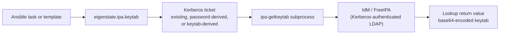



# Keytab Plugin

Related docs:

<a href="https://gprocunier.github.io/eigenstate-ipa/keytab-capabilities.html"><kbd>&nbsp;&nbsp;KEYTAB CAPABILITIES&nbsp;&nbsp;</kbd></a>
<a href="https://gprocunier.github.io/eigenstate-ipa/keytab-use-cases.html"><kbd>&nbsp;&nbsp;KEYTAB USE CASES&nbsp;&nbsp;</kbd></a>
<a href="https://gprocunier.github.io/eigenstate-ipa/vault-plugin.html"><kbd>&nbsp;&nbsp;IDM VAULT PLUGIN&nbsp;&nbsp;</kbd></a>
<a href="https://gprocunier.github.io/eigenstate-ipa/aap-integration.html"><kbd>&nbsp;&nbsp;AAP INTEGRATION&nbsp;&nbsp;</kbd></a>
<a href="https://gprocunier.github.io/eigenstate-ipa/documentation-map.html"><kbd>&nbsp;&nbsp;DOCS MAP&nbsp;&nbsp;</kbd></a>

## Purpose

`eigenstate.ipa.keytab` retrieves Kerberos keytab files for service and host
principals registered in FreeIPA/IdM.

This reference covers:

- how the plugin authenticates to IdM
- how it retrieves keytabs via `ipa-getkeytab`
- the difference between `retrieve` and `generate` modes
- how to control encryption types
- how to return keytab content for downstream use
- why Kerberos key rotation can be used as an operationally short-lived machine-credential pattern

The authenticating principal must have permission to retrieve keytabs for the
target principals. In most environments this requires admin rights or explicit
IPA RBAC delegation.

## Contents

- [Retrieval Model](#retrieval-model)
- [Authentication Model](#authentication-model)
- [Retrieve vs Generate](#retrieve-vs-generate)
- [Encryption Types](#encryption-types)
- [Return Shapes](#return-shapes)
- [Minimal Examples](#minimal-examples)
- [Failure Boundaries](#failure-boundaries)
- [When To Read The Scenario Guide](#when-to-read-the-scenario-guide)

## Retrieval Model



The lookup shells out to `ipa-getkeytab` from the local IdM client packages.
It does not use `ipalib` for the retrieval step. The `ipa-getkeytab` binary
handles the Kerberos-authenticated LDAP protocol internally. The only Ansible-
side Python dependency is a working Kerberos credential cache before the
subprocess runs. On the validated RHEL 10 path, `ipa-getkeytab` is provided by
`ipa-client`.

## Authentication Model

The lookup always operates with a Kerberos credential cache.

It can get there in three ways:

- `ipaadmin_password`:
  - runs `kinit` to obtain a ticket before calling `ipa-getkeytab`
  - requires a password that is usable for non-interactive `kinit`
- `kerberos_keytab`:
  - runs `kinit -kt` to obtain a ticket non-interactively
- neither password nor keytab:
  - assumes a valid existing ticket is already available in the default cache

> [!NOTE]
> Password auth is viable for local automation only when the IPA account's
> password is not forced into a change-on-first-login flow. A newly created
> IPA user with an expired password will fail non-interactive `kinit`.

> [!IMPORTANT]
> For AAP use, `kerberos_keytab` is the correct non-interactive path.
> A Controller credential type that mounts a keytab file into the EE is
> the standard deployment pattern. See the AAP integration guide for the
> full wiring.

When `kerberos_keytab` or `ipaadmin_password` point to local files, the plugin
warns if those files have permissions broader than `0600`.

TLS verification behavior:

- `verify: /path/to/ca.crt` adds `--cacert /path/to/ca.crt` to `ipa-getkeytab`
- `verify: false` skips the explicit `--cacert` override and relies on the
  local system trust configuration
- omitting `verify` first tries `/etc/ipa/ca.crt`
- if no local CA path is found, the plugin warns and falls back to the system
  trust store

## Retrieve vs Generate

### Why this matters beyond file delivery

A keytab is not just a file-delivery problem. In Kerberos-based automation it is
often the bootstrap material used to obtain the real runtime credential: a
Kerberos ticket. That makes the keytab surface more operationally powerful than
an ordinary static password.

When the principal is dedicated to one controller workflow or one tightly scoped
service boundary, `retrieve_mode='generate'` can also be used as an immediate
retirement mechanism: rotating the principal keys invalidates the previous
keytab material at once. In practice that means a job can:

- issue or retrieve a keytab for the run
- acquire Kerberos tickets from it
- rotate the principal again when the run closes
- discard the replacement if the intent is immediate retirement

That is not a Vault-style lease model. There is no TTL or issuer-owned renewal
contract. But it is still a materially stronger short-lived machine-identity
pattern than leaving a shared password in place indefinitely.


The `retrieve_mode` option controls the behavior of the `ipa-getkeytab` call.

### `retrieve` (default)

Passes `-r` to `ipa-getkeytab`. Only retrieves existing keys for the principal.
The call fails if no keys exist yet.

This is the safe default. Existing keytabs held by services are not invalidated.

### `generate`

Omits `-r`. May generate new random keys for the principal.

> [!WARNING]
> `generate` rotates the principal's keys. Any service or host that holds
> an existing keytab for that principal will be unable to authenticate
> immediately after the call. Use `generate` only when explicit rotation
> is the intent and when the new keytab will be deployed to all consuming
> services in the same playbook run.

The lookup emits a visible `display.warning` when `retrieve_mode='generate'`
is selected.

## Encryption Types

By default, `ipa-getkeytab` selects encryption types according to the IPA
server's policy. Use `enctypes` to override:

```yaml
enctypes:
  - aes256-cts
  - aes128-cts
```

Each entry becomes a separate `-e` flag in the `ipa-getkeytab` call. Setting
`enctypes` to an empty list (the default) passes no `-e` flags.

Typical use cases for explicit `enctypes`:

- restricting to AES-256 for compliance requirements
- excluding legacy DES or RC4 encryption types in mixed environments

## Return Shapes

The plugin always returns base64-encoded keytab content. Keytabs are binary
files and cannot be embedded directly in Ansible variables.

Three result shapes are available via `result_format`:

### `value` (default)

Returns a bare base64 string per principal.

```yaml
result: ["AQIB..."]
```

Use this when the playbook only needs the keytab bytes and has a simple
single-principal lookup.

### `record`

Returns a dict per principal with:

- `principal` — the Kerberos principal name
- `value` — base64-encoded keytab
- `encoding` — always `base64`

```yaml
result:
  - principal: "HTTP/webserver.example.com"
    value: "AQIB..."
    encoding: "base64"
```

Use this when the playbook should not depend on positional list ordering or
when it needs to log or route based on the principal name. In Ansible, use
`query(...) | first` for this structured return shape.

### `map`

Returns a single dict keyed by principal name. This is returned as a
one-element list containing the dict.

```yaml
result:
  - "HTTP/web-01.example.com": "AQIB..."
    "HTTP/web-02.example.com": "AQIC..."
```

Use this when a single lookup retrieves keytabs for multiple principals and
the playbook needs to address them by name rather than by position. In
Ansible, use `query(...) | first` for this structured return shape.

## Minimal Examples

Retrieve an existing HTTP service keytab:

```yaml
- ansible.builtin.set_fact:
    http_keytab_b64: "{{ lookup('eigenstate.ipa.keytab',
                          'HTTP/webserver.idm.corp.lan',
                          server='idm-01.idm.corp.lan',
                          ipaadmin_password=lookup('env', 'IPA_PASSWORD'),
                          verify='/etc/ipa/ca.crt') }}"
```

Retrieve using a keytab for non-interactive authentication:

```yaml
- ansible.builtin.set_fact:
    nfs_keytab_b64: "{{ lookup('eigenstate.ipa.keytab',
                          'nfs/storage.idm.corp.lan',
                          server='idm-01.idm.corp.lan',
                          kerberos_keytab='/runner/env/ipa/admin.keytab',
                          verify='/etc/ipa/ca.crt') }}"
```

Write keytab to disk on the target host:

```yaml
- ansible.builtin.copy:
    content: "{{ lookup('eigenstate.ipa.keytab',
                   'HTTP/webserver.idm.corp.lan',
                   server='idm-01.idm.corp.lan',
                   kerberos_keytab='/runner/env/ipa/admin.keytab',
                   verify='/etc/ipa/ca.crt') | b64decode }}"
    dest: /etc/httpd/conf/httpd.keytab
    mode: "0600"
    owner: apache
    group: apache
```

Multiple principals in one lookup with map format:

```yaml
- ansible.builtin.set_fact:
    web_keytabs: "{{ query('eigenstate.ipa.keytab',
                      'HTTP/web-01.idm.corp.lan',
                      'HTTP/web-02.idm.corp.lan',
                      server='idm-01.idm.corp.lan',
                      kerberos_keytab='/runner/env/ipa/admin.keytab',
                      result_format='map',
                      verify='/etc/ipa/ca.crt') | first }}"
# web_keytabs['HTTP/web-01.idm.corp.lan'] | b64decode
# web_keytabs['HTTP/web-02.idm.corp.lan'] | b64decode
```

Restrict to AES-256 only:

```yaml
- ansible.builtin.set_fact:
    keytab_b64: "{{ lookup('eigenstate.ipa.keytab',
                      'HTTP/webserver.idm.corp.lan',
                      server='idm-01.idm.corp.lan',
                      kerberos_keytab='/runner/env/ipa/admin.keytab',
                      enctypes=['aes256-cts'],
                      verify='/etc/ipa/ca.crt') }}"
```

Rotate keys (invalidates all existing keytabs for this principal):

```yaml
- ansible.builtin.set_fact:
    new_keytab_b64: "{{ lookup('eigenstate.ipa.keytab',
                          'HTTP/webserver.idm.corp.lan',
                          server='idm-01.idm.corp.lan',
                          kerberos_keytab='/runner/env/ipa/admin.keytab',
                          retrieve_mode='generate',
                          verify='/etc/ipa/ca.crt') }}"
```

## Failure Boundaries

Common failure classes are:

- `ipa-getkeytab` not installed on the control node or EE
- no valid Kerberos ticket and no password or keytab supplied
- `retrieve` mode fails because no keys exist yet for the principal (this is
  expected for brand-new service principals; use `generate` on first deploy
  and `retrieve` on subsequent runs)
- the authenticating principal lacks permission to retrieve the target
  principal's keytab
- network or KDC connectivity issue causes a timeout

> [!NOTE]
> If `retrieve` mode fails for a principal that was just created, the principal
> may not have keys yet. Use `generate` for the initial keytab issuance, then
> switch to `retrieve` for subsequent retrieval. You can also use
> `ipa service-add-principal` and confirm with `ipa service-show` before
> running the lookup.

## When To Read The Scenario Guide

Use <a href="https://gprocunier.github.io/eigenstate-ipa/keytab-capabilities.html"><kbd>KEYTAB CAPABILITIES</kbd></a> when
you need operator patterns rather than option-by-option reference:

- initial service keytab issuance
- keytab rotation workflows
- deploying keytabs across a fleet of services
- AAP credential type integration for keytab-based auth


