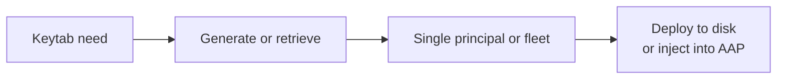
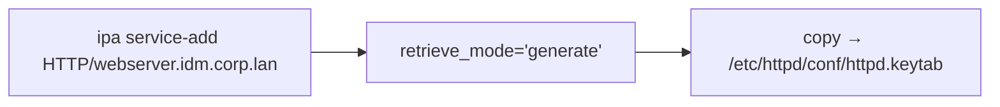
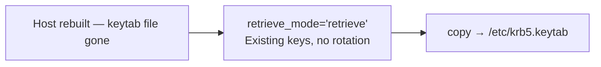
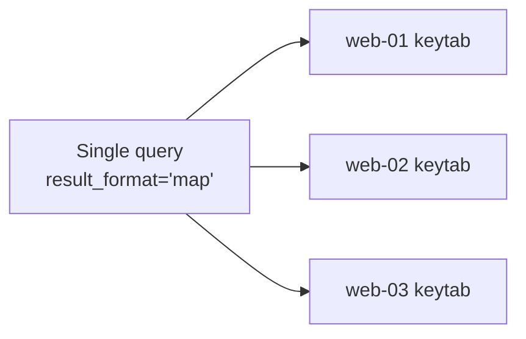
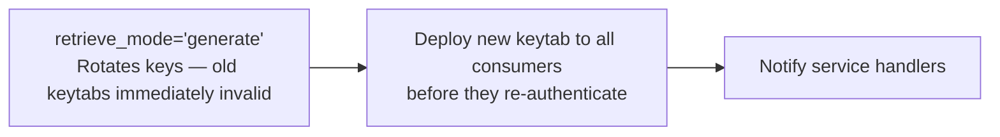
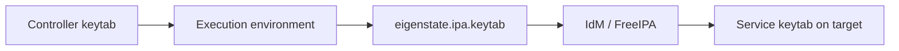



# Keytab Use Cases

Related docs:

<a href="https://gprocunier.github.io/eigenstate-ipa/keytab-plugin.html"><kbd>&nbsp;&nbsp;KEYTAB PLUGIN&nbsp;&nbsp;</kbd></a>
<a href="https://gprocunier.github.io/eigenstate-ipa/keytab-capabilities.html"><kbd>&nbsp;&nbsp;KEYTAB CAPABILITIES&nbsp;&nbsp;</kbd></a>
<a href="https://gprocunier.github.io/eigenstate-ipa/vault-use-cases.html"><kbd>&nbsp;&nbsp;IDM VAULT USE CASES&nbsp;&nbsp;</kbd></a>
<a href="https://gprocunier.github.io/eigenstate-ipa/rotation-use-cases.html"><kbd>&nbsp;&nbsp;ROTATION USE CASES&nbsp;&nbsp;</kbd></a>
<a href="https://gprocunier.github.io/eigenstate-ipa/documentation-map.html"><kbd>&nbsp;&nbsp;DOCS MAP&nbsp;&nbsp;</kbd></a>

## Purpose

This page contains worked examples for `eigenstate.ipa.keytab`.

Use the capability guide to choose the right retrieval mode and rotation
posture. Use this page when you need the corresponding playbook pattern.

## Contents

- [Use Case Flow](#use-case-flow)
- [1. New Service Onboarding](#1-new-service-onboarding)
- [2. Rebuilding A Host Without Rotating Keys](#2-rebuilding-a-host-without-rotating-keys)
- [3. Fleet Web Service Keytab Deployment](#3-fleet-web-service-keytab-deployment)
- [4. Scheduled Keytab Rotation](#4-scheduled-keytab-rotation)
- [5. Compliance-Restricted Keytab For A FIPS Environment](#5-compliance-restricted-keytab-for-a-fips-environment)
- [6. NFS Service Keytab Bootstrap](#6-nfs-service-keytab-bootstrap)
- [7. Host Keytab Recovery After Rebuild](#7-host-keytab-recovery-after-rebuild)
- [8. Controller-Scoped Keytab With Immediate Retirement](#8-controller-scoped-keytab-with-immediate-retirement)
- [9. Keytab-Gated Vault Secret Delivery](#9-keytab-gated-vault-secret-delivery)
- [10. AAP Job Template With Controller-Mounted Keytab](#10-aap-job-template-with-controller-mounted-keytab)
- [Kerberos Is A Good Default Here](#kerberos-is-a-good-default-here)

## Use Case Flow



## 1. New Service Onboarding

When a service principal is freshly created in IdM, it has no keys yet.
Use `retrieve_mode='generate'` for the initial keytab issuance, then switch
to `retrieve` for all subsequent runs.



```yaml
- name: Register HTTP service principal
  redhat.rhel_idm.ipaservice:
    ipaadmin_password: "{{ lookup('env', 'IPA_PASSWORD') }}"
    name: HTTP/webserver.idm.corp.lan
    state: present

- name: Issue initial service keytab
  ansible.builtin.set_fact:
    http_keytab_b64: "{{ lookup('eigenstate.ipa.keytab',
                          'HTTP/webserver.idm.corp.lan',
                          server='idm-01.idm.corp.lan',
                          kerberos_keytab='/runner/env/ipa/admin.keytab',
                          retrieve_mode='generate',
                          verify='/etc/ipa/ca.crt') }}"

- name: Deploy HTTP service keytab
  ansible.builtin.copy:
    content: "{{ http_keytab_b64 | b64decode }}"
    dest: /etc/httpd/conf/httpd.keytab
    mode: "0600"
    owner: apache
    group: apache
  notify: Restart httpd
```

> [!WARNING]
> `generate` rotates the principal's keys immediately. If any other host
> already holds a keytab for this principal, it will be invalidated. For
> a brand-new principal this is safe because no prior keytabs exist.

## 2. Rebuilding A Host Without Rotating Keys

When a host is rebuilt, its keytab file is lost but the principal's keys in
IdM are still valid. Use `retrieve_mode='retrieve'` (the default) to get a
fresh copy of the existing keys without invalidating other hosts that share
the same service principal.



```yaml
- name: Restore service keytab after host rebuild
  ansible.builtin.copy:
    content: "{{ lookup('eigenstate.ipa.keytab',
                   'HTTP/webserver.idm.corp.lan',
                   server='idm-01.idm.corp.lan',
                   kerberos_keytab='/runner/env/ipa/admin.keytab',
                   verify='/etc/ipa/ca.crt') | b64decode }}"
    dest: /etc/httpd/conf/httpd.keytab
    mode: "0600"
    owner: apache
    group: apache
```

The lookup uses `retrieve` by default. If the principal somehow has no keys
yet, the call fails with a clear error rather than silently generating new
keys and invalidating other services.

## 3. Fleet Web Service Keytab Deployment

When the same play must deploy keytabs to a group of web servers, retrieve
all principals in a single query using `result_format='map'` and iterate
over the inventory group.



```yaml
- name: Retrieve keytabs for all web servers
  ansible.builtin.set_fact:
    web_keytabs: "{{ query('eigenstate.ipa.keytab',
                      'HTTP/web-01.idm.corp.lan',
                      'HTTP/web-02.idm.corp.lan',
                      'HTTP/web-03.idm.corp.lan',
                      server='idm-01.idm.corp.lan',
                      kerberos_keytab='/runner/env/ipa/admin.keytab',
                      result_format='map',
                      verify='/etc/ipa/ca.crt') | first }}"

- name: Deploy keytab to each web server
  ansible.builtin.copy:
    content: "{{ web_keytabs['HTTP/' ~ inventory_hostname ~ '.idm.corp.lan'] | b64decode }}"
    dest: /etc/httpd/conf/httpd.keytab
    mode: "0600"
    owner: apache
    group: apache
  delegate_to: "{{ item }}"
  loop: "{{ groups['webservers'] }}"
  notify: Restart httpd
```

> [!NOTE]
> `result_format='map'` returns a one-element list containing the dict.
> Use `| first` to unwrap before subscripting by principal name.

## 4. Scheduled Keytab Rotation

Run an explicit key rotation on a schedule. The rotation and the deployment
must happen in the same play — the old keytab is invalid the moment `generate`
completes.



```yaml
- name: Rotate and redeploy NFS service keytab
  block:
    - name: Rotate NFS keytab
      ansible.builtin.set_fact:
        new_nfs_keytab_b64: "{{ lookup('eigenstate.ipa.keytab',
                                   'nfs/storage.idm.corp.lan',
                                   server='idm-01.idm.corp.lan',
                                   kerberos_keytab='/runner/env/ipa/admin.keytab',
                                   retrieve_mode='generate',
                                   verify='/etc/ipa/ca.crt') }}"

    - name: Deploy rotated NFS keytab
      ansible.builtin.copy:
        content: "{{ new_nfs_keytab_b64 | b64decode }}"
        dest: /etc/krb5.keytab
        mode: "0600"
      notify: Restart nfs-server
```

> [!WARNING]
> If the play fails between the rotation step and the deploy step, the service
> will hold an invalidated keytab. Keep the rotation and deployment in the same
> block with no blocking tasks in between.

## 5. Compliance-Restricted Keytab For A FIPS Environment

In a FIPS or high-assurance environment, restrict the keytab to AES-256 only
using `enctypes`. This prevents the IPA server's default policy from including
weaker cipher types in the issued keytab.

```yaml
- name: Issue AES-256-only keytab for FIPS workload
  ansible.builtin.copy:
    content: "{{ lookup('eigenstate.ipa.keytab',
                   'HTTP/fips-app.idm.corp.lan',
                   server='idm-01.idm.corp.lan',
                   kerberos_keytab='/runner/env/ipa/admin.keytab',
                   enctypes=['aes256-cts'],
                   verify='/etc/ipa/ca.crt') | b64decode }}"
    dest: /etc/httpd/conf/httpd.keytab
    mode: "0600"
    owner: apache
    group: apache
```

Verify the keytab contains only the expected encryption type after deployment:

```bash
klist -ekt /etc/httpd/conf/httpd.keytab
```

For RFC 8009 SHA-2 variants required in newer compliance baselines:

```yaml
enctypes:
  - aes256-sha2
  - aes128-sha2
```

## 6. NFS Service Keytab Bootstrap

NFS Kerberos (`sec=krb5`) requires the server to hold a valid keytab for
`nfs/hostname`. This play provisions the principal and issues the initial
keytab in a single run.

```yaml
- name: Add NFS service principal to IdM
  redhat.rhel_idm.ipaservice:
    ipaadmin_password: "{{ lookup('env', 'IPA_PASSWORD') }}"
    name: nfs/storage.idm.corp.lan
    state: present

- name: Issue initial NFS keytab
  ansible.builtin.set_fact:
    nfs_keytab_b64: "{{ lookup('eigenstate.ipa.keytab',
                          'nfs/storage.idm.corp.lan',
                          server='idm-01.idm.corp.lan',
                          kerberos_keytab='/runner/env/ipa/admin.keytab',
                          retrieve_mode='generate',
                          verify='/etc/ipa/ca.crt') }}"

- name: Install NFS keytab
  ansible.builtin.copy:
    content: "{{ nfs_keytab_b64 | b64decode }}"
    dest: /etc/krb5.keytab
    mode: "0600"
  notify:
    - Restart nfs-server
    - Restart rpc-gssd
```

After deployment, verify with:

```bash
klist -kt /etc/krb5.keytab
kinit -kt /etc/krb5.keytab nfs/storage.idm.corp.lan
klist
```

## 7. Host Keytab Recovery After Rebuild

When a host is rebuilt with `ipa-client-install`, the host principal already
exists in IdM and its keys are intact. Use `retrieve` mode to get the keytab
for the enrolled host identity without generating new keys.

```yaml
- name: Retrieve host keytab for rebuilt system
  ansible.builtin.copy:
    content: "{{ lookup('eigenstate.ipa.keytab',
                   'host/appserv-01.idm.corp.lan',
                   server='idm-01.idm.corp.lan',
                   kerberos_keytab='/runner/env/ipa/admin.keytab',
                   verify='/etc/ipa/ca.crt') | b64decode }}"
    dest: /etc/krb5.keytab
    mode: "0600"
```

> [!NOTE]
> `ipa-client-install` normally handles host keytab issuance as part of
> enrollment. Use this pattern only when the host was enrolled separately
> or when the keytab file was lost without re-enrolling the host in IdM.

## 8. Controller-Scoped Keytab With Immediate Retirement

For a dedicated automation principal, a keytab can be treated as short-lived
bootstrap material rather than a long-lived standing secret. The job retrieves
or generates the keytab, uses it to obtain tickets, completes the work, and
then rotates the principal again so the prior key material is dead.

```mermaid
flowchart LR
    start["controller job starts"] --> issue["issue or retrieve keytab"]
    issue --> auth["kinit / Kerberos tickets"]
    auth --> work["perform automation work"]
    work --> retire["retrieve_mode='generate' to rotate again"]
    retire --> end["prior keytab material no longer valid"]
```

```yaml
- name: Controller-scoped automation principal with immediate retirement
  hosts: localhost
  gather_facts: false

  vars:
    principal_name: HTTP/aap-once.idm.corp.lan

  tasks:
    - name: Issue run keytab
      ansible.builtin.set_fact:
        run_keytab_b64: "{{ lookup('eigenstate.ipa.keytab',
                             principal_name,
                             server='idm-01.idm.corp.lan',
                             kerberos_keytab='/runner/env/ipa/admin.keytab',
                             retrieve_mode='generate',
                             verify='/etc/ipa/ca.crt') }}"
      no_log: true

    - name: Use keytab for controller-side work
      ansible.builtin.copy:
        content: "{{ run_keytab_b64 | b64decode }}"
        dest: /tmp/aap-once.keytab
        mode: "0600"
      no_log: true

    - name: Retire prior key material immediately after run
      ansible.builtin.set_fact:
        _retired: "{{ lookup('eigenstate.ipa.keytab',
                        principal_name,
                        server='idm-01.idm.corp.lan',
                        kerberos_keytab='/runner/env/ipa/admin.keytab',
                        retrieve_mode='generate',
                        verify='/etc/ipa/ca.crt') }}"
      no_log: true

    - name: Discard replacement keytab locally
      ansible.builtin.file:
        path: /tmp/aap-once.keytab
        state: absent
```

This is not a lease engine. It is a workflow pattern for dedicated automation
principals when Kerberos already fits the architecture and immediate retirement
of the prior key material is enough.

## 9. Keytab-Gated Vault Secret Delivery

This is the cross-plugin bootstrap pattern. The keytab plugin retrieves a
service keytab, which is then used as the Kerberos credential for a
service-scoped vault lookup. The vault delivers a sealed bootstrap bundle
that is decrypted on the target host using its own private key.

For the full pattern and one-time admin setup, see
[Keytab Capabilities — Section 8](keytab-capabilities.md#8-service-bootstrap-keytab-gated-vault-secret-delivery).


```yaml
- name: Retrieve service keytab
  ansible.builtin.set_fact:
    app_keytab_b64: "{{ lookup('eigenstate.ipa.keytab',
                          'HTTP/app.idm.corp.lan',
                          server='idm-01.idm.corp.lan',
                          kerberos_keytab='/runner/env/ipa/admin.keytab',
                          verify='/etc/ipa/ca.crt') }}"

- name: Write service keytab to temporary path
  ansible.builtin.copy:
    content: "{{ app_keytab_b64 | b64decode }}"
    dest: /tmp/app-svc.keytab
    mode: "0600"

- name: Retrieve sealed bootstrap bundle as service principal
  ansible.builtin.set_fact:
    sealed_bundle_b64: "{{ lookup('eigenstate.ipa.vault',
                             'app-bootstrap-bundle',
                             server='idm-01.idm.corp.lan',
                             kerberos_keytab='/tmp/app-svc.keytab',
                             service='HTTP/app.idm.corp.lan',
                             encoding='base64',
                             verify='/etc/ipa/ca.crt') }}"

- name: Deploy sealed bundle to target
  ansible.builtin.copy:
    content: "{{ sealed_bundle_b64 | b64decode }}"
    dest: /tmp/bootstrap-bundle.cms
    mode: "0600"
  delegate_to: app.idm.corp.lan

- name: Unseal bundle on target
  ansible.builtin.command:
    argv:
      - openssl
      - cms
      - -decrypt
      - -in
      - /tmp/bootstrap-bundle.cms
      - -inform
      - DER
      - -inkey
      - /etc/pki/tls/private/app.idm.corp.lan.key
      - -recip
      - /etc/pki/tls/certs/app.idm.corp.lan.pem
      - -out
      - /tmp/bootstrap-bundle.tar.gz
  delegate_to: app.idm.corp.lan

- name: Remove temporary keytab from control node
  ansible.builtin.file:
    path: /tmp/app-svc.keytab
    state: absent

- name: Remove sealed blob from target
  ansible.builtin.file:
    path: /tmp/bootstrap-bundle.cms
    state: absent
  delegate_to: app.idm.corp.lan
```

The audit trail in IdM shows `HTTP/app.idm.corp.lan` retrieved the vault
payload — not the admin principal. The admin credential is only visible in
the keytab retrieval step, not in the secret delivery step.

## 10. AAP Job Template With Controller-Mounted Keytab

Store the admin keytab as a Controller credential type that mounts a file
into the execution environment. Point `kerberos_keytab` at the mounted path.
The job template never handles the keytab bytes directly.



Example task in a controller job template:

```yaml
- name: Deploy service keytab from controller job
  ansible.builtin.copy:
    content: "{{ lookup('eigenstate.ipa.keytab',
                   'HTTP/webserver.idm.corp.lan',
                   server='idm-01.idm.corp.lan',
                   kerberos_keytab='/runner/env/ipa/admin.keytab',
                   verify='/runner/env/ipa/ca.crt') | b64decode }}"
    dest: /etc/httpd/conf/httpd.keytab
    mode: "0600"
    owner: apache
    group: apache
```

EE package additions required:

```yaml
dependencies:
  system:
    - ipa-client      # RHEL 10 validated path
    - krb5-workstation
```

On the validated RHEL 10 path, `ipa-client` provides the `ipa-getkeytab`
binary. On other releases, install the package that provides
`/usr/sbin/ipa-getkeytab`. `krb5-workstation` provides `kinit` for the
credential cache setup. Neither `python3-ipalib` nor `python3-ipaclient` is
required for keytab retrieval.

## Kerberos Is A Good Default Here

The keytab plugin always operates through a Kerberos credential cache. That
is by design:

- `ipa-getkeytab` is a Kerberos-authenticated LDAP operation
- the principal doing the retrieval must have IdM RBAC rights to read keytab
  material for the target service
- using a keytab for auth (`kerberos_keytab`) means no plaintext passwords in
  job vars, EE environment, or controller storage

Prefer `kerberos_keytab` pointing to a controller-mounted credential for all
AAP and non-interactive use. Use `ipaadmin_password` only for one-off local
testing where keytab-based auth is not yet in place, and only when the IPA
account has a non-expired password that does not require a first-login change.

For the decision model behind these scenarios, return to
<a href="https://gprocunier.github.io/eigenstate-ipa/keytab-capabilities.html"><kbd>KEYTAB CAPABILITIES</kbd></a>.


