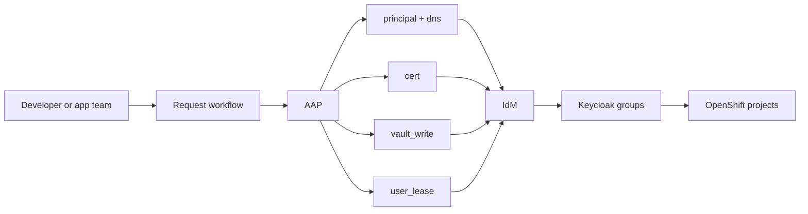



# OpenShift Developer Use Cases

Related docs:

<a href="https://gprocunier.github.io/eigenstate-ipa/openshift-primer.html"><kbd>&nbsp;&nbsp;OPENSHIFT ECOSYSTEM PRIMER&nbsp;&nbsp;</kbd></a>
<a href="https://gprocunier.github.io/eigenstate-ipa/aap-integration.html"><kbd>&nbsp;&nbsp;AAP INTEGRATION&nbsp;&nbsp;</kbd></a>
<a href="https://gprocunier.github.io/eigenstate-ipa/cert-use-cases.html"><kbd>&nbsp;&nbsp;CERT USE CASES&nbsp;&nbsp;</kbd></a>
<a href="https://gprocunier.github.io/eigenstate-ipa/vault-write-use-cases.html"><kbd>&nbsp;&nbsp;VAULT WRITE USE CASES&nbsp;&nbsp;</kbd></a>
<a href="https://gprocunier.github.io/eigenstate-ipa/ephemeral-access-capabilities.html"><kbd>&nbsp;&nbsp;EPHEMERAL ACCESS CAPABILITIES&nbsp;&nbsp;</kbd></a>
<a href="https://gprocunier.github.io/eigenstate-ipa/documentation-map.html"><kbd>&nbsp;&nbsp;DOCS MAP&nbsp;&nbsp;</kbd></a>

## Purpose

This page is for OpenShift application teams and developers who do not want to
become IdM specialists but still benefit when the platform stops treating
enterprise identity as someone else's problem.

The strongest developer-facing improvements are not usually about direct
cluster login. They are about the workflows around the application:

- getting the right teams in through a multi-domain identity path
- onboarding an internal service without four separate ticket queues
- using temporary elevation when the work is rare instead of keeping it forever
- letting self-service workflows fail early because they can actually see policy



## 1. Cross-Domain Team Access Stops Being A Manual Group-Sync Problem

When teams span multiple AD domains, the pain is rarely authentication itself.
The pain is everything around it:

- special-case mappings
- shadow groups
- inconsistent project access between clusters
- a new exception path every time a partner team or acquired business unit appears

IdM gives Keycloak one brokering layer to consume from instead of forcing every
cluster-facing integration to reason about every AD relationship directly.

That does not remove the need for good OpenShift RBAC design, but it does make
the identity path more mechanical and less political.

## 2. Internal Service Onboarding With DNS, PKI, And Identity In One Flow

This is the highest-value developer workflow in the set.

The pain point is familiar:

- the app needs a stable internal name
- it needs a service identity
- it needs a certificate
- the resulting material needs to land somewhere recoverable

Those steps often live in different queues run by different teams.
`eigenstate.ipa` makes it possible to express the whole controller-side flow in
one place.

The example below is deliberately strict: DNS and principal existence are
checked first. The collection is not pretending to do the DNS write path here.
It is proving that the preconditions exist before asking the IdM CA to sign.

```yaml
---
- name: Onboard an internal application service through IdM-backed workflows
  hosts: localhost
  gather_facts: false

  vars:
    ipa_server: idm-01.corp.example.com
    ipa_keytab: /runner/env/ipa/admin.keytab
    ipa_ca: /etc/ipa/ca.crt
    app_fqdn: api.internal.apps.corp.example.com
    app_zone: internal.apps.corp.example.com
    service_principal: "HTTP/{{ app_fqdn }}"

  tasks:
    - name: Confirm the DNS name already exists in integrated DNS
      ansible.builtin.set_fact:
        dns_record: "{{ lookup('eigenstate.ipa.dns',
                        'api',
                        zone=app_zone,
                        server=ipa_server,
                        kerberos_keytab=ipa_keytab,
                        verify=ipa_ca) }}"

    - name: Confirm the service principal exists before cert issuance
      ansible.builtin.set_fact:
        principal_state: "{{ lookup('eigenstate.ipa.principal',
                              service_principal,
                              server=ipa_server,
                              kerberos_keytab=ipa_keytab,
                              verify=ipa_ca) }}"

    - name: Abort if prerequisites are missing
      ansible.builtin.assert:
        that:
          - dns_record.exists
          - principal_state.exists
        fail_msg: "DNS or service-principal prerequisites are missing for {{ app_fqdn }}."

    - name: Generate a private key in memory
      community.crypto.openssl_privatekey_pipe:
        size: 4096
      register: app_key
      no_log: true

    - name: Generate a CSR in memory
      community.crypto.openssl_csr_pipe:
        privatekey_content: "{{ app_key.privatekey }}"
        common_name: "{{ app_fqdn }}"
      register: app_csr
      no_log: true

    - name: Request the signed certificate from IdM
      ansible.builtin.set_fact:
        issued_cert: "{{ lookup('eigenstate.ipa.cert',
                          service_principal,
                          operation='request',
                          server=ipa_server,
                          kerberos_keytab=ipa_keytab,
                          csr=app_csr.csr,
                          result_format='record',
                          verify=ipa_ca) }}"
      no_log: true

    - name: Archive the resulting bundle in an IdM service vault
      eigenstate.ipa.vault_write:
        name: "{{ app_fqdn }}-tls"
        state: archived
        service: "{{ service_principal }}"
        data: >-
          {{ {
               'certificate': issued_cert.value,
               'private_key': app_key.privatekey,
               'serial_number': issued_cert.metadata.serial_number
             } | to_nice_yaml }}
        description: "TLS bundle for {{ app_fqdn }}"
        server: "{{ ipa_server }}"
        kerberos_keytab: "{{ ipa_keytab }}"
        verify: "{{ ipa_ca }}"
      no_log: true
```

Why this is useful:

- the app team gets one onboarding workflow instead of several manual queues
- the platform team can keep the preconditions explicit
- the resulting service material can be archived in IdM instead of disappearing into a controller temp directory

## 3. Temporary Elevated Access To Dev Or Test Without Permanent Overgrant

Teams usually overgrant here because the rare operational path is too awkward
to run well.

If a migration, test-environment repair, or deep debugging window genuinely
needs elevation, the cleaner model is:

1. approve the window in AAP
2. set the expiry boundary in IdM
3. let cleanup be hygiene rather than the primary control

```yaml
---
- name: Open a short-lived dev-test elevation window
  hosts: localhost
  gather_facts: false

  vars:
    ipa_server: idm-01.corp.example.com
    ipa_keytab: /runner/env/ipa/lease-operator.keytab
    ipa_ca: /etc/ipa/ca.crt
    temp_user: app-debug-alex

  tasks:
    - name: Grant a 45-minute lease for the approved debugging window
      eigenstate.ipa.user_lease:
        username: "{{ temp_user }}"
        principal_expiration: "00:45"
        password_expiration_matches_principal: true
        require_groups:
          - app-debug-operators
        server: "{{ ipa_server }}"
        kerberos_keytab: "{{ ipa_keytab }}"
        ipaadmin_principal: lease-operator
        verify: "{{ ipa_ca }}"
```

This is not replacing project RBAC or admission policy. It is handling the
separate problem of user identity duration for rare privileged work.

## 4. Self-Service Workflows Can Fail Early Instead Of Failing Late

The hidden reason many self-service ideas never get automated is that the
workflow cannot answer simple questions up front:

- does the service principal exist?
- does the expected DNS name exist?
- is the target identity path even valid?

When those checks move onto the controller, more requests become safe enough to
template.

```yaml
---
- name: Pre-flight gate before app bootstrap
  hosts: localhost
  gather_facts: false

  vars:
    ipa_server: idm-01.corp.example.com
    ipa_keytab: /runner/env/ipa/admin.keytab
    ipa_ca: /etc/ipa/ca.crt
    app_zone: internal.apps.corp.example.com
    app_name: api
    service_principal: HTTP/api.internal.apps.corp.example.com

  tasks:
    - name: Check DNS
      ansible.builtin.set_fact:
        dns_record: "{{ lookup('eigenstate.ipa.dns',
                        app_name,
                        zone=app_zone,
                        server=ipa_server,
                        kerberos_keytab=ipa_keytab,
                        verify=ipa_ca) }}"

    - name: Check service principal
      ansible.builtin.set_fact:
        principal_state: "{{ lookup('eigenstate.ipa.principal',
                              service_principal,
                              server=ipa_server,
                              kerberos_keytab=ipa_keytab,
                              verify=ipa_ca) }}"

    - name: Refuse to continue when prerequisites are missing
      ansible.builtin.assert:
        that:
          - dns_record.exists
          - principal_state.exists
        fail_msg: "Application bootstrap prerequisites are incomplete in IdM."
```

That is not glamorous, but it is the difference between a request template that
can be trusted and one that still requires someone to inspect every case by hand.

## Read Next

- for the operator side of the same stack:
  <a href="https://gprocunier.github.io/eigenstate-ipa/openshift-operator-use-cases.html"><kbd>OPENSHIFT OPERATOR USE CASES</kbd></a>
- for the broader control-plane view:
  <a href="https://gprocunier.github.io/eigenstate-ipa/aap-integration.html"><kbd>AAP INTEGRATION</kbd></a>


