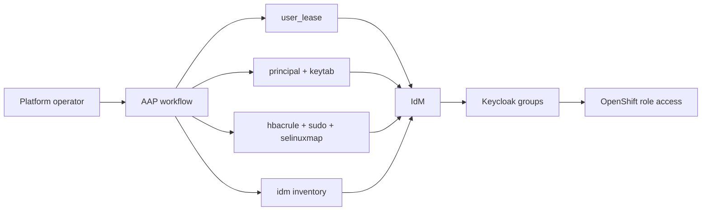
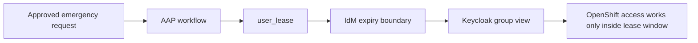
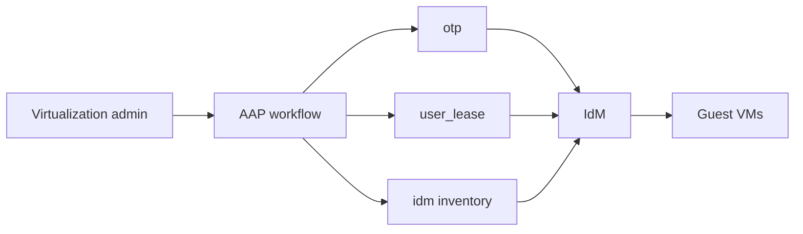



# OpenShift Operator Use Cases

Related docs:

<a href="https://gprocunier.github.io/eigenstate-ipa/openshift-primer.html"><kbd>&nbsp;&nbsp;OPENSHIFT ECOSYSTEM PRIMER&nbsp;&nbsp;</kbd></a>
<a href="https://gprocunier.github.io/eigenstate-ipa/aap-integration.html"><kbd>&nbsp;&nbsp;AAP INTEGRATION&nbsp;&nbsp;</kbd></a>
<a href="https://gprocunier.github.io/eigenstate-ipa/user-lease-use-cases.html"><kbd>&nbsp;&nbsp;USER LEASE USE CASES&nbsp;&nbsp;</kbd></a>
<a href="https://gprocunier.github.io/eigenstate-ipa/keytab-use-cases.html"><kbd>&nbsp;&nbsp;KEYTAB USE CASES&nbsp;&nbsp;</kbd></a>
<a href="https://gprocunier.github.io/eigenstate-ipa/otp-use-cases.html"><kbd>&nbsp;&nbsp;OTP USE CASES&nbsp;&nbsp;</kbd></a>
<a href="https://gprocunier.github.io/eigenstate-ipa/documentation-map.html"><kbd>&nbsp;&nbsp;DOCS MAP&nbsp;&nbsp;</kbd></a>

## Purpose

This page is for:

- OpenShift cluster administrators
- OpenShift Virtualization administrators
- platform operators who manage bastions, mirror registries, helper services, and guest enrollment beside the cluster

The focus is not `oc` syntax or cluster object CRUD.
The focus is the surrounding platform work that usually becomes painful first:

- temporary access
- controller-side service identity
- policy validation before disruptive change
- day-one VM enrollment
- inventory shaped by enterprise identity instead of naming conventions

## Cluster Administration Patterns



### 1. Time-Bounded Break-Glass Instead Of Standing Exceptions

This is the most defensible operator use case in the set.
The point is not just that AAP can schedule cleanup later. The point is that
the user becomes unusable in IdM when the work window closes.

That is materially better than:

- a permanent cluster-admin exception
- a bastion-admin user left in place "for emergencies"
- a cleanup-only process that fails open when no one removes the access later

The OpenShift side of this pattern is still your Keycloak mapping and cluster
role binding. The important control boundary is the IdM expiry itself.



```yaml
---
- name: Open a temporary break-glass window for cluster operations
  hosts: localhost
  gather_facts: false

  vars:
    ipa_server: idm-01.corp.example.com
    ipa_keytab: /runner/env/ipa/lease-operator.keytab
    ipa_ca: /etc/ipa/ca.crt
    temp_user: ocp-breakglass-jlee
    lease_group: ocp-cluster-breakglass

  tasks:
    - name: Grant a two-hour lease to the delegated break-glass user
      eigenstate.ipa.user_lease:
        username: "{{ temp_user }}"
        principal_expiration: "02:00"
        password_expiration_matches_principal: true
        require_groups:
          - "{{ lease_group }}"
        server: "{{ ipa_server }}"
        kerberos_keytab: "{{ ipa_keytab }}"
        ipaadmin_principal: lease-operator
        verify: "{{ ipa_ca }}"
      register: lease_state

    - name: Report the effective lease end
      ansible.builtin.debug:
        msg: >-
          Break-glass user {{ temp_user }} is usable until
          {{ lease_state.lease_end }}.
```

Notes:

- use absolute times when the approval window is fixed in advance
- use `require_groups` when the delegated RBAC model is already scoped to a governed group
- keep the Keycloak and cluster-role side as a separate documented boundary; this playbook is only establishing the IdM lease

### 2. Controller-Scoped Kerberos Identity For Cluster-Support Services

This is the stronger answer when the workflow runs on the controller and the
supporting service already fits a Kerberos model.

Examples:

- mirror-registry maintenance
- helper API or bastion-side automation
- cluster-adjacent workflows that need a service identity but should not live on copied passwords forever

The pattern is:

1. confirm the service principal exists
2. issue a run-scoped keytab
3. use it to obtain tickets for the controller-side work
4. rotate the keys again when the workflow closes

It is not a lease engine, but it is still much stronger than leaving a shared
service password or broadly reused secret on the controller.

```yaml
---
- name: Use a dedicated Kerberos principal for cluster-support automation
  hosts: localhost
  gather_facts: false

  vars:
    ipa_server: idm-01.corp.example.com
    ipa_keytab: /runner/env/ipa/admin.keytab
    ipa_ca: /etc/ipa/ca.crt
    support_principal: HTTP/aap-mirror-registry.corp.example.com
    run_keytab_path: /tmp/aap-mirror-registry.keytab

  tasks:
    - name: Confirm the principal exists before rotating keys
      ansible.builtin.set_fact:
        principal_state: "{{ lookup('eigenstate.ipa.principal',
                              support_principal,
                              server=ipa_server,
                              kerberos_keytab=ipa_keytab,
                              verify=ipa_ca) }}"

    - name: Abort if the support principal is missing
      ansible.builtin.assert:
        that:
          - principal_state.exists
        fail_msg: "Support principal {{ support_principal }} is missing in IdM."

    - name: Issue a run-scoped keytab and rotate prior material
      ansible.builtin.set_fact:
        run_keytab_b64: "{{ lookup('eigenstate.ipa.keytab',
                           support_principal,
                           server=ipa_server,
                           kerberos_keytab=ipa_keytab,
                           retrieve_mode='generate',
                           verify=ipa_ca) }}"
      no_log: true

    - name: Materialize the keytab locally for downstream tasks
      ansible.builtin.copy:
        content: "{{ run_keytab_b64 | b64decode }}"
        dest: "{{ run_keytab_path }}"
        mode: "0600"
      no_log: true

    - name: Acquire a Kerberos ticket for the support workflow
      ansible.builtin.command:
        cmd: "kinit -kt {{ run_keytab_path }} {{ support_principal }}"
      changed_when: false
      no_log: true

    - name: Retire prior key material again when the workflow closes
      ansible.builtin.set_fact:
        _retired: "{{ lookup('eigenstate.ipa.keytab',
                        support_principal,
                        server=ipa_server,
                        kerberos_keytab=ipa_keytab,
                        retrieve_mode='generate',
                        verify=ipa_ca) }}"
      no_log: true

    - name: Remove the local keytab copy
      ansible.builtin.file:
        path: "{{ run_keytab_path }}"
        state: absent
```

### 3. Policy Gate Before Cluster-Adjacent Maintenance

This is where the collection differentiates itself from a pure secrets story.

Before a maintenance workflow touches a bastion, mirror registry, helper node,
or other supporting estate component, AAP can check whether IdM policy still
matches the intended access path.

That lets the job fail before the disruptive work starts instead of halfway
through the window.

```yaml
---
- name: Pre-flight gate before mirror-registry maintenance
  hosts: localhost
  gather_facts: false

  vars:
    ipa_server: idm-01.corp.example.com
    ipa_keytab: /runner/env/ipa/admin.keytab
    ipa_ca: /etc/ipa/ca.crt
    target_host: mirror-registry.corp.example.com
    deploy_identity: svc-cluster-maint

  tasks:
    - name: Confirm sudo rule exists
      ansible.builtin.set_fact:
        sudo_rule: "{{ lookup('eigenstate.ipa.sudo',
                        'ops-maintenance',
                        sudo_object='rule',
                        server=ipa_server,
                        kerberos_keytab=ipa_keytab,
                        verify=ipa_ca) }}"

    - name: Confirm HBAC access would be granted
      ansible.builtin.set_fact:
        access_result: "{{ lookup('eigenstate.ipa.hbacrule',
                            deploy_identity,
                            operation='test',
                            targethost=target_host,
                            service='sshd',
                            server=ipa_server,
                            kerberos_keytab=ipa_keytab,
                            verify=ipa_ca) }}"

    - name: Assert policy is ready
      ansible.builtin.assert:
        that:
          - sudo_rule.exists
          - sudo_rule.enabled
          - not access_result.denied
        fail_msg: "IdM policy does not match the maintenance workflow boundary."
```

## OpenShift Virtualization Patterns



### 4. Day-One Guest Enrollment Into IdM

This is the cleanest way to stop guest identity from becoming a day-two cleanup
problem.

The pattern is:

1. ensure the IdM host object exists
2. generate a one-time enrollment password
3. consume that password on the guest through the official IdM collection

That gives the VM enterprise identity from the start instead of after several
manual handoffs.

```yaml
---
- name: Prepare IdM enrollment material for a new guest
  hosts: localhost
  gather_facts: false

  vars:
    ipa_server: idm-01.corp.example.com
    ipa_keytab: /runner/env/ipa/admin.keytab
    ipa_ca: /etc/ipa/ca.crt
    target_fqdn: vm-01.corp.example.com

  tasks:
    - name: Ensure the host object exists in IdM
      freeipa.ansible_freeipa.ipahost:
        ipaadmin_keytab: "{{ ipa_keytab }}"
        ipaadmin_principal: admin
        name: "{{ target_fqdn }}"
        state: present

    - name: Generate a one-time enrollment password for the guest
      ansible.builtin.set_fact:
        enroll_pass: "{{ lookup('eigenstate.ipa.otp',
                          target_fqdn,
                          token_type='host',
                          server=ipa_server,
                          kerberos_keytab=ipa_keytab,
                          verify=ipa_ca) | first }}"
      no_log: true

- name: Enroll the guest into IdM
  hosts: vm-01.corp.example.com
  gather_facts: false

  vars:
    ipa_server: idm-01.corp.example.com
    ipa_ca: /etc/ipa/ca.crt

  tasks:
    - name: Run ipa-client-install through the official IdM collection
      freeipa.ansible_freeipa.ipaclient:
        servers: "{{ ipa_server }}"
        domain: corp.example.com
        realm: CORP.EXAMPLE.COM
        ipaadmin_password: "{{ hostvars['localhost']['enroll_pass'] }}"
        ca_cert_file: "{{ ipa_ca }}"
        state: present
      no_log: true
```

### 5. Temporary Guest Administration Windows

Virtualization teams often face the same problem as cluster admins:
rare guest break/fix work leads to permanent privileges because the temporary
path is too fragile.

The same `user_lease` pattern works here too. The difference is the audience:
the lease opens a guest-administration window rather than cluster-admin access.

```yaml
---
- name: Open a short guest-administration window
  hosts: localhost
  gather_facts: false

  vars:
    ipa_server: idm-01.corp.example.com
    ipa_keytab: /runner/env/ipa/lease-operator.keytab
    ipa_ca: /etc/ipa/ca.crt
    temp_user: ocpv-guest-admin-kim

  tasks:
    - name: Grant a 90-minute lease
      eigenstate.ipa.user_lease:
        username: "{{ temp_user }}"
        principal_expiration: "01:30"
        password_expiration_matches_principal: true
        require_groups:
          - virt-guest-admins
        server: "{{ ipa_server }}"
        kerberos_keytab: "{{ ipa_keytab }}"
        ipaadmin_principal: lease-operator
        verify: "{{ ipa_ca }}"
```

### 6. Inventory And Targeting By Identity Shape

This is the quieter improvement, but it pays off every time the fleet changes.

Instead of targeting VMs only by naming convention, tag discipline, or a folder
in another inventory source, AAP can use IdM hostgroups, locations, and other
host metadata as the inventory boundary.

That is especially useful when virtualization operations need to align with:

- access zones
- delegated ownership
- datacenter or location boundaries
- guest groups already expressed in IdM

```yaml
plugin: eigenstate.ipa.idm
server: idm-01.corp.example.com
use_kerberos: true
kerberos_keytab: /runner/env/ipa/admin.keytab
verify: /etc/ipa/ca.crt
sources:
  - hosts
  - hostgroups
hostgroup_filter:
  - ocpv-guests
hostvars_include:
  - idm_fqdn
  - idm_location
  - idm_hostgroups
keyed_groups:
  - key: idm_location
    prefix: dc
    separator: "_"
```

## Read Next

- for developer and app-team onboarding:
  <a href="https://gprocunier.github.io/eigenstate-ipa/openshift-developer-use-cases.html"><kbd>OPENSHIFT DEVELOPER USE CASES</kbd></a>
- for the broader controller model:
  <a href="https://gprocunier.github.io/eigenstate-ipa/aap-integration.html"><kbd>AAP INTEGRATION</kbd></a>


