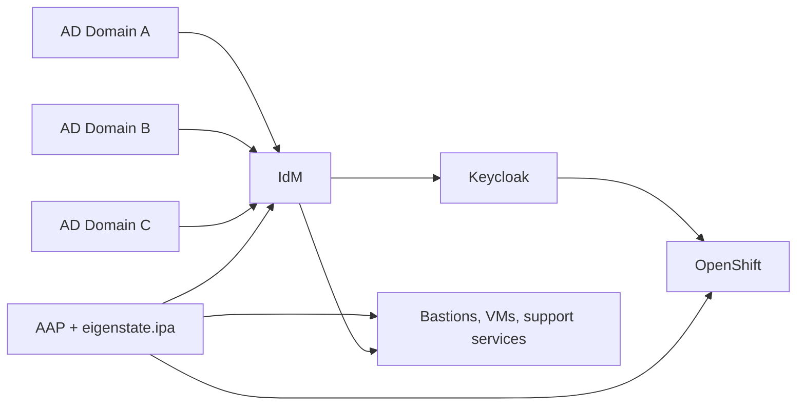



# OpenShift Ecosystem Primer

Related docs:

<a href="https://gprocunier.github.io/eigenstate-ipa/aap-integration.html"><kbd>&nbsp;&nbsp;AAP INTEGRATION&nbsp;&nbsp;</kbd></a>
<a href="https://gprocunier.github.io/eigenstate-ipa/ephemeral-access-capabilities.html"><kbd>&nbsp;&nbsp;EPHEMERAL ACCESS CAPABILITIES&nbsp;&nbsp;</kbd></a>
<a href="https://gprocunier.github.io/eigenstate-ipa/openshift-operator-use-cases.html"><kbd>&nbsp;&nbsp;OPENSHIFT OPERATOR USE CASES&nbsp;&nbsp;</kbd></a>
<a href="https://gprocunier.github.io/eigenstate-ipa/openshift-rhacm-use-cases.html"><kbd>&nbsp;&nbsp;OPENSHIFT RHACM USE CASES&nbsp;&nbsp;</kbd></a>
<a href="https://gprocunier.github.io/eigenstate-ipa/openshift-rhacs-use-cases.html"><kbd>&nbsp;&nbsp;OPENSHIFT RHACS USE CASES&nbsp;&nbsp;</kbd></a>
<a href="https://gprocunier.github.io/eigenstate-ipa/openshift-quay-use-cases.html"><kbd>&nbsp;&nbsp;OPENSHIFT QUAY USE CASES&nbsp;&nbsp;</kbd></a>
<a href="https://gprocunier.github.io/eigenstate-ipa/openshift-developer-use-cases.html"><kbd>&nbsp;&nbsp;OPENSHIFT DEVELOPER USE CASES&nbsp;&nbsp;</kbd></a>
<a href="https://gprocunier.github.io/eigenstate-ipa/documentation-map.html"><kbd>&nbsp;&nbsp;DOCS MAP&nbsp;&nbsp;</kbd></a>

## Purpose

Use this guide when OpenShift already uses Keycloak and enterprise identity,
and the question is how IdM plus `eigenstate.ipa` changes the workflows around
the cluster rather than the cluster API itself.

This is not an installation guide for OpenShift, Keycloak, or IdM.
It is a framing page for the surrounding control plane:

- identity brokerage across multiple AD domains
- controller-side policy and inventory in AAP
- temporary access, enrollment, DNS, PKI, and service identity workflows
- RHACM, RHACS, and Quay workflows around the cluster

## Assumed Model

This guide assumes:

- OpenShift uses Keycloak for cluster login and application-facing identity
- Keycloak consumes identity and group context from IdM
- IdM brokers trust with multiple Active Directory domains
- AAP is the workflow engine for approvals, scheduling, and repeatable execution
- `eigenstate.ipa` exposes the IdM state that those workflows need

The practical consequence is that OpenShift stops being the only place where
platform identity decisions show up. The identity, host policy, and
service-onboarding logic around the cluster becomes automatable too.

## What Changes

### Keycloak Stops Carrying The Whole Identity Problem

Keycloak is still the user-facing federation layer, but it no longer has to
solve every enterprise identity problem on its own.

IdM can absorb the harder parts:

- multiple AD trust relationships
- Kerberos-backed service identity
- host access policy
- delegated administrative boundaries
- OTP, DNS, and internal PKI

If RHACM is the event source, the same control plane also works for policy violations and lifecycle hooks. RHACM decides when to fire; AAP runs the job; IdM decides whether the identity, policy, and supporting artifacts are actually ready.
That matters because the OpenShift-facing login layer becomes cleaner when the
ugly estate-side identity work happens upstream of it.

### AAP Gets A Real Source Of Truth For Cluster-Adjacent Work

Without an IdM-backed control plane, AAP often becomes a job runner sitting on
top of stale inventory, copied credentials, and guessed policy.

With `eigenstate.ipa`, controller workflows can use:

- live inventory from IdM host and group state
- pre-flight policy checks through HBAC, sudo, and SELinux mapping
- Kerberos principal and keytab workflows for service identity
- OTP for first-day enrollment
- Dogtag-backed certificate issuance and retrieval
- vault lifecycle for static secrets and archived artifacts

That is where the collection becomes operationally useful for OpenShift teams.

### RHACM Turns Policy Events Into Identity-Aware Jobs

RHACM is the useful trigger layer when the platform already knows that a
cluster event or policy violation happened. The job still needs a real
identity boundary, though, and that is where IdM plus `eigenstate.ipa` matters.

The pattern is:

- RHACM provides the event and scope
- AAP launches the job
- `eigenstate.ipa` checks whether the identity, policy, DNS, certificate, or
  temporary access window is actually ready

That makes remediation and lifecycle work safer because the job does not start
from a blind shell hook. It starts from concrete enterprise state.

### RHACS Makes Enforcement Operationally Viable

RHACS already does the cluster-security work: image scanning, policy
enforcement, runtime detection, and network-baseline analysis. The hard part is
usually the response path around those findings.

That is where the collection matters:

- RHACS findings can launch AAP jobs that prove the remediation identity path
  before the job starts
- stricter RHACS enforcement is easier to keep turned on when service identity,
  DNS, and certificate onboarding are mechanical
- temporary exception work can expire in IdM instead of living in standing
  access or long-lived tickets

### Quay Keeps Registry Automation From Becoming Credential Sprawl

Quay already has its own registry, mirroring, robot-account, and notification
model. The hard part is usually the surrounding identity and automation path.

That is where the collection matters:

- Keycloak and IdM can stay the upstream access truth instead of creating local
  Quay identity sprawl
- AAP jobs around mirroring, promotion, or repository notifications can use
  IdM-backed service identity instead of generic shared credentials
- temporary registry administration can expire in IdM instead of surviving as a
  standing exception

### The Value Shows Up Around The Cluster

The collection is not trying to replace OpenShift RBAC, cluster operators, or
the `oc` CLI.

Its value is in the surrounding workflows that are usually harder than the
cluster change itself:

- opening and closing temporary elevated access
- onboarding a guest or service into enterprise identity
- proving that DNS, policy, and service identity are ready before a rollout
- using enterprise identity for controller-side automation instead of shared secrets

## Where The Collection Matters Most

| Persona | Hard thing that becomes more reasonable | Main collection surfaces | Start here |
| --- | --- | --- | --- |
| OpenShift cluster admin | time-bounded break-glass, controller auth for support services, policy-gated maintenance | `user_lease`, `principal`, `keytab`, `hbacrule`, `sudo`, `selinuxmap`, `idm` | [OpenShift Operator Use Cases](https://gprocunier.github.io/eigenstate-ipa/openshift-operator-use-cases.html) |
| OpenShift Virtualization admin | guest enrollment, temporary guest administration, targeting VMs by identity shape | `otp`, `user_lease`, `idm`, `principal`, `keytab` | [OpenShift Operator Use Cases](https://gprocunier.github.io/eigenstate-ipa/openshift-operator-use-cases.html) |
| OpenShift developer or app team | internal service onboarding, coherent app bootstrap, narrower temporary elevation | `principal`, `dns`, `cert`, `vault_write`, `user_lease` | [OpenShift Developer Use Cases](https://gprocunier.github.io/eigenstate-ipa/openshift-developer-use-cases.html) |
| RHACM operator | policy violations and lifecycle hooks become identity-aware AAP triggers instead of blind shell remediations | `principal`, `keytab`, `hbacrule`, `sudo`, `selinuxmap`, `user_lease`, `otp` | [OpenShift RHACM Use Cases](https://gprocunier.github.io/eigenstate-ipa/openshift-rhacm-use-cases.html) |
| RHACS operator | security findings become governed remediation, temporary access, and onboarding flows instead of generic follow-up tickets | `user_lease`, `principal`, `keytab`, `hbacrule`, `sudo`, `selinuxmap`, `dns`, `cert`, `vault_write` | [OpenShift RHACS Use Cases](https://gprocunier.github.io/eigenstate-ipa/openshift-rhacs-use-cases.html) |
| Quay operator | registry access, mirroring, notifications, and service onboarding stop depending on local user sprawl and long-lived shared credentials | `principal`, `keytab`, `dns`, `cert`, `vault_write`, `user_lease`, `hbacrule`, `sudo`, `selinuxmap` | [OpenShift Quay Use Cases](https://gprocunier.github.io/eigenstate-ipa/openshift-quay-use-cases.html) |

## Boundaries

This story is stronger when it stays narrow and honest.

Do not read these pages as a claim that `eigenstate.ipa` is:

- an OpenShift installation framework
- a replacement for cluster RBAC design
- a dynamic secrets engine
- a generic PAM session broker

The claim is simpler:

If Keycloak and OpenShift already sit on top of IdM-backed enterprise identity,
`eigenstate.ipa` gives AAP a clean way to consume that identity, policy, and
service lifecycle state as automation input.

## Read Next

Continue by persona:

- platform or virtualization operations:
  <a href="https://gprocunier.github.io/eigenstate-ipa/openshift-operator-use-cases.html"><kbd>OPENSHIFT OPERATOR USE CASES</kbd></a>
- developer and app onboarding flows:
  <a href="https://gprocunier.github.io/eigenstate-ipa/openshift-developer-use-cases.html"><kbd>OPENSHIFT DEVELOPER USE CASES</kbd></a>
- RHACM-triggered remediation and lifecycle hooks:
  <a href="https://gprocunier.github.io/eigenstate-ipa/openshift-rhacm-use-cases.html"><kbd>OPENSHIFT RHACM USE CASES</kbd></a>
- RHACS findings, enforcement, and governed response paths:
  <a href="https://gprocunier.github.io/eigenstate-ipa/openshift-rhacs-use-cases.html"><kbd>OPENSHIFT RHACS USE CASES</kbd></a>
- Quay identity, mirroring, and repository-event workflows:
  <a href="https://gprocunier.github.io/eigenstate-ipa/openshift-quay-use-cases.html"><kbd>OPENSHIFT QUAY USE CASES</kbd></a>

If the question is still mainly about controller workflow shape rather than
OpenShift itself, return to
<a href="https://gprocunier.github.io/eigenstate-ipa/aap-integration.html"><kbd>AAP INTEGRATION</kbd></a>.


