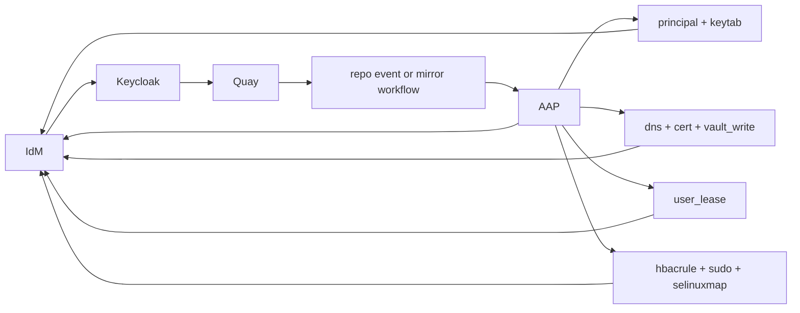



# OpenShift Quay Use Cases

Related docs:

<a href="https://gprocunier.github.io/eigenstate-ipa/openshift-primer.html"><kbd>&nbsp;&nbsp;OPENSHIFT ECOSYSTEM PRIMER&nbsp;&nbsp;</kbd></a>
<a href="https://gprocunier.github.io/eigenstate-ipa/aap-integration.html"><kbd>&nbsp;&nbsp;AAP INTEGRATION&nbsp;&nbsp;</kbd></a>
<a href="https://gprocunier.github.io/eigenstate-ipa/openshift-developer-use-cases.html"><kbd>&nbsp;&nbsp;OPENSHIFT DEVELOPER USE CASES&nbsp;&nbsp;</kbd></a>
<a href="https://gprocunier.github.io/eigenstate-ipa/openshift-rhacs-use-cases.html"><kbd>&nbsp;&nbsp;OPENSHIFT RHACS USE CASES&nbsp;&nbsp;</kbd></a>
<a href="https://gprocunier.github.io/eigenstate-ipa/vault-write-use-cases.html"><kbd>&nbsp;&nbsp;VAULT WRITE USE CASES&nbsp;&nbsp;</kbd></a>
<a href="https://gprocunier.github.io/eigenstate-ipa/documentation-map.html"><kbd>&nbsp;&nbsp;DOCS MAP&nbsp;&nbsp;</kbd></a>

## Purpose

This page is for Quay operators and platform teams who already understand the
registry itself, but need the identity and automation path around the registry
to stop depending on local sprawl and long-lived credentials.

Quay already does the registry-side work:

- repository storage and promotion
- team and organization access rules
- repository notifications
- robot accounts and mirroring workflows
- vulnerability scanning and policy hooks through the wider platform

The useful `eigenstate.ipa` angle is not to replace Quay. It is to make the
supporting identity, certificate, DNS, and temporary-access work around Quay
more mechanical.



## 1. Team Access Stops Being A Local Quay User Problem

In a multi-domain estate, Quay gets messy if it becomes its own identity
island. That usually leads to local users, duplicated team definitions, and a
lot of arguments about which group system is authoritative.

The cleaner model is:

- IdM brokers trust with the AD domains
- Keycloak consumes that unified identity view
- Quay consumes `OIDC` from Keycloak
- Quay teams and access rules follow the same upstream identity model already used elsewhere in the platform

That does not remove the need for good Quay organization design. It does stop
Quay from becoming one more place where identity drift accumulates.

## 2. Mirror And Promotion Jobs Do Not Need Long-Lived Shared Credentials

Quay already has robot accounts and mirroring workflows. The operational trap
is letting those turn into permanent, widely copied credentials.

The stronger pattern is to narrow the automation boundary around them:

- use Quay's own short-lived or narrowly scoped token options where the product fits
- use `principal` and `keytab` for the controller-side identity that runs the surrounding automation
- keep any bootstrap or archival material in an IdM vault through `vault_write`
- re-check the bastion or helper-service access path before the job starts

That does not make Quay's robot model disappear. It makes the rest of the
workflow stop depending on a generic shared secret sitting on the controller.

```yaml
---
- name: Pre-flight gate for a Quay mirror workflow
  hosts: localhost
  gather_facts: false

  vars:
    ipa_server: idm-01.corp.example.com
    ipa_keytab: /runner/env/ipa/admin.keytab
    ipa_ca: /etc/ipa/ca.crt
    support_principal: HTTP/quay-mirror-automation.corp.example.com
    target_host: bastion-01.corp.example.com
    deploy_identity: svc-quay-mirror

  tasks:
    - name: Confirm the service principal exists
      ansible.builtin.set_fact:
        principal_state: "{{ lookup('eigenstate.ipa.principal',
                              support_principal,
                              server=ipa_server,
                              kerberos_keytab=ipa_keytab,
                              verify=ipa_ca) }}"

    - name: Confirm HBAC would allow the helper path
      ansible.builtin.set_fact:
        access_state: "{{ lookup('eigenstate.ipa.hbacrule',
                           deploy_identity,
                           operation='test',
                           targethost=target_host,
                           service='sshd',
                           server=ipa_server,
                           kerberos_keytab=ipa_keytab,
                           verify=ipa_ca) }}"

    - name: Refuse the mirror job when the boundary is wrong
      ansible.builtin.assert:
        that:
          - principal_state.exists
          - not access_state.denied
        fail_msg: "Quay mirror automation cannot proceed until the IdM boundary is ready."
```

## 3. Registry Service Onboarding Becomes A Single Flow

A Quay deployment or external route usually needs more than the registry
operator itself:

- a stable internal or external name
- a certificate that matches that name
- somewhere controlled to archive bootstrap material
- controller-side service identity for follow-up jobs

Those pieces are often split across several teams. `eigenstate.ipa` makes the
supporting workflow expressible in one controller-side path:

- `dns` verifies that the expected name state exists
- `principal` verifies that the service identity exists
- `cert` issues the matching certificate
- `vault_write` archives the resulting bundle when needed

That makes Quay setup and promotion less dependent on ad hoc side channels.

## 4. Quay Notifications Can Trigger Identity-Aware Follow-Up

Quay already supports repository notifications and webhooks. That is enough to
launch useful AAP jobs around repository events without pretending Quay is a
full workflow engine.

Good examples:

- a repository event kicks off a governed mirror or promotion job
- a security-related repo event launches a validation workflow before a change is promoted
- a maintenance event opens a temporary operator window that expires in IdM instead of living in a ticket

The important thing is that the event is only the trigger. The real value comes
from making the follow-up job prove its identity, policy, and supporting-host
boundary before it acts.

## 5. Temporary Registry Administration Can Expire In IdM

Registry teams still need occasional elevated access for break-fix work,
migration windows, or emergency repository repair.

That is a good fit for `user_lease`:

- AAP opens a short-lived operator window
- IdM enforces the expiry
- Quay administration stops depending on a standing admin exception

That is not a Quay replacement feature. It is the surrounding control boundary
that makes rare privileged work easier to justify and easier to clean up.

## Read Next

- for the broader OpenShift framing:
  <a href="https://gprocunier.github.io/eigenstate-ipa/openshift-primer.html"><kbd>OPENSHIFT ECOSYSTEM PRIMER</kbd></a>
- for the developer-side service onboarding path:
  <a href="https://gprocunier.github.io/eigenstate-ipa/openshift-developer-use-cases.html"><kbd>OPENSHIFT DEVELOPER USE CASES</kbd></a>
- for the controller-side workflow model:
  <a href="https://gprocunier.github.io/eigenstate-ipa/aap-integration.html"><kbd>AAP INTEGRATION</kbd></a>


