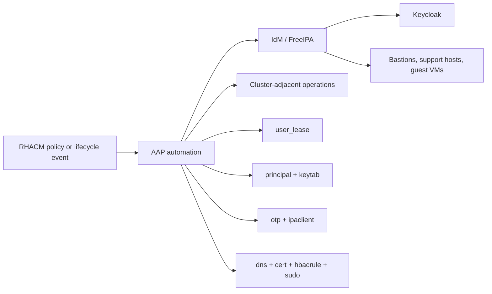



# OpenShift RHACM Use Cases

Related docs:

<a href="https://gprocunier.github.io/eigenstate-ipa/openshift-primer.html"><kbd>&nbsp;&nbsp;OPENSHIFT ECOSYSTEM PRIMER&nbsp;&nbsp;</kbd></a>
<a href="https://gprocunier.github.io/eigenstate-ipa/openshift-operator-use-cases.html"><kbd>&nbsp;&nbsp;OPENSHIFT OPERATOR USE CASES&nbsp;&nbsp;</kbd></a>
<a href="https://gprocunier.github.io/eigenstate-ipa/aap-integration.html"><kbd>&nbsp;&nbsp;AAP INTEGRATION&nbsp;&nbsp;</kbd></a>
<a href="https://gprocunier.github.io/eigenstate-ipa/openshift-developer-use-cases.html"><kbd>&nbsp;&nbsp;OPENSHIFT DEVELOPER USE CASES&nbsp;&nbsp;</kbd></a>
<a href="https://gprocunier.github.io/eigenstate-ipa/documentation-map.html"><kbd>&nbsp;&nbsp;DOCS MAP&nbsp;&nbsp;</kbd></a>

## Purpose

This page is for RHACM operators who already know that RHACM can trigger AAP,
and who want the IdM side of the picture to be concrete instead of hand-wavy.

The useful pattern is simple:

- RHACM detects a cluster lifecycle event or policy violation
- RHACM passes scope and context into AAP
- AAP uses `eigenstate.ipa` to check identity, policy, enrollment, and service state
- IdM becomes the enforcement boundary for the supporting estate

This is not a replacement for RHACM governance or AAP workflow design.
It is the IdM-facing branch of those workflows.

## Control Flow



## 1. Policy Violations Become Remediation Boundaries, Not Blind Shell Hooks

RHACM governance can already drive AAP when a policy goes non-compliant.
That is useful, but the remediation job still needs a boundary for who it runs
as and what it is allowed to touch.

`eigenstate.ipa` gives that boundary shape:

- `principal` proves the service identity exists
- `keytab` lets the remediation job authenticate as that identity
- `hbacrule`, `sudo`, and `selinuxmap` tell the controller whether the path is valid
- `user_lease` can open a temporary operator window when the fix should not be permanent

That is materially better than a policy trigger that lands in a generic shell
script with no identity model behind it.

```yaml
---
- name: RHACM policy violation remediation gate
  hosts: localhost
  gather_facts: false

  vars:
    ipa_server: idm-01.corp.example.com
    ipa_keytab: /runner/env/ipa/admin.keytab
    ipa_ca: /etc/ipa/ca.crt
    support_principal: HTTP/acm-remediation.corp.example.com
    target_host: mirror-registry.corp.example.com
    deploy_identity: svc-rhacm-remediation

  tasks:
    - name: Confirm the service principal exists
      ansible.builtin.set_fact:
        principal_state: "{{ lookup('eigenstate.ipa.principal',
                              support_principal,
                              server=ipa_server,
                              kerberos_keytab=ipa_keytab,
                              verify=ipa_ca) }}"

    - name: Confirm the remediation path is allowed
      ansible.builtin.set_fact:
        access_state: "{{ lookup('eigenstate.ipa.hbacrule',
                           deploy_identity,
                           operation='test',
                           targethost=target_host,
                           service='sshd',
                           server=ipa_server,
                           kerberos_keytab=ipa_keytab,
                           verify=ipa_ca) }}"

    - name: Refuse remediation if the identity path is wrong
      ansible.builtin.assert:
        that:
          - principal_state.exists
          - not access_state.denied
        fail_msg: "RHACM remediation cannot proceed because the IdM boundary is not ready."
```

## 2. Cluster Lifecycle Hooks Can Prepare Or Retire Identity Artifacts

RHACM cluster lifecycle workflows are a good place to stop treating identity as
an afterthought.

Examples:

- a prehook prepares host enrollment material for a new guest or support node
- a posthook retires service identity after a cluster or helper service is removed
- a create flow checks DNS and certificates before a cluster-facing endpoint is declared ready

The valuable part is not the hook itself. It is that the hook can consume real
IdM state instead of guessing.

```yaml
---
- name: RHACM cluster-create hook prepares supporting identity
  hosts: localhost
  gather_facts: false

  vars:
    ipa_server: idm-01.corp.example.com
    ipa_keytab: /runner/env/ipa/admin.keytab
    ipa_ca: /etc/ipa/ca.crt
    target_fqdn: support-gw-01.corp.example.com
    app_zone: corp.example.com
    service_principal: "HTTP/{{ target_fqdn }}"

  tasks:
    - name: Verify the supporting name exists in DNS
      ansible.builtin.set_fact:
        dns_record: "{{ lookup('eigenstate.ipa.dns',
                        'support-gw-01',
                        zone=app_zone,
                        server=ipa_server,
                        kerberos_keytab=ipa_keytab,
                        verify=ipa_ca) }}"

    - name: Verify the service principal exists
      ansible.builtin.set_fact:
        principal_state: "{{ lookup('eigenstate.ipa.principal',
                              service_principal,
                              server=ipa_server,
                              kerberos_keytab=ipa_keytab,
                              verify=ipa_ca) }}"

    - name: Refuse the hook if supporting identity is missing
      ansible.builtin.assert:
        that:
          - dns_record.exists
          - principal_state.exists
        fail_msg: "RHACM lifecycle hook cannot continue without supporting IdM state."
```

## 3. Temporary Operator Access Can Be Bound To The RHACM Event Window

If RHACM opens a maintenance or remediation window, the operator access should
expire with that window rather than survive it.

That is where `user_lease` fits well:

- RHACM provides the event
- AAP opens the window
- IdM makes the window disappear when the lease ends

This is a better control boundary than a cleanup-only job, because the identity
itself stops working.

## 4. Day-One Guest Or Support-Node Enrollment Can Ride The Same Flow

If RHACM launches a workflow that creates supporting hosts or VMs, the
enrollment step should be part of the same story.

Use `otp` to generate the enrollment password, then let the official IdM
modules consume it.
That keeps RHACM, AAP, and IdM lined up around the same source of truth.

The more practical version of the same idea is:

1. RHACM emits the lifecycle event.
2. AAP checks the support identity and policy path first.
3. IdM provides the enrollment token or host-side policy.
4. The workflow only then lets the guest or support node join the estate.

```yaml
---
- name: RHACM lifecycle hook prepares a new support node
  hosts: localhost
  gather_facts: false

  vars:
    ipa_server: idm-01.corp.example.com
    ipa_keytab: /runner/env/ipa/admin.keytab
    ipa_ca: /etc/ipa/ca.crt
    support_host: support-gw-01.corp.example.com
    support_identity: svc-rhacm-support

  tasks:
    - name: Confirm the support host name exists
      ansible.builtin.set_fact:
        dns_record: "{{ lookup('eigenstate.ipa.dns',
                        'support-gw-01',
                        zone='corp.example.com',
                        server=ipa_server,
                        kerberos_keytab=ipa_keytab,
                        verify=ipa_ca) }}"

    - name: Confirm the service principal exists
      ansible.builtin.set_fact:
        principal_state: "{{ lookup('eigenstate.ipa.principal',
                              'HTTP/{{ support_host }}',
                              server=ipa_server,
                              kerberos_keytab=ipa_keytab,
                              verify=ipa_ca) }}"

    - name: Confirm the support path is allowed
      ansible.builtin.set_fact:
        access_state: "{{ lookup('eigenstate.ipa.hbacrule',
                           support_identity,
                           operation='test',
                           targethost=support_host,
                           service='sshd',
                           server=ipa_server,
                           kerberos_keytab=ipa_keytab,
                           verify=ipa_ca) }}"

    - name: Refuse the hook if the node is not ready for the RHACM event
      ansible.builtin.assert:
        that:
          - dns_record.exists
          - principal_state.exists
          - not access_state.denied
        fail_msg: "RHACM support-node preparation is not ready yet."
```

That keeps the RHACM event from producing a partially built host that the
operator then has to repair by hand.

## Read Next

- for the broader OpenShift framing:
  <a href="https://gprocunier.github.io/eigenstate-ipa/openshift-primer.html"><kbd>OPENSHIFT ECOSYSTEM PRIMER</kbd></a>
- for the controller model behind the workflows:
  <a href="https://gprocunier.github.io/eigenstate-ipa/aap-integration.html"><kbd>AAP INTEGRATION</kbd></a>
- for the operator-side details that often sit behind RHACM events:
  <a href="https://gprocunier.github.io/eigenstate-ipa/openshift-operator-use-cases.html"><kbd>OPENSHIFT OPERATOR USE CASES</kbd></a>


