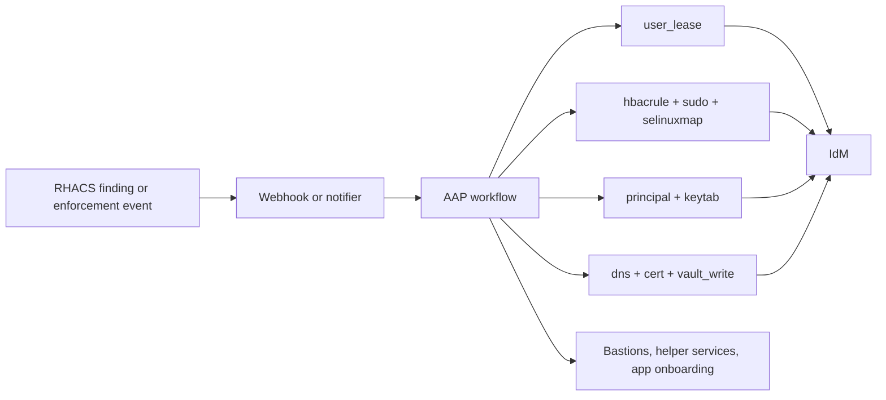



# OpenShift RHACS Use Cases

Related docs:

<a href="https://gprocunier.github.io/eigenstate-ipa/openshift-primer.html"><kbd>&nbsp;&nbsp;OPENSHIFT ECOSYSTEM PRIMER&nbsp;&nbsp;</kbd></a>
<a href="https://gprocunier.github.io/eigenstate-ipa/aap-integration.html"><kbd>&nbsp;&nbsp;AAP INTEGRATION&nbsp;&nbsp;</kbd></a>
<a href="https://gprocunier.github.io/eigenstate-ipa/openshift-operator-use-cases.html"><kbd>&nbsp;&nbsp;OPENSHIFT OPERATOR USE CASES&nbsp;&nbsp;</kbd></a>
<a href="https://gprocunier.github.io/eigenstate-ipa/openshift-developer-use-cases.html"><kbd>&nbsp;&nbsp;OPENSHIFT DEVELOPER USE CASES&nbsp;&nbsp;</kbd></a>
<a href="https://gprocunier.github.io/eigenstate-ipa/user-lease-use-cases.html"><kbd>&nbsp;&nbsp;USER LEASE USE CASES&nbsp;&nbsp;</kbd></a>
<a href="https://gprocunier.github.io/eigenstate-ipa/documentation-map.html"><kbd>&nbsp;&nbsp;DOCS MAP&nbsp;&nbsp;</kbd></a>

## Purpose

This page is for RHACS operators, platform security teams, and OpenShift
administrators who already know what RHACS can detect and enforce, but still
need the response path to be governed.

RHACS already does the hard cluster-security work:

- build, deploy, and runtime policy evaluation
- admission-time enforcement
- alerting through webhooks and other notifiers
- network baselining and generated policy YAML

The missing piece is usually not another scanner. It is a clean way to connect
security findings to enterprise identity, controlled remediation, and
cluster-adjacent infrastructure.



## 1. Security Findings Become Governed Remediation Jobs

RHACS can already alert by webhook, email, PagerDuty, Jira, or other notifier
integrations. The gap is what happens next.

Without an IdM-aware response path, the remediation often falls back to one of
these bad patterns:

- a generic shell script with copied credentials
- a permanent admin group used for every urgent fix
- a manual handoff where the identity boundary is never explicit

`eigenstate.ipa` makes the AAP job prove that the remediation path is valid
before it touches anything:

- `principal` and `keytab` establish controller-side service identity
- `hbacrule`, `sudo`, and `selinuxmap` confirm the path to the supporting host
- `user_lease` can open a narrow temporary operator window when a human fix is needed

```yaml
---
- name: RHACS violation opens a governed remediation path
  hosts: localhost
  gather_facts: false

  vars:
    ipa_server: idm-01.corp.example.com
    ipa_keytab: /runner/env/ipa/admin.keytab
    ipa_ca: /etc/ipa/ca.crt
    support_principal: HTTP/rhacs-remediation.corp.example.com
    remediation_identity: svc-rhacs-remediation
    target_host: bastion-01.corp.example.com

  tasks:
    - name: Confirm the service principal exists
      ansible.builtin.set_fact:
        principal_state: "{{ lookup('eigenstate.ipa.principal',
                              support_principal,
                              server=ipa_server,
                              kerberos_keytab=ipa_keytab,
                              verify=ipa_ca) }}"

    - name: Confirm HBAC would allow the remediation path
      ansible.builtin.set_fact:
        access_state: "{{ lookup('eigenstate.ipa.hbacrule',
                           remediation_identity,
                           operation='test',
                           targethost=target_host,
                           service='sshd',
                           server=ipa_server,
                           kerberos_keytab=ipa_keytab,
                           verify=ipa_ca) }}"

    - name: Refuse remediation when the identity boundary is wrong
      ansible.builtin.assert:
        that:
          - principal_state.exists
          - not access_state.denied
        fail_msg: "RHACS remediation cannot proceed until the IdM boundary is ready."
```

## 2. Multi-Domain RHACS Access Stops Depending On Local User Sprawl

In a multi-AD estate, RHACS access gets messy quickly if the product is treated
as its own identity island.

The cleaner model is to let RHACS consume the same upstream identity path that
OpenShift already trusts:

- Keycloak sits in front of the cluster login path
- IdM brokers trust with the AD domains
- RHACS consumes OIDC, SAML, or OpenShift auth backed by that same estate
- RHACS access rules map groups and metadata instead of local user sprawl

That makes cross-domain triage and separation of duties more reasonable.
It also means the same group change in IdM can affect OpenShift, Keycloak, and
RHACS access together instead of creating three different access tickets.

## 3. RHACS Enforcement Is Easier To Turn On When Service Onboarding Is Mechanical

Security teams often delay stronger RHACS enforcement because application teams
still bootstrap service identity by hand.

That leads to a predictable failure mode:

- RHACS blocks a deployment that is missing something important
- the team bypasses or weakens the policy because the fix path is painful
- the platform learns that enforcement is politically expensive

The better answer is to make the preconditions mechanical before the policy is
strict:

- `principal` verifies that the service identity exists
- `dns` verifies that the name state is already in place
- `cert` issues the certificate when the identity boundary is valid
- `vault_write` archives the resulting material for the deployment flow

That does not make RHACS less strict. It makes the secure path less brittle.

```yaml
---
- name: Pre-flight before enforcing stricter service policy
  hosts: localhost
  gather_facts: false

  vars:
    ipa_server: idm-01.corp.example.com
    ipa_keytab: /runner/env/ipa/admin.keytab
    ipa_ca: /etc/ipa/ca.crt
    app_zone: internal.apps.corp.example.com
    app_name: payments-api
    app_fqdn: payments-api.internal.apps.corp.example.com
    service_principal: "HTTP/{{ app_fqdn }}"

  tasks:
    - name: Confirm DNS exists
      ansible.builtin.set_fact:
        dns_record: "{{ lookup('eigenstate.ipa.dns',
                        app_name,
                        zone=app_zone,
                        server=ipa_server,
                        kerberos_keytab=ipa_keytab,
                        verify=ipa_ca) }}"

    - name: Confirm the service principal exists
      ansible.builtin.set_fact:
        principal_state: "{{ lookup('eigenstate.ipa.principal',
                              service_principal,
                              server=ipa_server,
                              kerberos_keytab=ipa_keytab,
                              verify=ipa_ca) }}"

    - name: Refuse enforcement promotion when prerequisites are missing
      ansible.builtin.assert:
        that:
          - dns_record.exists
          - principal_state.exists
        fail_msg: "Identity prerequisites are not ready for {{ app_fqdn }}."
```

## 4. Temporary Exception Work Can Expire In IdM Instead Of Living In Tickets

Some RHACS alerts do need a temporary exception window.
That does not mean the answer has to be a permanent admin role with a reminder
in Jira.

When a human operator really needs short-lived access to investigate or repair
something, `user_lease` gives the job a hard identity boundary:

- AAP opens the temporary access window
- IdM enforces the expiry
- cleanup becomes hygiene instead of the primary control

That is a better answer than keeping a standing exception just because the
security incident path is operationally awkward.

## 5. Network Policy Generation Becomes A Promotion Workflow, Not A Guessing Exercise

RHACS can generate and simulate network policy YAML from observed traffic and
network baselines. That is already valuable.

The extra value from the surrounding IdM stack is not that it writes the
`NetworkPolicy` objects for RHACS. It is that the surrounding promotion and
validation work can be controlled:

- the operator access used to test or apply the generated policy can be leased
- supporting bastion or helper-service access can be pre-flight checked
- related service onboarding state can be verified before the new policy is promoted

That turns RHACS network policy output into something closer to a governed
change workflow instead of a one-off export from the UI.

The controller-side shape looks more like this:

1. RHACS produces the finding or generated policy.
2. AAP validates the supporting identity path first.
3. A temporary operator lease is opened only for the review window.
4. The policy is applied or rejected while the lease is still active.
5. IdM closes the operator path when the review ends.

```yaml
---
- name: RHACS policy promotion gate
  hosts: localhost
  gather_facts: false

  vars:
    ipa_server: idm-01.corp.example.com
    ipa_keytab: /runner/env/ipa/admin.keytab
    ipa_ca: /etc/ipa/ca.crt
    remediation_identity: svc-rhacs-remediation
    review_identity: appsec-review
    target_host: bastion-01.corp.example.com

  tasks:
    - name: Confirm the review host path is allowed
      ansible.builtin.set_fact:
        access_state: "{{ lookup('eigenstate.ipa.hbacrule',
                           review_identity,
                           operation='test',
                           targethost=target_host,
                           service='sshd',
                           server=ipa_server,
                           kerberos_keytab=ipa_keytab,
                           verify=ipa_ca) }}"

    - name: Open a temporary review window for the policy change
      eigenstate.ipa.user_lease:
        username: "{{ review_identity }}"
        principal_expiration: "00:30"
        password_expiration_matches_principal: true
        require_groups:
          - rhacs-reviewers
        server: "{{ ipa_server }}"
        kerberos_keytab: "{{ ipa_keytab }}"
        ipaadmin_principal: lease-operator
        verify: "{{ ipa_ca }}"
      when:
        - not access_state.denied
```

That gives RHACS a real human-review boundary instead of an always-on exception
path.

## Read Next

- for the broader OpenShift framing:
  <a href="https://gprocunier.github.io/eigenstate-ipa/openshift-primer.html"><kbd>OPENSHIFT ECOSYSTEM PRIMER</kbd></a>
- for the operator workflows that often sit behind RHACS alerts:
  <a href="https://gprocunier.github.io/eigenstate-ipa/openshift-operator-use-cases.html"><kbd>OPENSHIFT OPERATOR USE CASES</kbd></a>
- for the controller-side execution model:
  <a href="https://gprocunier.github.io/eigenstate-ipa/aap-integration.html"><kbd>AAP INTEGRATION</kbd></a>


