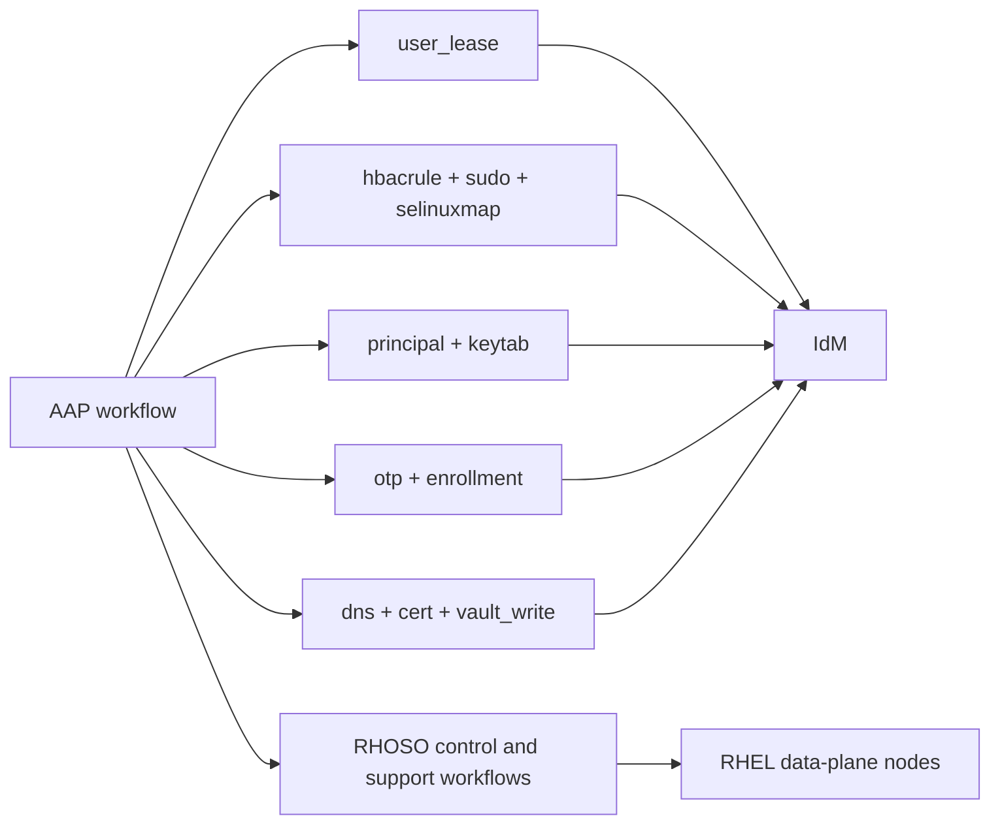



# RHOSO Operator Use Cases

Related docs:

<a href="https://gprocunier.github.io/eigenstate-ipa/openshift-rhoso-use-cases.html"><kbd>&nbsp;&nbsp;OPENSHIFT RHOSO USE CASES&nbsp;&nbsp;</kbd></a>
<a href="https://gprocunier.github.io/eigenstate-ipa/openshift-primer.html"><kbd>&nbsp;&nbsp;OPENSHIFT ECOSYSTEM PRIMER&nbsp;&nbsp;</kbd></a>
<a href="https://gprocunier.github.io/eigenstate-ipa/aap-integration.html"><kbd>&nbsp;&nbsp;AAP INTEGRATION&nbsp;&nbsp;</kbd></a>
<a href="https://gprocunier.github.io/eigenstate-ipa/user-lease-use-cases.html"><kbd>&nbsp;&nbsp;USER LEASE USE CASES&nbsp;&nbsp;</kbd></a>
<a href="https://gprocunier.github.io/eigenstate-ipa/otp-use-cases.html"><kbd>&nbsp;&nbsp;OTP USE CASES&nbsp;&nbsp;</kbd></a>
<a href="https://gprocunier.github.io/eigenstate-ipa/documentation-map.html"><kbd>&nbsp;&nbsp;DOCS MAP&nbsp;&nbsp;</kbd></a>

## Purpose

This page is for RHOSO cloud operators who already know the platform and want
the operator-side value of IdM plus `eigenstate.ipa` to be concrete.

The useful theme is simple:

- RHOSO already owns the cloud platform lifecycle
- AAP can run the surrounding enterprise workflow
- IdM can provide the identity, policy, and supporting-state boundary

That makes cloud operations less dependent on standing admin rights, copied
credentials, and guessed host state.



## 1. Maintenance Access Can Expire With The Window

Cloud operators still need elevated access for maintenance, support, and break-fix work.
The bad version of that story is a permanent admin membership or a shared
credential that everyone promises to clean up later.

`user_lease` gives the maintenance window a hard identity boundary:

- AAP opens the operator access window
- IdM enforces the expiry
- cleanup becomes hygiene instead of the primary control

That is useful in RHOSO because maintenance often stretches across the control
plane, bastions, and data-plane support hosts. A real expiry boundary is easier
to defend than a standing exception.

## 2. Data-Plane Work Can Prove The Host Access Path First

RHOSO already has an Ansible-shaped relationship with RHEL data-plane nodes.
The recurring question is whether the operator path into those hosts is
actually valid before the change starts.

That is where the read-only policy surfaces matter:

- `hbacrule` can test whether the login path is allowed
- `sudo` can confirm the privilege boundary on the host
- `selinuxmap` can confirm the expected confinement model

That turns “we think the support path is ready” into a controller-side check.

```yaml
---
- name: Pre-flight gate before RHOSO maintenance
  hosts: localhost
  gather_facts: false

  vars:
    ipa_server: idm-01.corp.example.com
    ipa_keytab: /runner/env/ipa/admin.keytab
    ipa_ca: /etc/ipa/ca.crt
    operator_identity: svc-rhoso-maint
    target_host: compute-17.example.com

  tasks:
    - name: Confirm HBAC would allow the maintenance login
      ansible.builtin.set_fact:
        access_state: "{{ lookup('eigenstate.ipa.hbacrule',
                           operator_identity,
                           operation='test',
                           targethost=target_host,
                           service='sshd',
                           server=ipa_server,
                           kerberos_keytab=ipa_keytab,
                           verify=ipa_ca) }}"

    - name: Confirm sudo policy exists for the maintenance boundary
      ansible.builtin.set_fact:
        sudo_rules: "{{ lookup('eigenstate.ipa.sudo',
                         object_type='rule',
                         operation='find',
                         criteria=operator_identity,
                         server=ipa_server,
                         kerberos_keytab=ipa_keytab,
                         verify=ipa_ca) }}"

    - name: Refuse maintenance when the IdM path is not ready
      ansible.builtin.assert:
        that:
          - not access_state.denied
          - sudo_rules | length > 0
        fail_msg: "RHOSO maintenance cannot proceed until the IdM access boundary is ready."
```

## 3. Supporting Services Around The Cloud Stop Being Side Work

A RHOSO deployment usually has more than OpenStack services themselves:

- helper endpoints
- API names
- internal routes
- certificates
- controller-side service identities for support automation

Those are exactly the pieces that drift into side channels.

The cleaner controller path is:

- `dns` proves the name state exists
- `principal` proves the service identity exists
- `cert` issues or retrieves the certificate for that identity
- `vault_write` archives the resulting bundle when the workflow needs it

That does not replace RHOSO service design. It makes the supporting identity
and PKI work less fragile.

## 4. Day-One Support Hosts And Utility VMs Can Join Identity Early

Cloud operations often bring up utility VMs or support nodes that live next to
the main platform but still need to be reachable and governed.

That is a good fit for `otp`:

- AAP generates the one-time host enrollment credential
- the official IdM modules or roles perform the actual enrollment
- inventory and policy then reflect the host as part of the same identity estate

That keeps supporting infrastructure from starting life outside the policy boundary.

## 5. Kerberos Service Identity Is Better Than Shared Admin Material

Support automation around the cloud often ends up with copied passwords or
long-lived bootstrap secrets because nobody stops to define a better identity shape.

The stronger operator pattern is:

- create a dedicated service principal for the controller-side workflow
- use `keytab` to retrieve the service identity when the job runs
- retire or rotate the material when the workflow boundary changes

That is particularly useful for helper services and bastion-side automation
that should look like a real machine identity rather than a borrowed admin user.

## Read Next

- for the RHOSO branch overview:
  <a href="https://gprocunier.github.io/eigenstate-ipa/openshift-rhoso-use-cases.html"><kbd>OPENSHIFT RHOSO USE CASES</kbd></a>
- for the tenant-side identity story:
  <a href="https://gprocunier.github.io/eigenstate-ipa/openshift-rhoso-tenant-use-cases.html"><kbd>RHOSO TENANT USE CASES</kbd></a>
- for the broader controller model:
  <a href="https://gprocunier.github.io/eigenstate-ipa/aap-integration.html"><kbd>AAP INTEGRATION</kbd></a>


