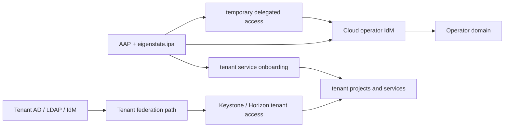



# RHOSO Tenant Use Cases

Related docs:

<a href="https://gprocunier.github.io/eigenstate-ipa/openshift-rhoso-use-cases.html"><kbd>&nbsp;&nbsp;OPENSHIFT RHOSO USE CASES&nbsp;&nbsp;</kbd></a>
<a href="https://gprocunier.github.io/eigenstate-ipa/openshift-primer.html"><kbd>&nbsp;&nbsp;OPENSHIFT ECOSYSTEM PRIMER&nbsp;&nbsp;</kbd></a>
<a href="https://gprocunier.github.io/eigenstate-ipa/openshift-developer-use-cases.html"><kbd>&nbsp;&nbsp;OPENSHIFT DEVELOPER USE CASES&nbsp;&nbsp;</kbd></a>
<a href="https://gprocunier.github.io/eigenstate-ipa/aap-integration.html"><kbd>&nbsp;&nbsp;AAP INTEGRATION&nbsp;&nbsp;</kbd></a>
<a href="https://gprocunier.github.io/eigenstate-ipa/user-lease-use-cases.html"><kbd>&nbsp;&nbsp;USER LEASE USE CASES&nbsp;&nbsp;</kbd></a>
<a href="https://gprocunier.github.io/eigenstate-ipa/documentation-map.html"><kbd>&nbsp;&nbsp;DOCS MAP&nbsp;&nbsp;</kbd></a>

## Purpose

This page is for RHOSO tenant operators, delegated domain administrators, and
hosted-project teams who need the tenant-side identity story to stay clean.

The main idea is that the tenant domain does not have to inherit the cloud
operator's identity model.

A credible tenant posture can look like this:

- the cloud operator keeps its own administrative domain
- a tenant brings its own AD, LDAP, IdM, or federation path
- Keystone maps those domains and federation choices into tenant access
- AAP uses `eigenstate.ipa` for the surrounding access, onboarding, and service-artifact workflows



## 1. Hosted Tenants Do Not Need To Become Local Keystone User Sprawl

A hosted cloud gets messy when every tenant access exception turns into local
users, one-off mappings, and duplicated group logic.

The stronger pattern is to keep a real upstream identity source:

- the tenant uses its own AD, LDAP, IdM, or federation layer
- Keystone consumes that tenant-facing identity model through its domain and federation mechanisms
- the operator domain remains separate from the tenant domain

That does not eliminate tenant design work. It does avoid turning hosted
tenants into a pile of local identities living only in the cloud.

## 2. Tenant Administration Can Still Be Temporary And Governed

Hosted tenants and delegated domain administrators still need occasional
elevated access for migration, onboarding, and support work.

That is where `user_lease` still fits:

- AAP opens a narrow administrative window
- IdM enforces the expiry for the operator-side identity that is handling the change
- the tenant task does not require a standing privileged operator account

This is especially useful when the cloud operator must intervene on behalf of a
tenant but should not keep that access after the work ends.

## 3. Tenant-Facing Service Onboarding Can Be Mechanical

Tenant applications and cloud-adjacent services still need boring but important work:

- names
- certificates
- service identities
- archive points for bootstrap material

Those supporting artifacts are a good fit for controller-side automation:

- `principal` proves the service identity exists
- `dns` proves the expected name state exists
- `cert` issues or retrieves the matching certificate
- `vault_write` archives the resulting bundle when the tenant workflow needs a controlled handoff

That makes tenant onboarding less dependent on ticket handoffs between the
cloud, PKI, and identity teams.

```yaml
---
- name: Tenant-facing service onboarding gate
  hosts: localhost
  gather_facts: false

  vars:
    ipa_server: idm-01.corp.example.com
    ipa_keytab: /runner/env/ipa/admin.keytab
    ipa_ca: /etc/ipa/ca.crt
    app_zone: tenant-a.apps.example.com
    app_name: image-api
    app_fqdn: image-api.tenant-a.apps.example.com
    service_principal: "HTTP/{{ app_fqdn }}"

  tasks:
    - name: Confirm tenant-facing DNS exists
      ansible.builtin.set_fact:
        dns_record: "{{ lookup('eigenstate.ipa.dns',
                        app_name,
                        zone=app_zone,
                        server=ipa_server,
                        kerberos_keytab=ipa_keytab,
                        verify=ipa_ca) }}"

    - name: Confirm the service principal exists
      ansible.builtin.set_fact:
        principal_state: "{{ lookup('eigenstate.ipa.principal',
                              service_principal,
                              server=ipa_server,
                              kerberos_keytab=ipa_keytab,
                              verify=ipa_ca) }}"

    - name: Refuse onboarding when the identity boundary is incomplete
      ansible.builtin.assert:
        that:
          - dns_record.exists
          - principal_state.exists
        fail_msg: "Tenant-facing onboarding cannot proceed until the IdM boundary is ready."
```

## 4. Tenant Identity Can Be Different Without Making Operations Blind

One tenant might use its own AD forest.
Another might already standardize on IdM.
Another might front the web SSO path through Keycloak or another federation layer.

That does not make the operator workflows meaningless.

The operator still benefits from:

- a clean IdM boundary for temporary operator access
- controller-side pre-flight checks before touching supporting infrastructure
- service identity, DNS, and certificate workflows that stay inside the automation boundary

So the tenant domain can vary without making the surrounding cloud operations
turn back into shell scripts and static lists.

## 5. Tenant Handoff Is Easier When The Controller Proves The Pieces First

The practical tenant flow is usually not “log in and hope the federation path is
correct.” It is:

1. confirm the tenant-side identity source exists
2. confirm the service identity or app-facing principal exists
3. open any short-lived operator window needed for the handoff
4. archive the resulting support material where the operator can recover it later

That keeps the cloud team from handing off a partially assembled tenant setup.

```yaml
---
- name: Prove a tenant handoff boundary before opening access
  hosts: localhost
  gather_facts: false

  vars:
    ipa_server: idm-01.corp.example.com
    ipa_keytab: /runner/env/ipa/admin.keytab
    ipa_ca: /etc/ipa/ca.crt
    tenant_domain: tenant-a.example.com
    tenant_app: image-api
    tenant_principal: "HTTP/{{ tenant_app }}.{{ tenant_domain }}"
    tenant_operator: svc-tenant-a-support

  tasks:
    - name: Confirm the tenant-facing service principal exists
      ansible.builtin.set_fact:
        principal_state: "{{ lookup('eigenstate.ipa.principal',
                              tenant_principal,
                              server=ipa_server,
                              kerberos_keytab=ipa_keytab,
                              verify=ipa_ca) }}"

    - name: Confirm the operator can reach the support path
      ansible.builtin.set_fact:
        access_state: "{{ lookup('eigenstate.ipa.hbacrule',
                           tenant_operator,
                           operation='test',
                           targethost='bastion-01.corp.example.com',
                           service='sshd',
                           server=ipa_server,
                           kerberos_keytab=ipa_keytab,
                           verify=ipa_ca) }}"

    - name: Open a temporary operator window when the tenant boundary is ready
      eigenstate.ipa.user_lease:
        username: "{{ tenant_operator }}"
        principal_expiration: "01:00"
        password_expiration_matches_principal: true
        require_groups:
          - tenant-a-lease-targets
        server: "{{ ipa_server }}"
        kerberos_keytab: "{{ ipa_keytab }}"
        ipaadmin_principal: lease-operator
        verify: "{{ ipa_ca }}"
      when:
        - principal_state.exists
        - not access_state.denied
```

This version is more useful than a generic support ticket because the tenant
handoff is tied to a visible identity boundary and the temporary access dies
with the work.

## Read Next

- for the RHOSO branch overview:
  <a href="https://gprocunier.github.io/eigenstate-ipa/openshift-rhoso-use-cases.html"><kbd>OPENSHIFT RHOSO USE CASES</kbd></a>
- for the cloud-operator side of the same platform:
  <a href="https://gprocunier.github.io/eigenstate-ipa/openshift-rhoso-operator-use-cases.html"><kbd>RHOSO OPERATOR USE CASES</kbd></a>
- for the broader developer and app-team lens:
  <a href="https://gprocunier.github.io/eigenstate-ipa/openshift-developer-use-cases.html"><kbd>OPENSHIFT DEVELOPER USE CASES</kbd></a>


