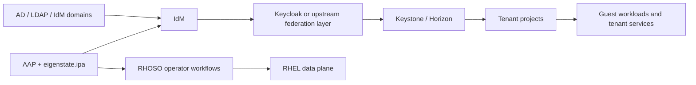



# OpenShift RHOSO Use Cases

Related docs:

<a href="https://gprocunier.github.io/eigenstate-ipa/openshift-primer.html"><kbd>&nbsp;&nbsp;OPENSHIFT ECOSYSTEM PRIMER&nbsp;&nbsp;</kbd></a>
<a href="https://gprocunier.github.io/eigenstate-ipa/openshift-rhoso-operator-use-cases.html"><kbd>&nbsp;&nbsp;RHOSO OPERATOR USE CASES&nbsp;&nbsp;</kbd></a>
<a href="https://gprocunier.github.io/eigenstate-ipa/openshift-rhoso-tenant-use-cases.html"><kbd>&nbsp;&nbsp;RHOSO TENANT USE CASES&nbsp;&nbsp;</kbd></a>
<a href="https://gprocunier.github.io/eigenstate-ipa/aap-integration.html"><kbd>&nbsp;&nbsp;AAP INTEGRATION&nbsp;&nbsp;</kbd></a>
<a href="https://gprocunier.github.io/eigenstate-ipa/ephemeral-access-capabilities.html"><kbd>&nbsp;&nbsp;EPHEMERAL ACCESS CAPABILITIES&nbsp;&nbsp;</kbd></a>
<a href="https://gprocunier.github.io/eigenstate-ipa/documentation-map.html"><kbd>&nbsp;&nbsp;DOCS MAP&nbsp;&nbsp;</kbd></a>

## Purpose

This page is the RHOSO branch off the OpenShift ecosystem primer.

Use it when the question is not how to run OpenStack itself, but how IdM,
enterprise identity, and AAP improve the workflows around a RHOSO deployment.

The useful split is:

- operator-domain workflows for the cloud control plane and RHEL data-plane estate
- tenant-domain workflows for hosted projects, delegated domains, and tenant-facing identity

That distinction matters because RHOSO has more than one identity boundary.
The cloud operator domain and the tenant domain do not need to collapse into
the same trust model.

## Why RHOSO Fits The Ecosystem Story

RHOSO already has the pieces that make this conversation real:

- an OpenShift-based control plane
- Ansible-managed RHEL data-plane nodes
- Keystone domain and federation patterns
- clear operator, tenant, and guest trust boundaries

`eigenstate.ipa` is not replacing Keystone or the OpenStack Operator.
It makes the surrounding identity, access, onboarding, DNS, certificate, and
temporary-elevation work more mechanical.



## 1. The Operator Domain Has Real Identity Work Around The Cloud

The cloud operator already has tools for deploying and maintaining RHOSO.
The friction usually shows up around the surrounding estate:

- who is allowed to touch the control or support path
- how temporary elevation is bounded
- whether the RHEL data-plane hosts are already in the right identity and policy state
- whether supporting DNS, certificate, and service identity artifacts are ready

That is where IdM plus `eigenstate.ipa` adds value.

Continue to
<a href="https://gprocunier.github.io/eigenstate-ipa/openshift-rhoso-operator-use-cases.html"><kbd>RHOSO OPERATOR USE CASES</kbd></a>.

## 2. The Tenant Domain Does Not Need To Inherit The Operator Identity Model

A hosted RHOSO deployment often has a second identity problem:

- the cloud operator has one administrative domain
- one or more tenants have their own AD, LDAP, IdM, or Keycloak-backed federation path
- Horizon or tenant-facing APIs still need a coherent access model

That is where the tenant-side story matters.

Continue to
<a href="https://gprocunier.github.io/eigenstate-ipa/openshift-rhoso-tenant-use-cases.html"><kbd>RHOSO TENANT USE CASES</kbd></a>.

## 3. AAP Is The Workflow Engine, Not The Product Boundary

RHOSO already has its own operator-driven lifecycle and Ansible involvement.
The useful AAP role is the work around that lifecycle:

- controller-side pre-flight checks before maintenance or supporting changes
- temporary-access windows for operator or tenant administration
- supporting service onboarding for DNS, PKI, and automation identity
- repeatable handoff jobs between the cloud boundary and the enterprise identity boundary

That keeps the story honest:

- RHOSO owns the cloud platform
- Keystone owns cloud identity and domains
- AAP runs the governed job
- IdM provides the identity, policy, and service-state truth that the job needs

## 4. RHOSO Maintenance Jobs Should Prove The Support Boundary First

A RHOSO support job is cleaner when the controller proves the operator path
before it opens a maintenance window.

That usually looks like:

1. test whether the bastion or data-plane login path is allowed
2. open a short lease only for the approved maintenance window
3. let the job complete while the IdM cutoff is still active
4. let the lease expire when the work ends

```yaml
---
- name: Gate a RHOSO maintenance window through IdM first
  hosts: localhost
  gather_facts: false

  vars:
    ipa_server: idm-01.corp.example.com
    ipa_keytab: /runner/env/ipa/admin.keytab
    ipa_ca: /etc/ipa/ca.crt
    operator_identity: svc-rhoso-maint
    target_host: compute-17.example.com

  tasks:
    - name: Confirm the support login path is allowed
      ansible.builtin.set_fact:
        access_state: "{{ lookup('eigenstate.ipa.hbacrule',
                           operator_identity,
                           operation='test',
                           targethost=target_host,
                           service='sshd',
                           server=ipa_server,
                           kerberos_keytab=ipa_keytab,
                           verify=ipa_ca) }}"

    - name: Open a short maintenance lease when the path is ready
      eigenstate.ipa.user_lease:
        username: "{{ operator_identity }}"
        principal_expiration: "01:00"
        password_expiration_matches_principal: true
        require_groups:
          - rhoso-maint-targets
        server: "{{ ipa_server }}"
        kerberos_keytab: "{{ ipa_keytab }}"
        ipaadmin_principal: lease-operator
        verify: "{{ ipa_ca }}"
      when:
        - not access_state.denied
```

That keeps the broad RHOSO branch tied to a real operator action instead of
only describing the surrounding identity model.

## Read Next

- for the cloud-operator side:
  <a href="https://gprocunier.github.io/eigenstate-ipa/openshift-rhoso-operator-use-cases.html"><kbd>RHOSO OPERATOR USE CASES</kbd></a>
- for hosted-tenant and delegated-domain patterns:
  <a href="https://gprocunier.github.io/eigenstate-ipa/openshift-rhoso-tenant-use-cases.html"><kbd>RHOSO TENANT USE CASES</kbd></a>
- for the broader OpenShift ecosystem framing:
  <a href="https://gprocunier.github.io/eigenstate-ipa/openshift-primer.html"><kbd>OPENSHIFT ECOSYSTEM PRIMER</kbd></a>
- for the controller execution model behind these jobs:
  <a href="https://gprocunier.github.io/eigenstate-ipa/aap-integration.html"><kbd>AAP INTEGRATION</kbd></a>


