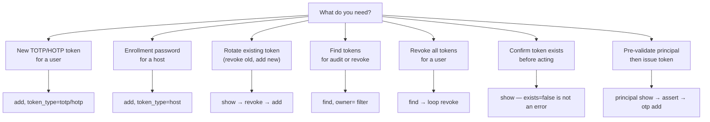
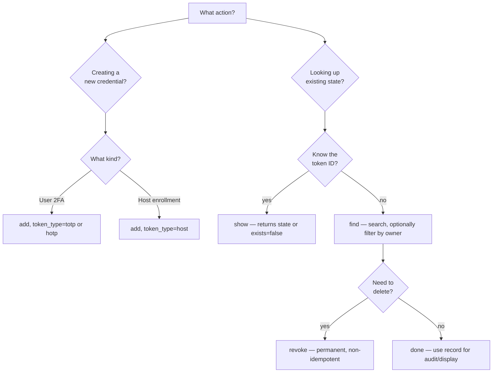
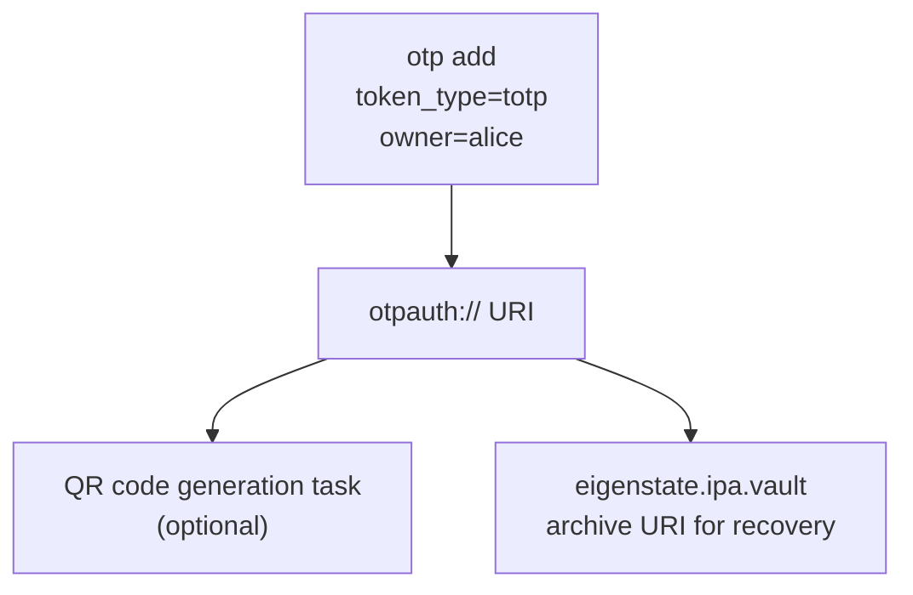
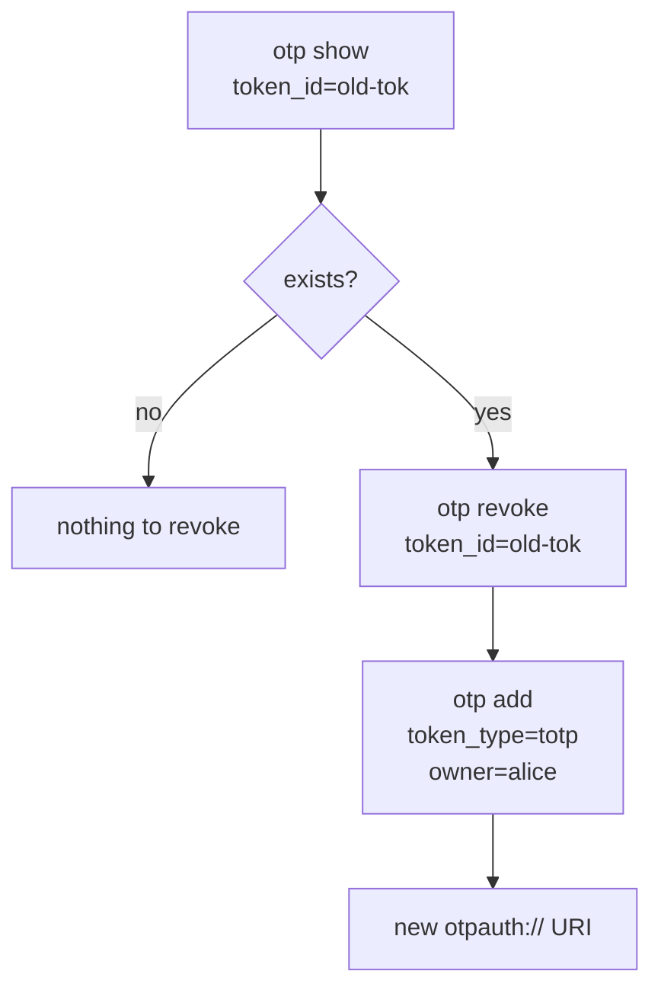
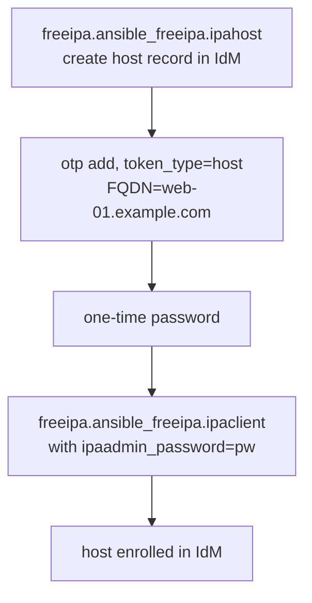
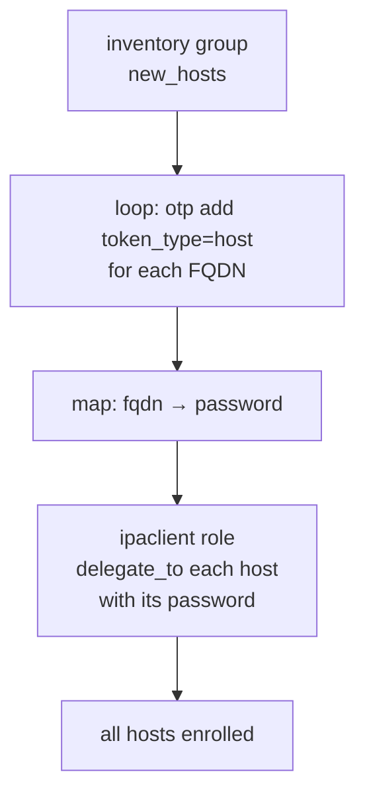
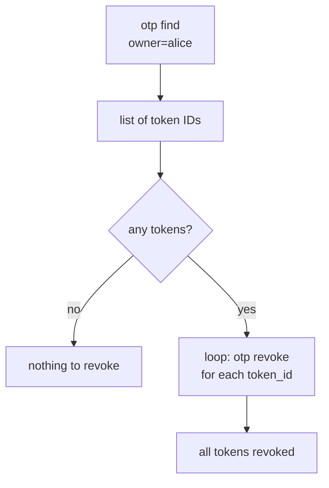
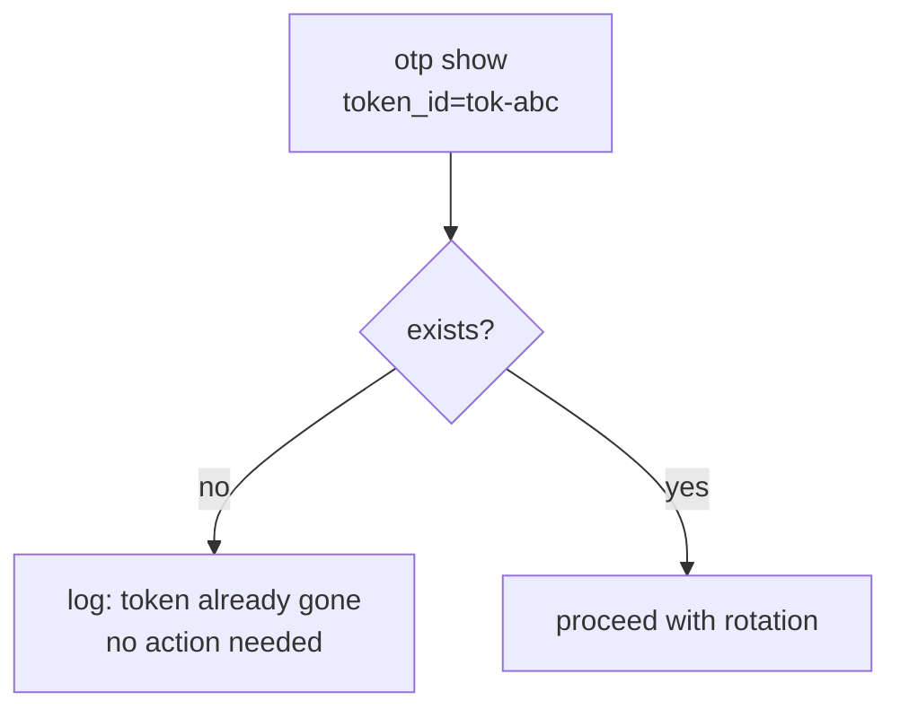
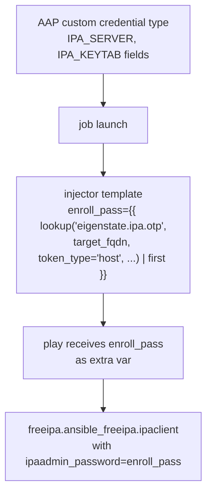
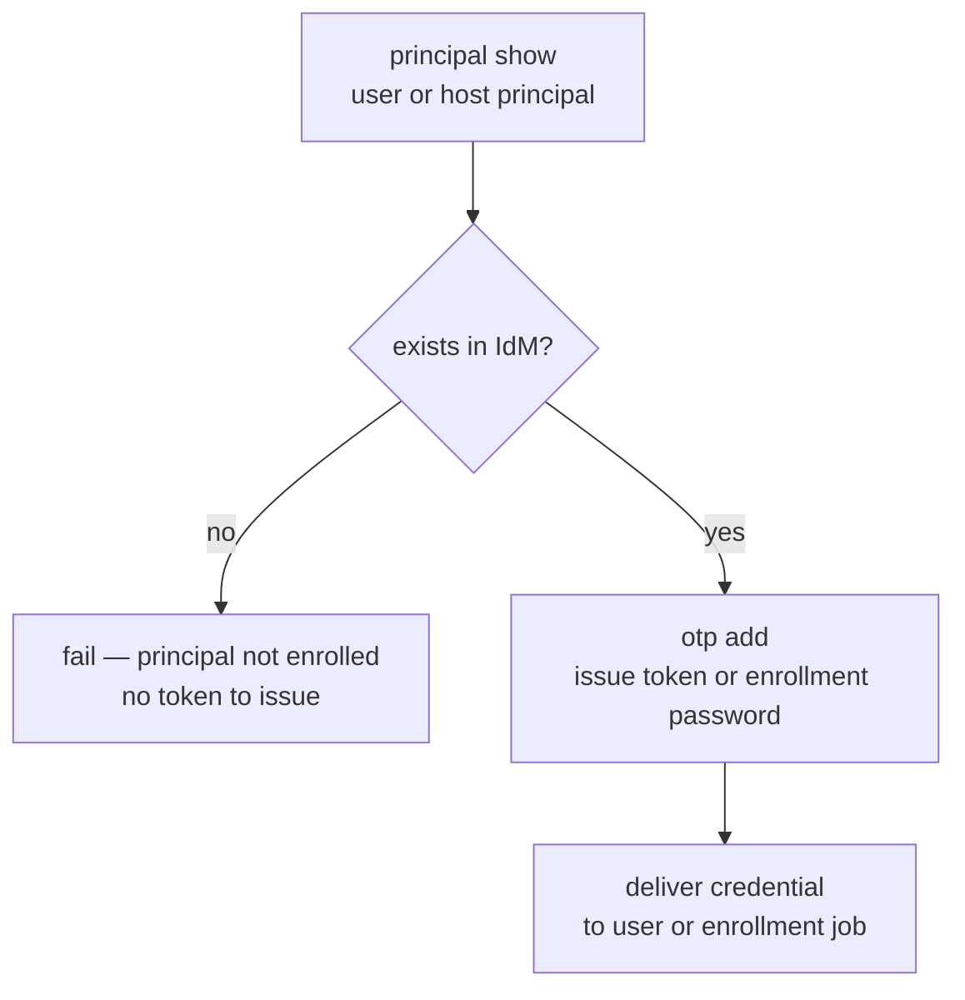



# OTP Capabilities

Related docs:

<a href="https://gprocunier.github.io/eigenstate-ipa/otp-plugin.html"><kbd>&nbsp;&nbsp;OTP PLUGIN&nbsp;&nbsp;</kbd></a>
<a href="https://gprocunier.github.io/eigenstate-ipa/otp-use-cases.html"><kbd>&nbsp;&nbsp;OTP USE CASES&nbsp;&nbsp;</kbd></a>
<a href="https://gprocunier.github.io/eigenstate-ipa/principal-capabilities.html"><kbd>&nbsp;&nbsp;PRINCIPAL CAPABILITIES&nbsp;&nbsp;</kbd></a>
<a href="https://gprocunier.github.io/eigenstate-ipa/documentation-map.html"><kbd>&nbsp;&nbsp;DOCS MAP&nbsp;&nbsp;</kbd></a>

## Purpose

Use this guide to choose the right OTP credential pattern for your automation.

It is the companion to the OTP plugin reference. Use the reference for exact
option syntax; use this guide when you are designing a workflow and need to
know which capability fits your situation.

## Contents

- [Capability Model](#capability-model)
- [Token Type Decision](#token-type-decision)
- [Operation Decision](#operation-decision)
- [1. Provision User TOTP Token](#1-provision-user-totp-token)
- [2. Rotate Existing User Token](#2-rotate-existing-user-token)
- [3. Host Enrollment Credential Delivery](#3-host-enrollment-credential-delivery)
- [4. Bulk Host Enrollment](#4-bulk-host-enrollment)
- [5. Emergency Revoke All Tokens for a User](#5-emergency-revoke-all-tokens-for-a-user)
- [6. Pre-flight Token Existence Check](#6-pre-flight-token-existence-check)
- [7. AAP Credential Type Injection](#7-aap-credential-type-injection)
- [8. Cross-Plugin: Principal Check Before Token Issuance](#8-cross-plugin-principal-check-before-token-issuance)
- [Quick Decision Matrix](#quick-decision-matrix)

## Capability Model

The OTP plugin is a write-capable credential primitive. `add` and `revoke`
change IdM state. `find` and `show` are read-only.

## Token Type Decision

| Type | When to use | IdM object created | URI returned |
| --- | --- | --- | --- |
| `totp` | Standard 2FA for users; works with authenticator apps (Google Authenticator, FreeOTP, etc.) | Yes — persistent token record | Yes — `otpauth://totp/...` |
| `hotp` | Counter-based OTP for hardware tokens or offline use cases | Yes — persistent token record | Yes — `otpauth://hotp/...` |
| `host` | One-time enrollment password for `ipa-client-install` or ansible-freeipa | No — password is ephemeral | No — plain text password |

When in doubt, use `totp`. It is the most widely supported and the default.

Use `hotp` only if the target authenticator does not support TOTP or if the
use case requires counter-based semantics.

Use `host` when automating host enrollment. The password is consumed by
`ipa-client-install` and does not persist in IdM.

## Operation Decision

## 1. Provision User TOTP Token

Use `operation=add` with `token_type=totp` (default) to create a new 2FA token for
a user. The result is an `otpauth://` URI suitable for QR code generation or
direct import into an authenticator app.

The token is active immediately. The user can add it to any TOTP-compatible
authenticator. IdM will require this token as a second factor on next login
if the user's auth policy requires OTP.

Use `description` to label tokens when a user may have more than one (work
device vs personal device, primary vs backup).

## 2. Rotate Existing User Token

To replace a token without leaving the old one active:

1. Use `show` to confirm the old token ID exists.
2. Use `revoke` to delete it.
3. Use `add` to issue a new one.

Why this order: revoke before add ensures the user cannot authenticate with
both the old and new token simultaneously during the rotation window.

## 3. Host Enrollment Credential Delivery

Use `operation=add`, `token_type=host` to generate a one-time enrollment password
for a host, then pass it to `freeipa.ansible_freeipa.ipaclient`.

The host record must already exist in IdM before calling `token_type=host`. The
`ipahost` module creates the record; `otp add token_type=host` then sets the
enrollment password on it.

After `ipaclient` consumes the password, the host is enrolled and the
credential is invalidated. No cleanup is needed.

## 4. Bulk Host Enrollment

Loop `operation=add`, `token_type=host` over an inventory group to generate
enrollment passwords for multiple hosts at once. Pair the result map with
`freeipa.ansible_freeipa.ipaclient` using `delegate_to`.

Use `result_format=map` to get a `{fqdn: password}` dictionary directly.
The map form avoids positional list indexing when correlating passwords back
to host names.

## 5. Emergency Revoke All Tokens for a User

When a user's authenticator is lost, stolen, or compromised, revoke all their
tokens in one play:

1. `find` with `owner=` filter to enumerate the user's token IDs.
2. Loop `revoke` over the result.

After revocation, the user cannot generate valid OTP codes and cannot
authenticate with second-factor requirements until a new token is issued.

## 6. Pre-flight Token Existence Check

Use `operation=show` to check whether a token still exists before rotating
or revoking it. A missing token returns `exists=false` — this is not an
error.

This pattern is useful in idempotent plays that may run multiple times. The
existence check lets the play skip revocation cleanly when the token was
already removed by an earlier run or by an operator.

## 7. AAP Credential Type Injection

Ansible Automation Platform supports custom credential types with injector
templates. An OTP lookup at job launch time generates a fresh enrollment
credential per-run, injecting it as an extra variable without persisting it
to disk.

The credential type stores the IPA server and keytab path. The injector
template calls the OTP lookup at runtime. The enrollment password is never
stored in AAP's credential vault.

## 8. Cross-Plugin: Principal Check Before Token Issuance

Combine `eigenstate.ipa.principal` and `eigenstate.ipa.otp` when issuing a
token for a host or user that may not yet be registered in IdM.

This pattern prevents issuing a token for a username or hostname that IdM
does not have a record for. Without the pre-flight check, `otp add` would
raise a `NotFound` error from ipalib; the principal check produces a cleaner
message earlier.

## Quick Decision Matrix

| Need | Best capability |
| --- | --- |
| Issue a TOTP token for a new user | Provision user TOTP token (#1) |
| Replace a user's compromised or lost token | Rotate existing user token (#2) |
| Automate joining a new host to IdM | Host enrollment credential delivery (#3) |
| Enroll a batch of new hosts | Bulk host enrollment (#4) |
| Revoke all tokens for a user immediately | Emergency revoke all tokens (#5) |
| Check token status before acting | Pre-flight token existence check (#6) |
| Generate enrollment credentials at AAP job launch | AAP credential type injection (#7) |
| Confirm user/host exists before issuing token | Cross-plugin: principal + OTP (#8) |

For option-level behavior, field definitions, and exact lookup syntax, return
to
<a href="https://gprocunier.github.io/eigenstate-ipa/otp-plugin.html"><kbd>OTP PLUGIN</kbd></a>.


