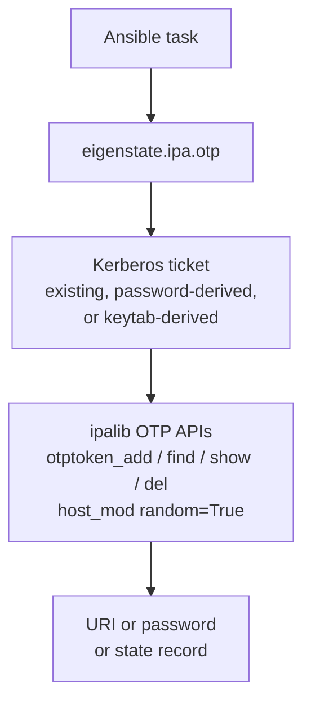

# OTP Plugin

Nearby docs:

<a href="https://gprocunier.github.io/eigenstate-ipa/otp-capabilities.html"><kbd>&nbsp;&nbsp;OTP CAPABILITIES&nbsp;&nbsp;</kbd></a>
<a href="https://gprocunier.github.io/eigenstate-ipa/otp-use-cases.html"><kbd>&nbsp;&nbsp;OTP USE CASES&nbsp;&nbsp;</kbd></a>
<a href="https://gprocunier.github.io/eigenstate-ipa/vault-plugin.html"><kbd>&nbsp;&nbsp;IDM VAULT PLUGIN&nbsp;&nbsp;</kbd></a>
<a href="https://gprocunier.github.io/eigenstate-ipa/aap-integration.html"><kbd>&nbsp;&nbsp;AAP INTEGRATION&nbsp;&nbsp;</kbd></a>
<a href="https://gprocunier.github.io/eigenstate-ipa/documentation-map.html"><kbd>&nbsp;&nbsp;DOCS MAP&nbsp;&nbsp;</kbd></a>

## Purpose

`eigenstate.ipa.otp` generates and manages OTP tokens and host enrollment
passwords in FreeIPA/IdM from Ansible.

This reference covers:

- how the plugin authenticates to IdM
- what token types are supported and when to use each
- how the `add`, `find`, `show`, and `revoke` operations behave
- what fields each result record contains
- how to shape the return value for different playbook patterns

The plugin generates credentials only. It does not perform host enrollment.
Consume host enrollment passwords with
`freeipa.ansible_freeipa.ipaclient` or `freeipa.ansible_freeipa.ipahost`.

## Contents

- [Token Model](#token-model)
- [Host Enrollment Model](#host-enrollment-model)
- [Authentication Model](#authentication-model)
- [Operations](#operations)
- [Options Reference](#options-reference)
- [Result Record Fields](#result-record-fields)
- [Return Shapes](#return-shapes)
- [Security Considerations](#security-considerations)
- [Minimal Examples](#minimal-examples)
- [Failure Boundaries](#failure-boundaries)
- [When To Read The Scenario Guide](#when-to-read-the-scenario-guide)

## Token Model



TOTP and HOTP tokens are stored as IdM objects. When `operation=add` succeeds,
IdM returns an `otpauth://` URI that encodes the shared secret. This URI is
the authenticator seed — it is only present in the `add` response and is never
returned by `find` or `show`.

**URI structure** (TOTP example):

```
otpauth://totp/REALM:username?secret=BASE32SECRET&issuer=REALM&algorithm=SHA1&digits=6&period=30
```

The `secret=` parameter is the raw HMAC key. Treat the full URI as a
credential. Use `no_log: true` on any task that registers or displays it.

## Host Enrollment Model

When `token_type=host`, the plugin calls `host_mod` with `random=True`. IdM sets a
one-time enrollment password on the host record and returns it in
`randompassword`. This password is consumed exactly once by
`ipa-client-install` or by the `freeipa.ansible_freeipa.ipaclient` role.

After the host uses the password to enroll, it is consumed and cannot be
reused. Calling `token_type=host` again generates a fresh password.

The host record must already exist in IdM before calling this plugin. To
create the host record, use the `freeipa.ansible_freeipa.ipahost` module.

## Authentication Model

The lookup always operates with a Kerberos credential cache.

It can get there in three ways:

- `ipaadmin_password`:
  - obtains a ticket before connecting
- `kerberos_keytab`:
  - obtains a ticket non-interactively
- neither password nor keytab:
  - assumes a valid existing ticket is already available

> [!IMPORTANT]
> This plugin requires `python3-ipalib` and `python3-ipaclient` on the
> Ansible controller or execution environment. Install with
> `dnf install python3-ipalib python3-ipaclient`.

TLS behavior:

- `verify: /path/to/ca.crt` enables explicit certificate verification
- omitting `verify` first tries `/etc/ipa/ca.crt`
- if no local IdM CA path is available, the plugin warns and falls back to
  the system CA bundle behavior from `ipalib`

## Operations

| Operation | `_terms` meaning | Result |
| --- | --- | --- |
| `add` (default) | Usernames (totp/hotp) or host FQDNs (host) | New token or enrollment password |
| `find` | Optional substring filter (omit for all tokens) | List of token metadata records |
| `show` | Token unique IDs (`ipatokenuniqueid`) | Token metadata record or `exists=false` |
| `revoke` | Token unique IDs (`ipatokenuniqueid`) | List of revoked token IDs |

**`add`**: Creates a new token for each term. For `token_type=totp` and `token_type=hotp`,
terms are IdM usernames. For `token_type=host`, terms are host FQDNs. Returns the
URI (user tokens) or one-time password (host). Non-idempotent — each call
creates a new token even if the user already has one.

**`find`**: Returns metadata for all tokens visible to the authenticated
principal. An optional search string in `_terms[0]` filters by token ID or
description substring. Use the `owner` option to restrict to a specific user.
The URI is never included in find results.

**`show`**: Returns the metadata record for each token ID given. If a token ID
does not exist, the record includes `exists=false` rather than raising an
error. The URI is never included in show results.

**`revoke`**: Permanently deletes each token by ID. Raises an error if a token
ID does not exist — revocation is not idempotent. To revoke all tokens for a
user, combine `find` with `owner` filter and loop over the result.

## Options Reference

### Standard auth options

| Option | Type | Default | Notes |
| --- | --- | --- | --- |
| `server` | str | — | Required. IPA server FQDN. Env: `IPA_SERVER`. |
| `ipaadmin_principal` | str | `admin` | Kerberos principal for authentication. |
| `ipaadmin_password` | str | — | Password for obtaining a Kerberos ticket. Env: `IPA_ADMIN_PASSWORD`. Secret. |
| `kerberos_keytab` | str | — | Path to a keytab file for non-interactive authentication. Env: `IPA_KEYTAB`. |
| `verify` | str | — | Path to the IPA CA certificate for TLS verification. Env: `IPA_CERT`. |

### OTP-specific options

| Option | Type | Default | Choices | Notes |
| --- | --- | --- | --- | --- |
| `_terms` | list[str] | — | — | Identifiers. See Operations table for per-operation meaning. |
| `operation` | str | `add` | `add`, `find`, `show`, `revoke` | Which operation to perform. |
| `token_type` | str | `totp` | `totp`, `hotp`, `host` | Token type. Only used by `add`. `type` remains an accepted compatibility alias. |
| `algorithm` | str | `sha1` | `sha1`, `sha256`, `sha384`, `sha512` | HMAC algorithm. Only applies to `totp` and `hotp`. |
| `digits` | int | `6` | `6`, `8` | OTP length. Only applies to `totp` and `hotp`. |
| `interval` | int | `30` | — | TOTP time step in seconds. Only meaningful for `token_type=totp`; ignored with a warning for `hotp` and `host`. |
| `owner` | str | — | — | Filter `find` results to this user. Ignored with a warning for other operations. |
| `description` | str | — | — | Token description for `add`. |
| `result_format` | str | `value` (add), `record` (find/show) | `value`, `record`, `map`, `map_record` | Output container shape. |

## Result Record Fields

### User token record (add, find, show)

| Field | Type | Nullable | Notes |
| --- | --- | --- | --- |
| `owner` | str | no | IdM username |
| `token_id` | str | no | `ipatokenuniqueid` — use this for `show` and `revoke` |
| `type` | str | no | `totp` or `hotp` |
| `uri` | str | yes | `otpauth://` URI; **only present on `add`**; `null` in find/show records |
| `algorithm` | str | no | `sha1`, `sha256`, `sha384`, or `sha512` |
| `digits` | int | yes | `6` or `8` |
| `interval` | int or null | yes | TOTP time step; `null` for HOTP tokens |
| `disabled` | bool | no | `true` when token is administratively disabled |
| `description` | str or null | yes | Token description if set |
| `exists` | bool | no | `false` only when `show` hits a missing token ID |

### Host enrollment record (add, token_type=host)

| Field | Type | Notes |
| --- | --- | --- |
| `fqdn` | str | Host FQDN as given in `_terms` |
| `type` | str | Always `host` |
| `password` | str | One-time enrollment password |
| `exists` | bool | Always `true` on successful add |

### Not-found record (show only)

When `operation=show` is given a token ID that does not exist in IdM, it
returns a record with `exists=false` and all other fields set to `null`. No
error is raised.

## Return Shapes

### `value` (default for `add`)

Returns a list of bare secret strings — URI for user tokens, password for
host tokens.

```yaml
uris: "{{ lookup('eigenstate.ipa.otp', 'alice', 'bob',
           server='idm-01.example.com',
           kerberos_keytab='/etc/admin.keytab') }}"
# uris[0] == 'otpauth://totp/...'
# uris[1] == 'otpauth://totp/...'
```

### `record` (default for `find` and `show`)

Returns a list of result dictionaries, one per term.

```yaml
token_records: "{{ lookup('eigenstate.ipa.otp', 'tok-abc123',
                    operation='show',
                    server='idm-01.example.com',
                    kerberos_keytab='/etc/admin.keytab') }}"
# token_records[0].token_id  == 'tok-abc123'
# token_records[0].exists    == true
# token_records[0].owner     == 'alice'
```

### `map`

Returns a dictionary keyed by the primary identifier — `owner` for user
token adds, `fqdn` for host adds, `token_id` for find/show — with bare
secret values.

```yaml
token_map: "{{ query('eigenstate.ipa.otp', 'alice', 'bob',
                server='idm-01.example.com',
                kerberos_keytab='/etc/admin.keytab',
                result_format='map') | first }}"
# token_map['alice'] == 'otpauth://totp/EXAMPLE.COM:alice?secret=...'
```

### `map_record`

Returns a dictionary keyed by primary identifier with full result
dictionaries as values.

```yaml
token_map: "{{ query('eigenstate.ipa.otp', 'alice',
                server='idm-01.example.com',
                kerberos_keytab='/etc/admin.keytab',
                result_format='map_record') | first }}"
# token_map['alice'].token_id == 'tok-abc123'
# token_map['alice'].uri      == 'otpauth://totp/...'
```

## Security Considerations

**The OTP URI contains the shared secret.** The `otpauth://` URI returned by
`operation=add` encodes the raw HMAC key in the `secret=` parameter. Anyone
with the URI can generate valid OTP codes for the token.

Operational requirements:

- use `no_log: true` on every task that registers or logs the URI
- do not write URIs to unencrypted files; use `eigenstate.ipa.vault` to
  archive them if long-term storage is needed
- do not display URIs in `ansible.builtin.debug` in production playbooks
- URIs are only returned at creation time — if the URI is lost, revoke the
  token and issue a new one

Host enrollment passwords have a narrower risk window — they are one-time use
and are consumed immediately by `ipa-client-install`. However, between
generation and consumption they should be handled as sensitive values
(use `no_log: true`, do not log, do not display).

## Minimal Examples

Provision a TOTP token for a user:

```yaml
- ansible.builtin.set_fact:
    totp_uri: "{{ lookup('eigenstate.ipa.otp', 'alice',
                   server='idm-01.corp.example.com',
                   kerberos_keytab='/runner/env/ipa/admin.keytab',
                   verify='/etc/ipa/ca.crt') | first }}"
  no_log: true
```

Generate a host enrollment password:

```yaml
- ansible.builtin.set_fact:
    enroll_pass: "{{ lookup('eigenstate.ipa.otp', 'web-01.corp.example.com',
                     token_type='host',
                     server='idm-01.corp.example.com',
                     kerberos_keytab='/runner/env/ipa/admin.keytab',
                     verify='/etc/ipa/ca.crt') | first }}"
  no_log: true
```

Find all tokens owned by a user:

```yaml
- ansible.builtin.set_fact:
    alice_tokens: "{{ lookup('eigenstate.ipa.otp',
                      operation='find',
                      owner='alice',
                      server='idm-01.corp.example.com',
                      kerberos_keytab='/runner/env/ipa/admin.keytab',
                      verify='/etc/ipa/ca.crt') }}"
```

Check whether a token exists by ID:

```yaml
- ansible.builtin.set_fact:
    token_state: "{{ lookup('eigenstate.ipa.otp', 'tok-abc123',
                     operation='show',
                     server='idm-01.corp.example.com',
                     kerberos_keytab='/runner/env/ipa/admin.keytab',
                     verify='/etc/ipa/ca.crt') | first }}"
```

Revoke a token by ID:

```yaml
- ansible.builtin.set_fact:
    revoked: "{{ lookup('eigenstate.ipa.otp', 'tok-abc123',
                  operation='revoke',
                  server='idm-01.corp.example.com',
                  kerberos_keytab='/runner/env/ipa/admin.keytab',
                  verify='/etc/ipa/ca.crt') }}"
```

## Failure Boundaries

Common failure classes:

- missing `ipalib` or `ipaclient` libraries on the controller or EE
- no valid Kerberos ticket and no password/keytab supplied
- `token_type=host` with any operation other than `add` — host enrollment passwords
  do not have persistent token records
- `add` called without terms — at least one username or FQDN is required
- `show` or `revoke` called without terms — token IDs are required
- `result_format=value` with `operation=find` or `show` — value format is
  only valid for `add`
- invalid `digits` value — must be `6` or `8`
- `NotFound` from ipalib during `add` — the user or host does not exist
- `NotFound` from ipalib during `revoke` — the token ID does not exist
- `AuthorizationError` from ipalib — principal lacks rights to manage tokens

> [!NOTE]
> `operation=show` with a missing token ID returns `exists=false` rather than
> raising an error. Use this for conditional logic without `ignore_errors`.

## When To Read The Scenario Guide

Use
<a href="https://gprocunier.github.io/eigenstate-ipa/otp-capabilities.html"><kbd>OTP CAPABILITIES</kbd></a>
when you need operator patterns rather than option-by-option reference:

- provisioning tokens for new users
- rotating tokens without manual IdM console access
- automating host enrollment credential delivery
- bulk enrollment across an inventory group
- emergency revocation of all tokens for a user
- cross-plugin patterns combining OTP with principal state checks
