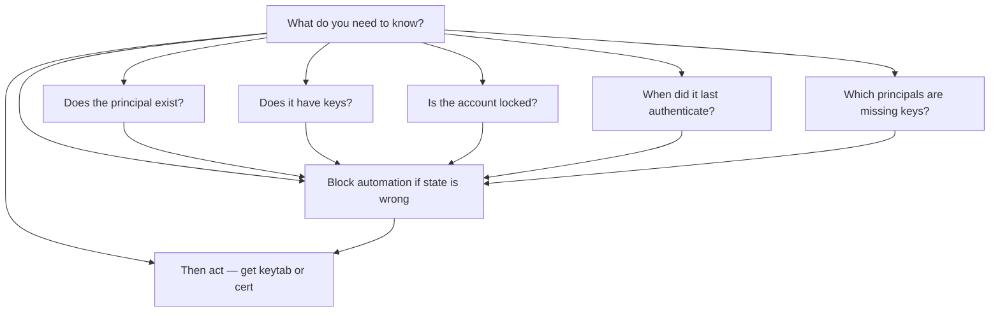
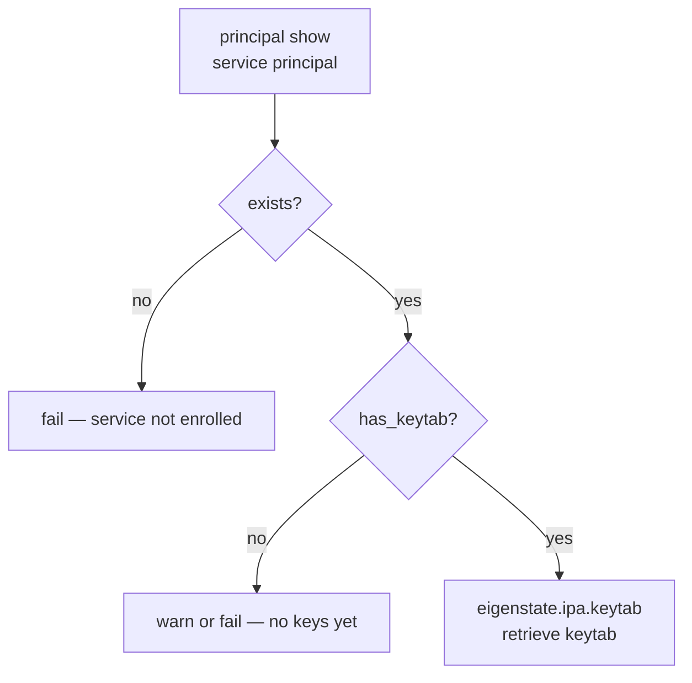
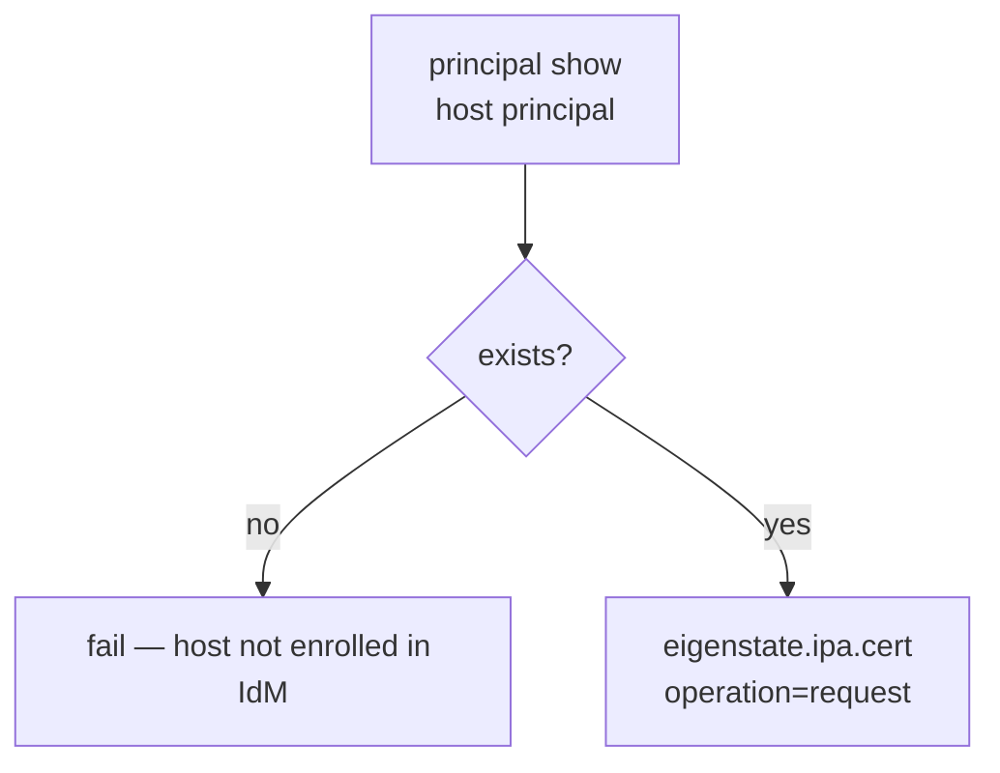
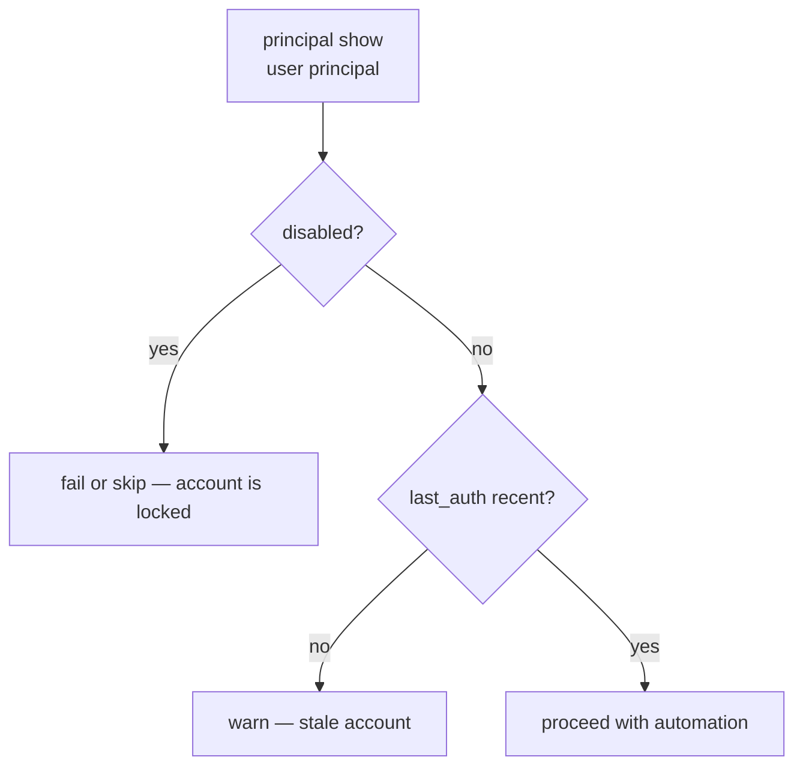
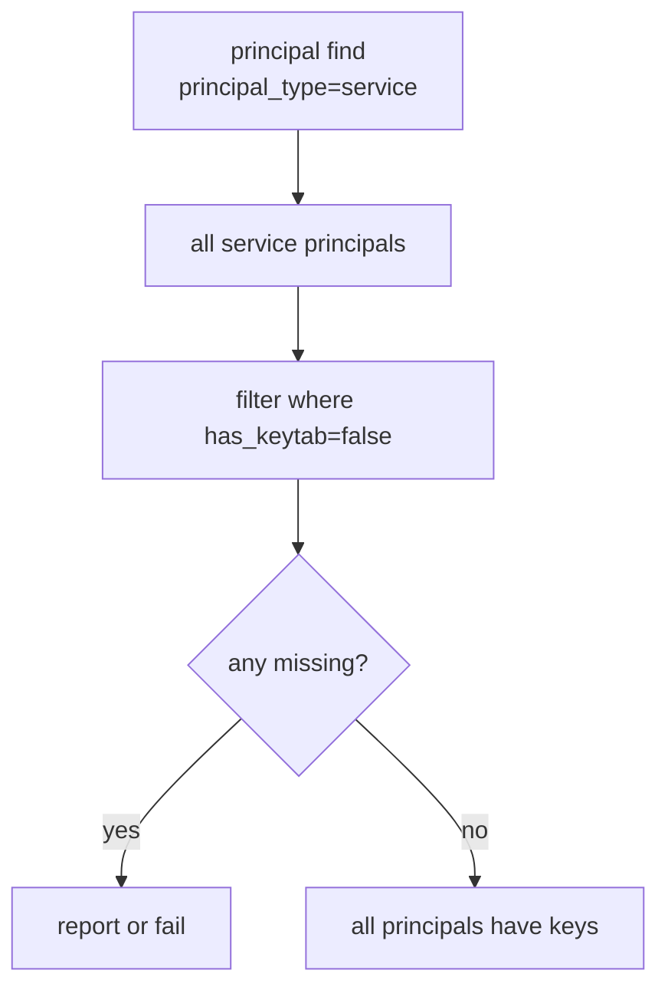
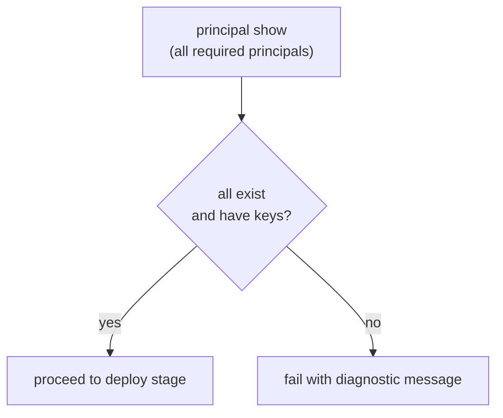
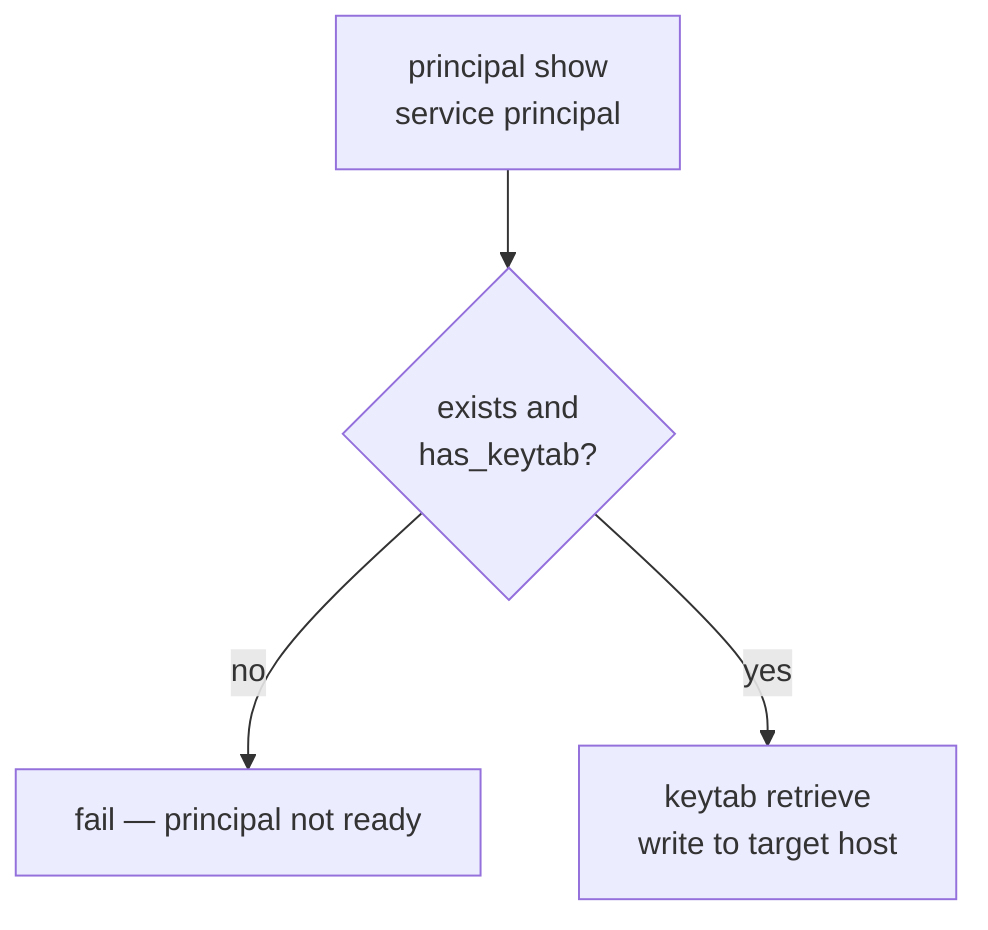
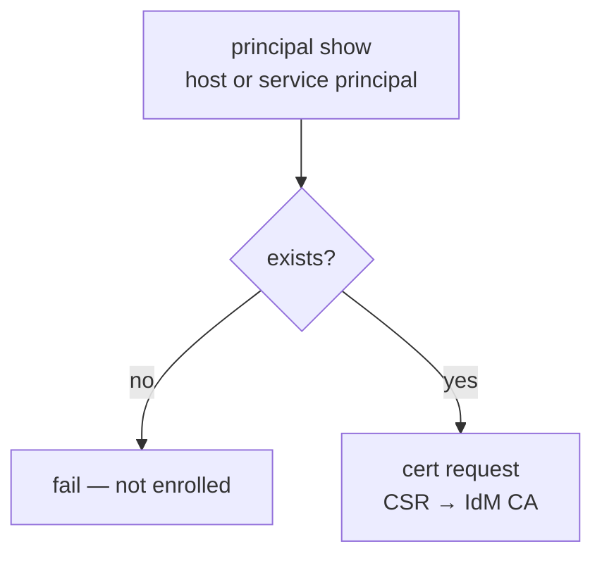
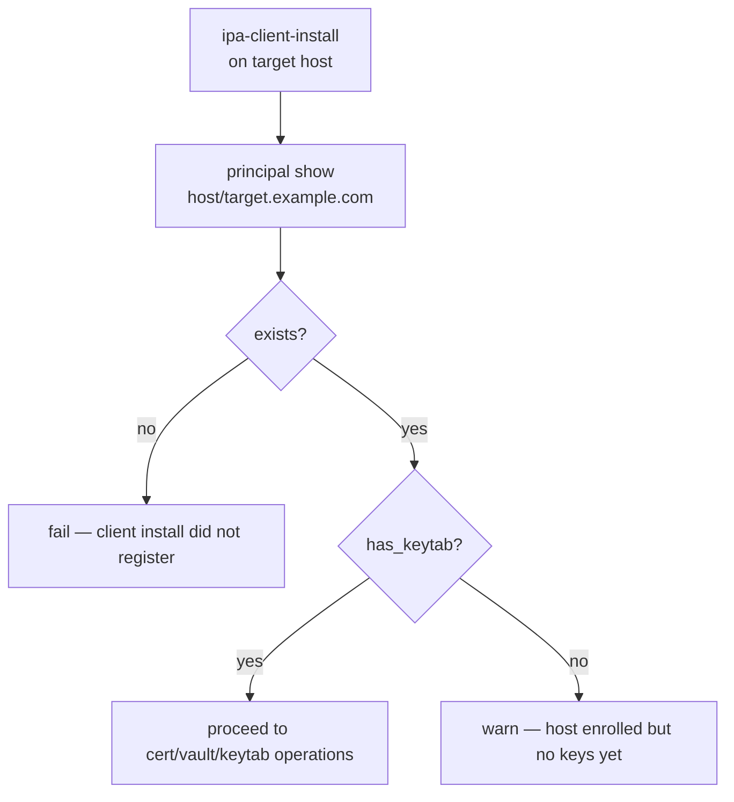



# Principal Capabilities

Nearby docs:

<a href="https://gprocunier.github.io/eigenstate-ipa/principal-plugin.html"><kbd>&nbsp;&nbsp;PRINCIPAL PLUGIN&nbsp;&nbsp;</kbd></a>
<a href="https://gprocunier.github.io/eigenstate-ipa/principal-use-cases.html"><kbd>&nbsp;&nbsp;PRINCIPAL USE CASES&nbsp;&nbsp;</kbd></a>
<a href="https://gprocunier.github.io/eigenstate-ipa/vault-capabilities.html"><kbd>&nbsp;&nbsp;IDM VAULT CAPABILITIES&nbsp;&nbsp;</kbd></a>
<a href="https://gprocunier.github.io/eigenstate-ipa/documentation-map.html"><kbd>&nbsp;&nbsp;DOCS MAP&nbsp;&nbsp;</kbd></a>

## Purpose

Use this guide to choose the right principal state lookup pattern for your
automation.

It is the companion to the principal plugin reference. Use the reference for
exact option syntax; use this guide when you are designing a workflow and need
to know which capability fits your situation.

## Contents

- [Capability Model](#capability-model)
- [1. Pre-flight Before Keytab Issuance](#1-pre-flight-before-keytab-issuance)
- [2. Pre-flight Before Cert Request](#2-pre-flight-before-cert-request)
- [3. User Principal State Inspection](#3-user-principal-state-inspection)
- [4. Bulk Missing-Keytab Audit](#4-bulk-missing-keytab-audit)
- [5. Pipeline Gate — Abort When Principal Absent](#5-pipeline-gate--abort-when-principal-absent)
- [6. Cross-Plugin: Principal Check Then Keytab Retrieval](#6-cross-plugin-principal-check-then-keytab-retrieval)
- [7. Cross-Plugin: Principal Check Then Cert Request](#7-cross-plugin-principal-check-then-cert-request)
- [8. Enrollment Verification After Host Join](#8-enrollment-verification-after-host-join)
- [Quick Decision Matrix](#quick-decision-matrix)

## Capability Model

The principal plugin is a read-only pre-flight primitive. It does not create
or modify IdM objects. Use it to answer state questions and to gate automation
that should only proceed when the answer is correct.

## 1. Pre-flight Before Keytab Issuance

Use `eigenstate.ipa.principal` before calling `eigenstate.ipa.keytab` when
you need to confirm the service principal exists and already has keytab keys
registered in IdM.

Typical cases:

- automation that distributes keytabs to newly enrolled services
- workflows that should fail early rather than get an empty keytab
- pipelines where a missing service principal is a deployment error, not a
  recoverable condition

Why this pattern fits:

- `eigenstate.ipa.keytab` will return an empty or unusable keytab if no keys
  exist yet; the principal check surfaces that problem earlier
- a `fail_msg` assertion here produces a clear error rather than a silent
  downstream failure

## 2. Pre-flight Before Cert Request

Use `eigenstate.ipa.principal` before calling `eigenstate.ipa.cert` with
`operation=request` when you want to confirm the host is enrolled in IdM
before attempting certificate issuance.

Typical cases:

- host certificate workflows that should gate on IdM enrollment, not just DNS
  reachability
- plays that request certs for many hosts and should report which ones are not
  yet enrolled before attempting any CA requests

Why this pattern fits:

- a host that resolves in DNS is not the same as a host enrolled in IdM
- cert requests against unenrolled hosts fail at the CA; catching this earlier
  in the play separates enrollment problems from CA configuration problems

## 3. User Principal State Inspection

Use `eigenstate.ipa.principal` to check whether a service account is locked or
has recent authentication activity before a play runs automation under that
account or grants it additional access.

Typical cases:

- confirming a deployment service account is not disabled before a release job
- auditing stale service accounts that have no recent `last_auth` timestamp
- conditional logic that behaves differently for locked versus active accounts

Why this pattern fits:

- `nsaccountlock` in IdM is authoritative; polling it from Ansible avoids
  running automation under a locked account and getting a misleading auth
  failure later
- `last_auth` requires IdM audit logging to be active; treat `null` as
  unknown, not as never-logged-in

## 4. Bulk Missing-Keytab Audit

Use `operation=find` with `principal_type=service` or `principal_type=host`
to enumerate all principals of a type, then filter the result to those where
`has_keytab=false`.

Typical cases:

- day-2 audits of a freshly enrolled environment where not all services have
  issued keytabs yet
- compliance checks that require all service principals to have active keys
- pre-release gates that should fail if any service in a defined set is
  missing key material

Why this pattern fits:

- `find` with `sizelimit=0` returns the full set; no paging required
- filtering in Jinja2 with `selectattr` keeps the play simple and does not
  require shell-out or `ipa service-find` on a bastion

## 5. Pipeline Gate — Abort When Principal Absent

Use `ansible.builtin.assert` with the principal state record to abort a
pipeline stage when a required principal is absent or in the wrong state.

Typical cases:

- CI/CD pipelines where service principals must be registered before the
  deployment stage can proceed
- pre-flight plays that run as the first task of a complex role
- multi-host deploys where each target must have its principal enrolled before
  any cert or keytab work begins

Why this pattern fits:

- a single assert task can gate an entire play on the state of multiple
  principals
- `result_format=map_record` lets the assert reference principals by name
  instead of by list index, which is more readable when checking several at
  once

## 6. Cross-Plugin: Principal Check Then Keytab Retrieval

Combine `eigenstate.ipa.principal` and `eigenstate.ipa.keytab` in the same
play when you want to pre-validate and then retrieve in a single role.

This is the recommended pattern for any role that manages keytab lifecycle.
The principal check step costs one extra ipalib query but pays for itself by
producing a clear error when the downstream step would otherwise fail silently.

## 7. Cross-Plugin: Principal Check Then Cert Request

Combine `eigenstate.ipa.principal` and `eigenstate.ipa.cert` when requesting
a certificate for a host or service.

Use this pattern in roles that manage host or service certificate lifecycle,
particularly when the role may run before the target is enrolled in IdM.

## 8. Enrollment Verification After Host Join

Use `eigenstate.ipa.principal` as the verification step after
`ipa-client-install` completes, to confirm IdM has the host record and that
keys have been issued.

Typical cases:

- post-enrollment validation in bootstrap playbooks
- integration tests that confirm a newly joined host shows up in IdM before
  moving on to cert or vault operations
- day-1 automation that should not proceed past enrollment without a verified
  IdM record

Why this pattern fits:

- `ipa-client-install` can exit 0 but leave the host in a partial state under
  network or timing failures; a principal check catches this before downstream
  operations run
- the `has_keytab` field distinguishes between "host record exists" and "host
  is fully functional"

## Quick Decision Matrix

| Need | Best capability |
| --- | --- |
| Confirm service exists before issuing keytab | Pre-flight before keytab issuance (#1) |
| Confirm host enrolled before requesting cert | Pre-flight before cert request (#2) |
| Check user account is active before automation | User principal state inspection (#3) |
| Find all service principals missing keys | Bulk missing-keytab audit (#4) |
| Abort entire pipeline if any principal is wrong | Pipeline gate assertion (#5) |
| Pre-validate then retrieve keytab in one play | Cross-plugin: principal + keytab (#6) |
| Pre-validate then request cert in one play | Cross-plugin: principal + cert (#7) |
| Confirm host join succeeded after enrollment | Enrollment verification (#8) |

For option-level behavior, field definitions, and exact lookup syntax, return
to
<a href="https://gprocunier.github.io/eigenstate-ipa/principal-plugin.html"><kbd>PRINCIPAL PLUGIN</kbd></a>.


