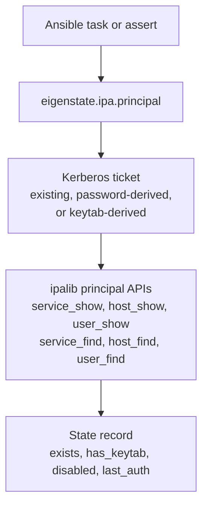
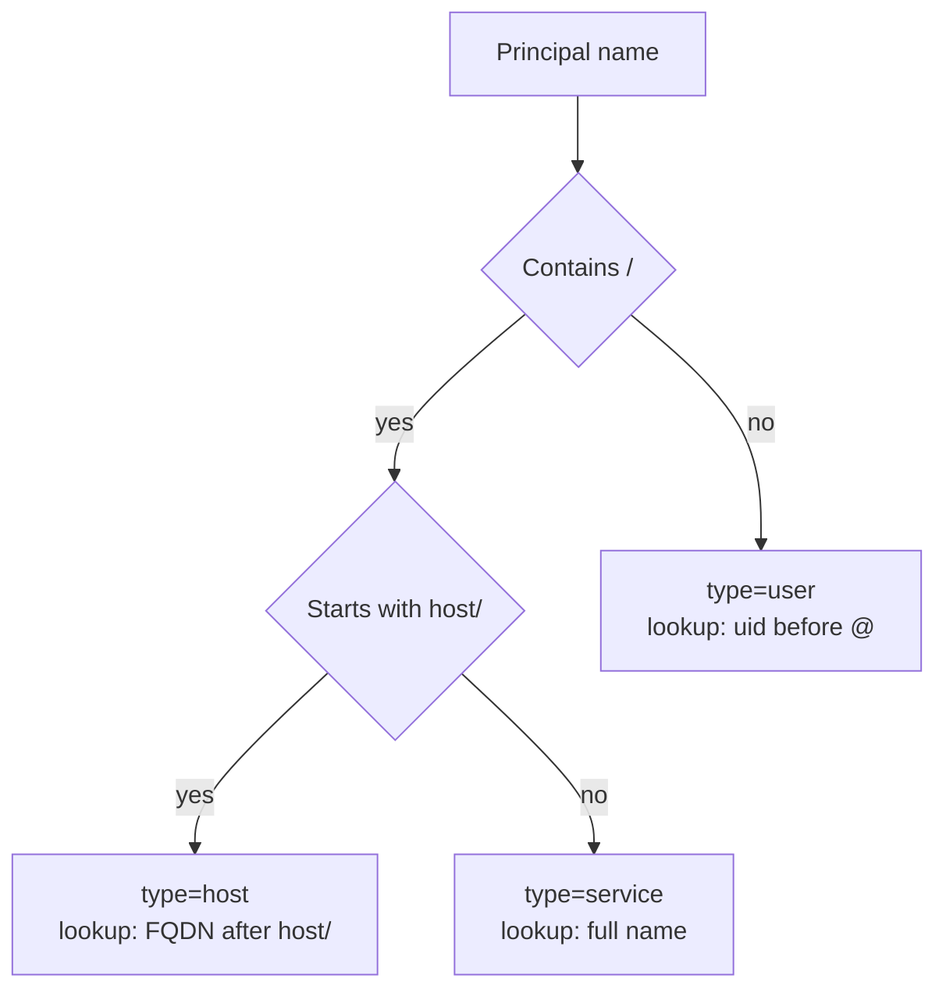

# Principal Plugin

Nearby docs:

<a href="https://gprocunier.github.io/eigenstate-ipa/principal-capabilities.html"><kbd>&nbsp;&nbsp;PRINCIPAL CAPABILITIES&nbsp;&nbsp;</kbd></a>
<a href="https://gprocunier.github.io/eigenstate-ipa/principal-use-cases.html"><kbd>&nbsp;&nbsp;PRINCIPAL USE CASES&nbsp;&nbsp;</kbd></a>
<a href="https://gprocunier.github.io/eigenstate-ipa/vault-plugin.html"><kbd>&nbsp;&nbsp;IDM VAULT PLUGIN&nbsp;&nbsp;</kbd></a>
<a href="https://gprocunier.github.io/eigenstate-ipa/aap-integration.html"><kbd>&nbsp;&nbsp;AAP INTEGRATION&nbsp;&nbsp;</kbd></a>
<a href="https://gprocunier.github.io/eigenstate-ipa/documentation-map.html"><kbd>&nbsp;&nbsp;DOCS MAP&nbsp;&nbsp;</kbd></a>

## Purpose

`eigenstate.ipa.principal` queries Kerberos principal state from FreeIPA/IdM
from Ansible.

This reference covers:

- how the plugin authenticates to IdM
- how principal type detection works
- how the `show` and `find` operations differ
- what fields each state record contains
- how to return a list versus a named map

The principal does not need to be a global IdM administrator. It only needs
rights to query the specific object types it will inspect.

## Contents

- [Lookup Model](#lookup-model)
- [Authentication Model](#authentication-model)
- [Principal Type Detection](#principal-type-detection)
- [Operations](#operations)
- [Result Record Fields](#result-record-fields)
- [Return Shapes](#return-shapes)
- [Minimal Examples](#minimal-examples)
- [Failure Boundaries](#failure-boundaries)
- [When To Read The Scenario Guide](#when-to-read-the-scenario-guide)

## Lookup Model



The lookup uses the IdM Python client libraries directly through `ipalib`.
All queries go through the same authenticated RPC transport as the vault and
keytab plugins.

## Authentication Model

The lookup always operates with a Kerberos credential cache.

It can get there in three ways:

- `ipaadmin_password`:
  - obtains a ticket before connecting
- `kerberos_keytab`:
  - obtains a ticket non-interactively
- neither password nor keytab:
  - assumes a valid existing ticket is already available

> [!IMPORTANT]
> This plugin requires `python3-ipalib` and `python3-ipaclient` on the
> Ansible controller or execution environment. Install with
> `dnf install python3-ipalib python3-ipaclient`.

TLS behavior:

- `verify: /path/to/ca.crt` enables explicit certificate verification
- omitting `verify` first tries `/etc/ipa/ca.crt`
- if no local IdM CA path is available, the plugin warns and falls back to
  the system CA bundle behavior from `ipalib`

## Principal Type Detection

When `principal_type` is left at the default `auto`, the plugin infers the
IdM object type from the principal name format:

| Name form | Detected type | Lookup argument |
| --- | --- | --- |
| `HTTP/web.example.com` | service | full name as-is |
| `HTTP/web.example.com@REALM` | service | name stripped of realm |
| `host/web.example.com` | host | FQDN after `host/` |
| `host/web.example.com@REALM` | host | FQDN after `host/`, realm stripped |
| `admin` | user | uid as-is |
| `admin@REALM` | user | uid before `@` |



When `principal_type` is set explicitly to `user`, `host`, or `service`,
detection is skipped and the name is handled accordingly.

`find` with `principal_type=auto` raises an error. You must specify the type
explicitly for find operations.

## Operations

The lookup supports two operations:

- `show` (default):
  - queries each named principal and returns its state record
  - expects one or more principal names in `_terms`
  - non-existent principals return `exists=false` rather than raising an error
- `find`:
  - searches all principals of the given type
  - `principal_type` must be specified (not `auto`)
  - `criteria` is an optional text filter; omitting it returns all principals
    of that type

## Result Record Fields

Each state record contains:

| Field | Type | Notes |
| --- | --- | --- |
| `name` | str | Input term as given |
| `canonical` | str | Full principal with `@REALM`; for hosts, `host/fqdn@REALM` when available |
| `type` | str | `user`, `host`, or `service` |
| `exists` | bool | `false` when IdM returned NotFound |
| `has_keytab` | bool | `false` when `exists=false` |
| `disabled` | bool or null | `true` when `nsaccountlock=true` (users only); `null` for host and service principals |
| `last_auth` | str or null | ISO 8601 timestamp from `krblastsuccessfulauth` (users only, requires IdM audit enabled); `null` otherwise |

## Return Shapes

### `record` (default)

Returns a list of state dictionaries, one per input principal:

```yaml
principal_states: "{{ lookup('eigenstate.ipa.principal',
                       'HTTP/web01.example.com',
                       'ldap/ldap01.example.com',
                       server='idm-01.example.com',
                       kerberos_keytab='/etc/admin.keytab') }}"
# principal_states[0].name  == 'HTTP/web01.example.com'
# principal_states[1].name  == 'ldap/ldap01.example.com'
```

For a single principal, `lookup(...)` returns the record directly as a mapping.
`query(...)` returns a one-element list, so use `| first` there if you want the
record itself.

### `map_record`

Returns a dictionary keyed by input principal name:

```yaml
state_map: "{{ lookup('eigenstate.ipa.principal',
                'HTTP/web01.example.com',
                'ldap/ldap01.example.com',
                server='idm-01.example.com',
                kerberos_keytab='/etc/admin.keytab',
                result_format='map_record') }}"
# state_map['HTTP/web01.example.com'].exists  == true
# state_map['ldap/ldap01.example.com'].exists == false
```

The map form is useful when several principals are checked in one call and
the playbook should not depend on positional list ordering.

## Minimal Examples

Single service principal existence check:

```yaml
- ansible.builtin.assert:
    that:
      - principal_state.exists
      - principal_state.has_keytab
    fail_msg: "Service principal missing or has no keys"
  vars:
    principal_state: "{{ lookup('eigenstate.ipa.principal',
                          'HTTP/web01.corp.example.com',
                          server='idm-01.corp.example.com',
                          ipaadmin_password=lookup('env', 'IPA_ADMIN_PASSWORD'),
                          verify='/etc/ipa/ca.crt') }}"
```

Host enrollment check before requesting a cert:

```yaml
- ansible.builtin.set_fact:
    host_state: "{{ lookup('eigenstate.ipa.principal',
                    'host/node01.corp.example.com',
                    server='idm-01.corp.example.com',
                    kerberos_keytab='/runner/env/ipa/admin.keytab',
                    verify='/etc/ipa/ca.crt') }}"
```

User lock state before automation:

```yaml
- ansible.builtin.set_fact:
    user_state: "{{ lookup('eigenstate.ipa.principal',
                    'svc-deploy',
                    server='idm-01.corp.example.com',
                    kerberos_keytab='/runner/env/ipa/admin.keytab',
                    verify='/etc/ipa/ca.crt') }}"
```

Multiple principals with named-map output:

```yaml
- ansible.builtin.set_fact:
    states: "{{ lookup('eigenstate.ipa.principal',
                'HTTP/web01.corp.example.com',
                'ldap/ldap01.corp.example.com',
                server='idm-01.corp.example.com',
                kerberos_keytab='/runner/env/ipa/admin.keytab',
                result_format='map_record',
                verify='/etc/ipa/ca.crt') }}"
```

Find all service principals:

```yaml
- ansible.builtin.set_fact:
    all_services: "{{ lookup('eigenstate.ipa.principal',
                      server='idm-01.corp.example.com',
                      kerberos_keytab='/runner/env/ipa/admin.keytab',
                      operation='find',
                      principal_type='service',
                      verify='/etc/ipa/ca.crt') }}"
```

Find service principals matching a criteria string:

```yaml
- ansible.builtin.set_fact:
    http_services: "{{ lookup('eigenstate.ipa.principal',
                        server='idm-01.corp.example.com',
                        kerberos_keytab='/runner/env/ipa/admin.keytab',
                        operation='find',
                        principal_type='service',
                        criteria='HTTP',
                        verify='/etc/ipa/ca.crt') }}"
```

## Failure Boundaries

Common failure classes:

- missing `ipalib` or `ipaclient` libraries on the controller or EE
- no valid Kerberos ticket and no password/keytab supplied
- `find` called with `principal_type=auto` — type must be specified
- `show` called without any principal names in `_terms`
- `AuthorizationError` from ipalib — principal lacks rights to query the
  object type

> [!NOTE]
> A principal that does not exist in IdM returns a state record with
> `exists=false` rather than raising an error. Use this for conditional
> pre-flight logic without `ignore_errors`.

## When To Read The Scenario Guide

Use
<a href="https://gprocunier.github.io/eigenstate-ipa/principal-capabilities.html"><kbd>PRINCIPAL CAPABILITIES</kbd></a>
when you need operator patterns rather than option-by-option reference:

- pre-flight gates before keytab issuance or cert requests
- host enrollment verification
- user lock state inspection before automation runs
- bulk missing-keytab audits
- cross-plugin workflows combining principal check with keytab or cert operations
