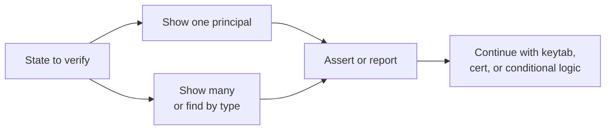
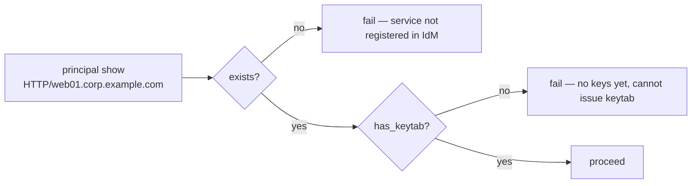
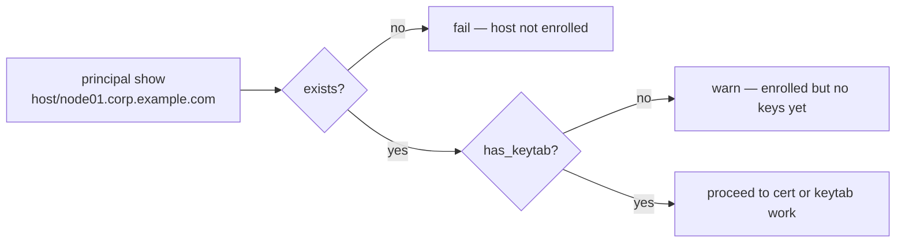



# Principal Use Cases

Related docs:

<a href="https://gprocunier.github.io/eigenstate-ipa/principal-plugin.html"><kbd>&nbsp;&nbsp;PRINCIPAL PLUGIN&nbsp;&nbsp;</kbd></a>
<a href="https://gprocunier.github.io/eigenstate-ipa/principal-capabilities.html"><kbd>&nbsp;&nbsp;PRINCIPAL CAPABILITIES&nbsp;&nbsp;</kbd></a>
<a href="https://gprocunier.github.io/eigenstate-ipa/vault-use-cases.html"><kbd>&nbsp;&nbsp;IDM VAULT USE CASES&nbsp;&nbsp;</kbd></a>
<a href="https://gprocunier.github.io/eigenstate-ipa/documentation-map.html"><kbd>&nbsp;&nbsp;DOCS MAP&nbsp;&nbsp;</kbd></a>

## Purpose

This page contains worked examples for `eigenstate.ipa.principal` against
FreeIPA/IdM.

Use the capability guide to choose the right pattern. Use this page when you
need the corresponding playbook.

## Contents

- [Use Case Flow](#use-case-flow)
- [1. Service Keytab Pre-flight Check](#1-service-keytab-pre-flight-check)
- [2. Host Enrollment Verification](#2-host-enrollment-verification)
- [3. User Lock State Check Before Automation](#3-user-lock-state-check-before-automation)
- [4. Missing-Keytab Audit Across All Services](#4-missing-keytab-audit-across-all-services)
- [5. Pipeline Gate With Assert](#5-pipeline-gate-with-assert)
- [6. Batch Pre-flight For Multiple Services](#6-batch-pre-flight-for-multiple-services)
- [7. Cross-Plugin: Principal Check Then Keytab Retrieval](#7-cross-plugin-principal-check-then-keytab-retrieval)
- [8. Cross-Plugin: Principal Check Then Cert Request](#8-cross-plugin-principal-check-then-cert-request)
- [9. Enrollment Verification After ipa-client-install](#9-enrollment-verification-after-ipa-client-install)
- [10. Scheduled Audit With map_record Output](#10-scheduled-audit-with-map_record-output)

## Use Case Flow



## 1. Service Keytab Pre-flight Check

Verify that a service principal exists and has Kerberos keys registered in
IdM before issuing a keytab. Without this check, a missing principal or an
unkeyed principal produces a silent failure downstream.



```yaml
- name: Pre-flight check before issuing keytab
  hosts: localhost
  gather_facts: false

  tasks:
    - name: Check service principal state
      ansible.builtin.set_fact:
        principal_state: "{{ lookup('eigenstate.ipa.principal',
                              'HTTP/web01.corp.example.com',
                              server='idm-01.corp.example.com',
                              kerberos_keytab='/runner/env/ipa/admin.keytab',
                              verify='/etc/ipa/ca.crt') }}"

    - name: Assert principal is ready
      ansible.builtin.assert:
        that:
          - principal_state.exists
          - principal_state.has_keytab
        fail_msg: >-
          Service principal HTTP/web01.corp.example.com is
          {{ 'missing' if not principal_state.exists else 'present but has no keys' }}.
          Register the principal in IdM before issuing a keytab.
```

## 2. Host Enrollment Verification

Confirm a host is enrolled in IdM and its principal has keys before
requesting a certificate or distributing a keytab.



```yaml
- name: Verify host enrollment before cert request
  hosts: localhost
  gather_facts: false

  tasks:
    - name: Check host principal
      ansible.builtin.set_fact:
        host_state: "{{ lookup('eigenstate.ipa.principal',
                         'host/node01.corp.example.com',
                         server='idm-01.corp.example.com',
                         kerberos_keytab='/runner/env/ipa/admin.keytab',
                         verify='/etc/ipa/ca.crt') }}"

    - name: Fail if not enrolled
      ansible.builtin.fail:
        msg: >-
          host/node01.corp.example.com is not enrolled in IdM.
          Run ipa-client-install on the target before requesting a cert.
      when: not host_state.exists

    - name: Warn if enrolled but no keys yet
      ansible.builtin.debug:
        msg: >-
          Warning: host/node01.corp.example.com is enrolled but has no
          Kerberos keys. Keytab issuance may not be possible yet.
      when: host_state.exists and not host_state.has_keytab
```

## 3. User Lock State Check Before Automation

Confirm a service account is active before a play runs automation under that
account or grants it access. A locked account will fail at the Kerberos auth
step; catching this earlier produces a clearer error.

```yaml
- name: Confirm deployment service account is active
  hosts: localhost
  gather_facts: false

  tasks:
    - name: Check service account state
      ansible.builtin.set_fact:
        svc_state: "{{ lookup('eigenstate.ipa.principal',
                        'svc-deploy',
                        server='idm-01.corp.example.com',
                        kerberos_keytab='/runner/env/ipa/admin.keytab',
                        verify='/etc/ipa/ca.crt') }}"

    - name: Fail if account is disabled
      ansible.builtin.fail:
        msg: >-
          Service account svc-deploy is disabled in IdM.
          Re-enable it before running the deployment job.
      when: svc_state.disabled | bool

    - name: Warn if last auth is unknown
      ansible.builtin.debug:
        msg: >-
          Warning: no last_auth timestamp for svc-deploy.
          IdM audit logging may not be enabled on this server.
      when: svc_state.last_auth is none

    - name: Show last authentication timestamp
      ansible.builtin.debug:
        msg: "svc-deploy last authenticated: {{ svc_state.last_auth }}"
      when: svc_state.last_auth is not none
```

## 4. Missing-Keytab Audit Across All Services

Use `operation=find` to enumerate all service principals and report which
ones do not yet have keytab keys. This is useful for day-2 audits and
pre-release gates.

```yaml
- name: Audit service principals for missing keytabs
  hosts: localhost
  gather_facts: false

  tasks:
    - name: Find all service principals
      ansible.builtin.set_fact:
        all_services: "{{ lookup('eigenstate.ipa.principal',
                           server='idm-01.corp.example.com',
                           kerberos_keytab='/runner/env/ipa/admin.keytab',
                           operation='find',
                           principal_type='service',
                           verify='/etc/ipa/ca.crt') }}"

    - name: Identify services without keys
      ansible.builtin.set_fact:
        unkeyed: "{{ all_services | selectattr('has_keytab', 'equalto', false) | list }}"

    - name: Report unkeyed services
      ansible.builtin.debug:
        msg: "Service principal without keys: {{ item.canonical }}"
      loop: "{{ unkeyed }}"
      when: unkeyed | length > 0

    - name: Fail if any service is unkeyed
      ansible.builtin.fail:
        msg: >-
          {{ unkeyed | length }} service principal(s) have no keytab keys.
          Issue keytabs for: {{ unkeyed | map(attribute='canonical') | join(', ') }}
      when: unkeyed | length > 0
```

To audit hosts instead of services, change `principal_type='service'` to
`principal_type='host'`.

## 5. Pipeline Gate With Assert

Use a single assert task to block an entire pipeline when any required
principal is absent. The `map_record` format makes each principal accessible
by name rather than by position.

```yaml
- name: Pipeline pre-flight — confirm all required principals
  hosts: localhost
  gather_facts: false

  vars:
    required_principals:
      - HTTP/web01.corp.example.com
      - ldap/ldap01.corp.example.com
      - nfs/nfs01.corp.example.com

  tasks:
    - name: Check all required service principals
      ansible.builtin.set_fact:
        principal_states: "{{ lookup('eigenstate.ipa.principal',
                               *required_principals,
                               server='idm-01.corp.example.com',
                               kerberos_keytab='/runner/env/ipa/admin.keytab',
                               result_format='map_record',
                               verify='/etc/ipa/ca.crt') }}"

    - name: Assert all principals exist and have keys
      ansible.builtin.assert:
        that:
          - principal_states[item].exists
          - principal_states[item].has_keytab
        fail_msg: >-
          Principal {{ item }} is
          {{ 'missing from IdM' if not principal_states[item].exists
             else 'registered but has no keys' }}.
      loop: "{{ required_principals }}"
```

## 6. Batch Pre-flight For Multiple Services

When the list of services is not known until runtime, build the principal
names dynamically from inventory and check them all in one lookup.

```yaml
- name: Pre-flight check for all web tier services
  hosts: localhost
  gather_facts: false

  tasks:
    - name: Build service principal names from web hosts
      ansible.builtin.set_fact:
        web_principals: >-
          {{ groups['web'] | map('regex_replace', '^(.*)$', 'HTTP/\1') | list }}

    - name: Check all web service principals
      ansible.builtin.set_fact:
        web_states: "{{ lookup('eigenstate.ipa.principal',
                         *web_principals,
                         server='idm-01.corp.example.com',
                         kerberos_keytab='/runner/env/ipa/admin.keytab',
                         result_format='map_record',
                         verify='/etc/ipa/ca.crt') }}"

    - name: Fail for any missing principal
      ansible.builtin.fail:
        msg: "Service principal {{ item }} is not registered in IdM."
      loop: "{{ web_principals }}"
      when: not web_states[item].exists
```

## 7. Cross-Plugin: Principal Check Then Keytab Retrieval

Combine `eigenstate.ipa.principal` and `eigenstate.ipa.keytab` in the same
play. The principal check gates the keytab retrieval and produces a clear
error when the service is not ready.

```yaml
- name: Distribute service keytab with pre-flight check
  hosts: web
  gather_facts: false

  tasks:
    - name: Pre-flight — check service principal
      ansible.builtin.set_fact:
        svc_state: "{{ lookup('eigenstate.ipa.principal',
                        'HTTP/' + inventory_hostname,
                        server='idm-01.corp.example.com',
                        kerberos_keytab='/runner/env/ipa/admin.keytab',
                        verify='/etc/ipa/ca.crt') }}"
      delegate_to: localhost

    - name: Abort if service principal is not ready
      ansible.builtin.assert:
        that:
          - svc_state.exists
          - svc_state.has_keytab
        fail_msg: >-
          HTTP/{{ inventory_hostname }} is
          {{ 'not registered in IdM' if not svc_state.exists
             else 'registered but has no keys' }}.
          Cannot retrieve a keytab until the principal has keys.

    - name: Retrieve and install keytab
      ansible.builtin.copy:
        content: "{{ lookup('eigenstate.ipa.keytab',
                      'HTTP/' + inventory_hostname,
                      server='idm-01.corp.example.com',
                      kerberos_keytab='/runner/env/ipa/admin.keytab',
                      retrieve_mode='retrieve',
                      verify='/etc/ipa/ca.crt') | b64decode }}"
        dest: /etc/http.keytab
        mode: "0600"
        owner: apache
        group: apache
      become: true
```

> [!NOTE]
> The principal pre-flight check only proves the target principal exists and has
> keys. The caller still needs IdM retrieve-keytab rights for the keytab lookup
> itself.

## 8. Cross-Plugin: Principal Check Then Cert Request

Combine `eigenstate.ipa.principal` and `eigenstate.ipa.cert` when issuing a
certificate for a host. The principal check confirms IdM enrollment before
submitting a CSR to the CA.

```yaml
- name: Request host certificate with enrollment pre-flight
  hosts: appservers
  gather_facts: false

  tasks:
    - name: Pre-flight — confirm host is enrolled in IdM
      ansible.builtin.set_fact:
        host_state: "{{ lookup('eigenstate.ipa.principal',
                         'host/' + inventory_hostname,
                         server='idm-01.corp.example.com',
                         kerberos_keytab='/runner/env/ipa/admin.keytab',
                         verify='/etc/ipa/ca.crt') }}"
      delegate_to: localhost

    - name: Abort if host is not enrolled
      ansible.builtin.fail:
        msg: >-
          host/{{ inventory_hostname }} is not enrolled in IdM.
          Run ipa-client-install before requesting a certificate.
      when: not host_state.exists

    - name: Generate private key
      community.crypto.openssl_privatekey:
        path: /etc/pki/tls/private/{{ inventory_hostname }}.key
        size: 4096
      become: true

    - name: Generate CSR
      community.crypto.openssl_csr:
        path: /etc/pki/tls/certs/{{ inventory_hostname }}.csr
        privatekey_path: /etc/pki/tls/private/{{ inventory_hostname }}.key
        common_name: "{{ inventory_hostname }}"
      become: true

    - name: Read CSR content
      ansible.builtin.slurp:
        src: /etc/pki/tls/certs/{{ inventory_hostname }}.csr
      register: csr_content
      become: true

    - name: Request certificate from IdM CA
      ansible.builtin.set_fact:
        issued_cert: "{{ lookup('eigenstate.ipa.cert',
                          'host/' + inventory_hostname,
                          server='idm-01.corp.example.com',
                          kerberos_keytab='/runner/env/ipa/admin.keytab',
                          operation='request',
                          csr=csr_content.content | b64decode,
                          verify='/etc/ipa/ca.crt') }}"
      delegate_to: localhost

    - name: Install certificate
      ansible.builtin.copy:
        content: "{{ issued_cert }}"
        dest: /etc/pki/tls/certs/{{ inventory_hostname }}.pem
        mode: "0644"
      become: true
```

## 9. Enrollment Verification After ipa-client-install

Use `eigenstate.ipa.principal` as the post-enrollment verification step in a
bootstrap play. A successful `ipa-client-install` does not always mean the
IdM record is in the expected state; verify before moving on.

```yaml
- name: Bootstrap and verify IdM enrollment
  hosts: new_hosts
  gather_facts: false

  tasks:
    - name: Run ipa-client-install
      ansible.builtin.command:
        cmd: >
          ipa-client-install
          --server idm-01.corp.example.com
          --domain corp.example.com
          --principal admin
          --password {{ ipa_admin_password }}
          --unattended
      become: true
      no_log: true

    - name: Wait briefly for IdM to register the host record
      ansible.builtin.pause:
        seconds: 10

    - name: Verify host is registered in IdM
      ansible.builtin.set_fact:
        host_state: "{{ lookup('eigenstate.ipa.principal',
                         'host/' + inventory_hostname,
                         server='idm-01.corp.example.com',
                         kerberos_keytab='/runner/env/ipa/admin.keytab',
                         verify='/etc/ipa/ca.crt') }}"
      delegate_to: localhost

    - name: Fail if host is not in IdM
      ansible.builtin.fail:
        msg: >-
          ipa-client-install reported success but
          host/{{ inventory_hostname }} is not visible in IdM.
          Check the IPA client install log on the target.
      when: not host_state.exists

    - name: Report enrollment state
      ansible.builtin.debug:
        msg: >-
          host/{{ inventory_hostname }} enrolled successfully.
          has_keytab={{ host_state.has_keytab }}
```

## 10. Scheduled Audit With map_record Output

Use `map_record` format to build a structured audit report of all service
principals, keyed by canonical principal name. This is suitable for a
scheduled compliance job that writes a report rather than immediately failing.

```yaml
- name: Weekly service principal audit
  hosts: localhost
  gather_facts: false

  tasks:
    - name: Find all service principals
      ansible.builtin.set_fact:
        all_services: "{{ lookup('eigenstate.ipa.principal',
                           server='idm-01.corp.example.com',
                           kerberos_keytab='/runner/env/ipa/admin.keytab',
                           operation='find',
                           principal_type='service',
                           result_format='map_record',
                           verify='/etc/ipa/ca.crt') }}"

    - name: Summarize key state by service
      ansible.builtin.debug:
        msg: >-
          {{ item.key }}:
          exists={{ item.value.exists }},
          has_keytab={{ item.value.has_keytab }}
      loop: "{{ all_services | dict2items }}"

    - name: Build list of unkeyed services for report
      ansible.builtin.set_fact:
        unkeyed_services: >-
          {{ all_services | dict2items
             | selectattr('value.has_keytab', 'equalto', false)
             | map(attribute='key') | list }}

    - name: Write audit report
      ansible.builtin.copy:
        content: |
          Service Principal Keytab Audit
          Date: {{ ansible_date_time.iso8601 | default(lookup('pipe', 'date -Iseconds')) }}
          Total principals: {{ all_services | length }}
          Missing keytabs:  {{ unkeyed_services | length }}

          
          Principals without keys:
          
            - {{ svc }}
          
          
          All service principals have keytab keys.
          
        dest: /var/log/ipa-principal-audit.txt
        mode: "0640"
```


