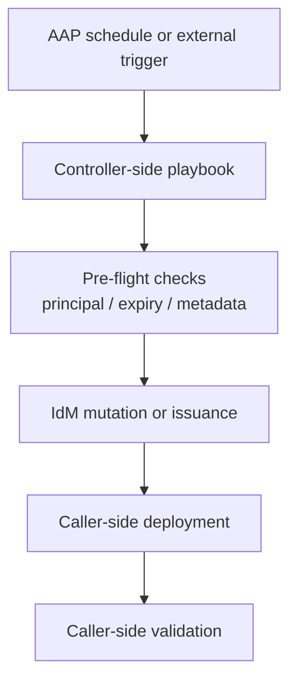



# Rotation Capabilities

Related docs:

<a href="https://gprocunier.github.io/eigenstate-ipa/vault-write-capabilities.html"><kbd>&nbsp;&nbsp;VAULT WRITE CAPABILITIES&nbsp;&nbsp;</kbd></a>
<a href="https://gprocunier.github.io/eigenstate-ipa/keytab-capabilities.html"><kbd>&nbsp;&nbsp;KEYTAB CAPABILITIES&nbsp;&nbsp;</kbd></a>
<a href="https://gprocunier.github.io/eigenstate-ipa/cert-capabilities.html"><kbd>&nbsp;&nbsp;CERT CAPABILITIES&nbsp;&nbsp;</kbd></a>
<a href="https://gprocunier.github.io/eigenstate-ipa/rotation-use-cases.html"><kbd>&nbsp;&nbsp;ROTATION USE CASES&nbsp;&nbsp;</kbd></a>
<a href="https://gprocunier.github.io/eigenstate-ipa/aap-integration.html"><kbd>&nbsp;&nbsp;AAP INTEGRATION&nbsp;&nbsp;</kbd></a>
<a href="https://gprocunier.github.io/eigenstate-ipa/documentation-map.html"><kbd>&nbsp;&nbsp;DOCS MAP&nbsp;&nbsp;</kbd></a>

## Purpose

Use this guide when the question is not "which plugin do I call?" but "what is
the collection's rotation model?"

The answer is precise:

- `eigenstate.ipa` supports controller-scheduled rotation workflows
- it does not provide a Vault-style lease engine or a CyberArk CPM equivalent
- the collection exposes IdM-native primitives that are composed in playbooks
  and AAP jobs

That distinction matters. The collection has a strong rotation story for static
secrets, keytabs, and certificates, but it is a workflow story rather than a
native rotation-engine story.

## Contents

- [Rotation Boundary](#rotation-boundary)
- [What The Collection Does Support](#what-the-collection-does-support)
- [What The Collection Does Not Support](#what-the-collection-does-not-support)
- [Asset Decision Matrix](#asset-decision-matrix)
- [Controller-Side Execution Model](#controller-side-execution-model)
- [State And Scheduling Model](#state-and-scheduling-model)
- [Safety Model By Asset Type](#safety-model-by-asset-type)
- [Positioning For Vault Or CyberArk Users](#positioning-for-vault-or-cyberark-users)
- [Quick Decision Matrix](#quick-decision-matrix)

## Rotation Boundary

The collection boundary is:

- the plugin or module mutates IdM state or retrieves new material
- the playbook handles deployment, restart, validation, and rollback decisions
- AAP or another scheduler decides when the workflow runs
- any "due" logic or approval gate stays explicit in the playbook, inventory,
  job template, or external state store

This keeps the plugin surface honest. A keytab lookup should retrieve or
generate a keytab. A vault write module should archive bytes. A cert lookup
should request, retrieve, or find certificates. None of them should pretend to
be a general lease system.

## What The Collection Does Support

The collection supports these rotation workflows well:

- static secret update in an IdM vault through `eigenstate.ipa.vault_write`
- destructive keytab replacement through `eigenstate.ipa.keytab` with
  `retrieve_mode='generate'`
- certificate renewal or reissuance through `eigenstate.ipa.cert`
- principal pre-flight checks through `eigenstate.ipa.principal`
- controller-side scheduling in AAP using keytab-backed Kerberos auth
- check-mode preview where the underlying module supports it

These are enough to build repeatable controller-driven rotation jobs for the
RHEL and IdM use cases the collection targets.

## What The Collection Does Not Support

The collection does not support:

- dynamic secrets engines
- credential leases with TTL, renew, and revoke semantics
- automatic background rotation inside the plugin itself
- generic deploy hooks or validation hooks inside a module
- a single global "rotate anything" engine across unrelated IdM object types

If the requirement is "issue a short-lived database credential on demand and
renew it automatically," that is a Vault-class problem, not an IdM vault
problem.

## Asset Decision Matrix

| Asset type | Rotation primitive | Deployment boundary | Notes |
| --- | --- | --- | --- |
| Static secret in IdM vault | `eigenstate.ipa.vault_write state=archived` | Caller deploys or consumes new value | Strongest idempotency story for standard vaults |
| Kerberos keytab | `eigenstate.ipa.keytab retrieve_mode='generate'` | Caller must deploy immediately | Destructive; old keytabs are invalidated |
| Certificate | `eigenstate.ipa.cert operation=request` or `operation=find` + request loop | Caller deploys cert and coordinates private key handling | Renewal is workflow-driven, not lease-driven |

## Controller-Side Execution Model

The intended steady-state model is:

Why this model fits the collection:

- the plugins already assume controller-side Kerberos and IdM client tooling
- AAP already provides scheduling, approval, credentials, and retries
- the dangerous part of rotation is almost never the mutation alone; it is the
  coordination around deployment and validation

## State And Scheduling Model

The collection does not require a built-in rotation state file to be useful.

Use one of these models instead:

- schedule by policy and always run the workflow
- schedule by expiry metadata already available from IdM
- schedule by an external inventory var, CMDB field, or controller extra var
- schedule by a small explicit controller-side state file when your playbook
  truly needs due-tracking

That keeps state explicit and avoids pretending that IdM vaults or keytabs are
leases with a native renewal clock.

## Safety Model By Asset Type

### Static secrets

Static secret rotation is the safest path in the collection.

- for standard vaults, `vault_write` compares current payload to incoming
  payload and skips no-op writes
- `check_mode: true` gives a useful preview
- rerunning a standard-vault rotation play is clean and predictable

### Keytabs

Keytab rotation is the sharp edge.

- `retrieve_mode='generate'` is an immediate principal key change
- all consumers of the old keytab become stale at once
- the deploy and restart phase must be in the same workflow

This is why the collection documents keytab rotation as an explicit playbook
pattern rather than hiding it behind a generic orchestration module.

### Certificates

Certificate rotation is a lifecycle workflow, not a cert lease engine.

- `find` gives the renewal candidate set
- `request` issues the replacement certificate
- revocation remains in the official IdM collections
- private-key ownership and deployment remain caller decisions

## Positioning For Vault Or CyberArk Users

For Vault or CyberArk users, the right wording is:

- no native automatic rotation engine
- yes controller-scheduled rotation workflows for static IdM-backed assets
- no dynamic secret lease model
- yes strong Ansible-native workflows for RHEL-centric PKI, keytab, and secret
  rotation

That is a real capability, but it should be described honestly as workflow
composition.

## Quick Decision Matrix

| Need | Best path |
| --- | --- |
| Rotate a static secret stored in IdM | `vault_write` + playbook deployment pattern |
| Preview whether a static secret update would change anything | `vault_write` with `check_mode: true` |
| Rotate a Kerberos keytab on purpose | `keytab retrieve_mode='generate'` + immediate redeploy |
| Renew certificates before expiry | `cert operation=find` + `operation=request` loop |
| Check whether a principal is ready before keytab or cert work | `principal` pre-flight |
| Run on a schedule in AAP | Controller job template with Kerberos keytab auth |
| Need TTL, renew, revoke, and short-lived dynamic credentials | Use Vault or another dynamic secrets system |

For concrete playbooks, continue to
<a href="https://gprocunier.github.io/eigenstate-ipa/rotation-use-cases.html"><kbd>ROTATION USE CASES</kbd></a>.


