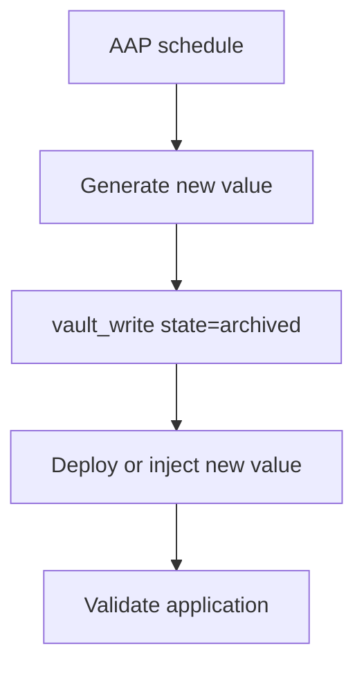
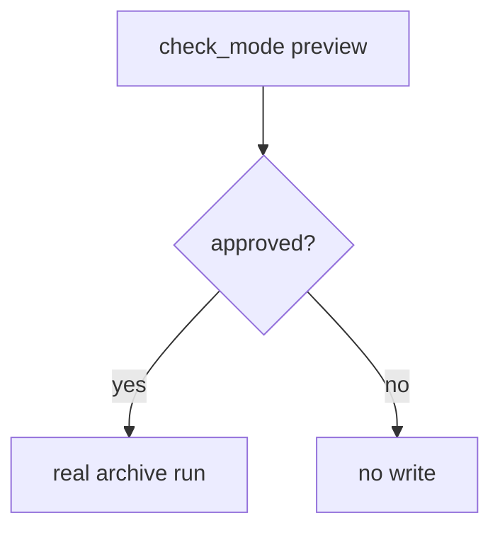
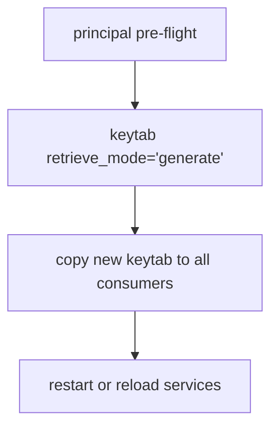
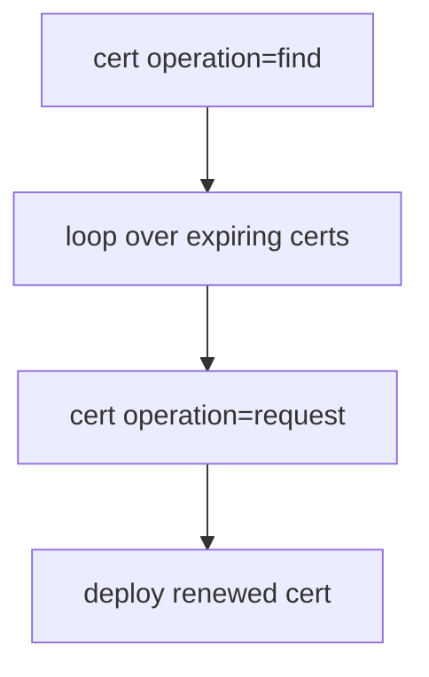



# Rotation Use Cases

Related docs:

<a href="https://gprocunier.github.io/eigenstate-ipa/rotation-capabilities.html"><kbd>&nbsp;&nbsp;ROTATION CAPABILITIES&nbsp;&nbsp;</kbd></a>
<a href="https://gprocunier.github.io/eigenstate-ipa/vault-write-use-cases.html"><kbd>&nbsp;&nbsp;VAULT WRITE USE CASES&nbsp;&nbsp;</kbd></a>
<a href="https://gprocunier.github.io/eigenstate-ipa/keytab-use-cases.html"><kbd>&nbsp;&nbsp;KEYTAB USE CASES&nbsp;&nbsp;</kbd></a>
<a href="https://gprocunier.github.io/eigenstate-ipa/cert-use-cases.html"><kbd>&nbsp;&nbsp;CERT USE CASES&nbsp;&nbsp;</kbd></a>
<a href="https://gprocunier.github.io/eigenstate-ipa/aap-integration.html"><kbd>&nbsp;&nbsp;AAP INTEGRATION&nbsp;&nbsp;</kbd></a>
<a href="https://gprocunier.github.io/eigenstate-ipa/documentation-map.html"><kbd>&nbsp;&nbsp;DOCS MAP&nbsp;&nbsp;</kbd></a>

## Purpose

This page collects the rotation workflows that matter to operators evaluating
`eigenstate.ipa` against Vault or CyberArk expectations.

These are not plugin-level references. They are controller-side workflow
patterns built from the collection's existing primitives.

## Contents

- [1. Scheduled Static Secret Rotation In AAP](#1-scheduled-static-secret-rotation-in-aap)
- [2. Pre-Approved Secret Rotation With Check Mode](#2-pre-approved-secret-rotation-with-check-mode)
- [3. Coordinated Keytab Rotation For A Shared Service Principal](#3-coordinated-keytab-rotation-for-a-shared-service-principal)
- [4. Certificate Renewal From Expiry Discovery](#4-certificate-renewal-from-expiry-discovery)
- [5. Rotation Positioning For Platform Teams](#5-rotation-positioning-for-platform-teams)

## 1. Scheduled Static Secret Rotation In AAP

Use this when a shared application secret lives in an IdM vault and needs a
periodic controller-driven update.



Example:

```yaml
- name: Rotate shared app secret
  hosts: localhost
  gather_facts: false

  vars:
    ipa_server: idm-01.example.com
    ipa_keytab: /runner/env/ipa/admin.keytab

  tasks:
    - name: Generate candidate secret
      ansible.builtin.set_fact:
        new_secret: "{{ lookup('community.general.random_string', length=32, special=false) }}"
      no_log: true

    - name: Archive new secret into IdM
      eigenstate.ipa.vault_write:
        name: app-secret
        state: archived
        shared: true
        data: "{{ new_secret }}"
        server: "{{ ipa_server }}"
        kerberos_keytab: "{{ ipa_keytab }}"
        verify: /etc/ipa/ca.crt
      register: rotation_result
      no_log: true

    - name: Report whether the secret changed
      ansible.builtin.debug:
        msg: "Secret rotation changed={{ rotation_result.changed }}"
```

Why this is the preferred shape:

- it uses the existing idempotent standard-vault write path
- it keeps generation and deployment explicit
- it lets AAP own the schedule without pretending the module is a lease engine

## 2. Pre-Approved Secret Rotation With Check Mode

Use this when an approval gate needs a preview before the actual rotation run.



Example:

```yaml
- name: Preview static secret rotation
  hosts: localhost
  gather_facts: false

  tasks:
    - name: Generate candidate secret
      ansible.builtin.set_fact:
        candidate_secret: "{{ lookup('community.general.random_string', length=32, special=false) }}"
      no_log: true

    - name: Preview archive result
      eigenstate.ipa.vault_write:
        name: app-secret
        state: archived
        shared: true
        data: "{{ candidate_secret }}"
        server: idm-01.example.com
        kerberos_keytab: /runner/env/ipa/admin.keytab
        verify: /etc/ipa/ca.crt
      check_mode: true
      register: rotation_preview
      no_log: true

    - name: Show preview outcome
      ansible.builtin.debug:
        msg: "Rotation would change={{ rotation_preview.changed }}"
```

This is the closest thing the collection has to a dry-run rotation engine, and
it is intentionally tied to the real module semantics rather than a synthetic
planner layer.

## 3. Coordinated Keytab Rotation For A Shared Service Principal

Use this when a service principal is shared by one or more hosts and the new
keytab must be deployed immediately after rotation.



Example:

```yaml
- name: Rotate and redeploy shared HTTP keytab
  hosts: webservers
  gather_facts: false

  vars:
    principal: HTTP/web.example.com

  tasks:
    - name: Confirm principal is ready
      ansible.builtin.set_fact:
        principal_state: "{{ lookup('eigenstate.ipa.principal',
                              principal,
                              server='idm-01.example.com',
                              kerberos_keytab='/runner/env/ipa/admin.keytab',
                              result_format='record',
                              verify='/etc/ipa/ca.crt') }}"
      delegate_to: localhost
      run_once: true

    - name: Fail if the principal is not ready
      ansible.builtin.assert:
        that:
          - principal_state.exists
          - principal_state.has_keytab
      delegate_to: localhost
      run_once: true

    - name: Rotate keytab on the controller
      ansible.builtin.set_fact:
        rotated_keytab_b64: "{{ lookup('eigenstate.ipa.keytab',
                                  principal,
                                  server='idm-01.example.com',
                                  kerberos_keytab='/runner/env/ipa/admin.keytab',
                                  retrieve_mode='generate',
                                  verify='/etc/ipa/ca.crt') }}"
      delegate_to: localhost
      run_once: true
      no_log: true

    - name: Deploy rotated keytab
      ansible.builtin.copy:
        content: "{{ hostvars[groups['webservers'][0]].rotated_keytab_b64 | b64decode }}"
        dest: /etc/httpd/conf/httpd.keytab
        mode: "0600"
        owner: apache
        group: apache
      no_log: true

    - name: Reload httpd
      ansible.builtin.systemd:
        name: httpd
        state: reloaded
```

This pattern is intentionally explicit because keytab rotation is destructive.
If the rotation and deploy phases are separated, the collection cannot save the
service from holding an invalidated keytab.

## 4. Certificate Renewal From Expiry Discovery

Use this when certificate rotation is driven by an expiry window rather than a
native cert lease model.



Example:

```yaml
- name: Renew expiring certificates
  hosts: localhost
  gather_facts: false

  tasks:
    - name: Find certificates expiring soon
      ansible.builtin.set_fact:
        expiring_certs: "{{ lookup('eigenstate.ipa.cert',
                              operation='find',
                              server='idm-01.example.com',
                              kerberos_keytab='/runner/env/ipa/admin.keytab',
                              valid_not_after_to='2026-06-05',
                              result_format='map_record',
                              verify='/etc/ipa/ca.crt') }}"

    - name: Renew each certificate from its matching CSR workflow
      ansible.builtin.debug:
        msg: "Renew certificate with serial {{ item.key }} for {{ item.value.metadata.subject }}"
      loop: "{{ expiring_certs | dict2items }}"
```

The renewal trigger here is explicit and query-driven. That is the collection's
PKI rotation model.

## 5. Rotation Positioning For Platform Teams

Use this wording when a team asks whether the collection "has rotation":

- yes, for controller-scheduled workflows over static secrets, keytabs, and
  certificates
- no, for Vault-style dynamic leases or CyberArk-style autonomous rotation
  engines
- yes, when the environment is IdM-backed and RHEL-centric
- no, when the requirement is dynamic cloud, database, or cross-platform PAM

That positioning is strong enough for the collection and honest enough to
publish.

For the underlying decision model, return to
<a href="https://gprocunier.github.io/eigenstate-ipa/rotation-capabilities.html"><kbd>ROTATION CAPABILITIES</kbd></a>.


