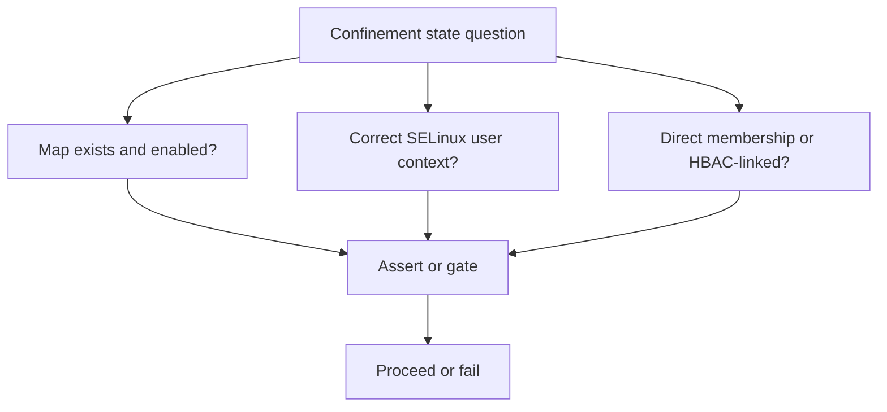
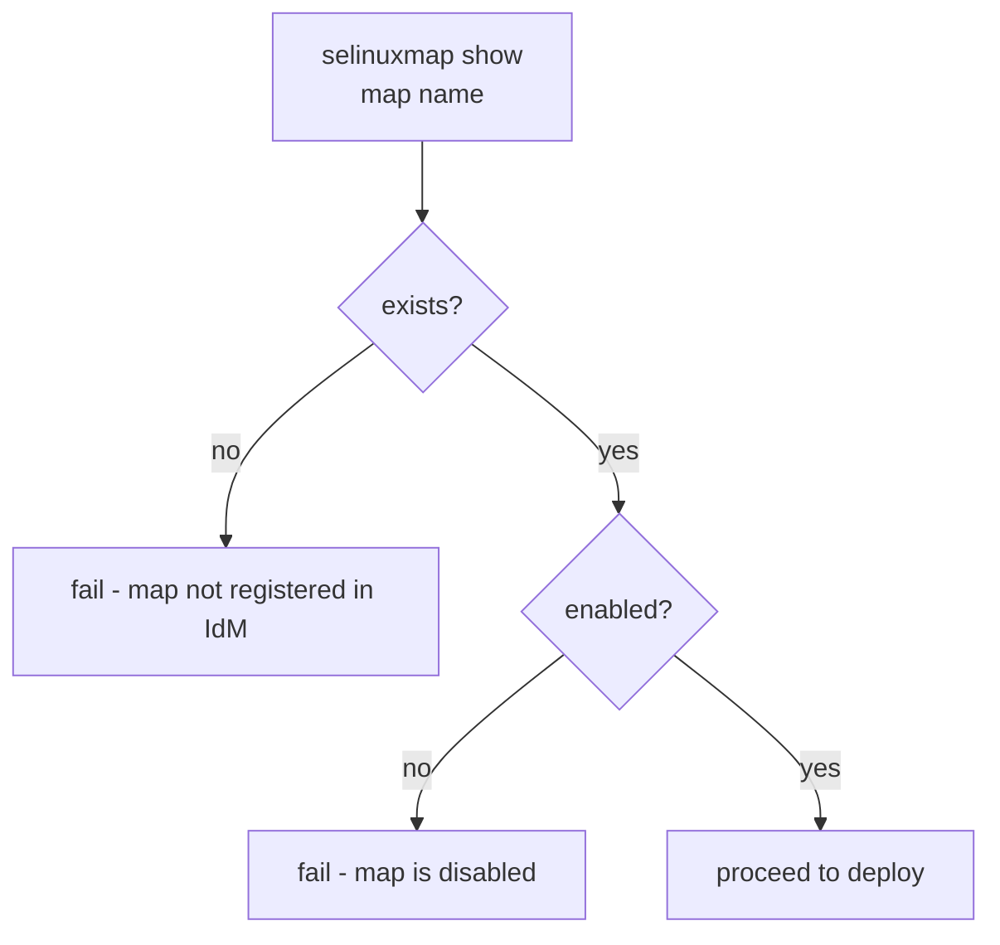
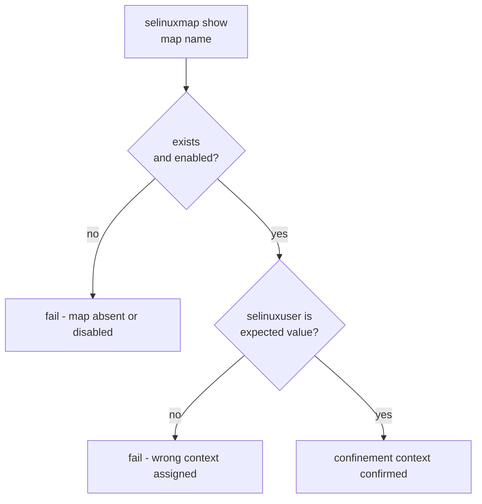
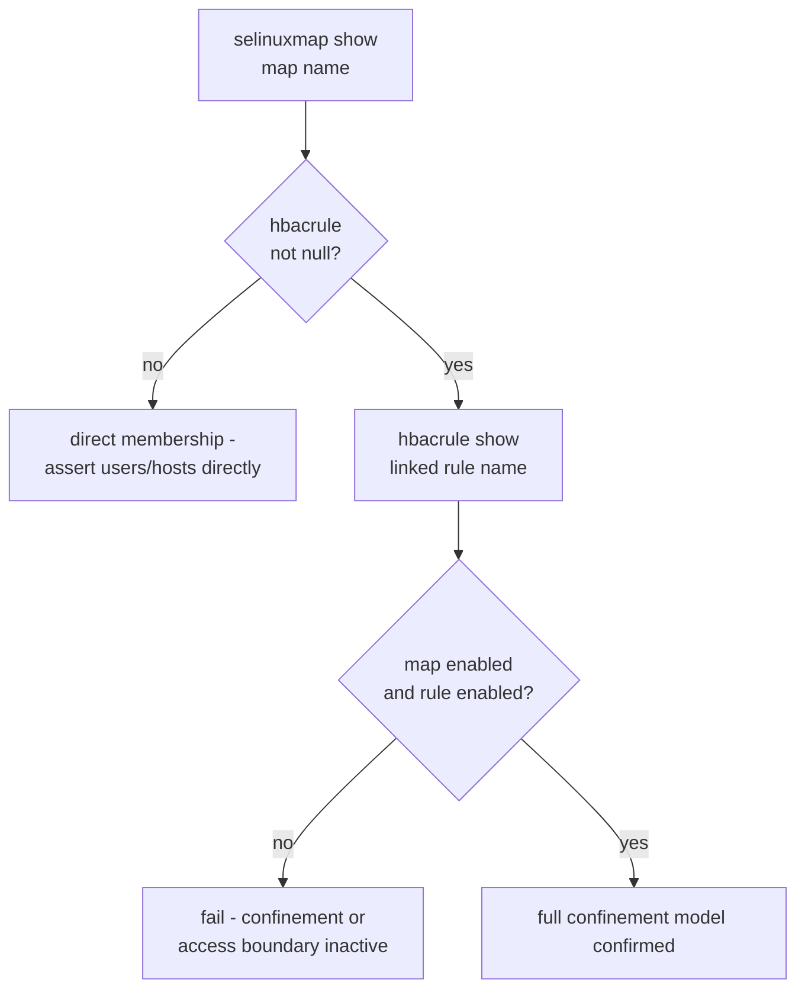
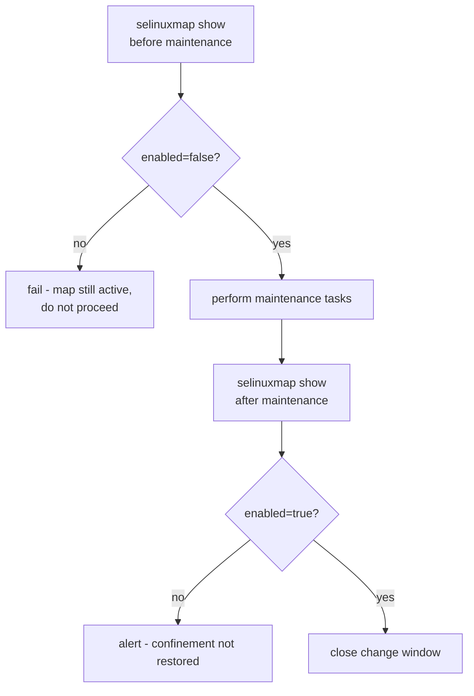
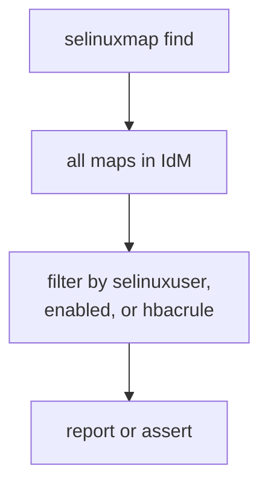
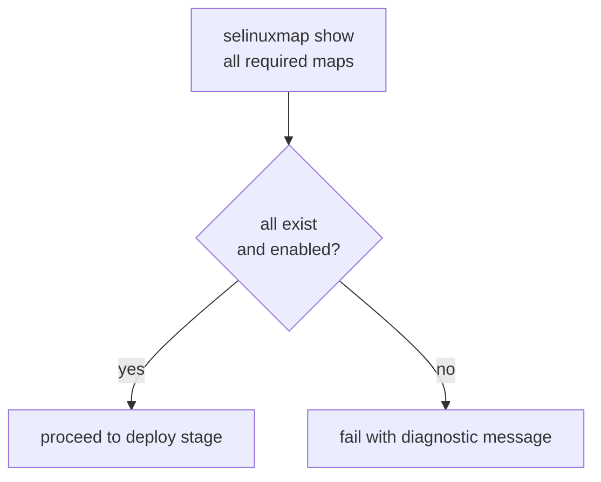
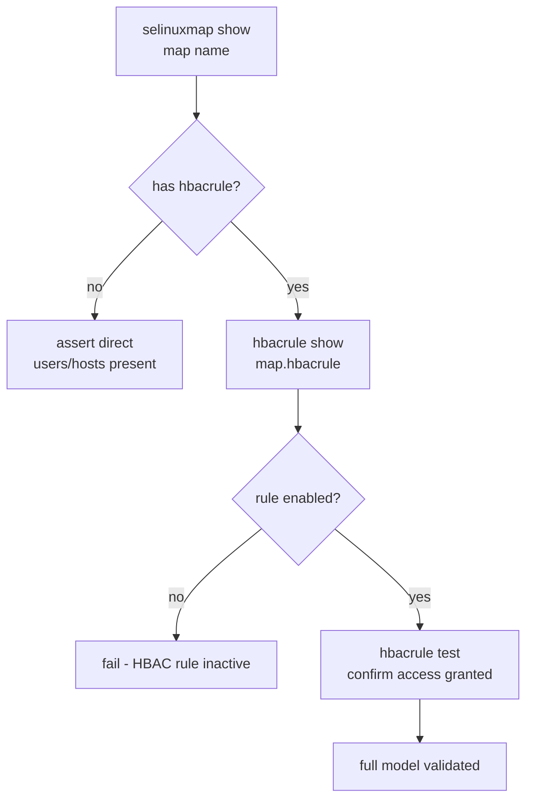

# SELinux Map Capabilities

Related docs:

<a href="https://gprocunier.github.io/eigenstate-ipa/selinuxmap-plugin.html"><kbd>&nbsp;&nbsp;SELINUX MAP PLUGIN&nbsp;&nbsp;</kbd></a>
<a href="https://gprocunier.github.io/eigenstate-ipa/selinuxmap-use-cases.html"><kbd>&nbsp;&nbsp;SELINUX MAP USE CASES&nbsp;&nbsp;</kbd></a>
<a href="https://gprocunier.github.io/eigenstate-ipa/hbacrule-plugin.html"><kbd>&nbsp;&nbsp;HBAC RULE PLUGIN&nbsp;&nbsp;</kbd></a>
<a href="https://gprocunier.github.io/eigenstate-ipa/documentation-map.html"><kbd>&nbsp;&nbsp;DOCS MAP&nbsp;&nbsp;</kbd></a>

## Purpose

Use this guide to choose the right SELinux map query pattern for your
automation.

It is the companion to the selinuxmap plugin reference. Use the reference for
exact option syntax; use this guide when you are designing a confinement
validation workflow and need to know which capability fits your situation.

## Contents

- [Capability Model](#capability-model)
- [1. Pre-flight Before Deploying to a Host](#1-pre-flight-before-deploying-to-a-host)
- [2. Validate Confinement Context Is Correct](#2-validate-confinement-context-is-correct)
- [3. Validate HBAC-Linked Map and Its Rule Together](#3-validate-hbac-linked-map-and-its-rule-together)
- [4. Confirm Map Is Disabled During Maintenance Windows](#4-confirm-map-is-disabled-during-maintenance-windows)
- [5. Bulk Audit of All SELinux Maps](#5-bulk-audit-of-all-selinux-maps)
- [6. Pipeline Gate — Abort When Confinement Is Missing](#6-pipeline-gate--abort-when-confinement-is-missing)
- [7. Cross-Plugin: Map Lookup Then HBAC Validation](#7-cross-plugin-map-lookup-then-hbac-validation)
- [Quick Decision Matrix](#quick-decision-matrix)

## Capability Model

The selinuxmap plugin is a read-only pre-flight primitive. It does not create
or modify IdM objects. Use it to answer confinement state questions and to gate
automation that should only proceed when the SELinux map model is correct.

## 1. Pre-flight Before Deploying to a Host

Use `eigenstate.ipa.selinuxmap` before a play deploys to a host when the
deployment depends on the target having correct SELinux confinement configured
in IdM.

Typical cases:

- playbooks that run as a named service identity and require that identity to
  receive a confined SELinux user at login
- pre-release plays that should fail explicitly if confinement infrastructure
  is not in place, rather than silently inheriting `unconfined_u`
- multi-stage pipelines where the confinement check runs before any packages
  are installed or services are started

Why this pattern fits:

- `eigenstate.ipa.selinuxmap` returns `exists: false` when the map is absent
  rather than raising an error, so a single assert covers both the absent and
  disabled cases cleanly
- catching this before deployment separates a confinement infrastructure
  problem from an application problem

## 2. Validate Confinement Context Is Correct

Use `eigenstate.ipa.selinuxmap` to assert that a specific SELinux user string
is assigned, not just that the map exists.

Typical cases:

- compliance checks that require service identities to receive `staff_u` rather
  than `unconfined_u`
- post-change validation after a SELinux map update to confirm the new context
  is applied
- audit workflows that report every map that assigns `unconfined_u`

Why this pattern fits:

- the `selinuxuser` field is the exact string SSSD and `pam_selinux` will use;
  asserting it here confirms the map delivers the intended confinement
- a map that exists but assigns `unconfined_u` provides no confinement at all

## 3. Validate HBAC-Linked Map and Its Rule Together

Use `eigenstate.ipa.selinuxmap` and `eigenstate.ipa.hbacrule` together when
the map's scope comes from an HBAC rule rather than direct membership.

Typical cases:

- confinement models where the same HBAC rule that controls login access also
  determines the SELinux context
- dual-validation plays that must confirm both the access boundary and the
  confinement boundary are active before deploying
- audits that check for inconsistency between the map and its linked HBAC rule
  (map enabled but rule disabled, or vice versa)

Why this pattern fits:

- a SELinux map linked to a disabled HBAC rule still has `enabled: true`; the
  HBAC link provides the scope, not a redundant gate
- `map.hbacrule` gives the rule name directly; pass it to `eigenstate.ipa.hbacrule`
  without hardcoding

## 4. Confirm Map Is Disabled During Maintenance Windows

Use `eigenstate.ipa.selinuxmap` to verify that a confinement map is disabled
before performing maintenance that requires elevated access, then re-assert
that it is re-enabled afterward.

Typical cases:

- maintenance windows where an identity temporarily needs `unconfined_u`
  access and the play should fail if the map is still active
- post-maintenance gates that confirm confinement was restored before closing
  a change ticket
- compliance workflows that log the enable/disable state at the start and end
  of a maintenance window

Why this pattern fits:

- the `enabled` field reflects the map's active state in IdM; polling it
  before and after maintenance confirms the change management process ran
  correctly
- this works without `ignore_errors` because an absent map returns
  `exists: false` rather than raising

## 5. Bulk Audit of All SELinux Maps

Use `operation=find` to enumerate all SELinux user maps and report on their
state.

Typical cases:

- day-2 compliance audits that list every map assigning `unconfined_u`
- checks that all maps in a set are enabled before a production deployment
- inventory-style reports that show which identities are confined and on which
  hosts

Why this pattern fits:

- `find` returns all maps without requiring knowledge of their names
- `result_format=map_record` makes it easy to reference maps by name in
  subsequent assert or debug tasks
- filtering in Jinja2 with `selectattr` avoids shell-out to `ipa selinuxusermap-find`

## 6. Pipeline Gate — Abort When Confinement Is Missing

Use `ansible.builtin.assert` with the selinuxmap record to abort a pipeline
stage when required confinement infrastructure is absent.

Typical cases:

- CI/CD pipelines where the deployment stage must not run unless named service
  identities have active SELinux map coverage
- pre-flight roles that run first in a complex deploy and gate all subsequent
  tasks on the confinement model being correct
- multi-identity workflows where each service identity must have its own map
  before any of them deploy

Why this pattern fits:

- a single assert task can gate an entire play on the state of multiple maps
- `result_format=map_record` lets the assert reference maps by name, which is
  more readable when checking several identities at once

## 7. Cross-Plugin: Map Lookup Then HBAC Validation

Combine `eigenstate.ipa.selinuxmap` and `eigenstate.ipa.hbacrule` in the same
play to validate the complete confinement and access model.

Use this pattern in compliance or pre-deploy roles that need to confirm both
that the SELinux confinement boundary is active and that the access boundary
it depends on is operational. The `hbacrule` operation=test step adds a live
simulation of whether the identity would be permitted access.

## Quick Decision Matrix

| Need | Best capability |
| --- | --- |
| Confirm map exists and is enabled before deploying | Pre-flight before deploy (#1) |
| Assert specific SELinux context is assigned | Validate confinement context (#2) |
| Validate map and its linked HBAC rule together | HBAC-linked map validation (#3) |
| Confirm map is disabled during maintenance window | Maintenance window gate (#4) |
| List all maps and their confinement state | Bulk audit (#5) |
| Abort pipeline if any required map is missing | Pipeline gate (#6) |
| Validate confinement + access boundary in one play | Cross-plugin: map + hbacrule (#7) |

For option-level behavior, field definitions, and exact lookup syntax, return
to
<a href="https://gprocunier.github.io/eigenstate-ipa/selinuxmap-plugin.html"><kbd>SELINUX MAP PLUGIN</kbd></a>.
