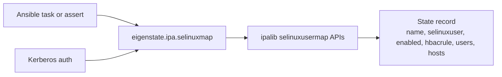



# SELinux Map Plugin

Related docs:

<a href="https://gprocunier.github.io/eigenstate-ipa/selinuxmap-capabilities.html"><kbd>&nbsp;&nbsp;SELINUX MAP CAPABILITIES&nbsp;&nbsp;</kbd></a>
<a href="https://gprocunier.github.io/eigenstate-ipa/selinuxmap-use-cases.html"><kbd>&nbsp;&nbsp;SELINUX MAP USE CASES&nbsp;&nbsp;</kbd></a>
<a href="https://gprocunier.github.io/eigenstate-ipa/hbacrule-plugin.html"><kbd>&nbsp;&nbsp;HBAC RULE PLUGIN&nbsp;&nbsp;</kbd></a>
<a href="https://gprocunier.github.io/eigenstate-ipa/principal-plugin.html"><kbd>&nbsp;&nbsp;PRINCIPAL PLUGIN&nbsp;&nbsp;</kbd></a>
<a href="https://gprocunier.github.io/eigenstate-ipa/documentation-map.html"><kbd>&nbsp;&nbsp;DOCS MAP&nbsp;&nbsp;</kbd></a>

## Purpose

`eigenstate.ipa.selinuxmap` queries SELinux user map state from FreeIPA/IdM
from Ansible.

SELinux user maps are the FreeIPA mechanism that answers: *which SELinux user
should this identity receive when it logs in to this host?* SSSD and
`pam_selinux` evaluate the map at login and launch the session in the mapped
context.

This reference covers:

- how the plugin authenticates to IdM
- what the `show` and `find` operations return
- what fields each state record contains
- how HBAC-linked scope differs from direct membership scope
- how to return a list versus a named map

To create, modify, or delete SELinux user maps, use
`freeipa.ansible_freeipa.ipaselinuxusermap`. This plugin is read-only.

## Contents

- [Lookup Model](#lookup-model)
- [Authentication Model](#authentication-model)
- [Operations](#operations)
- [Result Record Fields](#result-record-fields)
- [HBAC-Linked Scope](#hbac-linked-scope)
- [Return Shapes](#return-shapes)
- [Minimal Examples](#minimal-examples)
- [Failure Boundaries](#failure-boundaries)
- [When To Read The Scenario Guide](#when-to-read-the-scenario-guide)

## Lookup Model



## Authentication Model

Authentication follows the same pattern as all other `eigenstate.ipa` lookup
plugins:

1. **Keytab** (`kerberos_keytab`): preferred for non-interactive and AAP use.
   Pass the path to a keytab file. The plugin calls `kinit -kt` and manages
   the ccache lifecycle around the connection.
2. **Password** (`ipaadmin_password`): uses `ipalib.kinit_password` when
   available and falls back to the system `kinit` command on supported RHEL
   controllers as a compatibility path. In AAP, prefer keytabs over
   password-derived tickets. Set via `IPA_ADMIN_PASSWORD` environment variable
   for AAP credential injection.
3. **Ambient ticket**: when neither password nor keytab is provided, the plugin
   uses whatever ticket is in the current `KRB5CCNAME` or the default ccache.

TLS verification (`verify`) defaults to `/etc/ipa/ca.crt` when it exists.
Set it explicitly in EEs where the host system cert store is not available.

## Operations

### `show` (default)

Queries one or more named SELinux user maps and returns a record per name.

When a map does not exist, `show` returns a record with `exists: false` and
all fields null or empty. This lets pre-flight assertions run without
`ignore_errors`.

```yaml
vars:
  map: "{{ lookup('eigenstate.ipa.selinuxmap',
            'ops-deploy-map',
            server='idm-01.example.com',
            kerberos_keytab='/etc/admin.keytab') }}"
```

### `find`

Searches all SELinux user maps in IdM. Returns a list of all maps, optionally
filtered by the `criteria` string.

```yaml
vars:
  all_maps: "{{ lookup('eigenstate.ipa.selinuxmap',
                 operation='find',
                 server='idm-01.example.com',
                 kerberos_keytab='/etc/admin.keytab') }}"
```

## Result Record Fields

| Field | Type | Description |
| --- | --- | --- |
| `name` | str | SELinux user map name |
| `exists` | bool | Whether the map is registered in IdM |
| `selinuxuser` | str | SELinux user string in `selinux_user:mls_range` form, e.g. `staff_u:s0-s0:c0.c1023` |
| `enabled` | bool | Whether the map is active (disabled maps are not evaluated at login) |
| `usercategory` | str | `all` when the map applies to every user; `null` when user scope is direct membership |
| `hostcategory` | str | `all` when the map applies to every host; `null` when host scope is direct membership |
| `hbacrule` | str | Name of the linked HBAC rule providing combined scope; `null` when direct membership is used |
| `users` | list | IdM users directly in scope; empty when `usercategory=all` or HBAC-linked |
| `groups` | list | IdM groups directly in scope; empty when `usercategory=all` or HBAC-linked |
| `hosts` | list | IdM hosts directly in scope; empty when `hostcategory=all` or HBAC-linked |
| `hostgroups` | list | IdM host groups directly in scope; empty when `hostcategory=all` or HBAC-linked |
| `description` | str | Description field from the map entry, or `null` |

## HBAC-Linked Scope

FreeIPA SELinux user maps have two scope models:

**Direct membership**: users and hosts are listed explicitly in
`users`/`groups`/`hosts`/`hostgroups`. The `hbacrule` field is `null`.

**HBAC-linked scope**: the map delegates its user-and-host scope to an HBAC
rule. The `hbacrule` field contains the rule name, and the membership lists
are empty. This is the model used when the confinement boundary should match
the access boundary — the same HBAC rule that controls who can log in also
determines which SELinux context they receive.

To validate the full confinement model, check both the map and the linked HBAC
rule:

```yaml
- name: Validate confinement map and HBAC linkage
  ansible.builtin.assert:
    that:
      - map.exists
      - map.enabled
      - map.hbacrule is not none
      - hbac_rule.exists
      - hbac_rule.enabled
  vars:
    map: "{{ lookup('eigenstate.ipa.selinuxmap', 'ops-deploy-map',
               server='idm-01.example.com',
               kerberos_keytab='/etc/admin.keytab') }}"
    hbac_rule: "{{ lookup('eigenstate.ipa.hbacrule', map.hbacrule,
                    server='idm-01.example.com',
                    kerberos_keytab='/etc/admin.keytab') }}"
```

## Return Shapes

### `result_format=record` (default)

Returns a list with one dict per map. A single-term `show` lookup is unwrapped
by Ansible to a plain dict:

```yaml
map: "{{ lookup('eigenstate.ipa.selinuxmap', 'ops-deploy-map', ...) }}"
# map is a dict with name, exists, selinuxuser, enabled, etc.
```

### `result_format=map_record`

Returns a single dict keyed by map name. Use this when loading multiple maps
and referencing them by name:

```yaml
maps: "{{ lookup('eigenstate.ipa.selinuxmap',
           'ops-deploy-map', 'ops-patch-map',
           result_format='map_record', ...) }}"
# maps['ops-deploy-map'].selinuxuser
```

## Minimal Examples

**Pre-flight assert before deploying to a host:**

```yaml
- ansible.builtin.assert:
    that:
      - map.exists
      - map.enabled
    fail_msg: "SELinux map 'ops-deploy-map' is missing or disabled"
  vars:
    map: "{{ lookup('eigenstate.ipa.selinuxmap', 'ops-deploy-map',
               server='idm-01.example.com',
               kerberos_keytab='/etc/admin.keytab') }}"
```

**Check the SELinux context a map assigns:**

```yaml
- ansible.builtin.debug:
    msg: "Identity gets context {{ map.selinuxuser }}"
  vars:
    map: "{{ lookup('eigenstate.ipa.selinuxmap', 'ops-deploy-map',
               server='idm-01.example.com',
               ipaadmin_password=lookup('env', 'IPA_ADMIN_PASSWORD')) }}"
```

**List all maps (bulk audit):**

```yaml
- ansible.builtin.set_fact:
    all_maps: "{{ lookup('eigenstate.ipa.selinuxmap',
                   operation='find',
                   server='idm-01.example.com',
                   kerberos_keytab='/etc/admin.keytab') }}"
```

## Failure Boundaries

| Condition | Behavior |
| --- | --- |
| Map does not exist | Returns record with `exists: false`; no error |
| `ipalib` not installed | Raises `AnsibleLookupError` with install hint |
| `server` not set | Raises `AnsibleLookupError` immediately |
| `kinit` fails | Raises `AnsibleLookupError` with keytab/principal hint |
| TLS cert not found | Raises `AnsibleLookupError` |
| Not authorized to read map | Raises `AnsibleLookupError` |

## When To Read The Scenario Guide

Use this reference for option syntax and return field meaning.

Use the [capabilities guide](selinuxmap-capabilities.html) when you are
choosing how to query map state and need to understand which pattern fits
which automation boundary.

Use the [use cases guide](selinuxmap-use-cases.html) when you want a worked
playbook for a specific confinement validation scenario.


