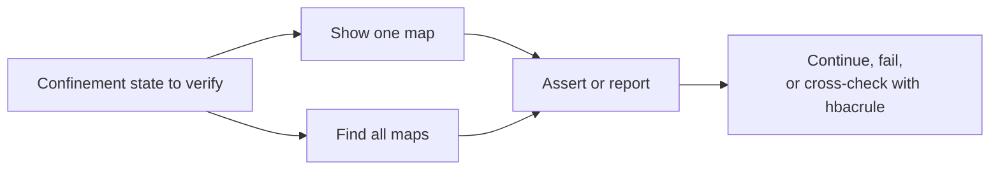
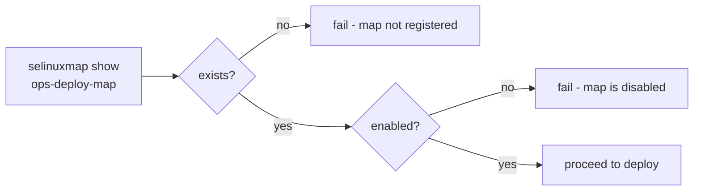
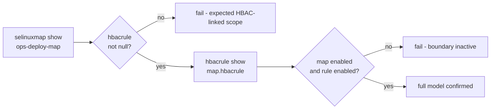
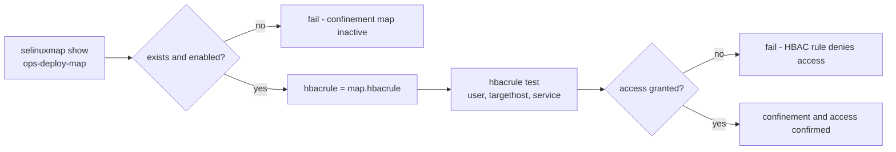



# SELinux Map Use Cases

Related docs:

<a href="https://gprocunier.github.io/eigenstate-ipa/selinuxmap-plugin.html"><kbd>&nbsp;&nbsp;SELINUX MAP PLUGIN&nbsp;&nbsp;</kbd></a>
<a href="https://gprocunier.github.io/eigenstate-ipa/selinuxmap-capabilities.html"><kbd>&nbsp;&nbsp;SELINUX MAP CAPABILITIES&nbsp;&nbsp;</kbd></a>
<a href="https://gprocunier.github.io/eigenstate-ipa/hbacrule-use-cases.html"><kbd>&nbsp;&nbsp;HBAC RULE USE CASES&nbsp;&nbsp;</kbd></a>
<a href="https://gprocunier.github.io/eigenstate-ipa/documentation-map.html"><kbd>&nbsp;&nbsp;DOCS MAP&nbsp;&nbsp;</kbd></a>

## Purpose

This page contains worked examples for `eigenstate.ipa.selinuxmap` against
FreeIPA/IdM.

Use the capability guide to choose the right pattern. Use this page when you
need the corresponding playbook.

## Contents

- [Use Case Flow](#use-case-flow)
- [1. Pre-flight Assert Before Deployment](#1-pre-flight-assert-before-deployment)
- [2. Validate SELinux Context Is Correct](#2-validate-selinux-context-is-correct)
- [3. HBAC-Linked Map and Rule Dual Validation](#3-hbac-linked-map-and-rule-dual-validation)
- [4. Maintenance Window Gate](#4-maintenance-window-gate)
- [5. Bulk Audit — Find All Maps Assigning unconfined_u](#5-bulk-audit--find-all-maps-assigning-unconfined_u)
- [6. Pipeline Gate With map_record](#6-pipeline-gate-with-map_record)
- [7. Cross-Plugin: Map Lookup Then HBAC Test](#7-cross-plugin-map-lookup-then-hbac-test)

## Use Case Flow



## 1. Pre-flight Assert Before Deployment

Verify that the SELinux user map for a service identity exists and is enabled
before a play deploys to the target host. Without this check, a missing or
disabled map means the identity logs in as `unconfined_u`.



```yaml
- name: Pre-flight — confirm SELinux confinement before deploy
  hosts: localhost
  gather_facts: false

  tasks:
    - name: Check SELinux user map state
      ansible.builtin.set_fact:
        confinement_map: "{{ lookup('eigenstate.ipa.selinuxmap',
                              'ops-deploy-map',
                              server='idm-01.corp.example.com',
                              kerberos_keytab='/runner/env/ipa/admin.keytab',
                              verify='/etc/ipa/ca.crt') }}"

    - name: Assert map is present and active
      ansible.builtin.assert:
        that:
          - confinement_map.exists
          - confinement_map.enabled
        fail_msg: >-
          SELinux user map 'ops-deploy-map' is
          {{ 'not registered in IdM' if not confinement_map.exists
             else 'registered but disabled' }}.
          Confinement infrastructure must be in place before deploying.
```

## 2. Validate SELinux Context Is Correct

Check that the map assigns the expected SELinux user string, not just that it
exists. A map that assigns `unconfined_u` provides no confinement.

```yaml
- name: Validate SELinux context assigned by map
  hosts: localhost
  gather_facts: false

  vars:
    expected_selinuxuser: "staff_u:s0-s0:c0.c1023"

  tasks:
    - name: Get map state
      ansible.builtin.set_fact:
        confinement_map: "{{ lookup('eigenstate.ipa.selinuxmap',
                              'ops-deploy-map',
                              server='idm-01.corp.example.com',
                              kerberos_keytab='/runner/env/ipa/admin.keytab',
                              verify='/etc/ipa/ca.crt') }}"

    - name: Assert map exists, is enabled, and assigns the correct context
      ansible.builtin.assert:
        that:
          - confinement_map.exists
          - confinement_map.enabled
          - confinement_map.selinuxuser == expected_selinuxuser
        fail_msg: >-
          Map 'ops-deploy-map' issue:
          exists={{ confinement_map.exists }},
          enabled={{ confinement_map.enabled }},
          selinuxuser={{ confinement_map.selinuxuser | default('null') }}
          (expected {{ expected_selinuxuser }}).
```

## 3. HBAC-Linked Map and Rule Dual Validation

Validate both the SELinux user map and the HBAC rule it delegates scope to.
Use this when the confinement boundary should match the access boundary.



```yaml
- name: Validate confinement model — map and linked HBAC rule
  hosts: localhost
  gather_facts: false

  tasks:
    - name: Get SELinux user map
      ansible.builtin.set_fact:
        confinement_map: "{{ lookup('eigenstate.ipa.selinuxmap',
                              'ops-deploy-map',
                              server='idm-01.corp.example.com',
                              kerberos_keytab='/runner/env/ipa/admin.keytab',
                              verify='/etc/ipa/ca.crt') }}"

    - name: Assert map is present and HBAC-linked
      ansible.builtin.assert:
        that:
          - confinement_map.exists
          - confinement_map.enabled
          - confinement_map.hbacrule is not none
        fail_msg: >-
          Map 'ops-deploy-map' must exist, be enabled, and be linked to an
          HBAC rule. hbacrule={{ confinement_map.hbacrule | default('null') }}.

    - name: Get linked HBAC rule
      ansible.builtin.set_fact:
        hbac_rule: "{{ lookup('eigenstate.ipa.hbacrule',
                        confinement_map.hbacrule,
                        server='idm-01.corp.example.com',
                        kerberos_keytab='/runner/env/ipa/admin.keytab',
                        verify='/etc/ipa/ca.crt') }}"

    - name: Assert HBAC rule is present and enabled
      ansible.builtin.assert:
        that:
          - hbac_rule.exists
          - hbac_rule.enabled
        fail_msg: >-
          Linked HBAC rule '{{ confinement_map.hbacrule }}' is
          {{ 'not registered in IdM' if not hbac_rule.exists
             else 'registered but disabled' }}.
          The confinement scope is inactive.
```

## 4. Maintenance Window Gate

Confirm that a confinement map is disabled before maintenance begins, and
re-enabled after it closes. Use this when a change window temporarily requires
elevated access.

```yaml
- name: Validate maintenance window confinement state
  hosts: localhost
  gather_facts: false

  vars:
    maintenance_map: "ops-patch-map"
    maintenance_state: "{{ maintenance_state | default('open') }}"
    # Set maintenance_state=open before maintenance, closed after.

  tasks:
    - name: Get confinement map state
      ansible.builtin.set_fact:
        cmap: "{{ lookup('eigenstate.ipa.selinuxmap',
                   maintenance_map,
                   server='idm-01.corp.example.com',
                   kerberos_keytab='/runner/env/ipa/admin.keytab',
                   verify='/etc/ipa/ca.crt') }}"

    - name: Assert map is disabled during open window
      ansible.builtin.assert:
        that:
          - cmap.exists
          - not cmap.enabled
        fail_msg: >-
          Map '{{ maintenance_map }}' must be disabled before maintenance
          can proceed. Disable the map in IdM before opening the window.
      when: maintenance_state == 'open'

    - name: Assert map is re-enabled after window closes
      ansible.builtin.assert:
        that:
          - cmap.exists
          - cmap.enabled
        fail_msg: >-
          Map '{{ maintenance_map }}' was not re-enabled after the
          maintenance window closed. Re-enable it in IdM now.
      when: maintenance_state == 'closed'
```

## 5. Bulk Audit — Find All Maps Assigning unconfined_u

Use `operation=find` to enumerate all SELinux user maps and identify those
that assign `unconfined_u`, which provides no confinement.

```yaml
- name: Audit SELinux user maps for unconfined assignments
  hosts: localhost
  gather_facts: false

  tasks:
    - name: Find all SELinux user maps
      ansible.builtin.set_fact:
        all_maps: "{{ lookup('eigenstate.ipa.selinuxmap',
                       operation='find',
                       server='idm-01.corp.example.com',
                       kerberos_keytab='/runner/env/ipa/admin.keytab',
                       verify='/etc/ipa/ca.crt') }}"

    - name: Identify maps assigning unconfined_u
      ansible.builtin.set_fact:
        unconfined_maps: >-
          {{ all_maps | selectattr('selinuxuser', 'search', 'unconfined_u')
             | selectattr('enabled', 'equalto', true) | list }}

    - name: Report enabled unconfined maps
      ansible.builtin.debug:
        msg: >-
          Map '{{ item.name }}' is enabled and assigns
          {{ item.selinuxuser }} — no confinement.
      loop: "{{ unconfined_maps }}"
      when: unconfined_maps | length > 0

    - name: Fail if any enabled maps assign unconfined_u
      ansible.builtin.fail:
        msg: >-
          {{ unconfined_maps | length }} enabled map(s) assign unconfined_u:
          {{ unconfined_maps | map(attribute='name') | join(', ') }}.
          Review and update the confinement model.
      when: unconfined_maps | length > 0
```

## 6. Pipeline Gate With map_record

Use `result_format=map_record` to gate a pipeline on the state of multiple
confinement maps by name. This is more readable than asserting by list index
when checking several identities.

```yaml
- name: Pipeline pre-flight — confirm all confinement maps
  hosts: localhost
  gather_facts: false

  vars:
    required_maps:
      - ops-deploy-map
      - ops-patch-map
      - svc-monitor-map

  tasks:
    - name: Check all required confinement maps
      ansible.builtin.set_fact:
        map_states: "{{ lookup('eigenstate.ipa.selinuxmap',
                         *required_maps,
                         server='idm-01.corp.example.com',
                         kerberos_keytab='/runner/env/ipa/admin.keytab',
                         result_format='map_record',
                         verify='/etc/ipa/ca.crt') }}"

    - name: Assert each map exists and is enabled
      ansible.builtin.assert:
        that:
          - map_states[item].exists
          - map_states[item].enabled
        fail_msg: >-
          Confinement map '{{ item }}' is
          {{ 'not registered in IdM' if not map_states[item].exists
             else 'registered but disabled' }}.
      loop: "{{ required_maps }}"
```

## 7. Cross-Plugin: Map Lookup Then HBAC Test

Combine `eigenstate.ipa.selinuxmap` and `eigenstate.ipa.hbacrule` with
`operation=test` to validate both that the confinement map is active and that
the linked HBAC rule would actually permit access.



```yaml
- name: Full confinement + access validation
  hosts: localhost
  gather_facts: false

  vars:
    identity: "svc-deploy"
    target_host: "app01.corp.example.com"
    target_service: "sshd"
    confinement_map_name: "ops-deploy-map"

  tasks:
    - name: Get SELinux user map
      ansible.builtin.set_fact:
        cmap: "{{ lookup('eigenstate.ipa.selinuxmap',
                   confinement_map_name,
                   server='idm-01.corp.example.com',
                   kerberos_keytab='/runner/env/ipa/admin.keytab',
                   verify='/etc/ipa/ca.crt') }}"

    - name: Assert map is present and enabled
      ansible.builtin.assert:
        that:
          - cmap.exists
          - cmap.enabled
        fail_msg: >-
          SELinux map '{{ confinement_map_name }}' is
          {{ 'not registered' if not cmap.exists else 'disabled' }}.

    - name: Test HBAC access via linked rule
      ansible.builtin.set_fact:
        access_result: "{{ lookup('eigenstate.ipa.hbacrule',
                            identity,
                            operation='test',
                            targethost=target_host,
                            service=target_service,
                            server='idm-01.corp.example.com',
                            kerberos_keytab='/runner/env/ipa/admin.keytab',
                            verify='/etc/ipa/ca.crt') }}"
      when: cmap.hbacrule is not none

    - name: Assert access is granted
      ansible.builtin.assert:
        that:
          - not access_result.denied
        fail_msg: >-
          HBAC test denied access for {{ identity }} →
          {{ target_host }} / {{ target_service }}.
          Matched rules: {{ access_result.matched | join(', ') | default('none') }}.
          Not matched: {{ access_result.notmatched | join(', ') }}.
      when: cmap.hbacrule is not none

    - name: Report validated confinement model
      ansible.builtin.debug:
        msg: >-
          Confinement model validated:
          map={{ confinement_map_name }},
          selinuxuser={{ cmap.selinuxuser }},
          access_granted={{ not access_result.denied }},
          matched_rules={{ access_result.matched | join(', ') }}.
      when: cmap.hbacrule is not none
```


