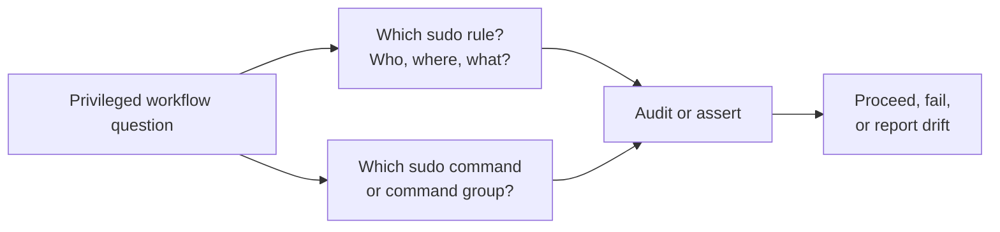

# Sudo Capabilities

Related docs:

<a href="https://gprocunier.github.io/eigenstate-ipa/sudo-plugin.html"><kbd>&nbsp;&nbsp;SUDO PLUGIN&nbsp;&nbsp;</kbd></a>
<a href="https://gprocunier.github.io/eigenstate-ipa/sudo-use-cases.html"><kbd>&nbsp;&nbsp;SUDO USE CASES&nbsp;&nbsp;</kbd></a>
<a href="https://gprocunier.github.io/eigenstate-ipa/documentation-map.html"><kbd>&nbsp;&nbsp;DOCS MAP&nbsp;&nbsp;</kbd></a>

## Purpose

Use this guide to choose the right sudo lookup pattern for your automation.

The plugin reference explains exact option syntax. This page explains when to
query a sudo rule, when to query a sudo command or command group, and when a
single lookup is enough versus when a broader audit is the better fit.

## Contents

- [Capability Model](#capability-model)
- [1. Pre-flight Before Running Privileged Automation](#1-pre-flight-before-running-privileged-automation)
- [2. Validate The Rule Scope Behind A Privileged Workflow](#2-validate-the-rule-scope-behind-a-privileged-workflow)
- [3. Audit Allowed and Denied Command Surfaces](#3-audit-allowed-and-denied-command-surfaces)
- [4. Confirm A Shared Command Group Exists](#4-confirm-a-shared-command-group-exists)
- [5. Bulk Audit of Sudo Policy Objects](#5-bulk-audit-of-sudo-policy-objects)
- [Quick Decision Matrix](#quick-decision-matrix)

## Capability Model

The sudo lookup has one core split:

- use `sudo_object='rule'` when the question is policy scope, enablement, or
  effective allowed and denied command assignments
- use `sudo_object='command'` when the question is whether a concrete command
  object exists in IdM
- use `sudo_object='commandgroup'` when the workflow depends on a reusable
  command set rather than one command path

## 1. Pre-flight Before Running Privileged Automation

Use `sudo_object='rule'` with `operation=show` when a play depends on a named
sudo rule being present and enabled before any privileged workflow starts.

Typical cases:

- operator jobs that assume a named sudo rule already grants the required access
- deployment plays that depend on a maintained command group such as
  `system-ops` or `cluster-admin`
- CI gates that should fail early when privileged policy is absent or disabled

Why this fits:

- `show` returns `exists: false` for missing rules instead of raising
- the same record tells you whether the rule is disabled and what command
  surfaces it actually grants

## 2. Validate The Rule Scope Behind A Privileged Workflow

Use `sudo_object='rule'` when the workflow depends on the correct users,
groups, hosts, hostgroups, or RunAs identities being in scope.

Typical cases:

- checking that a service account is directly in `users` or covered by a group
- confirming that a rule is host-scoped rather than globally permissive
- verifying that the RunAs target is what the workflow expects

Why this fits:

- sudo policy failures are often membership problems, not just missing rules
- one rule record exposes user scope, host scope, command scope, and RunAs
  scope together

## 3. Audit Allowed and Denied Command Surfaces

Use `sudo_object='rule'` when you need to inspect which command paths and
command groups are allowed or denied by a rule.

Typical cases:

- auditing that a rule grants `systemctl` but denies `su`
- validating that a production rule is narrower than a break-glass rule
- checking whether a policy relies on direct commands or shared command groups

Why this fits:

- `allow_sudocmds`, `allow_sudocmdgroups`, `deny_sudocmds`, and
  `deny_sudocmdgroups` are all returned in one record
- this avoids shelling out to multiple IPA CLI calls during policy checks

## 4. Confirm A Shared Command Group Exists

Use `sudo_object='commandgroup'` when the workflow depends on a named command
group being present and containing the expected commands.

Typical cases:

- validating a shared operations command set before applying or reviewing rules
- checking whether a command was added to a reusable group rather than a rule
- comparing command-group content across environments

Why this fits:

- command groups are the reuse boundary in IdM sudo policy
- one lookup returns the group name, description, and `commands` list

## 5. Bulk Audit of Sudo Policy Objects

Use `operation=find` when you need the full object set for a type.

Typical cases:

- list all sudo rules and report the disabled ones
- enumerate every command group and compare membership to a standard
- search for all command objects matching a prefix or path fragment

Why this fits:

- `find` makes the plugin useful for day-2 policy audit, not only pre-flight
  assertions
- `result_format='map_record'` is the better shape when later tasks need named
  access to specific rules or groups

## Quick Decision Matrix

| Need | Query |
| --- | --- |
| Check that a privileged workflow rule exists and is enabled | `sudo_object='rule'`, `operation='show'` |
| Check who or what a rule covers | `sudo_object='rule'`, `operation='show'` |
| Audit allowed and denied commands on a rule | `sudo_object='rule'`, `operation='show'` |
| Confirm a concrete command object exists | `sudo_object='command'`, `operation='show'` |
| Inspect membership of a reusable command set | `sudo_object='commandgroup'`, `operation='show'` |
| Enumerate all rules, commands, or command groups | `operation='find'` with the appropriate `sudo_object` |
