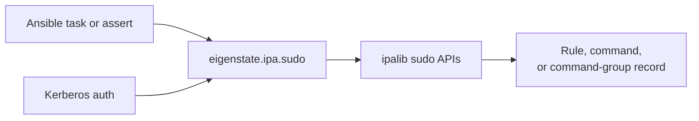



# Sudo Plugin

Related docs:

<a href="https://gprocunier.github.io/eigenstate-ipa/sudo-capabilities.html"><kbd>&nbsp;&nbsp;SUDO CAPABILITIES&nbsp;&nbsp;</kbd></a>
<a href="https://gprocunier.github.io/eigenstate-ipa/sudo-use-cases.html"><kbd>&nbsp;&nbsp;SUDO USE CASES&nbsp;&nbsp;</kbd></a>
<a href="https://gprocunier.github.io/eigenstate-ipa/hbacrule-plugin.html"><kbd>&nbsp;&nbsp;HBAC RULE PLUGIN&nbsp;&nbsp;</kbd></a>
<a href="https://gprocunier.github.io/eigenstate-ipa/documentation-map.html"><kbd>&nbsp;&nbsp;DOCS MAP&nbsp;&nbsp;</kbd></a>

## Purpose

`eigenstate.ipa.sudo` is the read-only sudo policy lookup for this collection.
It exposes three IdM sudo object types through one plugin surface:

- `sudo_object='rule'` for sudo rules
- `sudo_object='command'` for sudo commands
- `sudo_object='commandgroup'` for sudo command groups

Use it when playbooks need to inspect sudo policy before running work, audit the
current policy model, or assert that a required command or command group exists.
This plugin is read-only. Use the official FreeIPA modules for write paths:
`ipasudorule`, `ipasudocmd`, and `ipasudocmdgroup`.

## Contents

- [Lookup Model](#lookup-model)
- [Authentication Model](#authentication-model)
- [Operations](#operations)
- [Object Types](#object-types)
- [Return Shapes](#return-shapes)
- [Minimal Examples](#minimal-examples)
- [Failure Boundaries](#failure-boundaries)

## Lookup Model



## Authentication Model

Authentication follows the same pattern as the other `eigenstate.ipa` lookup
plugins:

1. `kerberos_keytab`: preferred for non-interactive and AAP use.
2. `ipaadmin_password`: uses password-backed `kinit`.
3. ambient Kerberos ticket: used when neither password nor keytab is passed.

`verify` defaults to `/etc/ipa/ca.crt` when present.

## Operations

### `show` (default)

Queries one or more named sudo objects and returns one record per object.
Missing objects return `exists: false` instead of raising.

```yaml
vars:
  rule: "{{ lookup('eigenstate.ipa.sudo',
            'ops-maintenance',
            sudo_object='rule',
            server='idm-01.example.com',
            kerberos_keytab='/etc/admin.keytab') }}"
```

### `find`

Searches all objects of the selected `sudo_object` type. Use `criteria` when
you want a filtered search.

```yaml
vars:
  groups: "{{ lookup('eigenstate.ipa.sudo',
              operation='find',
              sudo_object='commandgroup',
              server='idm-01.example.com',
              kerberos_keytab='/etc/admin.keytab') }}"
```

## Object Types

### `rule`

Returns sudo-rule policy state: enablement, direct membership, category-wide
scope, allowed and denied commands, RunAs assignments, options, and order.

Key fields:

- `enabled`
- `users`, `groups`, `external_users`
- `hosts`, `hostgroups`, `external_hosts`, `hostmasks`
- `allow_sudocmds`, `allow_sudocmdgroups`
- `deny_sudocmds`, `deny_sudocmdgroups`
- `runasusers`, `external_runasusers`, `runasuser_groups`
- `runasgroups`, `external_runasgroups`
- `usercategory`, `hostcategory`, `cmdcategory`
- `runasusercategory`, `runasgroupcategory`
- `sudooptions`, `order`

### `command`

Returns the command path and description for one sudo command object.

Key fields:

- `command`
- `description`

### `commandgroup`

Returns the command-group name, description, and member command list.

Key fields:

- `commands`
- `description`

## Return Shapes

### `result_format=record`

Returns a list with one dict per object. A single-term `show` lookup is
unwrapped by Ansible to a plain dict.

### `result_format=map_record`

Returns a single dict keyed by object name. This is the better shape when you
load multiple rules or command groups and reference them by name later.

## Minimal Examples

**Assert a sudo rule exists and is enabled:**

```yaml
- ansible.builtin.assert:
    that:
      - sudo_rule.exists
      - sudo_rule.enabled
    fail_msg: "Required sudo rule is missing or disabled"
  vars:
    sudo_rule: "{{ lookup('eigenstate.ipa.sudo',
                    'ops-maintenance',
                    sudo_object='rule',
                    server='idm-01.example.com',
                    kerberos_keytab='/etc/admin.keytab') }}"
```

**Inspect a sudo command group:**

```yaml
- ansible.builtin.debug:
    var: system_ops
  vars:
    system_ops: "{{ lookup('eigenstate.ipa.sudo',
                    'system-ops',
                    sudo_object='commandgroup',
                    server='idm-01.example.com',
                    kerberos_keytab='/etc/admin.keytab') }}"
```

## Failure Boundaries

- `show` does not fail for missing objects; it returns `exists: false`.
- authorization failures raise a lookup error.
- invalid TLS path or auth inputs raise a lookup error before the IPA query.
- `find` returns an empty list when no objects match the criteria.


