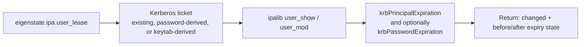



# User Lease Module

Related docs:

<a href="https://gprocunier.github.io/eigenstate-ipa/user-lease-capabilities.html"><kbd>&nbsp;&nbsp;USER LEASE CAPABILITIES&nbsp;&nbsp;</kbd></a>
<a href="https://gprocunier.github.io/eigenstate-ipa/user-lease-use-cases.html"><kbd>&nbsp;&nbsp;USER LEASE USE CASES&nbsp;&nbsp;</kbd></a>
<a href="https://gprocunier.github.io/eigenstate-ipa/ephemeral-access-capabilities.html"><kbd>&nbsp;&nbsp;EPHEMERAL ACCESS CAPABILITIES&nbsp;&nbsp;</kbd></a>
<a href="https://gprocunier.github.io/eigenstate-ipa/aap-integration.html"><kbd>&nbsp;&nbsp;AAP INTEGRATION&nbsp;&nbsp;</kbd></a>
<a href="https://gprocunier.github.io/eigenstate-ipa/documentation-map.html"><kbd>&nbsp;&nbsp;DOCS MAP&nbsp;&nbsp;</kbd></a>

## Purpose

`eigenstate.ipa.user_lease` manages IdM user expiry attributes as an access
boundary, not as generic user CRUD.

Use it when an existing user should become unusable at a defined time by
setting `krbPrincipalExpiration`, optionally with `krbPasswordExpiration`.
This reference covers the exact module surface: authentication, states, time
formats, group-gated assertions, return data, and failure boundaries.

## Contents

- [Write Model](#write-model)
- [Authentication Model](#authentication-model)
- [States](#states)
- [Time Input Formats](#time-input-formats)
- [Governed Group Assertions](#governed-group-assertions)
- [Idempotency](#idempotency)
- [Return Shape](#return-shape)
- [Options Reference](#options-reference)
- [Examples](#examples)
- [Failure Boundaries](#failure-boundaries)

## Write Model



The module reads the current user state from IdM, computes whether the target
expiry attributes need to change, and only then calls `user_mod`.

This is intentionally narrow:

- existing users only
- expiry attributes only
- optional governed-group assertion only
- no user creation, deletion, or broad attribute management

## Authentication Model

The module uses the same `ipalib` and Kerberos stack as `vault_write`.

It can authenticate in three ways:

- `ipaadmin_password`
  obtains a Kerberos ticket before connecting
- `kerberos_keytab`
  obtains a ticket non-interactively; preferred for AAP Execution Environments
- neither password nor keytab
  assumes a valid ticket already exists

> [!IMPORTANT]
> For delegated non-admin operation, the authenticating principal must have
> write access to `krbPrincipalExpiration` on the target user. Managing
> `krbPasswordExpiration` additionally requires write access to that attribute.

## States

### `state: present`

Ensures one or both expiry attributes are set to the requested time.

- `principal_expiration` sets `krbPrincipalExpiration`
- `password_expiration` sets `krbPasswordExpiration`
- `password_expiration_matches_principal: true` sets password expiry to the
  same effective time as principal expiry

### `state: expired`

Sets `krbPrincipalExpiration` to the current UTC time. When
`password_expiration_matches_principal: true` is also set, the password expiry
is set to the same current time.

### `state: cleared`

Removes `krbPrincipalExpiration`. When `clear_password_expiration: true` is
also set, removes `krbPasswordExpiration` too.

## Time Input Formats

For `state: present`, the module accepts these forms:

- generalized UTC: `YYYYmmddHHMMSSZ`
- ISO 8601 UTC: `YYYY-MM-DDTHH:MM:SSZ`
- ISO 8601 UTC without seconds: `YYYY-MM-DDTHH:MMZ`
- `now`
- relative `HH:MM`

Examples:

- `20260409183000Z`
- `2026-04-09T18:30:00Z`
- `2026-04-09T18:30Z`
- `now`
- `02:00`

> [!NOTE]
> Relative durations are evaluated at runtime and are therefore not stable
> across repeated runs. Use absolute times when strict idempotent convergence
> matters.

## Governed Group Assertions

`require_groups` is not an RBAC system. It is a safety check.

The module reads the user's direct IdM group memberships and fails if any
required group is missing. This is useful when the delegated permission itself
is already scoped to members of a governed group and the playbook should refuse
mutations outside that boundary.

## Idempotency

| State | Change condition |
| --- | --- |
| `present` | requested expiry differs from current expiry |
| `expired` | current expiry is not already equal to the current runtime timestamp |
| `cleared` | the selected expiry attribute currently exists |

Two practical points matter:

- absolute expiry values are stable and converge cleanly
- relative `HH:MM` values usually produce a new target time on every run

## Return Shape

```yaml
changed: true | false
username: string
uid: string
principal_expiration_before: string | null
principal_expiration_after: string | null
password_expiration_before: string | null
password_expiration_after: string | null
lease_end: string | null
memberof_group: list[str]
groups_checked: list[str]
```

All expiry values are returned in generalized UTC format.

## Options Reference

| Option | Required | Default | Description |
| --- | --- | --- | --- |
| `username` | yes | — | existing IdM user to modify |
| `state` | no | `present` | `present`, `expired`, or `cleared` |
| `principal_expiration` | no | — | target `krbPrincipalExpiration` for `state: present` |
| `password_expiration` | no | — | target `krbPasswordExpiration` for `state: present` |
| `password_expiration_matches_principal` | no | `false` | reuse the principal expiry time for password expiry |
| `clear_password_expiration` | no | `false` | with `state: cleared`, also remove password expiry |
| `require_groups` | no | `[]` | require the user to belong to all listed groups |
| `server` | yes | `$IPA_SERVER` | FQDN of the IPA server |
| `ipaadmin_principal` | no | `admin` | Kerberos principal to authenticate as |
| `ipaadmin_password` | no | `$IPA_ADMIN_PASSWORD` | password for the principal |
| `kerberos_keytab` | no | `$IPA_KEYTAB` | keytab path; takes precedence over password |
| `verify` | no | `$IPA_CERT` → `/etc/ipa/ca.crt` | IPA CA path for TLS verification. If no CA path is available, set `verify: false` explicitly to opt out. |

## Examples

Set a two-hour lease window:

```yaml
- name: Grant a two-hour lease
  eigenstate.ipa.user_lease:
    username: temp-deploy
    principal_expiration: "02:00"
    server: idm-01.example.com
    kerberos_keytab: /etc/ipa/lease-operator.keytab
    ipaadmin_principal: lease-operator
```

Expire both authentication paths now:

```yaml
- name: End temporary access now
  eigenstate.ipa.user_lease:
    username: temp-maintenance
    state: expired
    password_expiration_matches_principal: true
    require_groups:
      - lease-targets
    server: idm-01.example.com
    kerberos_keytab: /etc/ipa/lease-operator.keytab
    ipaadmin_principal: lease-operator
```

Clear lease state:

```yaml
- name: Remove principal expiry and leave password expiry untouched
  eigenstate.ipa.user_lease:
    username: temp-build
    state: cleared
    server: idm-01.example.com
    ipaadmin_password: "{{ ipa_password }}"
```

## Failure Boundaries

The module fails when:

- the target user does not exist
- the caller requested `state: present` without any target expiry input
- `password_expiration` and `password_expiration_matches_principal` are used together
- a required group is missing
- the authenticated principal lacks IdM write rights for the selected attributes

The module does not revoke already-issued Kerberos tickets. It only changes the
future authentication boundary on the user object.


