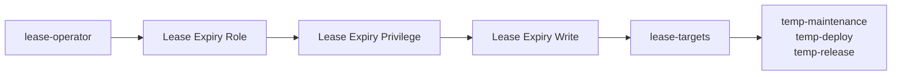



# User Lease RBAC Setup

Related docs:

<a href="https://gprocunier.github.io/eigenstate-ipa/user-lease-plugin.html"><kbd>&nbsp;&nbsp;USER LEASE PLUGIN&nbsp;&nbsp;</kbd></a>
<a href="https://gprocunier.github.io/eigenstate-ipa/user-lease-capabilities.html"><kbd>&nbsp;&nbsp;USER LEASE CAPABILITIES&nbsp;&nbsp;</kbd></a>
<a href="https://gprocunier.github.io/eigenstate-ipa/user-lease-use-cases.html"><kbd>&nbsp;&nbsp;USER LEASE USE CASES&nbsp;&nbsp;</kbd></a>
<a href="https://gprocunier.github.io/eigenstate-ipa/ephemeral-access-capabilities.html"><kbd>&nbsp;&nbsp;EPHEMERAL ACCESS CAPABILITIES&nbsp;&nbsp;</kbd></a>
<a href="https://gprocunier.github.io/eigenstate-ipa/documentation-map.html"><kbd>&nbsp;&nbsp;DOCS MAP&nbsp;&nbsp;</kbd></a>

## Purpose

`eigenstate.ipa.user_lease` assumes the target user and the delegated write
rights already exist in IdM.

This page shows how an IdM operator sets that up in two ways:

- manually with the `ipa` CLI
- declaratively with the official `freeipa.ansible_freeipa` collection

The goal is not generic user administration. The goal is a narrow delegated
model where a non-admin automation user can change `krbPrincipalExpiration`
and, if required, `krbPasswordExpiration` for a governed set of temporary users.

## What This Setup Creates

The delegated `user_lease` pattern usually needs four things:

1. a target group for the users that may be leased
2. one or more temporary users inside that group
3. an operator user that will run `eigenstate.ipa.user_lease`
4. an IdM permission, privilege, and role chain granting expiry-attribute write

Representative names used below:

| Object | Example |
| --- | --- |
| governed target group | `lease-targets` |
| temporary user | `temp-maintenance` |
| delegated operator user | `lease-operator` |
| permission | `Lease Expiry Write` |
| privilege | `Lease Expiry Privilege` |
| role | `Lease Expiry Role` |

## Operating Model



The important design point is that the automation identity does not become a
general IdM admin. It only gets write access to selected expiry attributes on
users who are members of the governed group.

## Before You Start

Decide these up front:

- which users are allowed to become temporary users
- whether password-based auth should expire with the same boundary as the principal
- whether the automation identity should be a user or a service account
- whether the role should be restricted to a dedicated operator user or an operator group

For `user_lease`, a user-based operator identity is the simpler live pattern
because the delegated write target is user attributes.

## Manual CLI Setup

The CLI path is the fastest way to prove the model and matches the shape used in
the lab validation.

### 1. Create the governed target group

```bash
ipa group-add lease-targets   --desc="Users allowed to be managed by eigenstate.ipa.user_lease"
```

### 2. Create the delegated operator user

```bash
ipa user-add lease-operator   --first=Lease   --last=Operator   --password
```

If the operator will use a keytab rather than a password, set that up using
your normal IdM user-keytab process before using the account from AAP or a
controller.

> [!IMPORTANT]
> Live validation showed that creating the operator user alone is not enough to
> make it immediately usable for non-interactive controller auth. The RBAC
> chain is correct after creation, but the operator credential still needs a
> real usable state before `user_lease` can authenticate with it.

### 3. Create the temporary user

```bash
ipa user-add temp-maintenance   --first=Temp   --last=Maintenance   --password
```

### 4. Put the temporary user in the governed target group

```bash
ipa group-add-member lease-targets   --users=temp-maintenance
```

Repeat that step for every user the delegated operator should be allowed to
lease.

### 5. Create the permission

This is the narrowest useful permission for the module.

```bash
ipa permission-add "Lease Expiry Write"   --right=write   --type=user   --memberof=lease-targets   --attrs=krbPrincipalExpiration   --attrs=krbPasswordExpiration
```

If you do not want the delegated operator to manage password expiry at all, drop
the `krbPasswordExpiration` attribute from this permission.

### 6. Create the privilege and attach the permission

```bash
ipa privilege-add "Lease Expiry Privilege"

ipa privilege-add-permission "Lease Expiry Privilege"   --permissions="Lease Expiry Write"
```

### 7. Create the role and attach the privilege

```bash
ipa role-add "Lease Expiry Role"

ipa role-add-privilege "Lease Expiry Role"   --privileges="Lease Expiry Privilege"
```

### 8. Make the delegated operator a member of the role

```bash
ipa role-add-member "Lease Expiry Role"   --users=lease-operator
```

### 9. Make the operator credential usable for automation

The RBAC setup and the operator credential lifecycle are related, but they are
not the same thing.

In live validation, a freshly created operator user needed an explicit
credential-readiness step before keytab-based `user_lease` execution worked.
A practical manual path was:

```bash
ipa user-mod lease-operator \
  --setattr=krbPasswordExpiration=20300101000000Z

ipa-getkeytab -s idm-01.example.com \
  -p lease-operator \
  -k /etc/ipa/lease-operator.keytab
```

If your workflow stays password-based instead of keytab-based, the same point
still applies: the operator user must have a real usable password state under
your IdM password policy before Controller or Ansible can authenticate as it.

### 10. Verify the setup

Check the permission:

```bash
ipa permission-show "Lease Expiry Write" --all
```

Check the role:

```bash
ipa role-show "Lease Expiry Role" --all
```

Check the governed user membership:

```bash
ipa group-show lease-targets --all
```

### 11. Prove the boundary with `user_lease`

From the controller or bastion, use the delegated operator credentials and the
same group in `require_groups`:

```yaml
- name: Open a lease only for governed users
  eigenstate.ipa.user_lease:
    username: temp-maintenance
    principal_expiration: "00:30"
    password_expiration_matches_principal: true
    require_groups:
      - lease-targets
    server: idm-01.example.com
    kerberos_keytab: /etc/ipa/lease-operator.keytab
    ipaadmin_principal: lease-operator
    verify: /etc/ipa/ca.crt
```

## IdM Operator Playbook

The Ansible path below uses the official `freeipa.ansible_freeipa` collection to
create the same model declaratively.

This playbook is for the IdM operator who is defining the boundary. It is not
the playbook that consumes `eigenstate.ipa.user_lease` later.

It creates the user, group, permission, privilege, and role chain. It does not
by itself guarantee that the delegated operator user is immediately ready for
non-interactive controller authentication. Treat credential enablement as a
separate step.

### Assumptions

- the play runs against an `ipaserver` host or host group
- the official FreeIPA collection is available
- the operator has admin rights to create users, groups, permissions, privileges, and roles

### Example playbook

```yaml
---
- name: Create delegated RBAC for eigenstate.ipa.user_lease
  hosts: ipaserver
  become: true
  gather_facts: false

  vars:
    lease_target_group: lease-targets
    lease_permission: Lease Expiry Write
    lease_privilege: Lease Expiry Privilege
    lease_role: Lease Expiry Role
    lease_operator_user: lease-operator
    lease_target_users:
      - name: temp-maintenance
        first: Temp
        last: Maintenance
      - name: temp-deploy
        first: Temp
        last: Deploy

  tasks:
    - name: Ensure the delegated operator exists
      freeipa.ansible_freeipa.ipauser:
        ipaadmin_password: "{{ ipa_admin_password }}"
        name: "{{ lease_operator_user }}"
        first: Lease
        last: Operator

    - name: Ensure temporary users exist
      freeipa.ansible_freeipa.ipauser:
        ipaadmin_password: "{{ ipa_admin_password }}"
        users: "{{ lease_target_users }}"

    - name: Ensure the governed target group exists
      freeipa.ansible_freeipa.ipagroup:
        ipaadmin_password: "{{ ipa_admin_password }}"
        name: "{{ lease_target_group }}"
        description: Users allowed to be managed by eigenstate.ipa.user_lease

    - name: Ensure temporary users are members of the governed target group
      freeipa.ansible_freeipa.ipagroup:
        ipaadmin_password: "{{ ipa_admin_password }}"
        name: "{{ lease_target_group }}"
        user: "{{ lease_target_users | map(attribute='name') | list }}"
        action: member

    - name: Ensure the expiry-write permission exists
      freeipa.ansible_freeipa.ipapermission:
        ipaadmin_password: "{{ ipa_admin_password }}"
        name: "{{ lease_permission }}"
        object_type: user
        right:
          - write
        attrs:
          - krbPrincipalExpiration
          - krbPasswordExpiration
        memberof: "{{ lease_target_group }}"

    - name: Ensure the lease privilege exists
      freeipa.ansible_freeipa.ipaprivilege:
        ipaadmin_password: "{{ ipa_admin_password }}"
        name: "{{ lease_privilege }}"

    - name: Ensure the permission is a member of the privilege
      freeipa.ansible_freeipa.ipaprivilege:
        ipaadmin_password: "{{ ipa_admin_password }}"
        name: "{{ lease_privilege }}"
        permission:
          - "{{ lease_permission }}"
        action: member

    - name: Ensure the lease role exists
      freeipa.ansible_freeipa.iparole:
        ipaadmin_password: "{{ ipa_admin_password }}"
        name: "{{ lease_role }}"

    - name: Ensure the privilege is attached to the role
      freeipa.ansible_freeipa.iparole:
        ipaadmin_password: "{{ ipa_admin_password }}"
        name: "{{ lease_role }}"
        privilege:
          - "{{ lease_privilege }}"
        action: member

    - name: Ensure the delegated operator is a member of the role
      freeipa.ansible_freeipa.iparole:
        ipaadmin_password: "{{ ipa_admin_password }}"
        name: "{{ lease_role }}"
        user:
          - "{{ lease_operator_user }}"
        action: member
```

## After the play: make the operator credential usable

The declarative RBAC play creates the boundary correctly, but the delegated
operator may still need a separate credential-readiness step before immediate
Controller use.

In the live validation lane, the operator user became usable for keytab-based
`user_lease` execution after an IdM admin set a real future
`krbPasswordExpiration` and then retrieved the keytab.

That means the practical sequence is:

1. run the RBAC play
2. make the operator credential usable under your IdM password policy
3. retrieve or stage the operator keytab if the workflow is keytab-based
4. run the consuming `user_lease` workflow

## Variations

### Principal expiry only

If password-based auth is not part of the workflow, remove
`krbPasswordExpiration` from the permission and only use
`principal_expiration` in `user_lease`.

That is the tighter model.

### Operator group instead of operator user

If multiple approved operators or jobs should hold the same delegated role:

- create an IdM group for lease operators
- add that group to the role instead of a single user
- keep the governed target group separate from the operator group

Do not collapse those two groups together. The first scopes who can act. The
second scopes who can be acted upon.

### Cleanup after the lease

`user_lease` should be the real control.

Later cleanup can still:

- remove the temporary user from `lease-targets`
- disable or delete the temporary user
- archive the lease result or notify an audit system

That cleanup is useful, but it should not be the only thing preventing future access.

## Failure Modes To Expect

If the setup is wrong, these are the most common failures:

- the temporary user is not in the governed target group
- the permission was created without `--memberof=lease-targets`
- the delegated operator was not added to the role
- the permission only includes `krbPrincipalExpiration`, but the play also tries to set password expiry
- the controller play omits `require_groups`, so the group boundary is no longer visible in the workflow

## Recommended Reading Order

After this setup page:

1. read [User Lease Capabilities](https://gprocunier.github.io/eigenstate-ipa/user-lease-capabilities.html)
2. then read [User Lease Use Cases](https://gprocunier.github.io/eigenstate-ipa/user-lease-use-cases.html)
3. use [AAP Integration](https://gprocunier.github.io/eigenstate-ipa/aap-integration.html) if Controller is the execution boundary


