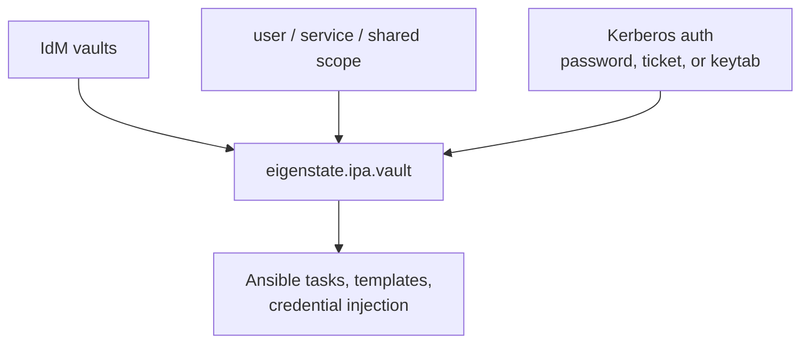
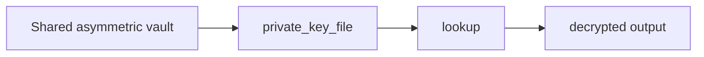
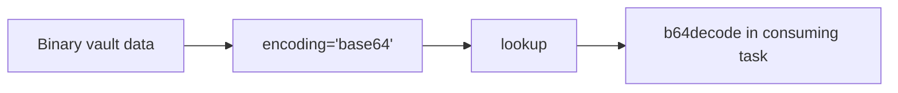
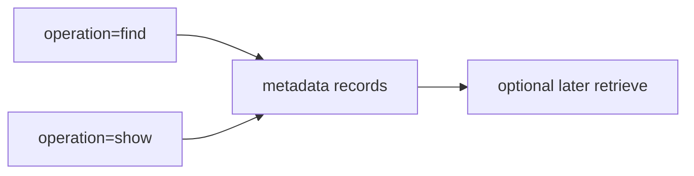
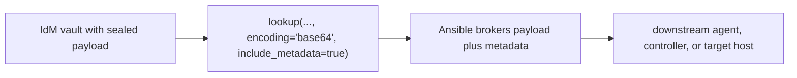
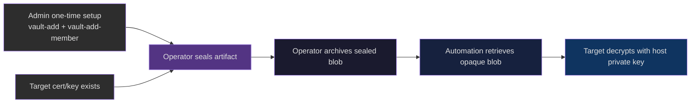
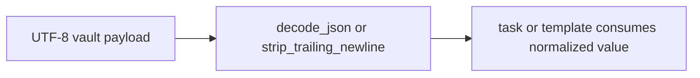

# IdM Vault Capabilities

Nearby docs:

<a href="https://gprocunier.github.io/eigenstate-ipa/vault-plugin.html"><kbd>&nbsp;&nbsp;IDM VAULT PLUGIN&nbsp;&nbsp;</kbd></a>
<a href="https://gprocunier.github.io/eigenstate-ipa/inventory-capabilities.html"><kbd>&nbsp;&nbsp;INVENTORY CAPABILITIES&nbsp;&nbsp;</kbd></a>
<a href="https://gprocunier.github.io/eigenstate-ipa/aap-integration.html"><kbd>&nbsp;&nbsp;AAP INTEGRATION&nbsp;&nbsp;</kbd></a>
<a href="https://gprocunier.github.io/eigenstate-ipa/documentation-map.html"><kbd>&nbsp;&nbsp;DOCS MAP&nbsp;&nbsp;</kbd></a>

## Purpose

Use this guide to choose the major IdM vault retrieval pattern exposed by
`eigenstate.ipa.vault`.

It is the IdM-vault-side companion to the inventory capabilities guide.

## Contents

- [Retrieval Model](#retrieval-model)
- [1. Shared Standard Vaults: Estate-Wide Secret Injection](#1-shared-standard-vaults-estate-wide-secret-injection)
- [2. Shared Symmetric Vaults: Centrally Owned Secret With Extra Unlock Material](#2-shared-symmetric-vaults-centrally-owned-secret-with-extra-unlock-material)
- [3. Shared Asymmetric Vaults: Private-Key-Gated Retrieval](#3-shared-asymmetric-vaults-private-key-gated-retrieval)
- [4. User Vaults: Principal-Scoped Secrets](#4-user-vaults-principal-scoped-secrets)
- [5. Service Vaults: Service-Principal-Scoped Secrets](#5-service-vaults-service-principal-scoped-secrets)
- [6. Binary Retrieval: Keytabs And Opaque Artifacts](#6-binary-retrieval-keytabs-and-opaque-artifacts)
- [7. Rotation And Incident Response](#7-rotation-and-incident-response)
- [8. Metadata Inspection Before Retrieval](#8-metadata-inspection-before-retrieval)
- [9. Brokered Sealed Artifact Metadata Convention](#9-brokered-sealed-artifact-metadata-convention)
- [10. Brokered Sealed Artifact Delivery](#10-brokered-sealed-artifact-delivery)
- [11. Sealed Artifact Full Workflow](#11-sealed-artifact-full-workflow)
  - [IPA Admin Path](#ipa-admin-path)
  - [Delegated Operator Path](#delegated-operator-path)
- [12. Structured Text Payloads](#12-structured-text-payloads)
- [Quick Decision Matrix](#quick-decision-matrix)

## Retrieval Model



Choose the vault pattern that matches both:

- the ownership boundary of the secret
- the runtime form the consuming automation actually needs

## 1. Shared Standard Vaults: Estate-Wide Secret Injection

Use a shared standard vault when the same secret must be consumed by automation
across many hosts or jobs and no extra decryption material should be required at
lookup time.

Typical cases:

- database passwords
- internal service credentials
- API tokens managed centrally


Example:

```yaml
- name: Read a shared database password
  ansible.builtin.set_fact:
    db_password: "{{ lookup('eigenstate.ipa.vault',
                     'database-password',
                     server='idm-01.corp.example.com',
                     ipaadmin_password=lookup('env', 'IPA_ADMIN_PASSWORD'),
                     shared=true,
                     verify='/etc/ipa/ca.crt') }}"
```

Why this pattern fits:

- retrieval is simple
- no additional vault-specific secret material is required
- the ownership model is clear for multi-consumer automation

## 2. Shared Symmetric Vaults: Centrally Owned Secret With Extra Unlock Material

Use a symmetric vault when the automation should retrieve a centrally owned
secret, but the vault itself should still require a second password for
decryption.

Typical cases:

- externally issued API credentials
- partner integration secrets
- staged rotation where the vault password is managed separately from the IdM
  principal


Example:

```yaml
- name: Read a symmetric vault using a password file
  ansible.builtin.set_fact:
    api_key: "{{ lookup('eigenstate.ipa.vault',
                 'partner-api-key',
                 server='idm-01.corp.example.com',
                 kerberos_keytab='/runner/env/ipa/admin.keytab',
                 shared=true,
                 vault_password_file='/runner/env/ipa/partner-api.pass',
                 verify='/etc/ipa/ca.crt') }}"
```

Why this pattern fits:

- the vault remains centrally owned
- decryption requires an additional control
- it works well when the decrypt password is handled by a separate controller
  credential or mounted file

## 3. Shared Asymmetric Vaults: Private-Key-Gated Retrieval

Use an asymmetric vault when the consuming automation should only succeed if it
also possesses a corresponding private key.

Typical cases:

- TLS private key recovery
- PKI artifacts stored under stronger operator control
- secrets intended for a narrow automation boundary



Example:

```yaml
- name: Read a TLS private key from an asymmetric vault
  ansible.builtin.copy:
    content: "{{ lookup('eigenstate.ipa.vault',
                  'wildcard-tls-key',
                  server='idm-01.corp.example.com',
                  kerberos_keytab='/runner/env/ipa/admin.keytab',
                  shared=true,
                  private_key_file='/runner/env/ipa/tls-recovery.pem',
                  verify='/etc/ipa/ca.crt') }}"
    dest: /etc/pki/tls/private/wildcard.key
    mode: "0600"
```

Why this pattern fits:

- access is tied to possession of the private key
- authorization is not based only on IdM principal rights
- it reduces accidental broad retrievability for sensitive material

## 4. User Vaults: Principal-Scoped Secrets

Use a user vault when the secret belongs to one named user principal rather than
to a shared automation domain.

Typical cases:

- per-user tokens
- personal signing material
- isolated operator bootstrap data


Example:

```yaml
- name: Read a user-owned secret
  ansible.builtin.debug:
    msg: "{{ lookup('eigenstate.ipa.vault',
             'my-bootstrap-token',
             server='idm-01.corp.example.com',
             kerberos_keytab='/runner/env/ipa/admin.keytab',
             username='appuser',
             verify='/etc/ipa/ca.crt') }}"
```

Why this pattern fits:

- ownership stays aligned with a single principal
- it avoids pushing personal material into a shared vault namespace

## 5. Service Vaults: Service-Principal-Scoped Secrets

Use a service vault when the secret belongs to a service principal boundary.

Typical cases:

- application service credentials
- daemon-specific tokens
- automation that manages service identity rather than human identity


Example:

```yaml
- name: Read a service-principal secret
  ansible.builtin.set_fact:
    service_secret: "{{ lookup('eigenstate.ipa.vault',
                         'oidc-client-secret',
                         server='idm-01.corp.example.com',
                         ipaadmin_password=lookup('env', 'IPA_ADMIN_PASSWORD'),
                         service='HTTP/app.corp.example.com',
                         verify='/etc/ipa/ca.crt') }}"
```

Why this pattern fits:

- the vault boundary mirrors the service identity boundary
- service secrets stay out of generic shared namespaces

## 6. Binary Retrieval: Keytabs And Opaque Artifacts

Use `encoding='base64'` when the vault content is not reliably text.

Typical cases:

- keytabs
- PKCS#12 bundles
- opaque binary blobs passed to another tool



Example:

```yaml
- name: Install service keytab from IdM vault
  ansible.builtin.copy:
    content: "{{ lookup('eigenstate.ipa.vault',
                  'service-keytab',
                  server='idm-01.corp.example.com',
                  kerberos_keytab='/runner/env/ipa/admin.keytab',
                  shared=true,
                  encoding='base64',
                  verify='/etc/ipa/ca.crt') | b64decode }}"
    dest: /etc/krb5.keytab
    mode: "0600"
```

Why this pattern fits:

- it preserves binary integrity through the lookup boundary
- the consuming task decides how and where to materialize the file

> [!CAUTION]
> Do not rely on the default `utf-8` return mode for binary payloads. Use
> `base64` intentionally when the content is a keytab, archive, bundle, or any
> other opaque byte sequence.

## 7. Rotation And Incident Response

Use IdM vault lookups when you need automation to consume the latest rotated
secret without changing repository content.

Typical cases:

- rotating a shared API key
- replacing a TLS certificate and private key bundle
- swapping breakglass credentials during an incident

The operational advantage is:

- rotate in IdM
- rerun the job
- let the lookup resolve the new value at execution time

That keeps secret version changes out of Git and out of static inventory.

## 8. Metadata Inspection Before Retrieval

Use `operation='show'` or `operation='find'` when the caller needs to inspect
vault metadata before deciding whether payload retrieval is appropriate.

Typical cases:

- delegated operators validating that a vault exists in their own scope
- controller flows that need to search for a matching vault name first
- playbooks that should fail earlier with scope and type context



Why this pattern fits:

- it separates discovery from secret consumption
- it makes scope and vault type visible earlier in the workflow
- it reduces guesswork for non-admin callers working inside narrow boundaries

## 9. Brokered Sealed Artifact Metadata Convention

Use a consistent metadata shape when the vault is holding an opaque artifact
that will be brokered by Ansible and consumed elsewhere.

Recommended fields:

- vault name:
  - describe the artifact class and consumer boundary, for example
    `payments-bootstrap-bundle` or `cluster-sealed-payload`
- description:
  - include the artifact format, the intended consumer, and the final trust
    boundary, for example `sealed bootstrap bundle for payments-agent`
- type:
  - keep the IdM vault type explicit
  - use `standard` for opaque sealed blobs unless the vault itself needs a
    second unlock material
- routing hint:
  - keep the playbook decision in metadata, not in ad hoc task names

Example convention:

```yaml
sealed_artifact:
  vault_name: payments-bootstrap-bundle
  description: sealed bootstrap bundle for payments-agent
  consumer: payments-agent
  final_boundary: target-host
  format: base64
```

Why this pattern fits:

- the lookup can return payload plus context in one record
- the playbook does not need to infer handling from the artifact bytes
- future operators can understand the flow from the vault record itself

## 10. Brokered Sealed Artifact Delivery

Use this pattern when the vault is storing an encrypted or sealed artifact that
Ansible should transport, but not interpret.

Typical cases:

- an encrypted TLS bundle delivered to a target host for final local unwrap
- a bootstrap payload handed to another controller or agent
- a sealed blob that should stay opaque inside the automation layer



Why this pattern fits:

- IdM stays the access-control and storage boundary
- Ansible can deliver the artifact without turning it into plaintext logic
- metadata can travel with the payload so the playbook can route it safely

This is not a HashiCorp Vault-style sealing controller or an Ansible Vault
replacement. The collection retrieves and brokers the artifact. The downstream
system is still responsible for final consumption or unseal.

## 11. Sealed Artifact Full Workflow

The sections above describe the brokered delivery pattern conceptually. This
section covers the full end-to-end workflow with commands, for both the IPA
admin path and a delegated operator path where admin rights are not required
after initial vault setup.

### The Key Distribution Problem

A sealed artifact can only be opened by the target host's private key. That
key never moves. The sealer only needs the target's public certificate — which
IdM can issue for an enrolled host and which is not sensitive material.

In practice, enrollment and certificate materialization are separate concerns:

- `ipa-client-install` gives the host its enrolled IdM identity
- a CMS-usable X.509 cert/private-key pair may still need to be requested with
  certmonger before this workflow will work

Do not assume the target already has a decryptable host cert just because it is
enrolled. Verify with `getcert list` or `ipa-getcert list` first.

```mermaid
flowchart LR
    subgraph prep["Target Preparation"]
        enroll["Host enrolled in IdM"]
        certreq["Request host cert with certmonger\nif no cert/key exists yet"]
        hostpair["Host X.509 cert + private key\nprivate key never leaves target"]
        enroll --> certreq --> hostpair
    end

    subgraph seal["Seal"]
        cert["Target public certificate\nnot sensitive"]
        blob["Sealed binary blob"]
        cert -->|"openssl cms -encrypt -recip host-cert.pem"| blob
    end

    subgraph store["Store"]
        vault["IdM vault\nKerberos access control"]
        blob -->|"ipa vault-archive"| vault
    end

    subgraph broker["Broker"]
        ansible["eigenstate.ipa.vault\nencoding=base64\nnever sees plaintext"]
        vault -->|"retrieve sealed blob"| ansible
    end

    subgraph unseal["Unseal"]
        deliver["Deliver opaque blob to target"]
        target["openssl cms -decrypt\nusing target private key"]
        ansible --> deliver --> target
    end

    hostpair -. export public cert .-> cert

    style prep fill:#2d2d2d,color:#e0e0e0
    style seal fill:#533483,color:#e0e0e0
    style store fill:#1a1a2e,color:#e0e0e0
    style broker fill:#16213e,color:#e0e0e0
    style unseal fill:#0f3460,color:#e0e0e0
```



### Prerequisite — Confirm A Target Cert/Key Pair Exists

Before sealing anything, confirm the target already has a CMS-usable host
certificate and matching private key. If not, request one explicitly.

Example on the target host:

```bash
getcert list

getcert request \
  -I appserv-01-sealed-artifact \
  -c IPA \
  -k /etc/pki/tls/private/appserv-01-sealed-artifact.key \
  -f /etc/pki/tls/certs/appserv-01-sealed-artifact.pem \
  -K host/appserv-01.idm.corp.lan@IDM.CORP.LAN \
  -D appserv-01.idm.corp.lan \
  -w
```

Use the resulting cert/key paths consistently in both the seal verification and
the final decrypt step.

### IPA Admin Path

```mermaid
flowchart LR
    kinit["kinit admin"]
    prereq["Verify or request target cert/key"]
    export["Export target public cert"]
    verify["openssl x509 -noout -subject -dates"]
    seal["openssl cms -encrypt"]
    vaultadd["ipa vault-add --type standard --shared"]
    archive["ipa vault-archive --shared"]
    retrieve["eigenstate.ipa.vault lookup\nencoding=base64, include_metadata=true"]
    copy["copy sealed blob to target"]
    unseal["openssl cms -decrypt\nusing target cert/key"]
    cleanup["remove sealed blob"]

    prereq --> export --> verify --> seal --> vaultadd --> archive --> retrieve --> copy --> unseal --> cleanup
    kinit --> export

    style kinit fill:#2d2d2d,color:#e0e0e0
    style prereq fill:#2d2d2d,color:#e0e0e0
    style export fill:#533483,color:#e0e0e0
    style verify fill:#533483,color:#e0e0e0
    style seal fill:#533483,color:#e0e0e0
    style vaultadd fill:#1a1a2e,color:#e0e0e0
    style archive fill:#1a1a2e,color:#e0e0e0
    style retrieve fill:#16213e,color:#e0e0e0
    style copy fill:#0f3460,color:#e0e0e0
    style unseal fill:#0f3460,color:#e0e0e0
    style cleanup fill:#0f3460,color:#e0e0e0
```



Use this when the operator has full IdM admin rights and owns the vault
directly.

**Step 1 — Ensure the target has a usable host cert/key pair**

```bash
getcert list
```

If no suitable cert exists yet, request one on the target host:

```bash
getcert request \
  -I appserv-01-sealed-artifact \
  -c IPA \
  -k /etc/pki/tls/private/appserv-01-sealed-artifact.key \
  -f /etc/pki/tls/certs/appserv-01-sealed-artifact.pem \
  -K host/appserv-01.idm.corp.lan@IDM.CORP.LAN \
  -D appserv-01.idm.corp.lan \
  -w
```

**Step 2 — Export the host certificate**

```bash
kinit admin

# Use whichever export path your environment supports.
# Example: copy the cert from the target after certmonger issued it.
scp root@appserv-01.idm.corp.lan:/etc/pki/tls/certs/appserv-01-sealed-artifact.pem \
  appserv-01.pem

openssl x509 -in appserv-01.pem -noout -subject -dates
```

The host certificate is not sensitive. Any authenticated principal can read it.

**Step 3 — Seal the artifact**

```bash
openssl cms -encrypt \
  -in artifact.bin \
  -out sealed.bin \
  -recip appserv-01.pem \
  -aes256 \
  -binary \
  -outform DER
```

Only `appserv-01` can decrypt this. The operator cannot unseal what they just
sealed.

**Step 4 — Create the vault and archive the sealed blob**

```bash
ipa vault-add appserv-01-bootstrap \
  --type standard \
  --shared

ipa vault-archive appserv-01-bootstrap \
  --in sealed.bin \
  --shared

ipa vault-show appserv-01-bootstrap --shared
```

**Step 5 — Retrieve and deliver via Ansible**

```yaml
- name: Deliver sealed bootstrap artifact
  hosts: appserv-01.idm.corp.lan
  gather_facts: false

  tasks:
    - name: Retrieve sealed blob from IdM vault
      ansible.builtin.set_fact:
        sealed_artifact: "{{ lookup('eigenstate.ipa.vault',
                             'appserv-01-bootstrap',
                             server='idm-01.idm.corp.lan',
                             kerberos_keytab='/runner/env/ipa/admin.keytab',
                             shared=true,
                             encoding='base64',
                             result_format='record',
                             include_metadata=true,
                             verify='/etc/ipa/ca.crt') }}"
      delegate_to: localhost
      run_once: true

    - name: Write sealed blob to target
      ansible.builtin.copy:
        content: "{{ sealed_artifact.value | b64decode }}"
        dest: /var/lib/bootstrap/sealed.bin
        mode: "0600"
        owner: root
        group: root

    - name: Unseal artifact on target
      ansible.builtin.command:
        cmd: >
          openssl cms -decrypt
          -in /var/lib/bootstrap/sealed.bin
          -recip /etc/pki/tls/certs/appserv-01-sealed-artifact.pem
          -inkey /etc/pki/tls/private/appserv-01-sealed-artifact.key
          -inform DER
          -out /var/lib/bootstrap/artifact.bin

    - name: Remove sealed blob
      ansible.builtin.file:
        path: /var/lib/bootstrap/sealed.bin
        state: absent
```

Do not assume a cert at `/etc/pki/tls/certs/` exists automatically just because
the host is enrolled. Verify the exact cert/key paths with `getcert list` or
`ipa-getcert list` and use those paths consistently.

If you are validating the decrypt step directly on the automation controller
instead of on the target host, make sure the play has permission to read the
certificate and private key. In the lab, controller-side decrypt on
the example controller required `become: true` because the host key material was
root-readable only.

### Delegated Operator Path



Use this when the operator does not have IdM admin rights. An admin creates
the vault and delegates access once. All subsequent operations run under the
operator's own principal.

| Step | Requires IdM admin? | Who acts |
| --- | --- | --- |
| Read host cert | No | Any authenticated principal |
| Seal artifact | No | Any operator |
| Create vault | Yes | IdM admin, one time |
| Delegate vault access | Yes | IdM admin, one time |
| Archive sealed blob | No | Delegated operator |
| Retrieve via Ansible | No | Service principal with vault membership |
| Unseal on host | No | Target host or local process |

**Admin one-time setup**

```bash
kinit admin

ipa vault-add appserv-01-bootstrap \
  --type standard \
  --shared

# Grant the delegated operator write access
ipa vault-add-member appserv-01-bootstrap \
  --shared \
  --users operator-principal

# Grant the automation service principal read access
ipa vault-add-member appserv-01-bootstrap \
  --shared \
  --services "HTTP/automation.idm.corp.lan"
```

**Operator steps — no admin rights required after this point**

```bash
# Authenticate as the delegated operator
kinit operator-principal

# Ensure the target cert/key pair exists first
getcert list

# Export or copy the host certificate using a method your environment supports
scp root@appserv-01.idm.corp.lan:/etc/pki/tls/certs/appserv-01-sealed-artifact.pem \
  appserv-01.pem

# Seal the artifact locally
openssl cms -encrypt \
  -in artifact.bin \
  -out sealed.bin \
  -recip appserv-01.pem \
  -aes256 \
  -binary \
  -outform DER

# Archive to the vault — operator is a member, no admin ticket required
ipa vault-archive appserv-01-bootstrap \
  --in sealed.bin \
  --shared
```

The Ansible retrieval and unseal steps are identical to the admin path. The
only difference is which principal the service keytab belongs to.

In this pattern, the collection returns the sealed artifact as a
base64-encoded structured record with:

- `encoding='base64'`
- `result_format='record'`
- `include_metadata=true`

and the resulting blob is only decryptable by the intended target that holds
the matching private key.

> [!NOTE]
> For a tighter ownership boundary, use a service-scoped vault tied to
> `host/appserv-01.idm.corp.lan` rather than a shared vault. This limits
> retrieval to principals explicitly granted access to that service scope.

> [!CAUTION]
> If the host certificate is renewed or replaced after the artifact is sealed,
> the sealed blob cannot be decrypted with the new key pair. Re-seal against
> the current cert and re-archive before the next delivery run.

## 12. Structured Text Payloads

Use the text-normalization helpers when the vault payload is text, but the
consumer really wants structured data or newline-free values.

Typical cases:

- JSON application configuration
- tokens or passwords accidentally stored with a final newline
- controller injectors that should receive parsed fields instead of a raw blob



Why this pattern fits:

- JSON secrets can be returned as native data instead of reparsed later
- password-like values can be normalized at the lookup boundary
- the consuming task gets cleaner, less repetitive templating logic

## Quick Decision Matrix

| Need | Best pattern |
| --- | --- |
| Simple centrally shared text secret | shared standard vault |
| Centrally shared secret with extra unlock material | shared symmetric vault |
| Secret gated by private-key possession | shared asymmetric vault |
| Principal-owned secret | user vault |
| Service-identity-owned secret | service vault |
| Binary artifact | any of the above with `encoding='base64'` |
| Inspect before retrieving | `operation='show'` or `operation='find'` |
| Brokered sealed artifact | consistent metadata convention plus `include_metadata=true` |
| Opaque encrypted artifact with routing context | `encoding='base64'` plus `include_metadata=true` |
| Parsed JSON or trimmed text | `decode_json=true` or `strip_trailing_newline=true` |

For option-level behavior, failure modes, and exact lookup syntax, return to
<a href="https://gprocunier.github.io/eigenstate-ipa/vault-plugin.html"><kbd>IDM VAULT PLUGIN</kbd></a>.
