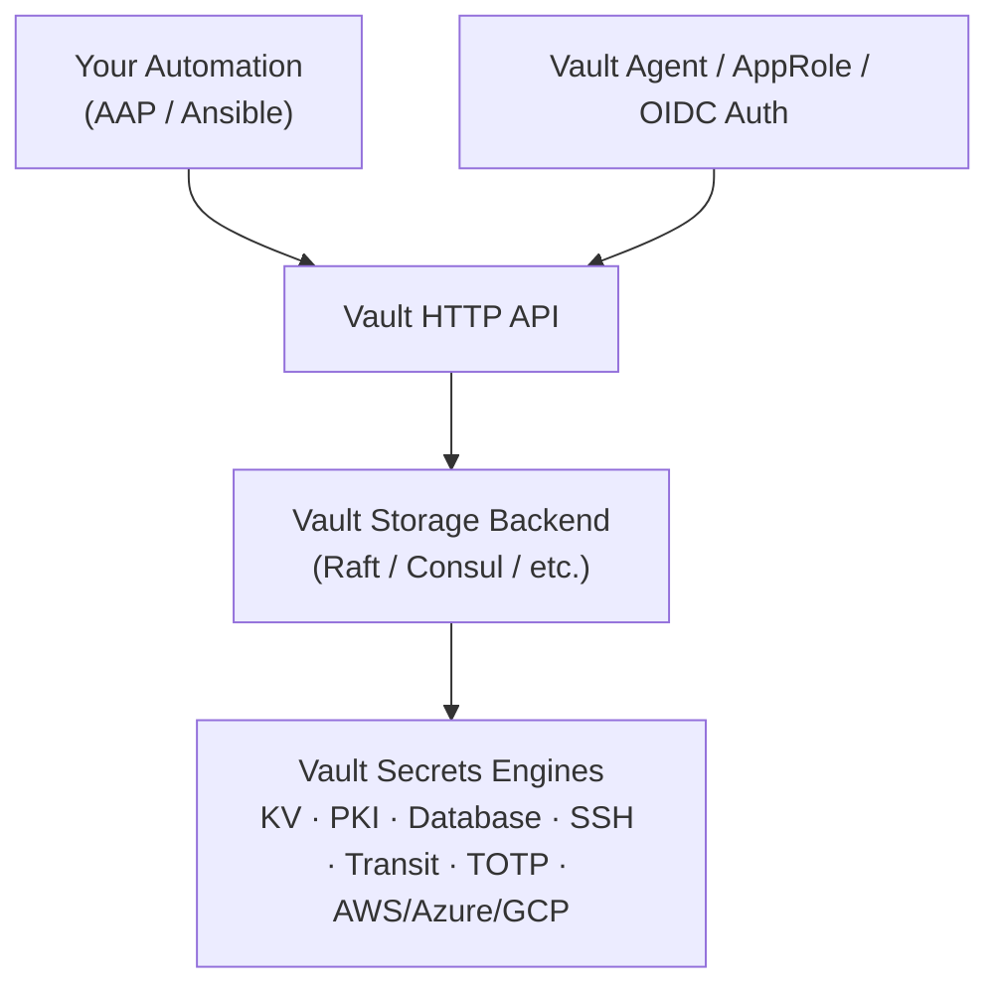
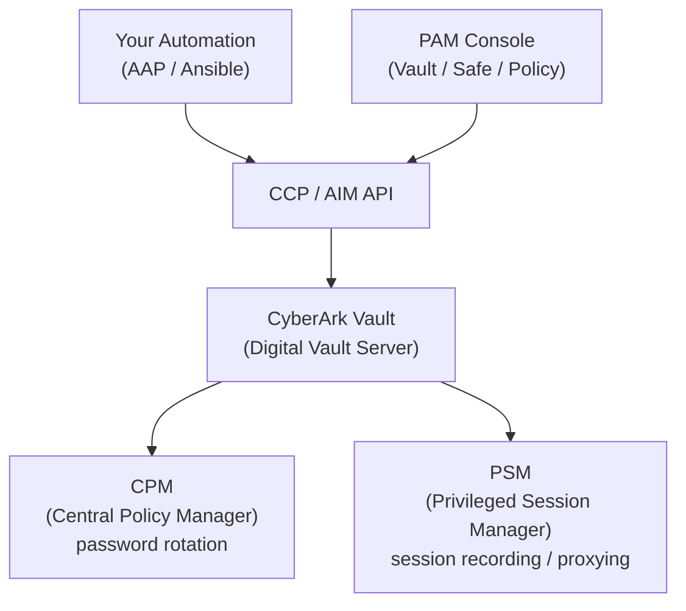
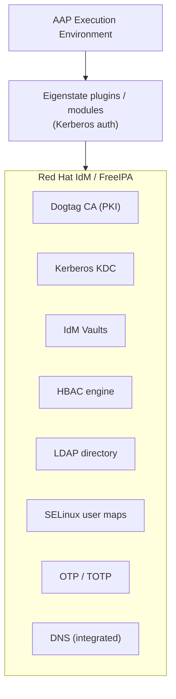



# Vault And CyberArk Primer

Related docs:

<a href="https://gprocunier.github.io/eigenstate-ipa/rotation-capabilities.html"><kbd>&nbsp;&nbsp;ROTATION CAPABILITIES&nbsp;&nbsp;</kbd></a>
<a href="https://gprocunier.github.io/eigenstate-ipa/rotation-use-cases.html"><kbd>&nbsp;&nbsp;ROTATION USE CASES&nbsp;&nbsp;</kbd></a>
<a href="https://gprocunier.github.io/eigenstate-ipa/aap-integration.html"><kbd>&nbsp;&nbsp;AAP INTEGRATION&nbsp;&nbsp;</kbd></a>
<a href="https://gprocunier.github.io/eigenstate-ipa/vault-write-capabilities.html"><kbd>&nbsp;&nbsp;VAULT WRITE CAPABILITIES&nbsp;&nbsp;</kbd></a>
<a href="https://gprocunier.github.io/eigenstate-ipa/keytab-capabilities.html"><kbd>&nbsp;&nbsp;KEYTAB CAPABILITIES&nbsp;&nbsp;</kbd></a>
<a href="https://gprocunier.github.io/eigenstate-ipa/cert-capabilities.html"><kbd>&nbsp;&nbsp;CERT CAPABILITIES&nbsp;&nbsp;</kbd></a>
<a href="https://gprocunier.github.io/eigenstate-ipa/documentation-map.html"><kbd>&nbsp;&nbsp;DOCS MAP&nbsp;&nbsp;</kbd></a>

## Purpose

Use this guide when you already understand HashiCorp Vault or CyberArk and you
want to know where `eigenstate.ipa` overlaps, where it is stronger inside an
IdM-centric estate, and where it is not a substitute.

This is a comparison and positioning document, not a plugin reference page. It
is meant to answer the adoption question honestly for RHEL- and IdM-centric
automation teams.

## Contents

- [Who This Document Is For](#who-this-document-is-for)
- [The Core Argument](#the-core-argument)
- [Architecture: Where Each Product Lives](#architecture-where-each-product-lives)
- [Feature-by-Feature Comparison](#feature-by-feature-comparison)
- [Authentication Model Comparison](#authentication-model-comparison)
- [What Eigenstate Does Not Do](#what-eigenstate-does-not-do)
- [Where the Stack Makes Sense](#where-the-stack-makes-sense)
- [Coexistence Considerations](#coexistence-considerations)
- [Quick Decision Reference](#quick-decision-reference)
- [Further Reading](#further-reading)

This page is a direct capability comparison for operators who already think in
Vault or CyberArk terms and want to understand the collection on its own
architectural boundaries.

---

## Who This Document Is For

You manage infrastructure on RHEL or OpenShift. You are using HashiCorp Vault, CyberArk,
or both to handle secrets injection, PKI, and privileged access for automation. Someone
has asked you to evaluate whether Eigenstate covers enough of that surface to reduce your
dependency on a third-party product, or whether it can eliminate a tool entirely for your
automation layer.

This document is a direct capability comparison. It is honest about what IdM covers,
what it does not, and where the boundary sits between the two toolchains.

In this document, **Eigenstate** means `eigenstate.ipa` plus the official IdM
collections (`freeipa.ansible_freeipa` / `redhat.rhel_idm`) and AAP, used
together as one automation stack.

> [!NOTE]
> AAP matters in this comparison because it supplies the scheduler, execution
> environment, credential injection, approval path, and controller-side job
> boundary that make Eigenstate's rotation and retrieval workflows operationally
> comparable to the automation-facing experience of Vault or CyberArk. Without
> AAP, the comparison still mostly holds for the IdM-backed capabilities
> themselves: the `eigenstate.ipa` plugins, the official IdM collections, and
> plain Ansible can still retrieve secrets, issue certs, manage keytabs, and
> run pre-flight checks. What drops away is the first-class controller story for
> scheduling, approvals, credential-source wiring, and repeatable EE packaging.
> For the collection's controller-side execution model, see
> https://gprocunier.github.io/eigenstate-ipa/aap-integration.html

---

## The Core Argument

If you run Red Hat IdM (or FreeIPA), you are already operating:

- an X.509 CA (Dogtag PKI)
- a Kerberos KDC with principal lifecycle
- a secrets store (IdM vaults: standard, symmetric, asymmetric)
- an LDAP directory with a rich schema
- a host-based access control engine (HBAC)
- a SELinux user mapping control plane
- an OTP/TOTP system for enrollment and MFA
- DNS (in most deployments)

None of that requires a HashiCorp or CyberArk license. It is included in every RHEL
subscription through Red Hat IdM, or available free through FreeIPA.

Eigenstate surfaces all of this for AAP automation: `eigenstate.ipa` lookup plugins,
inventory, and write paths, plus the official IdM collections where upstream modules
already cover adjacent lifecycle operations. The stack is Kerberos-authenticated and
native to the Ansible task model.

The argument is not that IdM replaces Vault or CyberArk for every environment. It is that
for RHEL-centric shops, IdM already covers a significant portion of the automation
secrets and identity surface, and most organizations are paying for an external tool
to do work their identity infrastructure could do instead.

Where a Vault or CyberArk user perceives a "rotation gap," the right answer is:

- no native automatic rotation engine
- yes controller-scheduled rotation workflows for static IdM-backed assets
- no dynamic secret leases
- yes Ansible-native rotation patterns for vault secrets, keytabs, and certs

---

## Architecture: Where Each Product Lives

### HashiCorp Vault

Vault is a standalone secrets server. Every secret, every certificate, every dynamic
credential lives in Vault. It has its own storage, its own auth methods, and its own
lease/renewal engine. It is a significant operational dependency — it must be highly
available, backed up, unsealed after restarts, and maintained separately from your
identity provider.

### CyberArk

CyberArk's automation-facing surface is the Central Credential Provider (CCP) or
Application Identity Manager (AIM). Automation retrieves credentials from CyberArk
Safes. The platform also covers session recording and privileged session management,
which is distinct from secrets retrieval. CyberArk is primarily a PAM (Privileged
Access Management) platform that also does secrets injection.

### Eigenstate

There is no separate secrets server. IdM is your identity provider — it was already
running. Eigenstate is how you use it from Ansible without shelling out to
`ipa vault-archive` or `kinit && curl`.

---

## Feature-by-Feature Comparison

### Secrets Storage and Retrieval

| Capability | HashiCorp Vault | CyberArk | Eigenstate |
|---|---|---|---|
| Static secret storage | KV v1/v2 | Safe + Account | IdM vault (standard) |
| Secret with extra decrypt material | Transit wrap or KV with external key | Safe-level encryption options | Symmetric vault (password-gated) |
| Private-key-gated secret storage | Cubbyhole + Vault agent | N/A native | Asymmetric vault (public-key-gated) |
| Per-user secret scope | Cubbyhole | Personal Safe | User-scoped vault |
| Per-service secret scope | Namespaces / policies | Application Safe | Service-principal-scoped vault |
| Binary artifact storage | KV with base64 convention | Safe with binary | IdM vault with `encoding='base64'` |
| Static secret update in automation | API write / `vault kv put` | Account update workflow | `vault_write` module `state=archived` |
| Native automatic rotation engine | Yes | Yes (CPM) | No native engine; controller-scheduled rotation workflows for static secrets, keytabs, and certs |
| Vault member management | Vault policies | Safe permissions | `vault_write` members / members_absent |
| Idempotent secret creation | API-level, no native check-mode | N/A | Full Ansible check-mode + idempotency |
| Rotation dry-run / preview | N/A | N/A | `check_mode: true` on vault_write |
| Secret metadata inspection | `kv metadata get` | Safe metadata | `operation=show` or `operation=find` |
| Native Ansible lookup plugin | Community via hvac | CyberArk AAM plugin | `eigenstate.ipa.vault` (built-in) |
| Auth method for automation | AppRole, OIDC, K8s SA, AWS IAM... | AIM / CCP certificate | Kerberos keytab (non-interactive) |

**What IdM does that Vault does not:**

IdM vault ownership is tied to IdM principal boundaries — user vaults, service-principal
vaults, shared vaults — with LDAP-backed access control. The ownership model is the same
model already governing your hosts, users, and services. There is no separate policy
language to learn.

**What Vault does that IdM does not:**

Vault has dynamic secrets engines: it can generate ephemeral database credentials,
time-limited AWS IAM keys, and short-lived API tokens on demand. IdM vaults are static.
`eigenstate.ipa` supports controller-scheduled rotation workflows over those static
assets, but it is not a lease engine. If your primary use case is dynamic short-lived
credential generation, IdM vaults are not the right tool.

---

### PKI — Certificate Lifecycle

| Capability | HashiCorp Vault PKI Engine | CyberArk | Eigenstate |
|---|---|---|---|
| Built-in CA | Yes (internal CA or intermediate) | No (integrates with external CA) | Yes (Dogtag CA, production-grade) |
| CSR signing from Ansible | `vault write pki/sign/role` | External CA workflow | `eigenstate.ipa.cert operation=request` |
| Certificate retrieval by serial | Not native in KV | N/A | `operation=retrieve` |
| Pre-expiry discovery | No native query | Via CyberArk Accounts | `operation=find` with expiry window |
| Batch certificate issuance | Separate API calls | N/A | Multiple principals in one lookup call |
| Cert + private key bundle delivery | Manual assembly | N/A | cert plugin + vault plugin together |
| Certmonger integration | No | No | Native RHEL / IdM pattern |
| Cert expiry in Ansible vars | No native | No | `result_format=map_record` carries metadata |
| Auto-create principal on request | No | No | `add=true` on cert request |
| Subject Alternative Names | Via role config | Via CA | Via CSR |
| Certificate revocation | `vault write pki/revoke` | Via CA | Official IdM modules: `freeipa.ansible_freeipa.ipacert` / `redhat.rhel_idm.ipacert` (`state: revoked`, `revocation_reason`) |

**The PKI argument:**

Vault's PKI engine is genuinely useful, but it requires running Vault as a CA or
integrating it as an intermediate CA in your existing PKI hierarchy. If you run RHEL
with IdM, you already have a production-grade CA in Dogtag. `eigenstate.ipa.cert` gives
you Ansible-native access to it: sign CSRs, retrieve certs, find what's expiring, deploy
cert and key from the same play. No Vault PKI engine, no separate CA infrastructure.

---

### Kerberos and Service Principal Lifecycle

This is a surface that neither HashiCorp Vault nor CyberArk covers at all.

| Capability | HashiCorp Vault | CyberArk | Eigenstate |
|---|---|---|---|
| Keytab retrieval for service principals | No | No | `eigenstate.ipa.keytab` |
| Keytab rotation (generate new keys) | No | No | `retrieve_mode='generate'` |
| Principal existence / state check | No | No | `eigenstate.ipa.principal` |
| Principal keytab presence check | No | No | `has_keytab` in principal lookup |
| Principal disabled / locked state | No | No | `disabled` in principal lookup |
| Principal last authentication time | No | No | `last_auth` in principal lookup |
| Bulk principal audit | No | No | `operation=find` across principal types |
| Pre-flight gates before keytab ops | No | No | principal lookup → conditional keytab |
| Service enrollment automation | No | No | OTP-gated `ipa-client-install` via otp plugin |

Keytab management is one of the highest-friction manual operations in RHEL environments.
When a service is deployed, someone has to run `ipa-getkeytab` manually, transfer the
file securely, and install it. `eigenstate.ipa.keytab` brings that step into the Ansible
lifecycle: the play retrieves the keytab in base64, writes it to the target, and sets
permissions — no out-of-band step.

The `eigenstate.ipa.principal` plugin closes the pre-flight gap: before requesting a
keytab, a play can verify the principal exists, is not disabled, and does or does not
already have a keytab — driving conditional logic rather than failing silently.

---

### Access Policy and Identity Validation

This is the surface where IdM is most differentiated from both Vault and CyberArk.

| Capability | HashiCorp Vault | CyberArk | Eigenstate |
|---|---|---|---|
| Host-based access control engine | No | No (PSM proxies access) | HBAC (native IdM) |
| Live HBAC access test from Ansible | No | No | `eigenstate.ipa.hbacrule operation=test` |
| HBAC rule configuration inspection | No | No | `operation=show` / `operation=find` |
| Pipeline gate on access policy | No | No | HBAC test → fail/proceed |
| SELinux user map inspection | No | No | `eigenstate.ipa.selinuxmap` |
| SELinux confinement pre-flight | No | No | selinuxmap show before deploy |
| Identity-driven inventory groups | No | No | `eigenstate.ipa.idm` inventory plugin |
| Inventory groups from HBAC rules | No | No | `eigenstate.ipa.idm` with HBAC sources |
| Session recording policy | No | PSM (network-layer proxy) | tlog via SSSD + IdM central policy |
| Session recording scope | N/A | SSH/RDP through PSM gateway | SSH, login, su, sudo (on-host tlog-rec) |
| Recording storage / search | N/A | CyberArk Vault / PSM UI | syslog → Rsyslog/Elasticsearch |
| Per-user / per-group recording policy | No | Via Safe/CyberArk policy | IdM-centralized SSSD session_recording keyed off IdM users and groups |

**The HBAC argument:**

HashiCorp Vault can tell you whether a token has a policy granting access to a path.
CyberArk can tell you whether an account is in a Safe. Neither can answer: "Would
this user actually be permitted to log into this host for this service under current
policy?" That question lives in IdM.

`eigenstate.ipa.hbacrule` with `operation=test` runs the FreeIPA hbactest engine live
and returns an allow/deny decision with the matching rule name. A compliance play can
gate on that result before running tasks that assume access is valid.

**The session recording argument:**

CyberArk PSM records sessions by proxying them through a central gateway. tlog takes a
different approach: recording happens on the host, driven by policy distributed centrally
through IdM.

IdM stores session recording policy as directory entries or policy data keyed to
users and groups, and the broader FreeIPA design also contemplates host and host-group
scope. SSSD on each enrolled host queries IdM for that policy and applies it at login
time by invoking `tlog-rec` as the session shell. The recording captures terminal I/O
for SSH, login, su, and sudo sessions, emits JSON to syslog, and flows downstream to
Elasticsearch or any syslog-compatible destination via Rsyslog or Fluentd. Playback is
available via `tlog-play` on the command line or through a web interface.

The architectural difference from CyberArk PSM is where recording happens: tlog records
on the host, while the policy that decides who and what to record can be distributed
centrally through IdM and resolved through host-side SSSD. PSM records by interposing the
connection at a central gateway. Neither architecture is inherently superior — the choice
reflects an organizational security posture decision. An organization that mandates
network-layer session brokering is making an architectural commitment that can be
implemented with CyberArk PSM, Teleport, a hardened bastion with forced commands, or
other tools. tlog is the right answer when that commitment is not a requirement; when it
is, CyberArk PSM is one of several ways to fulfill it, not the only one.

The trade-off for tlog is that recording depends on policy reaching the host via SSSD; a
host that cannot reach IdM falls back to configured defaults. A network-interposing broker
cannot be bypassed this way, which is why some compliance frameworks mandate it.

tlog is a standard component of RHEL and is configurable entirely through IdM policy
and SSSD. No additional license is required.

---

### OTP and Host Enrollment

| Capability | HashiCorp Vault | CyberArk | Eigenstate |
|---|---|---|---|
| TOTP token management | Vault TOTP secrets engine | No | `eigenstate.ipa.otp` |
| HOTP token management | No | No | `eigenstate.ipa.otp` |
| One-time enrollment passwords | Response wrapping (similar concept) | No | `eigenstate.ipa.otp operation=add` |
| Token revocation | Yes | No | `operation=revoke` |
| Token state inspection | No | No | `operation=show` / `operation=find` |
| Non-interactive host enrollment | No native Ansible path | No | OTP token → `ipa-client-install --password` |

Vault's TOTP engine generates tokens but is not integrated with RHEL host enrollment.
IdM's OTP system is the native bootstrap credential for `ipa-client-install`. The OTP
plugin generates a one-time password, delivers it to the target, and triggers enrollment
— closing the loop from "bare metal" to "enrolled IdM host" without manual intervention.

---

### Inventory — Identity as Infrastructure Data

Neither Vault nor CyberArk provides Ansible inventory.

`eigenstate.ipa.idm` builds dynamic inventory directly from IdM:

- **Hosts** → inventory hosts, with `idm_*` metadata variables
- **Host groups** → inventory groups (recursive, cycle-safe)
- **Net groups** → NIS-compatible host groups as inventory groups
- **HBAC rules** → access-scoped inventory groups (e.g., the group of hosts a service is
  permitted on becomes a targetable inventory group)

The result is that your HBAC policy and your Ansible inventory share a single source of
truth. A compliance play targeting "all hosts that this service principal can access"
does not require maintaining a separate inventory file.

---

### Sealed Artifact / Brokered Delivery

Vault has a response wrapping mechanism for single-use secret delivery. IdM's vault
system provides an analogous pattern, fully supported by the collection:

1. Generate a host certificate for the target via `eigenstate.ipa.cert`
2. Seal an artifact with `openssl cms -encrypt` using the target's public cert
3. Archive the sealed blob into an IdM vault via `eigenstate.ipa.vault_write`
4. Ansible retrieves and delivers the opaque blob via `eigenstate.ipa.vault`
5. Only the target host can decrypt it with its private key

The sealed artifact can only be opened by the intended recipient after sealing. Plaintext
exists at the producer or sealing step, but the stored and transported artifact is opaque
thereafter. That is the same source-side trust boundary you accept with any controller-side
sealing workflow, including Vault-style brokered delivery patterns. This is documented in
full in the collection's vault-use-cases guide, including a delegated operator path where
IdM admin rights are not required after initial vault setup.

---

## Authentication Model Comparison

| Product | Primary automation auth | Token lifecycle | Non-interactive path |
|---|---|---|---|
| HashiCorp Vault | AppRole (RoleID + SecretID) or K8s SA | Token TTL + renewal | AppRole with wrapped SecretID |
| CyberArk CCP | Client cert or OS credential | N/A (stateless query) | Machine cert in AIM config |
| Eigenstate | Kerberos keytab | Ticket TTL (~10h, renewable) | Admin keytab on controller |

Kerberos keytab authentication does not require credential bootstrap: there is no
RoleID to provision, no SecretID to rotate, no client cert to issue outside the system
you are already using. The keytab is retrieved via the same `eigenstate.ipa.keytab`
plugin that the collection itself uses for service onboarding. The auth material and
the secrets system are the same system.

One admin keytab, stored as an AAP credential, authenticates the controller to:
- the inventory plugin
- the vault lookup plugin
- the cert plugin
- the keytab plugin
- the OTP plugin
- the HBAC and SELinux inspection plugins

No Vault agent. No sidecar. No AppRole rotation job. No SecretID wrapping workflow.

---

## What Eigenstate Does Not Do

Be direct about the gaps. Do not adopt this collection under a false impression.

**Dynamic secrets.** IdM vaults are static. Vault's database secrets engine, AWS dynamic
credentials, and ephemeral IAM roles have no equivalent in IdM. The collection supports
controller-scheduled rotation workflows for static assets, but not dynamic short-lived
credential issuance or renewal. If your primary Vault use case is generating short-lived
database credentials on demand, IdM is not a substitute.

**Privileged session proxying.** CyberArk PSM proxies SSH/RDP through a controlled jump
host, providing brokered access and centralized session control at the network layer. IdM
does not proxy sessions — access gating happens through HBAC at login time. If your
organization has mandated a network-layer session broker, that is an architectural
decision that CyberArk PSM fulfills, but so do other tools (Teleport, hardened bastions
with forced commands, etc.). This is not a gap unique to IdM; it is a question of whether
your compliance posture requires interposing the connection path at all.

**Cross-platform credential management.** CyberArk manages Windows credentials, Active
Directory accounts, cloud provider IAM, network devices, and more. IdM is RHEL/Linux-
centric. If your privileged access program spans Windows servers, network gear, and cloud
accounts, CyberArk covers scope that IdM cannot.

**Certificate revocation.** The `eigenstate.ipa.cert` plugin covers request, retrieve,
and find but does not have a revoke operation. Revocation is covered by the official
`freeipa.ansible_freeipa.ipacert` and `redhat.rhel_idm.ipacert` modules, both of which
expose `state: revoked`, `state: held`, and `state: released` with `revocation_reason`
for RFC 5280 reason codes. This is not a gap in the ecosystem — it requires pulling in
the official IdM collections alongside `eigenstate.ipa`.

**Write path for access policy.** `eigenstate.ipa.hbacrule` and `eigenstate.ipa.selinuxmap`
are read-only. The official `freeipa.ansible_freeipa` and `redhat.rhel_idm` collections
cover HBAC rule and SELinux map write operations — create, modify, delete, and member
management. This is not a gap in the ecosystem, but it requires using the official IdM
collections alongside `eigenstate.ipa` for policy write workflows.

**Audit trail on secret access.** IdM does log Kerberos authentication and LDAP
operations, but it does not provide a dedicated secrets-access audit log in the way
Vault's audit devices or CyberArk's session logs do. If your compliance requirement is
"show me every time a credential was retrieved, by whom, from where," IdM's native audit
posture may not meet the bar without additional log aggregation.

---

## Where the Stack Makes Sense

Eigenstate is the right answer when:

- Your infrastructure is RHEL-centric and Red Hat IdM is already your identity provider.
- Your secrets use cases are credential injection, TLS automation, keytab lifecycle, and
  PKI, and a controller-scheduled workflow is sufficient for rotation.
- You want Kerberos-authenticated automation without maintaining a separate auth method
  and token rotation job.
- You are paying for HashiCorp Vault primarily to cover PKI and static secrets, and you
  are running IdM anyway.
- You want inventory, access policy, and secret management to share a single source of
  truth rather than maintaining sync between three separate systems.
- The HashiCorp BSL license change introduced procurement friction and you are evaluating
  alternatives.

It is not the right answer when:

- Dynamic ephemeral database credentials or cloud IAM are the primary driver.
- You need cross-platform credential management across Windows, network devices, and cloud
  accounts at scale.
- Your compliance posture mandates a network-layer session broker that interposes the
  connection path (tlog records on-host and does not fulfill this specific architectural
  requirement, though the requirement itself is not CyberArk-specific).
- Your environment is not primarily RHEL/Linux.

---

## Coexistence Considerations

Eigenstate does not require replacing either Vault or CyberArk. The common
incremental path is:

**Use Eigenstate for what IdM does natively:**

- Keytab lifecycle (previously manual or scripted)
- PKI for RHEL-enrolled services (previously via Vault PKI engine or manual certmonger)
- Access validation pre-flights (previously impossible in automation)
- Identity-driven inventory (previously static INI or separate inventory scripts)

**Keep Vault or CyberArk for what they do that IdM cannot:**

- Dynamic database credentials
- Cross-platform secrets (Windows, cloud, network devices)
- Network-layer session brokering where the connection must be interposed (CyberArk PSM,
  Teleport, and similar tools all serve this need; it is an architectural posture
  decision, not a CyberArk-exclusive capability)

This is not an all-or-nothing evaluation. If Eigenstate eliminates two of five Vault
use cases in your environment, that narrows scope, reduces license exposure, and removes
operational complexity even without a full migration.

---

## Quick Decision Reference

| Situation | Recommended path |
|---|---|
| Inject static secrets into automation | IdM vault + `eigenstate.ipa.vault` |
| Update a static credential in automation | `eigenstate.ipa.vault_write` state=archived |
| Issue TLS cert for RHEL service | `eigenstate.ipa.cert` + Dogtag CA |
| Find certs expiring in 30 days | `eigenstate.ipa.cert operation=find` |
| Deploy keytab to enrolled host | `eigenstate.ipa.keytab` |
| Rotate Kerberos keys for a service | `retrieve_mode='generate'` on keytab plugin within one controller-side workflow |
| Verify principal exists before keytab op | `eigenstate.ipa.principal` pre-flight |
| Target plays to access-policy groups | `eigenstate.ipa.idm` with HBAC source |
| Validate access before compliance run | `eigenstate.ipa.hbacrule operation=test` |
| Enroll a bare-metal host non-interactively | `eigenstate.ipa.otp` → ipa-client-install |
| Deliver sealed artifact to host only | cert + vault_write + opaque vault deliver |
| Generate ephemeral DB credentials | Vault dynamic secrets engine |
| Network-layer session brokering | CyberArk PSM, Teleport, hardened bastion |
| Manage Windows/AD privileged accounts | CyberArk |

---

## Further Reading

- Collection source: https://github.com/gprocunier/eigenstate-ipa
- Collection docs: https://gprocunier.github.io/eigenstate-ipa/
- Rotation model: https://gprocunier.github.io/eigenstate-ipa/rotation-capabilities.html
- Rotation workflows: https://gprocunier.github.io/eigenstate-ipa/rotation-use-cases.html
- Red Hat IdM documentation: https://docs.redhat.com/en/documentation/red_hat_enterprise_linux/9/html/managing_idm_users_hosts_and_services/
- Dogtag PKI: https://www.dogtagpki.org/
- FreeIPA: https://www.freeipa.org/


