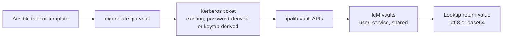



# IdM Vault Plugin

Related docs:

<a href="https://gprocunier.github.io/eigenstate-ipa/vault-capabilities.html"><kbd>&nbsp;&nbsp;IDM VAULT CAPABILITIES&nbsp;&nbsp;</kbd></a>
<a href="https://gprocunier.github.io/eigenstate-ipa/inventory-plugin.html"><kbd>&nbsp;&nbsp;INVENTORY PLUGIN&nbsp;&nbsp;</kbd></a>
<a href="https://gprocunier.github.io/eigenstate-ipa/aap-integration.html"><kbd>&nbsp;&nbsp;AAP INTEGRATION&nbsp;&nbsp;</kbd></a>
<a href="https://gprocunier.github.io/eigenstate-ipa/documentation-map.html"><kbd>&nbsp;&nbsp;DOCS MAP&nbsp;&nbsp;</kbd></a>

## Purpose

`eigenstate.ipa.vault` retrieves, inspects, and searches IdM vaults from
Ansible.

This reference covers:

- how the plugin authenticates to IdM
- which vault ownership scopes it supports
- how retrieval, inspection, and search differ
- how standard, symmetric, and asymmetric vaults differ at lookup time
- how to return text-safe versus binary-safe values

The principal does not need to be a global IdM administrator. It only needs the
rights required to retrieve the specific vaults in its jurisdiction.

## Contents

- [Retrieval Model](#retrieval-model)
- [Authentication Model](#authentication-model)
- [Ownership Scope](#ownership-scope)
- [Operations](#operations)
- [Vault Types](#vault-types)
- [Return Encoding](#return-encoding)
- [Return Shapes And Normalization](#return-shapes-and-normalization)
- [Brokered Artifact Delivery](#brokered-artifact-delivery)
- [Minimal Examples](#minimal-examples)
- [Failure Boundaries](#failure-boundaries)
- [When To Read The Scenario Guide](#when-to-read-the-scenario-guide)

## Retrieval Model



The lookup uses the IdM Python client libraries directly through `ipalib`.
Vault retrieval is not just a REST fetch. The client stack also handles the
transport and vault-specific decryption workflow expected by IdM.

> [!WARNING]
> Lookup results from `eigenstate.ipa.vault` become ordinary Ansible data as
> soon as the lookup returns. They are not automatically masked by the lookup
> plugin. Put `no_log: true` on consuming `set_fact`, `copy`, `template`, or
> module tasks when the payload is sensitive, and avoid `debug:` on retrieved
> secrets.

## Authentication Model

The lookup always operates with a Kerberos credential cache.

It can get there in three ways:

- `ipaadmin_password`:
  - obtains a ticket before connecting
- `kerberos_keytab`:
  - obtains a ticket non-interactively
- neither password nor keytab:
  - assumes a valid existing ticket is already available

> [!IMPORTANT]
> The lookup plugin is more sensitive to missing local dependencies than the
> inventory plugin. It requires `python3-ipalib` and `python3-ipaclient`, and
> often also `krb5-workstation` when a ticket must be acquired dynamically.
> When local secret material is read from `kerberos_keytab`,
> `vault_password_file`, or `private_key_file`, the plugin now warns if the
> file permissions are broader than `0600`.

TLS behavior:

- `verify: /path/to/ca.crt` enables explicit certificate verification
- omitting `verify` first tries `/etc/ipa/ca.crt`
- if no local IdM CA path is available, the lookup now fails unless you set `verify: false` explicitly

That keeps the vault plugin aligned with the inventory plugin while still
respecting `ipalib`'s own controller-side defaults.

## Ownership Scope

Select exactly one vault scope:

- `username`
- `service`
- `shared: true`

If none is selected, the plugin uses the default scope behavior of the IdM API
for the authenticated principal.

In practice:

- use `shared: true` for estate-wide automation secrets
- use `service` when a service principal owns the vault
- use `username` for principal-scoped private vaults

## Operations

The lookup supports three operations:

- `retrieve`:
  - default
  - returns vault payloads
- `show`:
  - returns metadata for the named vaults without retrieving secret material
- `find`:
  - searches the selected scope and returns metadata records

`retrieve` and `show` expect one or more vault names. `find` uses the selected
scope and an optional `criteria` string.

## Vault Types

### Standard Vaults

These require no additional decryption parameters.

Use them when the secret should be retrievable directly once the principal is
authorized.

If the lookup can read vault metadata first, it now rejects symmetric or
asymmetric decryption inputs early for standard vaults.

### Symmetric Vaults

These require one of:

- `vault_password`
- `vault_password_file`

The lookup reads the symmetric password and passes it to the IdM vault retrieve
operation.

If the lookup can inspect the vault metadata first, it now fails early when a
symmetric vault is missing the symmetric password input or when the caller
incorrectly supplies `private_key_file`.

### Asymmetric Vaults

These require:

- `private_key_file`

The private key is read locally and passed into the IdM vault retrieve
operation.

If the lookup can inspect the vault metadata first, it now fails early when an
asymmetric vault is missing `private_key_file` or when the caller incorrectly
supplies symmetric vault password inputs.

## Return Encoding

The lookup returns one list element per requested vault name.

Encoding modes:

- `utf-8`:
  - default
  - best for passwords, tokens, PEM text, and other text payloads
- `base64`:
  - best for keytabs, PKCS#12 bundles, and other binary material

If you need a file on disk from binary content, use `encoding='base64'` and
decode it in the consuming task.

## Return Shapes And Normalization

If you need a structured result instead of a plain value, use
`result_format: record`. Each lookup result then becomes a dictionary with:

- `name`
- `scope`
- `encoding`
- `value`

That is the safer shape when the caller needs to keep track of which vault each
payload came from.

Additional container shapes are also available:

- `result_format: map`
  - returns `{vault_name: value}`
- `result_format: map_record`
  - returns `{vault_name: {name, scope, encoding, value}}`

The mapping forms are useful when several vaults are retrieved in one call and
the playbook should not depend on positional list ordering.

Two text-only helpers are also available for `operation='retrieve'`:

- `decode_json: true`
  - parses the decoded UTF-8 payload as JSON and returns structured data
- `strip_trailing_newline: true`
  - removes one trailing newline from decoded UTF-8 payloads

These helpers are intentionally limited to retrieved text payloads. They do not
apply to `show`, `find`, or `encoding='base64'`.

If you need payload plus vault context in one retrieve call, set
`include_metadata: true` with `result_format: record` or
`result_format: map_record`. Retrieved records then also include:

- `type`
- `description`
- `vault_id`

That is useful when the lookup is brokering an opaque artifact to another
system and the playbook should make routing decisions from vault metadata rather
than from hard-coded assumptions.

For the recommended metadata convention and the full brokered handoff pattern,
see the vault capabilities and use-case guides.

## Brokered Artifact Delivery

The lookup is still a retrieval tool, not an unsealing controller. The useful
extension here is that it can now return broker-friendly records that contain
both:

- the payload
- the vault metadata that describes how the payload should be handled

That is the right shape for encrypted or sealed artifacts that should move
through Ansible unchanged and only be consumed or unwrapped by a downstream
system.

## Minimal Examples

Shared standard vault:

```yaml
- ansible.builtin.debug:
    msg: "{{ lookup('eigenstate.ipa.vault',
             'database-password',
             server='idm-01.example.com',
             ipaadmin_password=lookup('env', 'IPA_ADMIN_PASSWORD'),
             shared=true,
             verify='/etc/ipa/ca.crt') }}"
```

Symmetric vault:

```yaml
- ansible.builtin.set_fact:
    api_key: "{{ lookup('eigenstate.ipa.vault',
                 'api-key',
                 server='idm-01.example.com',
                 kerberos_keytab='/runner/env/ipa/admin.keytab',
                 shared=true,
                 vault_password_file='/runner/env/ipa/vault.pass',
                 verify='/etc/ipa/ca.crt') }}"
```

Binary secret:

```yaml
- ansible.builtin.copy:
    content: "{{ lookup('eigenstate.ipa.vault',
                  'service-keytab',
                  server='idm-01.example.com',
                  ipaadmin_password=lookup('env', 'IPA_ADMIN_PASSWORD'),
                  shared=true,
                  encoding='base64') | b64decode }}"
    dest: /etc/krb5.keytab
    mode: "0600"
```

Structured JSON secret:

```yaml
- ansible.builtin.set_fact:
    app_config: "{{ lookup('eigenstate.ipa.vault',
                    'app-config',
                    server='idm-01.example.com',
                    kerberos_keytab='/runner/env/ipa/team-svc.keytab',
                    shared=true,
                    decode_json=true,
                    verify='/etc/ipa/ca.crt') }}"
```

Inspect metadata without retrieving the payload:

```yaml
- ansible.builtin.set_fact:
    vault_info: "{{ lookup('eigenstate.ipa.vault',
                    'database-password',
                    server='idm-01.example.com',
                    kerberos_keytab='/runner/env/ipa/team-svc.keytab',
                    shared=true,
                    operation='show',
                    result_format='record',
                    verify='/etc/ipa/ca.crt') }}"
```

Find vaults and return a named metadata map:

```yaml
- ansible.builtin.set_fact:
    matching_vaults: "{{ lookup('eigenstate.ipa.vault',
                          server='idm-01.example.com',
                          kerberos_keytab='/runner/env/ipa/team-svc.keytab',
                          shared=true,
                          operation='find',
                          criteria='database',
                          result_format='map_record',
                          verify='/etc/ipa/ca.crt') }}"
```

Broker an encrypted artifact to a downstream system:

```yaml
- ansible.builtin.set_fact:
    sealed_bundle: "{{ lookup('eigenstate.ipa.vault',
                       'payments-bootstrap-bundle',
                       server='idm-01.example.com',
                       kerberos_keytab='/runner/env/ipa/team-svc.keytab',
                       shared=true,
                       encoding='base64',
                       result_format='record',
                       include_metadata=true,
                       verify='/etc/ipa/ca.crt') }}"
```

## Failure Boundaries

Common failure classes are:

- missing `ipalib` libraries on the controller or EE
- no valid Kerberos ticket and no password/keytab supplied
- wrong vault scope, causing a not-found result even when the vault exists
- missing symmetric password or asymmetric private key for the vault type

> [!NOTE]
> An IdM vault lookup failure is often an ownership-scope mismatch rather than a
> missing object. If a vault is present in IdM but the lookup says not found,
> recheck `username`, `service`, and `shared` first.

## When To Read The Scenario Guide

Use <a href="https://gprocunier.github.io/eigenstate-ipa/vault-capabilities.html"><kbd>IDM VAULT CAPABILITIES</kbd></a> when
you need operator patterns rather than option-by-option reference:

- password injection
- API token retrieval
- certificate deployment
- keytab distribution
- rotation and incident-response workflows


