# IdM Vault Use Cases

Nearby docs:

<a href="https://gprocunier.github.io/eigenstate-ipa/vault-plugin.html"><kbd>&nbsp;&nbsp;IDM VAULT PLUGIN&nbsp;&nbsp;</kbd></a>
<a href="https://gprocunier.github.io/eigenstate-ipa/vault-capabilities.html"><kbd>&nbsp;&nbsp;IDM VAULT CAPABILITIES&nbsp;&nbsp;</kbd></a>
<a href="https://gprocunier.github.io/eigenstate-ipa/inventory-use-cases.html"><kbd>&nbsp;&nbsp;INVENTORY USE CASES&nbsp;&nbsp;</kbd></a>
<a href="https://gprocunier.github.io/eigenstate-ipa/documentation-map.html"><kbd>&nbsp;&nbsp;DOCS MAP&nbsp;&nbsp;</kbd></a>

## Purpose

This page contains worked examples for `eigenstate.ipa.vault` against IdM
vaults.

Use the capability guide to choose vault ownership and retrieval patterns. Use
this page when you need the corresponding playbook or controller pattern.

Not every caller is a global IdM administrator. A delegated operator can use
IdM vault lookups inside their own jurisdiction if the vault ownership and IdM
permissions line up with the scope they are responsible for.

## Contents

- [Use Case Flow](#use-case-flow)
- [1. Shared Database Password Injection](#1-shared-database-password-injection)
- [2. Shared API Key From A Symmetric Vault](#2-shared-api-key-from-a-symmetric-vault)
- [3. TLS Private Key Recovery From An Asymmetric Vault](#3-tls-private-key-recovery-from-an-asymmetric-vault)
- [4. Service Keytab Distribution](#4-service-keytab-distribution)
- [5. User-Owned Bootstrap Token](#5-user-owned-bootstrap-token)
- [6. Service-Principal Secret Injection](#6-service-principal-secret-injection)
- [7. Controller Credential-Source Pattern](#7-controller-credential-source-pattern)
- [8. Rotation Without Repository Churn](#8-rotation-without-repository-churn)
- [9. OTP Bootstrap Into Kerberos And Vault Retrieval](#9-otp-bootstrap-into-kerberos-and-vault-retrieval)
- [10. Inspect Vault Metadata Before Retrieval](#10-inspect-vault-metadata-before-retrieval)
- [11. Brokered Sealed Artifact Metadata Convention](#11-brokered-sealed-artifact-metadata-convention)
- [12. Brokered Sealed Artifact Delivery](#12-brokered-sealed-artifact-delivery)
- [13. Structured JSON And Normalized Text Retrieval](#13-structured-json-and-normalized-text-retrieval)
- [Kerberos Is A Good Default Here](#kerberos-is-a-good-default-here)

## Use Case Flow

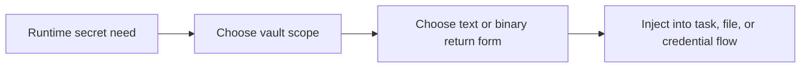

## 1. Shared Database Password Injection

Use a shared standard vault when many jobs need the same text secret and no
extra decrypt material should be involved.

This is a common non-admin pattern when a team owns a shared service and the
vault is scoped to that service or team rather than to the entire IdM domain.

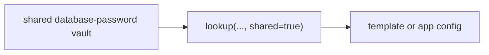

Example:

```yaml
- name: Retrieve database password
  ansible.builtin.set_fact:
    db_password: "{{ lookup('eigenstate.ipa.vault',
                     'database-password',
                     server='idm-01.corp.example.com',
                     kerberos_keytab='/runner/env/ipa/team-svc.keytab',
                     shared=true,
                     verify='/etc/ipa/ca.crt') }}"

- name: Render application config
  ansible.builtin.template:
    src: app.conf.j2
    dest: /etc/myapp/app.conf
```

## 2. Shared API Key From A Symmetric Vault

Use a symmetric vault when the secret is centrally owned but protected by an
additional vault password.

This is also a strong delegated-operator pattern when the operator can read the
vault through a team-scoped principal but the shared password is distributed
through a separate secret channel.

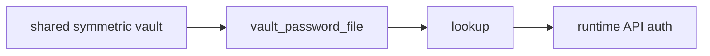

Example:

```yaml
- name: Retrieve partner API key
  ansible.builtin.set_fact:
    partner_api_key: "{{ lookup('eigenstate.ipa.vault',
                          'partner-api-key',
                          server='idm-01.corp.example.com',
                          kerberos_keytab='/runner/env/ipa/team-svc.keytab',
                          shared=true,
                          vault_password_file='/runner/env/ipa/partner-api.pass',
                          verify='/etc/ipa/ca.crt') }}"
```

## 3. TLS Private Key Recovery From An Asymmetric Vault

Use an asymmetric vault when retrieval should require a local private key in
addition to IdM-side authorization.

That is useful for a narrow platform team that is allowed to recover only its
own TLS material.

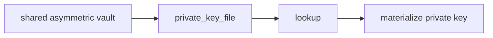

Example:

```yaml
- name: Recover wildcard TLS key
  ansible.builtin.copy:
    content: "{{ lookup('eigenstate.ipa.vault',
                  'wildcard-tls-key',
                  server='idm-01.corp.example.com',
                  kerberos_keytab='/runner/env/ipa/team-svc.keytab',
                  shared=true,
                  private_key_file='/runner/env/ipa/tls-recovery.pem',
                  verify='/etc/ipa/ca.crt') }}"
    dest: /etc/pki/tls/private/wildcard.key
    mode: "0600"
```

## 4. Service Keytab Distribution

When the vault payload is binary, return base64 and decode at the edge.

This is one of the strongest Kerberos-adjacent use cases because the retrieved
artifact is itself a Kerberos credential material.

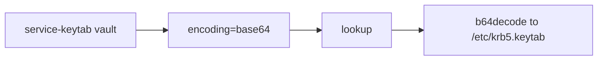

Example:

```yaml
- name: Install service keytab from IdM vault
  ansible.builtin.copy:
    content: "{{ lookup('eigenstate.ipa.vault',
                  'service-keytab',
                  server='idm-01.corp.example.com',
                  kerberos_keytab='/runner/env/ipa/team-svc.keytab',
                  shared=true,
                  encoding='base64',
                  verify='/etc/ipa/ca.crt') | b64decode }}"
    dest: /etc/krb5.keytab
    mode: "0600"
```

## 5. User-Owned Bootstrap Token

Use a user vault when the secret belongs to one user principal rather than to a
shared automation namespace.

This fits a delegated user or application owner who should be able to retrieve
their own bootstrap material without full IdM admin rights.

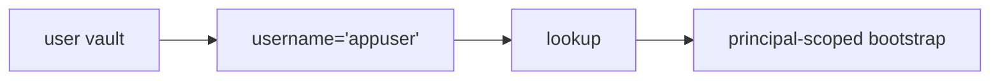

Example:

```yaml
- name: Retrieve bootstrap token for appuser
  ansible.builtin.debug:
    msg: "{{ lookup('eigenstate.ipa.vault',
             'bootstrap-token',
             server='idm-01.corp.example.com',
             kerberos_keytab='/runner/env/ipa/team-svc.keytab',
             username='appuser',
             verify='/etc/ipa/ca.crt') }}"
```

## 6. Service-Principal Secret Injection

Use a service vault when the secret boundary should mirror the service identity.

This is the most natural non-admin service-account pattern in the collection.

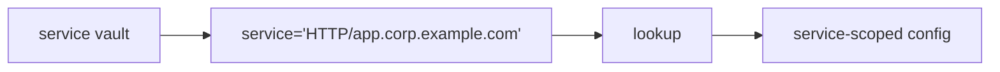

Example:

```yaml
- name: Retrieve OIDC client secret
  ansible.builtin.set_fact:
    oidc_client_secret: "{{ lookup('eigenstate.ipa.vault',
                             'oidc-client-secret',
                             server='idm-01.corp.example.com',
                             kerberos_keytab='/runner/env/ipa/team-svc.keytab',
                             service='HTTP/app.corp.example.com',
                             verify='/etc/ipa/ca.crt') }}"
```

## 7. Controller Credential-Source Pattern

One of the better controller uses is to resolve secrets from IdM at runtime
instead of storing them statically in controller fields.

That pattern is especially useful for delegated operators because the controller
can hold a team keytab rather than a reusable admin password.

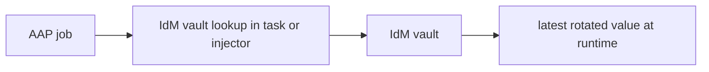

Example:

```yaml
- name: Resolve runtime secret in controller
  ansible.builtin.set_fact:
    runtime_secret: "{{ lookup('eigenstate.ipa.vault',
                         'db-password',
                         server='idm-01.corp.example.com',
                         kerberos_keytab='/runner/env/ipa/team-svc.keytab',
                         shared=true,
                         verify='/runner/env/ipa/ca.crt') }}"
```

## 8. Rotation Without Repository Churn

The operational payoff of the vault plugin is clean reruns after rotation.

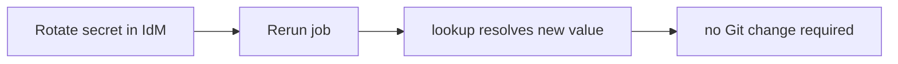

Use this when:

- an API key rotates
- a certificate bundle changes
- a breakglass secret is replaced during incident response

Kerberos is profitable here because the same non-admin service principal can be
used before and after rotation, so the operator rotates the vault content rather
than the auth mechanism.

## 9. OTP Bootstrap Into Kerberos And Vault Retrieval

Use an IdM OTP when the job is not trying to manage a long-lived secret at all,
but instead needs a one-time bootstrap credential that leads into a normal
Kerberos-backed automation flow.

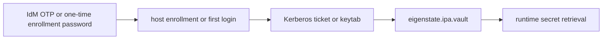

This is the right mental model when the real goal is:

- bootstrap a new host
- complete a first-login or enrollment step
- then switch the automation over to normal vault-backed retrieval

Example:

```yaml
- name: Install a host using an OTP-based enrollment credential
  ansible.builtin.command:
    cmd: >-
      ipa-client-install
      --principal=admin
      --password="{{ otp_enrollment_password }}"
      --unattended

- name: Retrieve the post-enrollment service secret from IdM vault
  ansible.builtin.set_fact:
    app_service_password: "{{ lookup('eigenstate.ipa.vault',
                               'app-service-password',
                               server='idm-01.corp.example.com',
                               kerberos_keytab='/runner/env/ipa/admin.keytab',
                               shared=true,
                               verify='/etc/ipa/ca.crt') }}"
```

Why this matters:

- OTP is doing bootstrap work, not secret lifecycle work
- the actual runtime secret is a different stored vault entry, here named
  `app-service-password`
- the flow stays IdM-native instead of pretending OTP is a dynamic secret engine

> [!NOTE]
> OTP is useful here because it can be consumed once and then disappear from the
> bootstrap path. That makes it a good fit for enrollment and first-login
> workflows, but not a replacement for leased or dynamically issued secrets.

## 10. Inspect Vault Metadata Before Retrieval

Use `operation='show'` or `operation='find'` when the automation needs to
inspect vault metadata before trying to consume the payload.

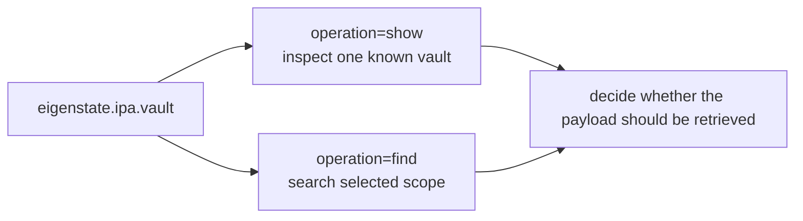

This is useful when:

- a delegated operator wants to confirm the vault exists in their scope
- a controller workflow wants inventory of matching vaults before selecting one
- the playbook should fail earlier with metadata context instead of a late
  retrieval error

Example:

```yaml
- name: Inspect one known vault
  ansible.builtin.set_fact:
    vault_info: "{{ lookup('eigenstate.ipa.vault',
                    'database-password',
                    server='idm-01.corp.example.com',
                    kerberos_keytab='/runner/env/ipa/team-svc.keytab',
                    shared=true,
                    operation='show',
                    result_format='record') }}"

- name: Find matching shared vaults
  ansible.builtin.set_fact:
    matching_vaults: "{{ lookup('eigenstate.ipa.vault',
                          server='idm-01.corp.example.com',
                          kerberos_keytab='/runner/env/ipa/team-svc.keytab',
                          shared=true,
                          operation='find',
                          criteria='database',
                          result_format='map_record') }}"
```

## 11. Brokered Sealed Artifact Metadata Convention

Use a stable metadata convention when the vault is holding a sealed or
encrypted artifact that Ansible will broker to another system.

Recommended fields:

- vault name:
  - include the artifact class and destination boundary, for example
    `payments-bootstrap-bundle` or `cluster-sealed-payload`
- description:
  - say what the artifact is for, who consumes it, and where the final trust
    boundary sits
- type:
  - keep the IdM vault type explicit
  - use `standard` unless the vault itself needs additional unlock material
- format:
  - say whether the payload is `base64`, `utf-8`, or another downstream
    application format

Example metadata:

```yaml
sealed_artifact:
  vault_name: payments-bootstrap-bundle
  description: sealed bootstrap bundle for payments-agent
  consumer: payments-agent
  final_boundary: target-host
  format: base64
```

## 12. Brokered Sealed Artifact Delivery

Use this pattern when IdM should authorize and store an opaque encrypted
artifact, Ansible should deliver it, and a downstream system should do the
final consume or unseal step.

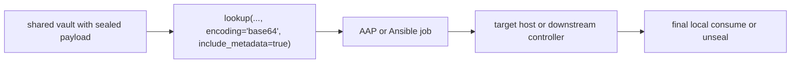

This is useful when:

- a platform team owns a bootstrap bundle that should not live in Git
- the automation runner should not contain unsealing logic
- the target system or a downstream agent is the correct final trust boundary

Detailed example:

```yaml
- name: Retrieve sealed bootstrap bundle and its vault metadata
  ansible.builtin.set_fact:
    bootstrap_bundle: "{{ lookup('eigenstate.ipa.vault',
                           'payments-bootstrap-bundle',
                           server='idm-01.corp.example.com',
                           kerberos_keytab='/runner/env/ipa/payments-svc.keytab',
                           shared=true,
                           encoding='base64',
                           result_format='record',
                           include_metadata=true,
                           verify='/etc/ipa/ca.crt') }}"

- name: Materialize the opaque bundle on the target host
  ansible.builtin.copy:
    content: "{{ bootstrap_bundle.value | b64decode }}"
    dest: /var/lib/payments/bootstrap.bundle
    mode: "0600"

- name: Route handling from vault metadata
  ansible.builtin.debug:
    msg:
      - "vault={{ bootstrap_bundle.name }}"
      - "type={{ bootstrap_bundle.type }}"
      - "description={{ bootstrap_bundle.description }}"

- name: Hand the bundle to the local bootstrap agent
  ansible.builtin.command:
    argv:
      - /usr/local/libexec/payments-bootstrap
      - --bundle
      - /var/lib/payments/bootstrap.bundle
  when: bootstrap_bundle.description is search('bootstrap')
```

What this does well:

- IdM is the authorization and storage boundary
- Kerberos-authenticated automation is the delivery broker
- the artifact stays opaque through the playbook
- the playbook can still make safe routing decisions from vault metadata

What it does not do:

- decrypt or unseal the artifact inside the lookup plugin
- provide lease, renewal, or revocation semantics
- replace a controller that owns the final cryptographic unwrap step

Role-shaped example pattern:

```yaml
- name: Read brokered artifact metadata
  ansible.builtin.set_fact:
    brokered_artifact: "{{ lookup('eigenstate.ipa.vault',
                          sealed_artifact.vault_name,
                          server='idm-01.corp.example.com',
                          kerberos_keytab='/runner/env/ipa/payments-svc.keytab',
                          shared=true,
                          encoding=sealed_artifact.format,
                          result_format='record',
                          include_metadata=true,
                          verify='/etc/ipa/ca.crt') }}"

- name: Materialize brokered artifact
  ansible.builtin.copy:
    content: "{{ brokered_artifact.value | b64decode }}"
    dest: /var/lib/payments/bootstrap.bundle
    mode: "0600"

- name: Hand off to local consumer
  ansible.builtin.command:
    argv:
      - /usr/local/libexec/payments-bootstrap
      - --bundle
      - /var/lib/payments/bootstrap.bundle
  when: brokered_artifact.description is search('bootstrap')
```

## 13. Structured JSON And Normalized Text Retrieval

Use the output helpers when the payload is text but the caller should receive a
cleaner value than the raw stored bytes.

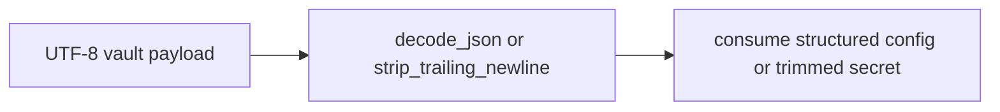

This is useful when:

- application settings are stored as JSON in one vault entry
- a password or token was stored with a final newline
- controller injectors should avoid repeating parsing or trimming logic

Example:

```yaml
- name: Retrieve structured JSON config
  ansible.builtin.set_fact:
    app_config: "{{ lookup('eigenstate.ipa.vault',
                    'app-config',
                    server='idm-01.corp.example.com',
                    kerberos_keytab='/runner/env/ipa/team-svc.keytab',
                    shared=true,
                    decode_json=true,
                    verify='/etc/ipa/ca.crt') }}"

- name: Retrieve a newline-normalized password
  ansible.builtin.set_fact:
    db_password: "{{ lookup('eigenstate.ipa.vault',
                     'database-password',
                     server='idm-01.corp.example.com',
                     kerberos_keytab='/runner/env/ipa/team-svc.keytab',
                     shared=true,
                     strip_trailing_newline=true,
                     verify='/etc/ipa/ca.crt') }}"
```

## Kerberos Is A Good Default Here

Kerberos is especially useful for delegated vault work because:

- a team keytab can be reused without exposing a human password
- AAP and other non-interactive runners can authenticate cleanly
- the same principal can retrieve secrets repeatedly across rotation events
- the caller can stay inside a narrow service or user scope instead of using a
  global admin credential

Use password auth when you are bootstrapping an environment, but prefer
Kerberos for steady-state secret retrieval.

For the decision model behind these scenarios, return to
<a href="https://gprocunier.github.io/eigenstate-ipa/vault-capabilities.html"><kbd>IDM VAULT CAPABILITIES</kbd></a>.
