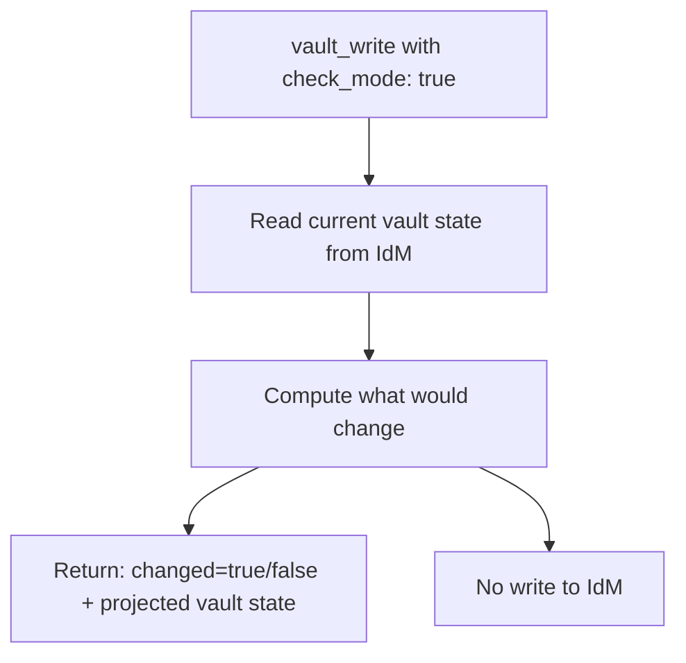
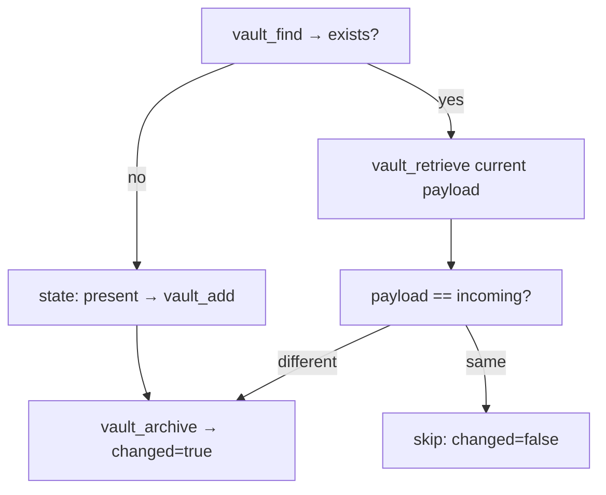
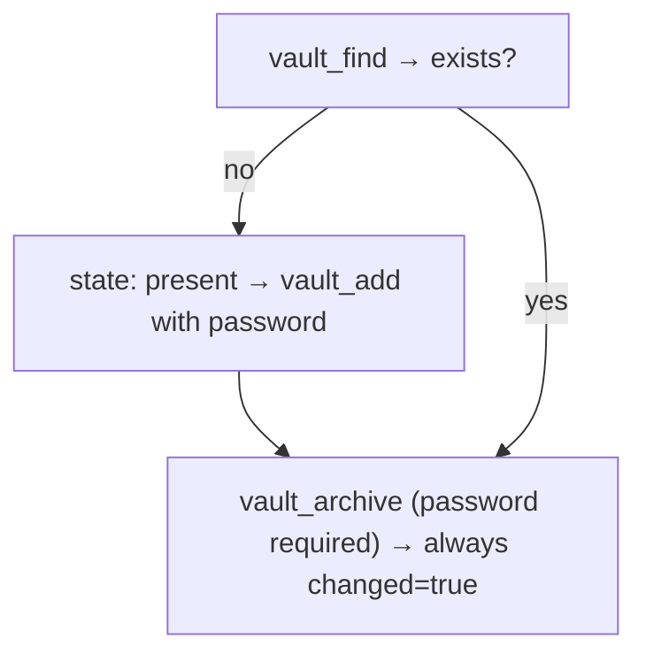
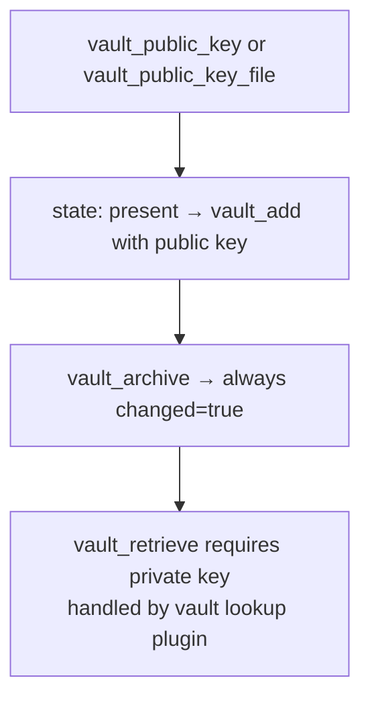
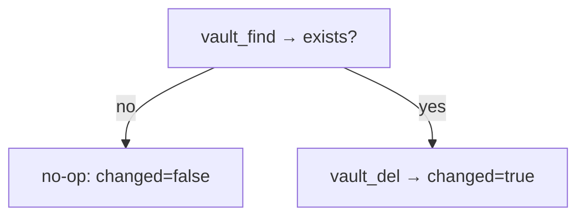
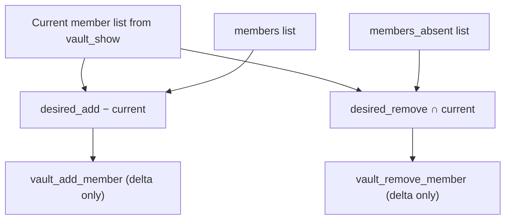
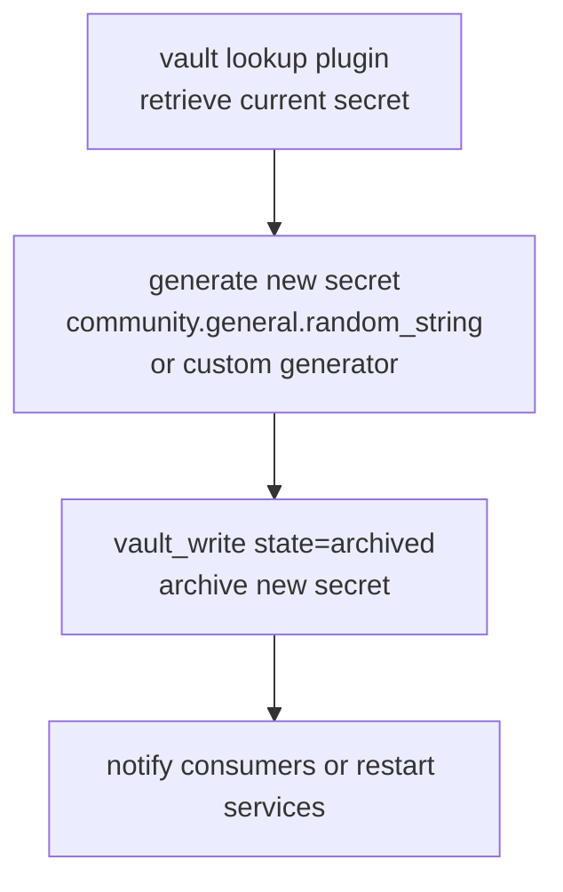
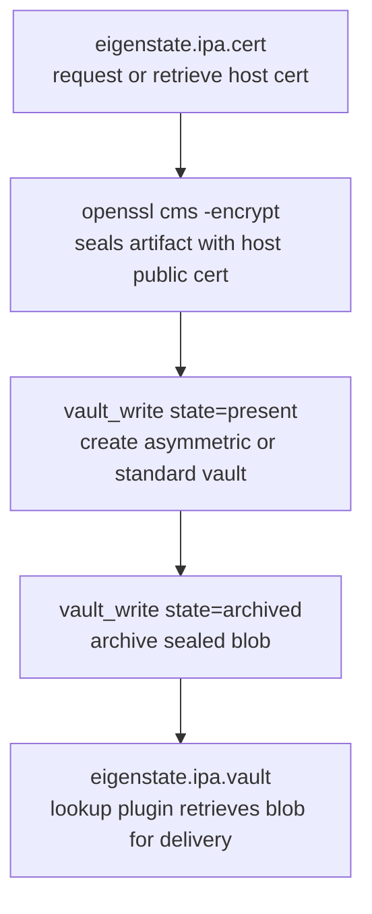
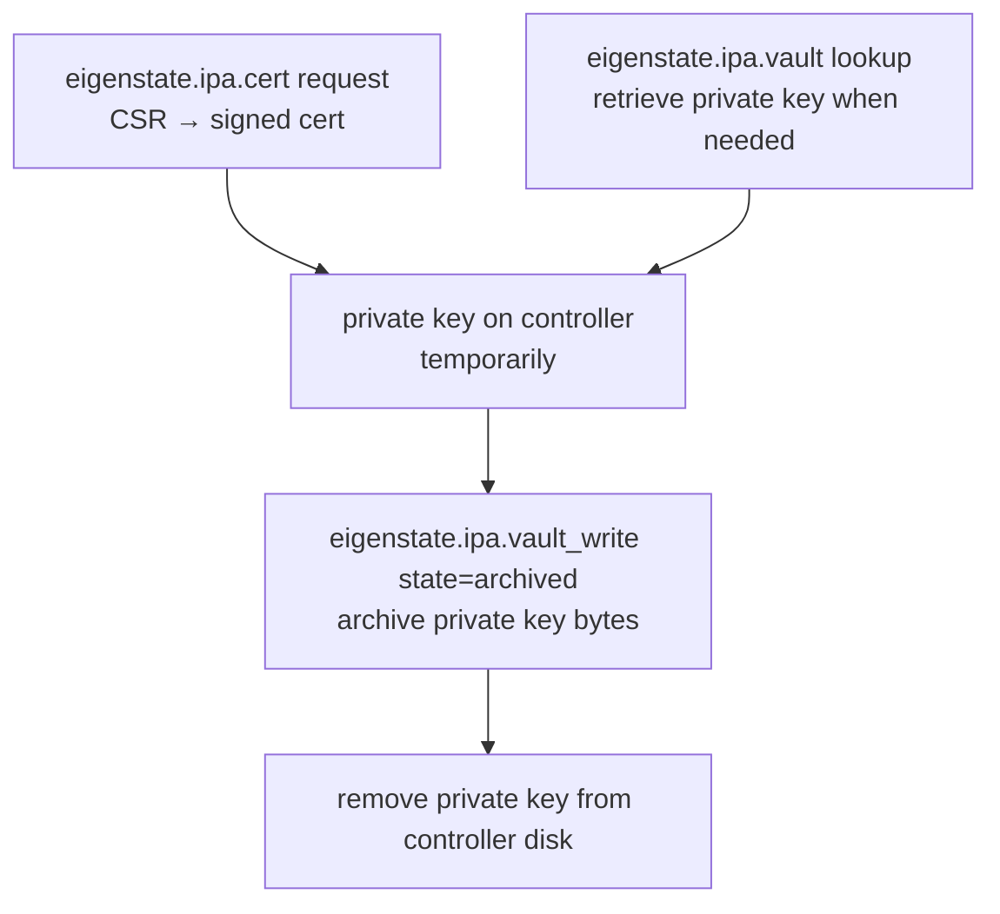

# IdM Vault Write Capabilities

Nearby docs:

<a href="https://gprocunier.github.io/eigenstate-ipa/vault-write-plugin.html"><kbd>&nbsp;&nbsp;VAULT WRITE PLUGIN&nbsp;&nbsp;</kbd></a>
<a href="https://gprocunier.github.io/eigenstate-ipa/vault-write-use-cases.html"><kbd>&nbsp;&nbsp;VAULT WRITE USE CASES&nbsp;&nbsp;</kbd></a>
<a href="https://gprocunier.github.io/eigenstate-ipa/vault-capabilities.html"><kbd>&nbsp;&nbsp;IDM VAULT CAPABILITIES&nbsp;&nbsp;</kbd></a>
<a href="https://gprocunier.github.io/eigenstate-ipa/documentation-map.html"><kbd>&nbsp;&nbsp;DOCS MAP&nbsp;&nbsp;</kbd></a>

## Purpose

Use this guide to choose the right vault write pattern for your automation.

This is the write-path companion to the
<a href="https://gprocunier.github.io/eigenstate-ipa/vault-capabilities.html"><kbd>IDM VAULT CAPABILITIES</kbd></a>
guide. It covers how to create, archive, modify, rotate, and delete vaults,
and how the module behaves differently across vault types.

## Contents

- [Vault Type × Operation Matrix](#vault-type--operation-matrix)
- [Check Mode Behavior](#check-mode-behavior)
- [Idempotency Guarantees Per State](#idempotency-guarantees-per-state)
- [Standard Vault: Create And Archive](#standard-vault-create-and-archive)
- [Symmetric Vault: Extra Unlock Material](#symmetric-vault-extra-unlock-material)
- [Asymmetric Vault: Public-Key-Gated Storage](#asymmetric-vault-public-key-gated-storage)
- [Vault Deletion](#vault-deletion)
- [Member Management Semantics](#member-management-semantics)
- [Rotation Automation Pattern](#rotation-automation-pattern)
- [Sealed Artifact Write Path](#sealed-artifact-write-path)
- [Cross-Plugin Pattern: Cert + Vault Write](#cross-plugin-pattern-cert--vault-write)
- [Quick Decision Matrix](#quick-decision-matrix)

## Vault Type × Operation Matrix

| Vault type | `state: present` | `state: archived` | `state: absent` |
| --- | --- | --- | --- |
| standard | create/update | create if absent → compare payload → archive if different | delete |
| symmetric | create/update | create if absent → always archive | delete |
| asymmetric | create (public key required) | create if absent → always archive | delete |

Changing the vault type of an existing vault is not supported. Delete and
recreate the vault to change its type.

## Check Mode Behavior

The module is fully compatible with Ansible check mode. All write operations
are skipped. The return value reflects the projected state after the
operation would have completed.

Check mode is the recommended approach before running rotation automation in
production. See use case 10 in the use-cases guide for the check-mode
pre-flight pattern.

## Idempotency Guarantees Per State

### `state: present`

- runs `vault_find` before creating
- skips `vault_add` if the vault already exists with the expected properties
- skips `vault_mod` if no properties changed
- catches `EmptyModlist` from IdM and treats it as `changed: false`

### `state: absent`

- runs `vault_find` before deleting
- skips `vault_del` if the vault does not exist
- reports `changed: false` when no deletion was needed

### `state: archived` (standard vault)

- runs the `present` logic first
- if the vault was just created: archives (no current payload exists to compare)
- if the vault already existed: retrieves the current payload via
  `vault_retrieve` and compares bytes to the incoming payload
- skips `vault_archive` if the payloads are identical
- reports `changed: false` when no archive was needed

### `state: archived` (symmetric or asymmetric vault)

- runs the `present` logic first
- always calls `vault_archive`
- always reports `changed: true`

This is the one non-idempotent behavior in the module. It is intentional:
the current ciphertext cannot be compared to the incoming plaintext without
decryption, which would require the decrypt key in-flight. Avoid running
`state: archived` against symmetric or asymmetric vaults in tight loops
unless you expect the change on every run.

> [!NOTE]
> If write-only-when-changed behavior is required for symmetric vaults,
> read the current value out-of-band with the vault lookup plugin and compare
> it in the playbook before calling `vault_write`. The module cannot do this
> safely on its own.

## Standard Vault: Create And Archive

Use a standard vault for the majority of rotation and provisioning automation.

Standard vaults offer the full idempotency guarantee: repeated runs with the
same payload produce no changes.

## Symmetric Vault: Extra Unlock Material

Use a symmetric vault when creation and archive should require an additional
password beyond IdM authorization.

At creation time the module supplies the symmetric vault password to IdM so
the vault can be initialized correctly. The same password is required again
at archive and retrieval time and is never stored by the module.

Design your automation so the password is sourced from a controller
credential or another vault, not from a static variable.

## Asymmetric Vault: Public-Key-Gated Storage

Use an asymmetric vault when the secret should be retrievable only by the
entity that holds the corresponding private key.

The public key is provided once, at creation. Subsequent archive operations
do not require the public key again. The private key is never involved in
the write path — it is required only at retrieval time by the vault lookup
plugin.

## Vault Deletion

`state: absent` is the decommission path.

Deletion is not recoverable. If the vault contains active secrets, retrieve
and store them elsewhere before deleting.

## Member Management Semantics

Member reconciliation is delta-only. The module computes the difference
between the desired state and the current state and only makes the minimum
change.

If `to_add` and `to_remove` are both empty, the member reconciliation step
returns `changed: false` without making any API calls.

Members can be users, groups, or service principals. Pass them by their full
principal name or group name. The module classifies each entry and passes it
to the matching IPA member argument set before calling `vault_add_member` or
`vault_remove_member`. On the live IPA API that means `user`, `group`, and
`services`.

> [!NOTE]
> The `members` and `members_absent` lists are not mutually exclusive at the
> parameter level, but a name that appears in both will be added and then
> immediately removed (or vice versa depending on current state). Avoid
> listing the same principal in both.

## Rotation Automation Pattern

Rotation is the primary operational use case for this module.

For standard vaults, the module compares the current payload before
archiving. If the generator produces the same value (unlikely but possible
for short secrets), the archive step is skipped and the play reports no
change.

For rotation jobs that need to know definitively whether the secret changed,
check `register.changed` after the `vault_write` task.

## Sealed Artifact Write Path

The vault capabilities guide documents a full sealed-artifact delivery
workflow where an operator seals data with a target's public certificate and
archives it into IdM. Previously this required shelling out to `ipa
vault-archive`. With `vault_write`, the archive step is native Ansible.

This is the full Ansible-native path for the pattern described in
<a href="https://gprocunier.github.io/eigenstate-ipa/vault-capabilities.html"><kbd>IDM VAULT CAPABILITIES</kbd></a>
sections 10 and 11.

## Cross-Plugin Pattern: Cert + Vault Write

After requesting a certificate via `eigenstate.ipa.cert`, the private key
is typically on disk at the controller. The sealed artifact pattern archives
it into IdM immediately after issuance so the controller does not hold the
long-term secret.

This closes the gap in the cert plugin workflow where the private key had no
native Ansible home after issuance. The vault becomes the durable private
key store; the controller holds it only transiently.

## Quick Decision Matrix

| Need | Best pattern |
| --- | --- |
| Create a new vault | `state: present` |
| Store a secret | `state: archived` with `data` or `data_file` |
| Rotate a secret in place | retrieve with vault lookup → generate → `state: archived` |
| Delete a vault | `state: absent` |
| Ensure idempotent provisioning in a role | `state: present` + `state: archived` (standard vault) |
| Add a service account to a vault | `state: present` + `members` |
| Remove a decommissioned member | `state: present` + `members_absent` |
| Extra encryption layer over IdM auth | `vault_type: symmetric` |
| Private-key-gated sealed storage | `vault_type: asymmetric` |
| Preview what rotation would do | `check_mode: true` |
| Archive private key after cert issuance | `state: archived` after `eigenstate.ipa.cert` |

For worked scenarios covering each of these, see
<a href="https://gprocunier.github.io/eigenstate-ipa/vault-write-use-cases.html"><kbd>VAULT WRITE USE CASES</kbd></a>.
