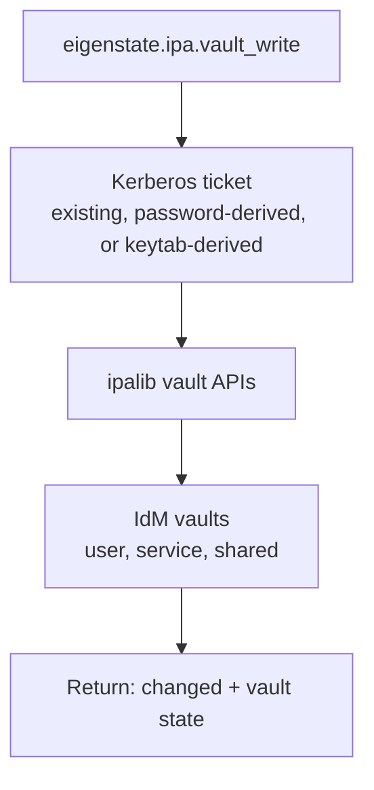

# IdM Vault Write Module

Nearby docs:

<a href="https://gprocunier.github.io/eigenstate-ipa/vault-write-capabilities.html"><kbd>&nbsp;&nbsp;VAULT WRITE CAPABILITIES&nbsp;&nbsp;</kbd></a>
<a href="https://gprocunier.github.io/eigenstate-ipa/vault-write-use-cases.html"><kbd>&nbsp;&nbsp;VAULT WRITE USE CASES&nbsp;&nbsp;</kbd></a>
<a href="https://gprocunier.github.io/eigenstate-ipa/vault-plugin.html"><kbd>&nbsp;&nbsp;IDM VAULT PLUGIN&nbsp;&nbsp;</kbd></a>
<a href="https://gprocunier.github.io/eigenstate-ipa/documentation-map.html"><kbd>&nbsp;&nbsp;DOCS MAP&nbsp;&nbsp;</kbd></a>

## Purpose

`eigenstate.ipa.vault_write` manages the lifecycle of FreeIPA/IdM vaults from
Ansible — create, archive, modify, and delete.

This reference covers:

- how the module authenticates to IdM
- which states the module supports and what each does
- which vault types the module can create
- how idempotency works for each state
- how member management works
- the full return shape

For the complementary read path, see
<a href="https://gprocunier.github.io/eigenstate-ipa/vault-plugin.html"><kbd>IDM VAULT PLUGIN</kbd></a>.

## Contents

- [Write Model](#write-model)
- [Authentication Model](#authentication-model)
- [Ownership Scope](#ownership-scope)
- [States](#states)
- [Vault Types](#vault-types)
- [Idempotency](#idempotency)
- [Member Management](#member-management)
- [Return Shape](#return-shape)
- [Options Reference](#options-reference)
- [Examples](#examples)
- [Failure Boundaries](#failure-boundaries)

## Write Model



The module uses the same `ipalib`-based connection stack as the vault lookup
plugin. Kerberos credential handling and ipalib bootstrap are managed by the
shared `module_utils/ipa_client.py` layer.

## Authentication Model

The module always operates with a Kerberos credential cache.

It can get there in three ways:

- `ipaadmin_password`:
  - obtains a ticket before connecting
- `kerberos_keytab`:
  - obtains a ticket non-interactively; preferred for AAP Execution Environments
- neither password nor keytab:
  - assumes a valid existing ticket is already available

> [!IMPORTANT]
> The module requires `python3-ipalib` and `python3-ipaclient` on the Ansible
> controller or inside the Execution Environment. Sensitive files
> (`kerberos_keytab`, `vault_password_file`, `vault_public_key_file`) should
> have mode `0600` or more restrictive. The module warns when it detects
> broader permissions.

TLS behavior:

- `verify: /path/to/ca.crt` enables explicit certificate verification
- omitting `verify` first tries `/etc/ipa/ca.crt`
- if no local IdM CA path is available, the module warns and relies on the
  ipalib default behavior

## Ownership Scope

Select exactly one vault scope:

- `username`
- `service`
- `shared: true`

If none is selected, the module uses the default scope behavior of the IdM
API for the authenticated principal.

In practice:

- use `shared: true` for estate-wide automation secrets
- use `service` when a service principal owns the vault
- use `username` for principal-scoped private vaults

## States

### `state: present` (default)

Ensures the vault exists. Creates it if absent. Updates `description` if
changed. Does not change the vault type of an existing vault.

### `state: absent`

Removes the vault. No-op if the vault does not exist.

### `state: archived`

Ensures the vault exists (equivalent to `state: present` first), then
stores the supplied payload in it.

For **standard vaults**: retrieves the current payload and compares it to the
incoming payload. Skips the archive step if the payloads are identical.

For **symmetric and asymmetric vaults**: always archives. The current
ciphertext cannot be safely compared without decryption, so the module
treats these vault types as write-always for `state: archived`. Document this
behavior in rotation automation that needs to reason about change tracking.

## Vault Types

### Standard Vaults

No encryption beyond IdM authorization. The vault accepts any bytes as
payload. Retrieval requires only a valid Kerberos principal with access.

Use for most secrets: passwords, tokens, configuration blobs, certificates,
and keytabs.

### Symmetric Vaults

The vault encrypts the payload with a password. Archiving and retrieving both
require the password (`vault_password` or `vault_password_file`).

Use when an additional control layer is required beyond IdM authorization.

### Asymmetric Vaults

The vault encrypts the payload with an RSA public key. Retrieval requires the
corresponding private key. The public key is supplied at vault creation time
only (`vault_public_key` or `vault_public_key_file`).

Use for sealed artifact storage where retrieval should be gated by private-key
possession.

## Idempotency

| State | Change condition |
| --- | --- |
| `present` | vault did not exist, or `description` differed |
| `absent` | vault existed |
| `archived` (standard) | vault did not exist, or payload differed from current content |
| `archived` (symmetric/asymmetric) | vault did not exist, or `state: archived` was requested |

> [!NOTE]
> Symmetric and asymmetric vaults report `changed: true` on every `archived`
> run because the module cannot compare the current encrypted payload without
> the decryption key. See
> <a href="https://gprocunier.github.io/eigenstate-ipa/vault-write-capabilities.html"><kbd>VAULT WRITE CAPABILITIES</kbd></a>
> for operational patterns that account for this.

## Member Management

`members` and `members_absent` operate as delta-only adjustments. The module
reads the current member list from IdM and only adds or removes the
principals that need to change.

- `members`: add these principals if not already members
- `members_absent`: remove these principals if currently members

Both lists accept user, group, and service principal names. Member
reconciliation runs after the state operation completes, during any run where
the vault exists (or was just created).

Benign errors from IdM — "already a member" or "not a member" — are silently
filtered. Only unexpected failures cause the module to fail.

## Return Shape

```yaml
changed: true | false
vault:
  name: string
  scope: string        # "shared", "username=X", "service=X", or "default"
  type: string         # standard | symmetric | asymmetric
  description: string  # empty string when not set
  members: list[str]   # sorted list of member principals
  owners: list[str]    # sorted list of owner principals
```

`vault` is returned for `state: present` and `state: archived`. It is not
returned for `state: absent`.

In check mode, the `vault` field reflects the projected state after the
operation, not the actual current state.

## Options Reference

| Option | Required | Default | Description |
| --- | --- | --- | --- |
| `name` | yes | — | Vault name |
| `state` | no | `present` | `present`, `absent`, or `archived` |
| `server` | yes | `$IPA_SERVER` | FQDN of the IPA server |
| `ipaadmin_principal` | no | `admin` | Kerberos principal to authenticate as |
| `ipaadmin_password` | no | `$IPA_ADMIN_PASSWORD` | Password for the principal |
| `kerberos_keytab` | no | `$IPA_KEYTAB` | Path to a keytab file; takes precedence over password |
| `verify` | no | `$IPA_CERT` → `/etc/ipa/ca.crt` | Path to IPA CA certificate for TLS verification |
| `username` | no | — | User vault scope; mutually exclusive with `service` and `shared` |
| `service` | no | — | Service vault scope; mutually exclusive with `username` and `shared` |
| `shared` | no | `false` | Shared vault scope; mutually exclusive with `username` and `service` |
| `vault_type` | no | `standard` | `standard`, `symmetric`, or `asymmetric`; only applies at creation |
| `description` | no | — | Human-readable vault description |
| `vault_public_key` | no | — | RSA public key PEM string; for asymmetric vaults; mutually exclusive with `vault_public_key_file` |
| `vault_public_key_file` | no | — | Path to RSA public key PEM file; mutually exclusive with `vault_public_key` |
| `data` | no | — | Secret payload to archive; `no_log`; mutually exclusive with `data_file` |
| `data_file` | no | — | Path to file to archive as payload; mutually exclusive with `data` |
| `vault_password` | no | — | Symmetric vault password; `no_log`; mutually exclusive with `vault_password_file` |
| `vault_password_file` | no | — | Path to file containing symmetric vault password; mutually exclusive with `vault_password` |
| `members` | no | `[]` | Principals to ensure are vault members (delta-only) |
| `members_absent` | no | `[]` | Principals to ensure are not vault members (delta-only) |

## Examples

Create a standard shared vault:

```yaml
- name: Ensure vault exists
  eigenstate.ipa.vault_write:
    name: rotation-target
    state: present
    shared: true
    description: "Credential targeted for rotation automation"
    server: idm-01.example.com
    kerberos_keytab: /etc/ipa/automation.keytab
    ipaadmin_principal: automation@EXAMPLE.COM
```

Archive a secret into a standard vault:

```yaml
- name: Archive database password
  eigenstate.ipa.vault_write:
    name: db-password
    state: archived
    shared: true
    data: "{{ new_db_password }}"
    server: idm-01.example.com
    ipaadmin_password: "{{ lookup('env', 'IPA_ADMIN_PASSWORD') }}"
```

Rotation pattern — retrieve current, generate new, archive back:

```yaml
- name: Retrieve current secret
  ansible.builtin.set_fact:
    current_secret: >-
      {{ lookup('eigenstate.ipa.vault', 'app-secret',
                server='idm-01.example.com',
                shared=true,
                ipaadmin_password=ipa_password) }}

- name: Generate new secret
  ansible.builtin.set_fact:
    new_secret: "{{ lookup('community.general.random_string', length=32) }}"

- name: Archive rotated secret
  eigenstate.ipa.vault_write:
    name: app-secret
    state: archived
    shared: true
    data: "{{ new_secret }}"
    server: idm-01.example.com
    ipaadmin_password: "{{ ipa_password }}"
```

Create a symmetric vault:

```yaml
- name: Create symmetric vault
  eigenstate.ipa.vault_write:
    name: encrypted-credential
    state: present
    vault_type: symmetric
    shared: true
    server: idm-01.example.com
    ipaadmin_password: "{{ ipa_password }}"

- name: Archive into symmetric vault
  eigenstate.ipa.vault_write:
    name: encrypted-credential
    state: archived
    shared: true
    data: "{{ sensitive_value }}"
    vault_password: "{{ vault_encryption_password }}"
    server: idm-01.example.com
    ipaadmin_password: "{{ ipa_password }}"
```

Create an asymmetric vault for sealed artifact storage:

```yaml
- name: Create asymmetric vault
  eigenstate.ipa.vault_write:
    name: cert-private-key
    state: present
    vault_type: asymmetric
    vault_public_key_file: /etc/pki/ipa/automation-public.pem
    shared: true
    description: "Private key sealed after certificate issuance"
    server: idm-01.example.com
    kerberos_keytab: /etc/ipa/automation.keytab
    ipaadmin_principal: automation@EXAMPLE.COM
```

Add a service account as a vault member:

```yaml
- name: Grant app-server read access
  eigenstate.ipa.vault_write:
    name: app-secret
    state: present
    shared: true
    members:
      - HTTP/app01.example.com@EXAMPLE.COM
    server: idm-01.example.com
    ipaadmin_password: "{{ ipa_password }}"
```

Delete a vault:

```yaml
- name: Remove decommissioned vault
  eigenstate.ipa.vault_write:
    name: old-service-credential
    state: absent
    shared: true
    server: idm-01.example.com
    ipaadmin_password: "{{ ipa_password }}"
```

Check mode pre-flight for rotation:

```yaml
- name: Preview rotation impact
  eigenstate.ipa.vault_write:
    name: app-secret
    state: archived
    shared: true
    data: "{{ candidate_secret }}"
    server: idm-01.example.com
    ipaadmin_password: "{{ ipa_password }}"
  check_mode: true
  register: rotation_preview
```

## Failure Boundaries

Common failure classes:

- missing `ipalib` libraries on the controller or in the Execution Environment
- no valid Kerberos ticket and no password/keytab supplied
- wrong vault scope — the vault exists but under a different scope; the module
  reports not found even when the vault exists
- missing `vault_password` or `vault_password_file` for a symmetric vault
- missing `vault_public_key` or `vault_public_key_file` for a new asymmetric vault
- `state: archived` called without `data` or `data_file`
- `EmptyModlist` from IdM when no property actually changed; the module treats
  this as `changed: false`

> [!NOTE]
> An ownership-scope mismatch is the most common source of unexpected
> not-found failures. If a vault exists in IdM but the module reports it does
> not, recheck `username`, `service`, and `shared` first.
